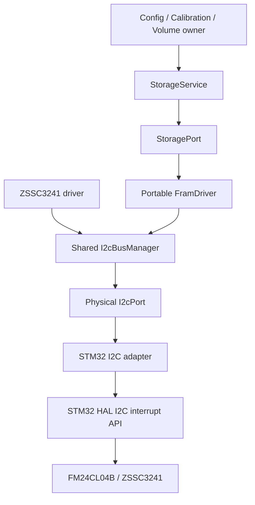

# Kế hoạch triển khai driver FM24CL04B bằng STM32 HAL

| Thuộc tính | Giá trị |
|---|---|
| Document ID | `FW-IMPL-FRAM-001` |
| Phiên bản | `1.0` |
| Ngày | `2026-07-20` |
| MCU | `STM32L433RCT6` |
| F-RAM | `FM24CL04B`, 4 Kbit, 512 × 8 |
| Bus | Shared I²C giữa FM24CL04B và ZSSC3241 |
| Runtime | Bare-metal cooperative, event-driven |
| Repo tham chiếu | `whoisLePhuc/smart-water-flow-pressure-monitor` |
| Commit đã phân tích | `b77c0610af79c00eef5020d08f96a6289c7e76b9` |
| Trạng thái tài liệu | Implementation plan |

## 1. Mục tiêu

Tài liệu này mô tả từng bước để đưa FM24CL04B từ driver HAL blocking dùng cho bring-up thành module production có thể đóng gói trong firmware hiện tại.

Kết quả cuối cùng phải đạt được pipeline:

```text
Record owner
  -> StorageService
  -> instance-owned StoragePort
  -> portable FramDriver
  -> shared I2cBusManager
  -> physical I2cPort
  -> STM32 I2C interrupt adapter
  -> STM32 HAL
  -> I2C1
  -> FM24CL04B
```

Driver hoàn chỉnh phải:

- đọc/ghi đúng không gian logic `0x000`–`0x1FF`;
- ánh xạ đúng page bit vào địa chỉ I²C `0x50/0x51` khi A2=A1=0;
- không gọi STM32 HAL trong portable driver, service hoặc protocol;
- không block cooperative event loop;
- dùng chung một `I2cBusManager` với ZSSC3241;
- chia transaction để giới hạn thời gian chiếm bus;
- chống completion cũ, trùng hoặc sai generation;
- hỗ trợ `StorageService` thực hiện invalidate → body write → read-back verify → commit-last;
- vượt qua unit, contract, integration, HIL và power-cycle tests trước khi đóng gói.

## 2. Source of truth và tài liệu tham chiếu

Thứ tự ưu tiên khi có mâu thuẫn:

1. Hardware schematic và pin/address straps của board thật.
2. Datasheet FM24CL04B.
3. Các decision đã accepted, đặc biệt `DEC-HW-006` cho shared I²C.
4. [`22_persistent_storage.md`](https://github.com/whoisLePhuc/smart-water-flow-pressure-monitor/blob/main/1.docs/05_firmware/20_data_and_storage/22_persistent_storage.md).
5. [`50_platform_abstraction.md`](https://github.com/whoisLePhuc/smart-water-flow-pressure-monitor/blob/main/1.docs/05_firmware/50_platform/50_platform_abstraction.md).
6. [`52_stm32_platform_backend.md`](https://github.com/whoisLePhuc/smart-water-flow-pressure-monitor/blob/main/1.docs/05_firmware/50_platform/52_stm32_platform_backend.md).
7. [`94_linux_to_stm32_porting_plan.md`](https://github.com/whoisLePhuc/smart-water-flow-pressure-monitor/blob/main/1.docs/05_firmware/90_implementation/94_linux_to_stm32_porting_plan.md).
8. Code hiện tại và hai file HAL blocking đã viết.

Các đặc tính component được dùng trong plan:

- dung lượng 512 byte;
- địa chỉ logic 9-bit;
- bit 8 của địa chỉ logic nằm trong slave-address page bit;
- word address là 8 bit thấp;
- không có EEPROM-style write delay;
- không cần ACK polling sau write;
- WP high khóa toàn bộ write;
- multi-byte write không tạo atomic record.

## 3. Đánh giá baseline hiện tại

### 3.1. Phần đã có

Codebase hiện có:

- `src/drivers/storage/fram_driver.c/.h`;
- memory backend 512 byte dùng cho Linux/unit test;
- range check cho địa chỉ và độ dài;
- `I2cBusManager` với pending queue, priority, timeout và bus generation;
- portable `I2cPort`;
- skeleton `i2c_port_stm32` với injected HAL operation table;
- `StorageService` và A/B record protocol;
- storage codec, CRC và boot/power-loss tests;
- Linux F-RAM peer;
- event IDs cho I²C và storage;
- CMake targets cho driver, adapter và test.

Hai file HAL blocking đã viết có thể tái sử dụng các phần sau cho bring-up:

- hằng số `512`, `256`, `0x50`, `0x51`;
- helper resolve page/address;
- overflow-safe bounds checking;
- tách transfer tại `0x100`;
- bài kiểm tra đọc lại dữ liệu sau write.

### 3.2. Khoảng trống bắt buộc phải xử lý

| Gap | Trạng thái hiện tại | Hậu quả |
|---|---|---|
| I²C path trong `FramDriver` | Luôn trả `FRAM_DRV_IO_ERROR` | Chưa truy cập phần cứng thật |
| Driver API | Synchronous | Không đạt contract non-blocking |
| `StorageService` | Gọi `FramDriver_Read/Write()` trực tiếp | Mỗi tick vẫn thực hiện I/O blocking |
| `StoragePort` | Hai hàm global synchronous | Không instance-owned; không dùng được completion identity |
| Shared bus ownership | `I2cBusManager` nằm trong `MeasurementManager` | Storage không thể sở hữu chung bus sạch với pressure |
| Physical port ownership | Mỗi client có callback `submit_tx` | Chưa đúng tài liệu: bus manager phải là caller duy nhất của physical port |
| Client address | Mỗi client chỉ có một slave address | FM24CL04B cần hai địa chỉ page `0x50/0x51` |
| Transaction ID | Caller tự cấp nhưng uniqueness được kiểm tra toàn bus | Hai client có thể cấp trùng ID |
| Linux F-RAM peer | Đang decode hai byte địa chỉ | Không giống FM24CL04B thật: một page bit + một word-address byte |
| HAL bridge | Chỉ có operation-table skeleton | Chưa gọi `HAL_I2C_*_IT`, chưa bind callback/recovery |
| HAL error mapping | Chưa có mapping đầy đủ | NACK, busy, timeout và bus error chưa tách được |
| WP | Memory-backend flag; chưa có evidence phần cứng | Không được kết luận WP từ generic NACK |
| App composition | Chưa sở hữu bus, driver và service storage thật | Chưa có end-to-end binding |

### 3.3. Kết luận kiến trúc

Không nên chép hai file HAL blocking vào `src/drivers/storage` rồi coi đó là implementation cuối. Việc này sẽ:

- đưa `main.h`, `hi2c1` và HAL vào portable layer;
- bỏ qua `I2cBusManager`;
- tạo xung đột khi ZSSC3241 cùng dùng I²C1;
- block event loop;
- làm Linux và STM32 dùng hai contract khác nhau.

Driver blocking chỉ là **bring-up probe**. Module production phải đi theo kiến trúc async bên dưới.

## 4. Kiến trúc mục tiêu



Quy tắc dependency:

- `StorageService` không biết FM24CL04B hoặc HAL.
- `FramDriver` không biết CRC, A/B slot hoặc record schema.
- `FramDriver` không giữ `I2C_HandleTypeDef *` trong production build.
- `I2cBusManager` là owner duy nhất của physical `I2cPort`.
- `i2c_port_stm32` là portable-to-STM32 adapter nhưng không chứa board pin policy.
- HAL handle và callback routing thuộc board composition/HAL bridge.
- ISR/HAL callback không chạy CRC, A/B selection hoặc `StorageService_Tick()`.

## 5. Cấu trúc module đề xuất

Giữ cấu trúc source tree hiện tại và bổ sung các file sau:

```text
2.firmware/
├── src/
│   ├── app/
│   │   ├── app_composition.c
│   │   └── app_composition.h
│   ├── drivers/storage/
│   │   ├── fram_driver.c
│   │   ├── fram_driver.h
│   │   ├── fram_storage_port.c
│   │   ├── fram_storage_port.h
│   │   └── CMakeLists.txt
│   ├── infrastructure/bus/
│   │   ├── i2c_bus_manager.c
│   │   └── i2c_bus_manager.h
│   ├── ports/
│   │   ├── i2c_port.h
│   │   └── storage_port.h
│   ├── services/storage/
│   │   ├── storage_service.c
│   │   └── storage_service.h
│   └── platform/
│       ├── linux/peers/
│       │   └── peer_fram.c
│       └── stm32/
│           ├── adapters/
│           │   ├── i2c_port_stm32.c
│           │   └── i2c_port_stm32.h
│           ├── hal/
│           │   ├── stm32l4_i2c_hal_bridge.c
│           │   └── stm32l4_i2c_hal_bridge.h
│           └── board/
│               ├── board_storage_binding.c
│               └── board_storage_binding.h
├── apps/stm32_bringup/
│   └── fram_smoke_test.c
└── tests/
    ├── unit/drivers/test_fram_driver.c
    ├── contract/ports/test_storage_port.c
    ├── contract/platform/test_stm32_i2c_adapter.c
    ├── integration/storage/test_fram_storage_service.c
    ├── integration/storage/test_i2c_fram_zssc_contention.c
    └── hil/fram/README.md
```

`stm32l4_i2c_hal_bridge.c` chỉ được build trong STM32 target. Host CMake tests tiếp tục inject fake operation table vào `i2c_port_stm32` nên không cần STM32 HAL headers.

## 6. Interface cần định nghĩa

### 6.1. Configuration của FM24CL04B

```c
typedef struct {
    uint8_t  slave_address_base_7bit; /* A2/A1 encoded, page bit cleared */
    uint16_t capacity_bytes;           /* 512 for FM24CL04B */
    uint16_t max_chunk_bytes;          /* Initial profile: 32, verify on board */
    uint8_t  bus_priority;             /* Lower than pressure-result read */
    uint32_t transaction_timeout_us;
} FramConfig;
```

Validation khi init:

- `capacity_bytes == 512`;
- `max_chunk_bytes > 0` và không vượt static transfer buffer;
- bit page trong base address phải bằng 0;
- base address phải nằm trong dải `0x50`, `0x52`, `0x54`, `0x56` tùy A2/A1;
- timeout khác 0;
- bus manager pointer hợp lệ.

### 6.2. Token của logical operation

```c
typedef struct {
    uint32_t operation_id;
    uint32_t correlation_id;
    uint32_t owner_generation;
} AsyncOperationToken;
```

Ý nghĩa:

- `operation_id`: định danh một lần đọc/ghi logic của F-RAM;
- `correlation_id`: liên kết với step/request của `StorageService`;
- `owner_generation`: loại completion cũ sau reset/reinit.

Physical `transaction_id` và `bus_generation` không do `StorageService` tự tạo. Bus manager phải cấp/đóng dấu chúng cho từng chunk.

### 6.3. Submit result và terminal result

Không trộn trạng thái admission với trạng thái terminal.

```c
typedef enum {
    FRAM_SUBMIT_ACCEPTED = 0,
    FRAM_SUBMIT_BUSY,
    FRAM_SUBMIT_INVALID_PARAM,
    FRAM_SUBMIT_OUT_OF_RANGE,
    FRAM_SUBMIT_NOT_READY,
    FRAM_SUBMIT_NO_CAPACITY
} FramSubmitResult;

typedef enum {
    FRAM_RESULT_OK = 0,
    FRAM_RESULT_NACK,
    FRAM_RESULT_TIMEOUT,
    FRAM_RESULT_BUS_ERROR,
    FRAM_RESULT_CANCELLED,
    FRAM_RESULT_STALE,
    FRAM_RESULT_SHORT_TRANSFER,
    FRAM_RESULT_INTERNAL_ERROR
} FramResult;
```

Không trả `FRAM_RESULT_WRITE_PROTECTED` chỉ từ NACK. Chỉ dùng kết quả này nếu có independent WP GPIO/config evidence.

### 6.4. Completion envelope

```c
typedef struct {
    AsyncOperationToken token;
    FramResult result;
    uint16_t requested_length;
    uint16_t transferred_length;
    uint32_t last_transaction_id;
    uint32_t client_generation;
    uint32_t bus_generation;
} FramCompletion;
```

### 6.5. Public driver API

```c
typedef void (*FramCompletionFn)(
    void *context,
    const FramCompletion *completion);

FramSubmitResult fram_init(
    FramDriver *driver,
    I2cBusManager *bus,
    const FramConfig *config,
    FramCompletionFn completion_fn,
    void *completion_context);

FramSubmitResult fram_probe_async(
    FramDriver *driver,
    AsyncOperationToken token);

FramSubmitResult fram_read_async(
    FramDriver *driver,
    uint16_t address,
    uint8_t *buffer,
    uint16_t length,
    AsyncOperationToken token);

FramSubmitResult fram_write_async(
    FramDriver *driver,
    uint16_t address,
    const uint8_t *buffer,
    uint16_t length,
    AsyncOperationToken token);

void fram_on_i2c_completion(
    FramDriver *driver,
    const I2cTransactionCompletion *completion);

void fram_cancel_generation(
    FramDriver *driver,
    uint32_t new_generation);

bool fram_is_busy(const FramDriver *driver);
```

`probe_async()` chỉ chứng minh hai page address phản hồi qua thao tác đọc có địa chỉ. FM24CL04B không cung cấp device-ID đủ để chứng minh IC phản hồi chắc chắn là đúng part.

### 6.6. Instance-owned StoragePort

Thay `storage_port_read/write()` global bằng:

```c
typedef struct {
    void *context;

    FramSubmitResult (*read_async)(
        void *context,
        uint32_t offset,
        uint8_t *buffer,
        uint16_t size,
        AsyncOperationToken token);

    FramSubmitResult (*write_async)(
        void *context,
        uint32_t offset,
        const uint8_t *data,
        uint16_t size,
        AsyncOperationToken token);

    void (*cancel_generation)(
        void *context,
        uint32_t new_generation);

    bool (*is_busy)(const void *context);
} StoragePort;
```

`fram_storage_port.c` chỉ map kiểu/status giữa `StoragePort` và `FramDriver`; không chứa HAL hoặc record logic.

### 6.7. I2cBusManager contract cần chỉnh trước

Target contract:

```c
typedef struct {
    uint32_t client_id;
    uint32_t correlation_id;
    uint32_t client_generation;
    uint8_t  slave_address;
    const uint8_t *tx;
    uint16_t tx_length;
    uint8_t *rx;
    uint16_t rx_length;
    uint64_t deadline_us;
    uint8_t priority;
} I2cBusRequest;

I2cSubmitResult i2c_bus_submit(
    I2cBusManager *bus,
    const I2cBusRequest *request,
    uint32_t *transaction_id_out);
```

Client registration cần address policy:

```c
typedef struct {
    uint32_t client_id;
    uint32_t client_generation;
    uint8_t address_base;
    uint8_t address_mask;
    void *context;
    void (*on_complete)(void *context,
                        const I2cTransactionCompletion *completion);
} I2cBusClient;
```

Address validation:

```c
(request_address & address_mask) ==
(client.address_base & address_mask)
```

Profiles:

- ZSSC3241: mask `0x7F`, chỉ một địa chỉ;
- FM24CL04B: base `0x50`, mask `0x7E`, cho phép `0x50` và `0x51`.

Bus manager phải:

- sở hữu một borrowed `I2cPort`;
- tự cấp transaction ID duy nhất;
- là caller duy nhất của `I2cPort.submit()`;
- copy identity vào `I2cPortRequest`;
- map physical completion về đúng client;
- reject duplicate/late/stale completion;
- increment bus generation khi recovery;
- áp priority trước admission nhưng không preempt active frame.

## 7. State và buffer của FramDriver

### 7.1. Driver state

```c
typedef enum {
    FRAM_STATE_UNINITIALIZED = 0,
    FRAM_STATE_IDLE,
    FRAM_STATE_SUBMITTING_CHUNK,
    FRAM_STATE_WAITING_I2C,
    FRAM_STATE_COMPLETING,
    FRAM_STATE_FAULT
} FramState;
```

`FramDriver` nên chứa:

- borrowed `I2cBusManager *`;
- immutable `FramConfig` sau init;
- state và current operation type;
- owner/client generation;
- current logical address;
- requested/transferred/remaining length;
- caller buffer view;
- driver-owned TX chunk buffer `1 + max_chunk`;
- current transaction/correlation identity;
- completion callback/context;
- counters: submitted, completed, timeout, NACK, stale, cancelled, range error.

Không cấp phát heap.

### 7.2. Buffer lifetime

- Read buffer do caller sở hữu và phải sống tới terminal completion.
- Write input thuộc caller nhưng chunk đang submit phải immutable.
- Nên copy mỗi write chunk vào driver-owned TX buffer gồm `word_address + data`.
- Driver-owned TX buffer không được thay đổi khi HAL/I²C transaction chưa hoàn thành.
- `StorageService` vẫn giữ encoded record immutable tới terminal operation.

## 8. Thuật toán địa chỉ và chunking

### 8.1. Ánh xạ địa chỉ

```c
static uint8_t fram_slave_address(
    const FramConfig *cfg,
    uint16_t logical_address)
{
    return (uint8_t)(cfg->slave_address_base_7bit |
                     ((logical_address >> 8) & 0x01u));
}

static uint8_t fram_word_address(uint16_t logical_address)
{
    return (uint8_t)(logical_address & 0xFFu);
}
```

Không shift `<< 1` trong portable driver. Việc HAL dùng địa chỉ dịch trái nằm hoàn toàn trong STM32 HAL bridge.

### 8.2. Range validation

```c
static bool fram_range_is_valid(uint16_t address, uint16_t length)
{
    if (length == 0u)
        return address <= FM24CL04B_SIZE_BYTES;

    return address < FM24CL04B_SIZE_BYTES &&
           length <= (uint16_t)(FM24CL04B_SIZE_BYTES - address);
}
```

Zero-length no-op chỉ thành công nếu toàn project chốt cùng semantics. Không truy cập buffer khi length bằng 0.

### 8.3. Tính chunk

```c
page_remaining = 256u - (logical_address & 0xFFu);
memory_remaining = 512u - logical_address;

chunk = min(operation_remaining,
            config.max_chunk_bytes,
            page_remaining,
            memory_remaining);
```

Mỗi chunk:

1. tính slave address theo bit 8;
2. đặt word address 8-bit vào byte TX đầu tiên;
3. submit đúng một transaction;
4. chờ completion;
5. chỉ khi completion hợp lệ mới tăng `transferred`;
6. nếu còn dữ liệu thì chuẩn bị chunk tiếp theo;
7. nếu hết thì phát đúng một terminal completion.

Initial `max_chunk_bytes = 32` phù hợp với chunk hiện dùng trong `StorageService`, nhưng vẫn là giá trị `NEEDS_VERIFICATION`. Phải đo bus occupancy ở 100/400 kHz và kiểm tra pressure deadline trước khi chốt production profile.

## 9. STM32 HAL integration

### 9.1. Hai giai đoạn HAL

#### Giai đoạn A — blocking smoke test

Dùng hai file HAL hiện có trong `apps/stm32_bringup/fram_smoke_test.c` hoặc target riêng. Cho phép:

- `HAL_I2C_IsDeviceReady()`;
- `HAL_I2C_Mem_Read()`;
- `HAL_I2C_Mem_Write()`;
- timeout ngắn và log UART;
- hard-coded `hi2c1` trong riêng bring-up app.

Không cho phép code này được service hoặc production driver gọi.

#### Giai đoạn B — production interrupt path

Theo report hiện tại, I²C không dùng DMA. Dùng interrupt API:

- `HAL_I2C_Master_Transmit_IT()` cho write frame `word-address + data`;
- `HAL_I2C_Mem_Read_IT()` hoặc sequence IT tương đương cho selective/random read;
- `HAL_I2C_Master_Receive_IT()` cho device contract không có word address;
- `HAL_I2C_ErrorCallback()` cho terminal error capture.

Nếu dùng `HAL_I2C_Mem_Read_IT()` cho F-RAM:

- `DevAddress = address_7bit << 1` chỉ trong HAL bridge;
- `MemAddress = tx[0]`;
- `MemAddSize = I2C_MEMADD_SIZE_8BIT`;
- `pData = request.rx`;
- `Size = request.rx_length`.

Nếu physical port phải giữ hoàn toàn generic cho cả ZSSC và F-RAM, HAL bridge có thể dispatch theo shape của request:

| Request shape | HAL action |
|---|---|
| `tx>0`, `rx=0` | Master transmit IT |
| `tx=0`, `rx>0` | Master receive IT |
| `tx=1`, `rx>0`, memory flag | Memory read IT, 8-bit word address |
| `tx>0`, `rx>0`, generic repeated-start flag | Sequential transmit IT → receive IT |

Không suy memory protocol chỉ bằng slave address. Thêm request flags/capability nếu cần để backend không chứa device-specific address table.

### 9.2. Callback boundary

HAL callbacks chạy trong interrupt context. Chỉ thực hiện:

1. xác nhận đúng `hi2c1`/active handle;
2. capture `HAL_I2C_GetError()` và operation identity;
3. đánh dấu một fixed completion mailbox;
4. signal/defer về cooperative context.

Không thực hiện trong ISR:

- CRC;
- `StorageService_Tick()`;
- A/B scan;
- memcpy slot lớn;
- printf;
- submit một storage request mới;
- recovery dài.

Ngoại lệ cho multi-frame repeated-start: intermediate HAL callback được phép thực hiện bounded hardware continuation cần thiết để bắt đầu RX frame; chỉ final callback mới tạo terminal evidence.

### 9.3. NVIC

Giữ proposal đã thống nhất:

- `NVIC_PRIORITYGROUP_4`;
- `I2C1_ER_IRQn`: preemption priority 2;
- `I2C1_EV_IRQn`: preemption priority 4;
- application không dùng priority 0–1.

IRQ handler chỉ gọi HAL IRQ handler chuẩn:

```c
void I2C1_EV_IRQHandler(void)
{
    HAL_I2C_EV_IRQHandler(&hi2c1);
}

void I2C1_ER_IRQHandler(void)
{
    HAL_I2C_ER_IRQHandler(&hi2c1);
}
```

Nếu sau này đưa FreeRTOS vào baseline, phải review lại priority so với `configMAX_SYSCALL_INTERRUPT_PRIORITY`.

### 9.4. HAL error normalization

Minimum mapping:

| HAL evidence | Port/I²C result |
|---|---|
| Admission `HAL_OK` | Accepted, chưa phải completed |
| Admission `HAL_BUSY` | `PORT_STATUS_BUSY` |
| `HAL_I2C_ERROR_AF` | NACK |
| `HAL_I2C_ERROR_BERR` | Bus error |
| `HAL_I2C_ERROR_ARLO` | Arbitration loss / bus failure |
| `HAL_I2C_ERROR_OVR` | Hardware error |
| Timeout từ manager deadline | Timeout |
| Recovery generation mismatch | Stale |

Không map mọi lỗi về một `FRAM_IO_ERROR` duy nhất vì sẽ mất khả năng chẩn đoán và retry đúng.

### 9.5. Recovery

Recovery chạy trong cooperative/platform context:

1. kết thúc/cancel active HAL operation nếu có;
2. capture HAL/raw error;
3. `HAL_I2C_DeInit()`;
4. thực hiện board-approved stuck-bus recovery nếu SDA/SCL không idle;
5. `HAL_I2C_Init()`;
6. increment physical resource/bus generation;
7. terminal-cancel operation cũ;
8. không tự động đánh dấu FM24CL04B hoặc ZSSC ready;
9. probe/rescan theo device/service policy.

Exact GPIO clock-pulse recovery phải được đặt trong board backend và xác nhận với schematic; không đưa vào portable driver.

## 10. Kế hoạch triển khai theo phase

### Phase 0 — Freeze hardware và contract

Mục tiêu: đóng các giá trị đầu vào trước khi viết production code.

Thực hiện:

1. Xác nhận A2/A1 trên schematic và board thật.
2. Xác nhận WP nối GND, VDD hay MCU GPIO.
3. Xác nhận SDA/SCL, pull-up và điện áp I/O.
4. Xác nhận I²C1 timing profile đầu tiên: bring-up ở 100 kHz, sau đó qualification 400 kHz.
5. Xác nhận report rule: I²C dùng interrupt, không DMA.
6. Chốt zero-length semantics.
7. Chốt initial chunk 32 byte là test profile, chưa phải qualified production constant.

Đầu ra:

- `FramConfig` board profile;
- cập nhật hardware manifest;
- danh sách `NEEDS_VERIFICATION`;
- không còn comment sai “A0 là chân vật lý”.

Exit criteria:

- slave page addresses được tính từ schematic, không suy đoán;
- WP policy có một mô tả duy nhất;
- pin/timing/profile có traceability.

### Phase 1 — Blocking hardware smoke test

Mục tiêu: xác nhận wiring và IC trước khi debug kiến trúc async.

Thực hiện:

1. Tách driver blocking đã viết thành bring-up-only target.
2. Include đúng `i2c.h` hoặc explicit handle injection; không phụ thuộc `main.h` để khai báo `hi2c1`.
3. Sửa comment A0/page bit.
4. Map riêng `HAL_TIMEOUT`, `HAL_BUSY`, `HAL_ERROR` trong log.
5. Probe `0x50` và `0x51` nếu A2=A1=0.
6. Read-before-write và lưu lại byte gốc ở vùng scratch đã dành riêng.
7. Test write/read/restore byte gốc.
8. Test boundary `0x0FF/0x100`.
9. Power-cycle và đọc lại.
10. Capture logic analyzer.

Không ghi đè vùng A/B record có dữ liệu thật. Dành một vùng bring-up scratch trong memory map hoặc chạy trước khi provision device.

Exit criteria:

- cả hai page ACK;
- data read-back đúng;
- power-cycle giữ dữ liệu;
- waveform đúng address, word-address, ACK/NACK, repeated START và STOP;
- lỗi khi tháo IC không làm firmware treo vô hạn.

### Phase 2 — Sửa physical I²C ownership contract

Mục tiêu: tạo nền shared bus đúng trước khi viết driver async.

Thực hiện:

1. Chuyển shared `I2cBusManager` từ `MeasurementManager` lên `AppComposition`.
2. Inject physical `I2cPort` vào bus manager.
3. Xóa `submit_tx` khỏi từng `I2cBusClient` hoặc biến nó thành internal adapter; bus manager phải gọi port trực tiếp.
4. Bus manager tự cấp transaction ID.
5. Thêm per-request slave address và per-client address mask.
6. Hoàn thiện `i2c_bus_on_port_completion()`.
7. Giữ priority queue, deadline và bus generation.
8. Cập nhật ZSSC binding dùng borrowed shared bus thay vì bus riêng.
9. Cập nhật existing tests trước khi thêm F-RAM.

Exit criteria:

- một physical port duy nhất;
- ZSSC contract tests vẫn pass;
- client không gọi HAL/port trực tiếp;
- `0x50/0x51` có thể thuộc cùng một F-RAM client;
- transaction IDs không thể trùng giữa clients.

### Phase 3 — Portable async FramDriver

Mục tiêu: thay I²C stub bằng driver device đúng datasheet nhưng không chứa HAL.

Thực hiện:

1. Đổi naming về project style lowercase cho API mới.
2. Implement init/config validation.
3. Implement address mapping.
4. Implement range/zero/null checks.
5. Implement one-active-operation FSM.
6. Implement page/chunk split.
7. Implement read selective-address transaction.
8. Implement write `word-address + data` transaction.
9. Validate exact transaction/correlation/client/bus generation.
10. Reject stale/duplicate completion.
11. Emit exactly one terminal logical completion.
12. Implement cancel/reinit generation.
13. Giữ memory backend bên ngoài production driver hoặc thông qua fake bus; không để `use_i2c` branch trộn hai backend trong cùng driver.

Exit criteria:

- driver không include HAL/POSIX;
- không có heap;
- không có synchronous wait;
- mọi operation hoàn tất đúng một lần;
- all driver unit tests pass.

### Phase 4 — Linux peer parity và deterministic tests

Mục tiêu: Linux fake mô phỏng đúng wire/device contract của FM24CL04B.

Thực hiện:

1. Sửa `peer_fram.c` không decode địa chỉ 16-bit từ `tx[0:1]`.
2. Page lấy từ slave address bit 0 đối với configured base.
3. Word address lấy từ `tx[0]`.
4. Read bắt đầu từ selective address đã truyền.
5. Write data bắt đầu từ `tx[1]`.
6. Inject NACK, timeout, short transfer, corruption và reset.
7. Giữ memory image qua simulated MCU reset.
8. Cho phép snapshot/hash final image để test determinism.

Exit criteria:

- Linux trace dùng cùng addresses/chunks như STM32 target;
- cross-page tests pass;
- fault-injection deterministic;
- fake không tạo durable-success thay cho StorageService.

### Phase 5 — STM32 interrupt provider và HAL bridge

Mục tiêu: nối physical port vào HAL mà không làm thay đổi core/service.

Thực hiện:

1. Hoàn thiện `Stm32I2cHalOps` cho L4 HAL.
2. Implement request shape dispatch.
3. Implement active request ownership.
4. Implement EV/ER IRQ routing.
5. Implement final completion mailbox/defer.
6. Implement HAL error capture.
7. Implement cancel/recovery.
8. Reject callback từ handle khác.
9. Reject completion sau generation change.
10. Cross-compile với exact STM32CubeL4 version của project.

Exit criteria:

- adapter contract tests pass với fake HAL;
- target compiles không warning;
- no HAL include outside `platform/stm32`/CubeMX board code;
- callback không chạy storage logic;
- logic analyzer khớp request trace.

### Phase 6 — StoragePort và StorageService async migration

Mục tiêu: loại bỏ synchronous driver call khỏi service.

Thực hiện:

1. Thay global `storage_port_read/write` bằng instance-owned `StoragePort`.
2. Bind `FramDriver` qua `fram_storage_port`.
3. `StorageService_Init()` nhận `const StoragePort *` thay vì `FramDriver *`.
4. Mỗi FSM state chỉ:
   - chuẩn bị bounded local data;
   - submit tối đa một I/O;
   - chuyển sang WAIT state;
   - return về event loop.
5. Chỉ completion đúng token mới advance state.
6. Tách state `WAIT_INVALIDATE`, `WAIT_READBACK`, `WAIT_BODY_WRITE`, `WAIT_COMMIT` nếu cần.
7. Giữ commit ordering canonical.
8. Sau timeout ở write, không suy đoán durability; rescan slot trước retry.
9. Update `StorageFacade` để phản ánh readiness/error.
10. App composition đăng ký/bind storage events và periodic/bounded service progress.

Exit criteria:

- không còn synchronous F-RAM I/O trong service tick;
- event loop không block chờ I²C;
- previous valid A/B slot được giữ trong mọi injected failure;
- durable success chỉ sau commit read-back và validation.

### Phase 7 — AppComposition end-to-end binding

`AppComposition` cần sở hữu hoặc borrow rõ ràng:

```c
I2cBusManager shared_i2c_bus;
FramDriver fram;
StoragePort storage_port;
StorageService storage_service;
StorageFacade storage;
```

Board composition sở hữu:

```c
Stm32I2cAdapter i2c_adapter;
I2cPort physical_i2c_port;
Stm32L4I2cHalBridge i2c_hal_bridge;
```

Init order:

1. HAL/CubeMX peripheral init.
2. STM32 HAL bridge init.
3. Physical `I2cPort` init.
4. Shared `I2cBusManager` init với physical port.
5. Register F-RAM client.
6. Register ZSSC client.
7. Init portable `FramDriver`.
8. Create `StoragePort` binding.
9. Init `StorageService`.
10. Probe/read A/B và boot restore.
11. Init record owners với restored/default data.
12. Enable normal measurement scheduling.

Storage failure không được ngăn toàn bộ measurement nếu system policy cho phép degraded boot; nhưng phải tạo health evidence rõ.

Exit criteria:

- one object graph, no hidden global storage state;
- boot restore chạy qua đúng production path;
- ZSSC và F-RAM cùng dùng một manager;
- init/reinit invalidates old completions.

### Phase 8 — HIL, qualification và đóng gói

Mục tiêu: chuyển trạng thái từ Linux-verified sang STM32-hardware-verified.

Thực hiện:

1. Chạy functional HIL suite.
2. Chạy shared-I²C contention suite.
3. Reset/power-cycle injection.
4. Xác nhận WP.
5. Đo chunk latency và event-loop impact.
6. Chạy 100 power cycles theo gate hiện có của porting plan.
7. Lưu raw logs, firmware SHA, board revision, Cube/HAL version và test fixture version.
8. Cập nhật implementation status và traceability.

Exit criteria:

- toàn bộ Definition of Done ở phần 13 đạt;
- không còn production I²C stub;
- hardware evidence có thể truy vết về build và board.

## 11. Danh mục test chi tiết

### 11.1. Driver unit tests

File: `tests/unit/drivers/test_fram_driver.c`

| ID | Test |
|---|---|
| `TC_FRAM_ADDR_001` | `0x000` → slave page 0, word `0x00` |
| `TC_FRAM_ADDR_002` | `0x0FF` → page 0, word `0xFF` |
| `TC_FRAM_ADDR_003` | `0x100` → page 1, word `0x00` |
| `TC_FRAM_ADDR_004` | `0x1FF` → page 1, word `0xFF` |
| `TC_FRAM_ADDR_005` | A2/A1 variants map `0x50`–`0x57` correctly |
| `TC_FRAM_RANGE_001` | first and last byte valid |
| `TC_FRAM_RANGE_002` | address 512 with nonzero length rejected |
| `TC_FRAM_RANGE_003` | `address + length > 512` rejected without overflow |
| `TC_FRAM_RANGE_004` | zero-length semantics |
| `TC_FRAM_PARAM_001` | null driver/config/buffer/callback |
| `TC_FRAM_CHUNK_001` | 32-byte limit respected |
| `TC_FRAM_CHUNK_002` | `0x0FF → 0x100` split |
| `TC_FRAM_CHUNK_003` | multi-chunk read/write transferred count |
| `TC_FRAM_STATE_001` | second operation while busy rejected |
| `TC_FRAM_STATE_002` | success produces one terminal completion |
| `TC_FRAM_STATE_003` | duplicate completion ignored/counts diagnostic |
| `TC_FRAM_STATE_004` | wrong transaction/correlation ignored |
| `TC_FRAM_STATE_005` | old client/bus generation rejected |
| `TC_FRAM_ERROR_001` | NACK mapping |
| `TC_FRAM_ERROR_002` | timeout mapping |
| `TC_FRAM_ERROR_003` | cancellation mapping |
| `TC_FRAM_ERROR_004` | short transfer mapping |
| `TC_FRAM_WRITE_001` | write source mutation after submit cannot corrupt active chunk |
| `TC_FRAM_WP_001` | generic NACK not mislabeled as WP |

### 11.2. I2C manager contract tests

- bus manager là sole physical-port caller;
- transaction ID unique across F-RAM/ZSSC;
- F-RAM page addresses pass client mask;
- unrelated slave address rejected;
- one active physical transaction;
- queue full/admission failure visible;
- pressure priority thắng trước khi admission;
- active F-RAM frame không bị preempt;
- storage có anti-starvation bound;
- timeout increments generation/recovery state correctly;
- late physical completion does not reach logical owner as success.

### 11.3. STM32 adapter tests với fake HAL

- `HAL_OK`, `HAL_BUSY`, `HAL_ERROR` admission mapping;
- memory read uses shifted address only in HAL bridge;
- 8-bit memory address selected;
- TX/RX/combined shapes;
- intermediate repeated-start callback;
- final TX/RX/error callback;
- wrong handle ignored;
- exactly one deferred terminal completion;
- cancel/recover while active;
- late callback after recover stale;
- completion mailbox cannot overwrite unread evidence silently.

### 11.4. StorageService integration tests

- scan A/B and choose target;
- invalidate written and read back before body;
- body written in bounded chunks;
- body read-back matches;
- commit `0xA5` written last and separately;
- commit read-back verified;
- failure at every submit/completion step;
- reset after every durable boundary;
- previous valid slot survives;
- latest-wins pending candidate does not mutate in-flight bytes;
- exactly one terminal commit result;
- boot restore selects newest valid compatible record;
- newer corrupt slot falls back to older valid slot;
- unknown schema is preserved/rejected, not silently overwritten.

### 11.5. Shared-I²C integration tests

- F-RAM before, during và after ZSSC conversion;
- ZSSC EOC khi F-RAM queued;
- ZSSC result read ưu tiên hơn pending F-RAM chunk;
- F-RAM active chunk hoàn tất trước pressure transaction;
- background storage vẫn tiến triển dưới pressure load;
- timeout/recovery của một client không chấp nhận completion cũ của client kia;
- functional-ready của ZSSC và F-RAM được đánh giá riêng sau bus recovery.

### 11.6. Hardware/HIL tests

| Nhóm | Bằng chứng cần thu |
|---|---|
| Probe | ACK ở hai page addresses |
| Addressing | Logic-analyzer capture `0x000`, `0x0FF`, `0x100`, `0x1FF` |
| Random read | START → address write → word address → repeated START → read → STOP |
| Write | address + word address + data + STOP |
| Cross-page | Hai transaction với slave page tương ứng |
| Persistence | Data giữ sau reset và power-cycle |
| WP | Write behavior ở trạng thái WP thật của board |
| Fault | NACK/disconnect/timeout không deadlock |
| Recovery | Bus hoạt động lại; generation cũ bị reject |
| Shared bus | ZSSC pressure deadline không bị phá bởi storage chunk |
| Power loss | Old hoặc new valid A/B record được chọn, không chọn torn record |
| Endurance smoke | Repeated read/write pattern không tạo mismatch |

Mỗi HIL artifact phải ghi:

- board revision và serial/fixture identity;
- firmware commit/build ID;
- STM32CubeL4/HAL version;
- I²C frequency/timing register;
- supply voltage;
- test procedure version;
- logic-analyzer/raw log file;
- pass/fail và người/automation thực hiện.

## 12. CMake và CI cần bổ sung

### Driver target

```cmake
add_library(fw_driver_storage STATIC
    fram_driver.c
    fram_storage_port.c
)

target_link_libraries(fw_driver_storage PUBLIC
    fw_ports
    fw_infra_bus
    project_compiler_options
)
```

Không link `fw_adapter_stm32` hoặc STM32 HAL vào portable driver target.

### Test targets

Thêm tối thiểu:

```text
test_fram_driver
test_fram_storage_port
test_fram_storage_service
test_i2c_fram_zssc_contention
test_stm32_i2c_adapter
```

CI gates:

1. C11 build với warnings-as-errors.
2. Focused unit tests.
3. Full `ctest`.
4. ASan/UBSan cho host tests.
5. `architecture_check`.
6. Static analysis nếu pipeline hiện có hỗ trợ.
7. `arm-none-eabi` cross-build cho STM32 target.
8. Linker map/RAM/flash budget check.
9. Selected on-target smoke/HIL cho integration branch/release.

## 13. Definition of Done để đóng gói module

Module FM24CL04B chỉ được đánh dấu **packaged/ready for integration** khi toàn bộ checklist sau đạt:

### Code

- [ ] Public API instance-owned, không global `FRAM_*` phụ thuộc `hi2c1`.
- [ ] Portable driver không include STM32 HAL.
- [ ] I²C mode không còn stub.
- [ ] Không còn `use_i2c` trộn fake memory và production transport trong cùng driver.
- [ ] Địa chỉ page mapping đúng A2/A1 thật.
- [ ] Range check ngăn rollover ngoài 512 byte.
- [ ] Chunk split ở `0x100` và theo configured maximum.
- [ ] Không có EEPROM delay/ACK polling.
- [ ] One active logical operation; exactly-one terminal completion.
- [ ] Stale/duplicate/wrong-generation completion bị reject.
- [ ] HAL error được normalize.
- [ ] WP không bị suy từ generic NACK.
- [ ] Không heap; buffer lifetime được document.

### Architecture

- [ ] Một shared `I2cBusManager` thuộc composition root.
- [ ] Bus manager là sole caller của physical I²C port.
- [ ] ZSSC và F-RAM dùng chung manager.
- [ ] `StorageService` dùng `StoragePort`, không phụ thuộc `FramDriver *`.
- [ ] Storage service async; event-loop turn bounded.
- [ ] HAL chỉ nằm trong STM32 backend/board binding.
- [ ] Boot restore dùng production path.

### Verification

- [ ] Driver unit suite pass.
- [ ] I²C manager contract suite pass.
- [ ] STM32 adapter fake-HAL suite pass.
- [ ] Storage A/B and power-loss suite pass.
- [ ] Shared-I²C contention suite pass.
- [ ] Sanitizer và architecture check pass.
- [ ] STM32 cross-build pass.
- [ ] Logic-analyzer address/restart/STOP evidence pass.
- [ ] Cross-page và last-byte HIL pass.
- [ ] 100 power-cycle restore gate pass.
- [ ] Error/recovery HIL không deadlock.

### Documentation/traceability

- [ ] `IMPLEMENTATION_STATUS.md` phân biệt Linux verified và STM32 verified.
- [ ] `22_persistent_storage.md` được cập nhật path/interface thật.
- [ ] `52_stm32_platform_backend.md` ghi HAL/IRQ mapping thật.
- [ ] `95_firmware_traceability.md` map requirement → code → test.
- [ ] Report dùng cùng thuật ngữ “Shared I²C and F-RAM”, `I2cBusManager`, `StorageService`, A/B, CRC và WP.
- [ ] Các giá trị chunk/timing chưa qualification vẫn ghi `NEEDS_VERIFICATION`.

## 14. Thứ tự commit đề xuất

Không gom toàn bộ migration vào một commit lớn. Chia thành:

1. `test(fram): add address, range and chunk characterization tests`
2. `refactor(i2c): make bus manager own the physical port`
3. `refactor(i2c): support per-request address and manager transaction IDs`
4. `feat(fram): implement portable asynchronous FM24CL04B driver`
5. `fix(sim): align F-RAM peer with page-select addressing`
6. `feat(storage): replace global storage API with instance-owned StoragePort`
7. `refactor(storage): migrate StorageService to async I/O completion`
8. `feat(stm32): implement interrupt-driven I2C HAL bridge`
9. `feat(app): bind shared I2C, F-RAM and boot restore in composition`
10. `test(storage): add shared-I2C and power-loss integration gates`
11. `docs(fram): update implementation status and traceability`

Mỗi commit phải build/test được hoặc ghi rõ là mechanical interface migration đi cùng commit kế tiếp trong cùng PR.

## 15. Ước lượng triển khai

| Phase | Công việc | Ước lượng |
|---|---|---:|
| 0 | Freeze hardware/contract | 0.5 ngày |
| 1 | Blocking smoke test + logic analyzer | 0.5–1 ngày |
| 2 | I²C ownership/ID/address refactor | 1–2 ngày |
| 3 | Portable async FramDriver | 1–1.5 ngày |
| 4 | Linux peer + deterministic tests | 0.5–1 ngày |
| 5 | STM32 HAL interrupt bridge | 1–1.5 ngày |
| 6 | StoragePort/StorageService async migration | 1.5–2.5 ngày |
| 7 | AppComposition + boot restore | 0.5–1 ngày |
| 8 | HIL/power-cycle/qualification | 1–2 ngày |

Tổng implementation dự kiến: **8–12 ngày kỹ thuật**, không bao gồm thời gian sửa lỗi phần cứng hoặc qualification dài hạn.

## 16. Rủi ro và kiểm soát

| Rủi ro | Kiểm soát |
|---|---|
| Chép driver HAL blocking vào portable layer | Tách bring-up target và production async driver |
| A2/A1/WP khác giả định | Freeze theo schematic + đo board trước code production |
| F-RAM dùng hai địa chỉ nhưng manager chỉ hỗ trợ một | Per-request address + client address mask |
| Transaction ID trùng giữa ZSSC/F-RAM | Bus manager cấp ID |
| HAL callback chạy service logic | Deferred completion mailbox/event |
| F-RAM chiếm bus quá lâu | 32-byte initial chunk, đo và qualify |
| NACK bị hiểu sai là WP | Yêu cầu independent WP evidence |
| Timeout sau partial write | Rescan/verify; không suy durable success |
| Linux peer khác wire protocol thật | Sửa peer page-select + 8-bit word address |
| StorageService tưởng async nhưng vẫn blocking | WAIT states và completion-driven advancement |
| Bus recovery làm completion cũ mutate state | bus/client/owner generation validation |
| Report và code lệch terminology/status | Cập nhật traceability và implementation status cùng PR |

## 17. Hành động nên thực hiện ngay

Thứ tự làm việc cho ngày đầu:

1. Xác nhận A2, A1 và WP trên schematic/board.
2. Nạp blocking smoke-test từ hai file hiện có.
3. Chạy probe `0x50/0x51` và boundary test.
4. Lưu logic-analyzer capture.
5. Viết `test_fram_driver.c` trước khi refactor production driver.
6. Refactor shared I²C ownership lên `AppComposition`.
7. Chỉ sau khi I²C contract ổn định mới implement `fram_read_async()` và `fram_write_async()`.

Đây là critical path. Bắt đầu sửa `StorageService` trước khi shared I²C contract ổn định sẽ tạo rework lớn vì completion identity và address ownership vẫn chưa đúng.

## 18. Tài liệu kỹ thuật ngoài repo

- [Infineon FM24CL04B product page](https://www.infineon.com/part/FM24CL04B-G)
- [FM24CL04B datasheet, Document 001-84455 Rev. *L](https://www.farnell.com/datasheets/2795448.pdf)
- [STMicroelectronics — Getting started with I2C](https://wiki.st.com/stm32mcu/wiki/Getting_started_with_I2C)

---

### Ghi chú xác minh

Plan được lập từ repo `main` tại commit `b77c0610af79c00eef5020d08f96a6289c7e76b9`, các tài liệu firmware hiện hành, report đã triển khai và hai file `fram_driver.c/.h` blocking do người dùng cung cấp. Môi trường phân tích hiện không có executable `cmake`, vì vậy trạng thái test hiện tại được lấy từ cấu trúc code/CMake và tài liệu repo; full build/CTest phải được chạy ở bước triển khai đầu tiên.
