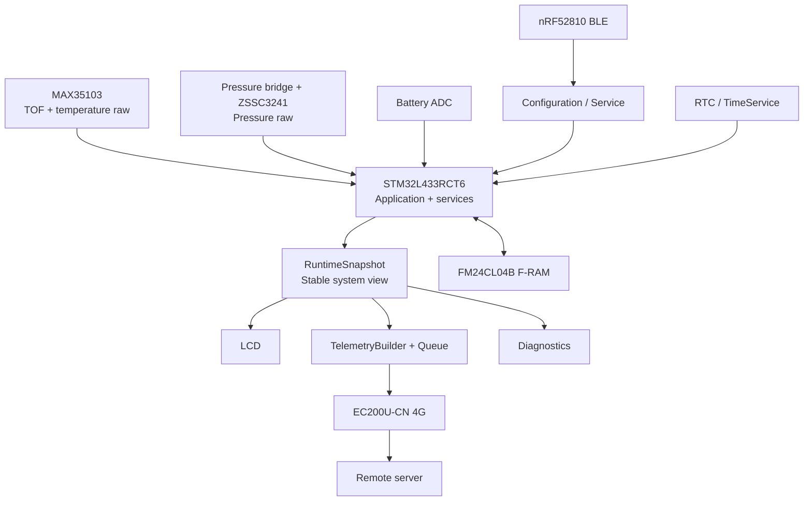
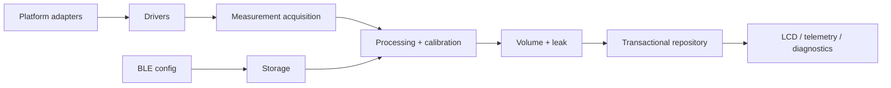
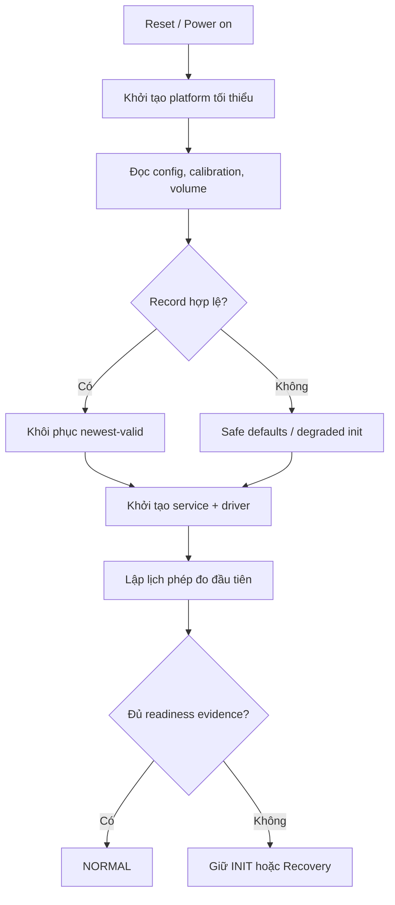
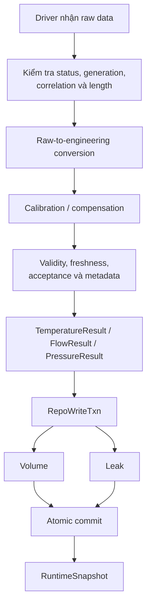
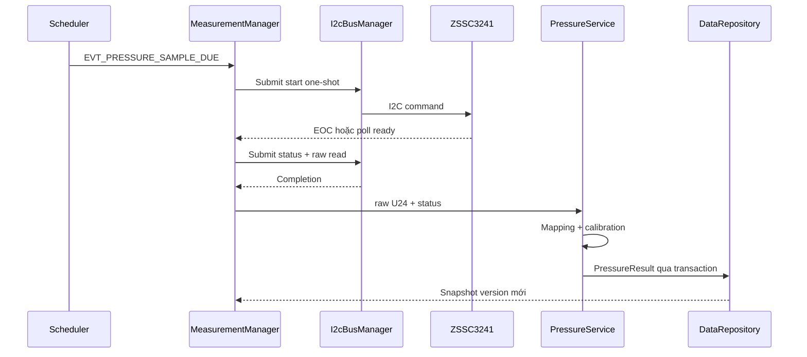
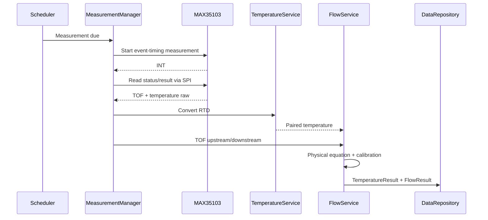
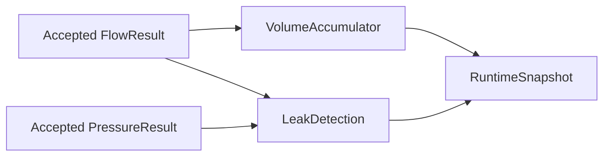
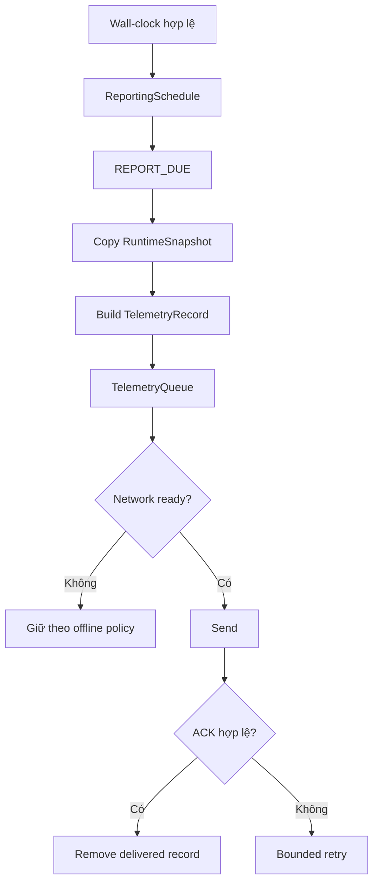
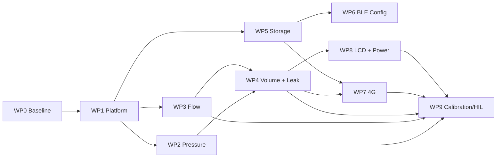

---

document_id: SWFPM-SYS-PROP-001
title: Đề xuất triển khai hệ thống Smart Water Flow and Pressure Monitor
status: DRAFT_FOR_TEAM_REVIEW
version: 1.1
owner: System Engineering
last_updated: 2026-07-17
baseline_repository: whoisLePhuc/smart-water-flow-pressure-monitor
baseline_branch: main
language: vi
---

# Đề xuất triển khai hệ thống Smart Water Flow and Pressure Monitor

**Tên viết tắt:** SWFPM
**Mục đích tài liệu:** Trình bày ý tưởng, phạm vi, kiến trúc, trạng thái triển khai và kế hoạch còn lại để nhóm cùng review và thống nhất
**Đối tượng đọc:** Quản lý dự án, firmware, hardware, backend, kiểm thử, hiệu chuẩn và thành viên mới
**Baseline tham chiếu:** Repository `whoisLePhuc/smart-water-flow-pressure-monitor`, nhánh `main`, baseline firmware kiểm tra ngày 17/07/2026

> Tài liệu này là báo cáo đề xuất ở cấp hệ thống. Các công thức chi tiết, register, API cụ thể và test vector được quản lý trong bộ tài liệu kỹ thuật của repository. Những giá trị chưa được xác nhận bằng yêu cầu sản phẩm hoặc thử nghiệm phần cứng được đánh dấu **TBD**.

---

# 1. Tóm tắt điều hành

Smart Water Flow and Pressure Monitor là thiết bị nhúng dùng để đo và giám sát trạng thái đường ống nước tại hiện trường. Hệ thống thu thập dữ liệu lưu lượng, nhiệt độ và áp suất; tích lũy thể tích nước; phát hiện dấu hiệu rò rỉ; hiển thị thông tin tại thiết bị; cho phép cấu hình cục bộ qua BLE; và gửi dữ liệu định kỳ lên máy chủ qua mạng 4G.

Kiến trúc đề xuất sử dụng:

* `STM32L433RCT6` làm vi điều khiển trung tâm;
* `MAX35103` và hai đầu dò siêu âm để đo thời gian truyền sóng, phục vụ tính lưu lượng và nhiệt độ;
* cầu cảm biến áp suất kết hợp `ZSSC3241` để đo áp suất;
* `FM24CL04B` F-RAM để lưu cấu hình, hiệu chuẩn và checkpoint thể tích;
* `nRF52810` làm BLE coprocessor cho cấu hình và bảo trì tại chỗ;
* `Quectel EC200U-CN` để gửi telemetry qua mạng 4G;
* RTC nội bộ STM32 để quản lý thời gian và lịch báo cáo;
* LCD segment để hiển thị dữ liệu tại thiết bị.

Firmware được triển khai theo hướng **documentation-first** và **simulation-first**. Logic portable được xây dựng và kiểm thử trên Linux trước khi nối với STM32 HAL và phần cứng thật. Cách làm này giúp tách thuật toán khỏi phần cứng, rút ngắn thời gian debug và cho phép tái hiện lỗi bằng virtual time và scenario test.

## 1.1. Trạng thái hiện tại

Repository hiện đã có nền tảng portable tương đối hoàn chỉnh về:

* thiết kế hệ thống và decision registry;
* event-driven cooperative runtime;
* event queue, scheduler, FSM và transactional snapshot repository;
* pressure và flow acquisition pipeline chạy end-to-end trên Linux;
* các module xử lý nhiệt độ, lưu lượng, áp suất, thể tích, leak detection và battery monitoring;
* storage codec/restore với A/B slot rotation;
* reporting schedule, telemetry builder, queue và delivery state machine;
* Linux simulation, CI workflow và test ở mức unit, contract, integration và system.

Tuy nhiên, hệ thống chưa phải firmware sản phẩm đã qualify. Các khoảng trống chính còn lại gồm:

* STM32 adapters mới ở mức compile-ready/contract-tested, chưa bind peripheral, pin, DMA và IRQ trên board;
* công thức flow vật lý đã được triển khai nhưng geometry, sign convention và hệ số calibration production vẫn cần được chốt và kiểm định;
* MAX35103 register-address/read-command chính xác cho board chưa được bind;
* RTC, F-RAM electrical behavior, STOP 2, watchdog, BLE, 4G và LCD chưa được tích hợp/verify trên phần cứng;
* chưa có bằng chứng calibration, HIL và field validation trên hệ thống nước thật.

## 1.2. Đề xuất triển khai

Các vertical slice portable đã được hoàn thành trước bring-up. Roadmap tiếp theo nên là:

1. Chốt requirement, hardware revision, geometry, sign convention và target accuracy.
2. Bring-up nền tảng STM32: monotonic timer, ISR event queue và peripheral binding.
3. Chạy **pressure vertical slice** trên board bằng pipeline đã verify trên Linux.
4. Chạy **ultrasonic flow vertical slice** trên board, chốt register binding và sensor timing.
5. Verify F-RAM A/B trên mất nguồn thật, sau đó tích hợp RTC, STOP 2 và watchdog.
6. Chỉ tích hợp BLE, 4G và LCD sau khi measurement + storage ổn định.
7. Thực hiện calibration, HIL test và field validation.

Milestone đầu tiên được đề xuất là:

> **Đưa pressure vertical slice đã chạy trên Linux lên STM32 thật, xuất được `PressureResult` hợp lệ trong `RuntimeSnapshot`, có trace cho normal path, lỗi, timeout và recovery.**

## 1.3. Thay đổi firmware trong baseline mới

* Bổ sung CI bắt buộc cho CMake configure/build, compiler warnings-as-errors, architecture check, CTest và ASan/UBSan.
* Hoàn thiện `I2cBusManager` với priority/FIFO queue, transaction identity, completion, timeout, cancel và recovery.
* Hoàn thiện ZSSC3241 command/status/U24 decoder và pressure pipeline end-to-end.
* Bổ sung `SpiBusManager`, MAX35103 14-byte result decoder, kiểm tra coherence và metadata.
* Hoàn thiện temperature pairing, freshness/acceptance gate, flow formula và calibration binding.
* Nối `FlowResult → VolumeAccumulator → LeakDetection` trong một `RepoWriteTxn` duy nhất.
* Sửa transaction read semantics, volume publication và pressure evidence của leak detection.
* Hoàn thiện F-RAM A/B slot rotation với invalidate/write/readback/verify/commit.
* Bổ sung evidence-backed mode guard, FSM action executor, ISR-safe event posting và execution-time budget.
* Bổ sung STM32 async I²C/SPI adapter cùng contract cho RTC, GPIO IRQ, UART, STOP 2 và watchdog; phần board binding vẫn chờ bring-up.

---

# 2. Bối cảnh và vấn đề cần giải quyết

## 2.1. Bối cảnh

Trong hệ thống cấp nước hoặc đường ống phân tán, việc chỉ quan sát tổng lượng nước tại một thời điểm không đủ để đánh giá trạng thái vận hành. Các vấn đề như rò rỉ nhỏ kéo dài, dòng chảy bất thường, sụt áp hoặc mất kết nối có thể tồn tại mà không được phát hiện sớm.

Một thiết bị giám sát tại hiện trường cần đáp ứng đồng thời các yêu cầu:

* đo được lưu lượng và áp suất tại chỗ;
* hoạt động độc lập khi mất mạng;
* lưu lại các trạng thái quan trọng khi mất nguồn;
* cung cấp dữ liệu cho người vận hành tại thiết bị;
* hỗ trợ cấu hình và bảo trì mà không cần mở thiết bị;
* truyền dữ liệu định kỳ lên server;
* giới hạn tiêu thụ năng lượng và thời gian giữ modem hoạt động;
* cung cấp đủ metadata để xác định dữ liệu có hợp lệ và đủ mới hay không.

## 2.2. Các vấn đề hệ thống hướng tới

| Vấn đề                              | Hạn chế nếu không có hệ thống                    | Cách SWFPM giải quyết                          |
| ----------------------------------- | ------------------------------------------------ | ---------------------------------------------- |
| Không có dữ liệu lưu lượng tức thời | Khó nhận biết dòng nhỏ kéo dài hoặc burst        | Đo flow có dấu và lưu lịch sử telemetry        |
| Chỉ có lưu lượng, không có áp suất  | Thiếu bằng chứng hỗ trợ khi đường ống bất thường | Đo pressure và theo dõi trạng thái thấp/cao    |
| Rò rỉ được phát hiện muộn           | Tăng thất thoát và chi phí vận hành              | Đánh giá continuous flow và burst tại thiết bị |
| Mất mạng 4G                         | Ngừng giám sát nếu phụ thuộc cloud               | Measurement và LCD độc lập connectivity        |
| Mất nguồn                           | Mất volume hoặc configuration                    | F-RAM, record version, CRC và checkpoint       |
| Cấu hình khó thay đổi               | Phải kết nối cáp hoặc nạp lại firmware           | BLE local configuration có validation          |
| Debug khó tái hiện                  | Lỗi timing/hardware không lặp lại                | Linux simulation, virtual time và trace        |

## 2.3. Giá trị đề xuất

Hệ thống hướng tới các giá trị sau:

* phát hiện sớm dấu hiệu bất thường;
* giảm phụ thuộc vào kiểm tra thủ công;
* có dữ liệu liên tục cho phân tích vận hành;
* hỗ trợ bảo trì tại hiện trường qua BLE;
* hoạt động an toàn khi mất mạng;
* giảm rủi ro tích hợp bằng simulation-first;
* hỗ trợ nhiều biến thể phần cứng qua profile và calibration record.

---

# 3. Đối tượng sử dụng và use case

## 3.1. Các bên liên quan

| Đối tượng                 | Nhu cầu chính                                               | Giao diện                   |
| ------------------------- | ----------------------------------------------------------- | --------------------------- |
| Người vận hành            | Xem flow, pressure, volume, pin và cảnh báo                 | LCD                         |
| Kỹ thuật viên hiện trường | Đọc status, cấu hình, service và calibration được cấp quyền | BLE                         |
| Hệ thống server           | Nhận telemetry định kỳ và trạng thái thiết bị               | 4G                          |
| Nhóm firmware             | Phát triển, mô phỏng, debug và port STM32                   | Linux simulator, test, SWD  |
| Nhóm hardware             | Thiết kế schematic, nguồn, bus, sensor và pin mapping       | Schematic, test point       |
| Nhóm backend              | Nhận, xác thực, lưu và hiển thị telemetry                   | MQTT hoặc HTTP — TBD        |
| Nhóm hiệu chuẩn/QA        | Hiệu chuẩn flow, pressure, temperature và kiểm định         | Service interface, test rig |
| Bộ phận sản xuất          | Nạp firmware variant, identity và calibration               | Factory process             |

## 3.2. Use case chính

### UC-01 — Đo và hiển thị tại thiết bị

Thiết bị đo flow, temperature, pressure và battery; tính volume và leak status; sau đó cập nhật LCD từ một `RuntimeSnapshot` ổn định.

### UC-02 — Cấu hình tại hiện trường

Kỹ thuật viên kết nối BLE, được xác thực, gửi configuration candidate, nhận kết quả validation, persistent commit và apply.

### UC-03 — Báo cáo định kỳ

RTC/TimeService xác định slot đến hạn. Firmware tạo `TelemetryRecord`, đưa vào queue và yêu cầu modem gửi khi connectivity sẵn sàng.

### UC-04 — Hoạt động khi mất mạng

Measurement, volume, leak detection, LCD và persistent checkpoint tiếp tục hoạt động. Telemetry được giữ hoặc xử lý theo offline policy đã chốt.

### UC-05 — Khởi động sau mất nguồn

Firmware kiểm tra persistent record, chọn dữ liệu hợp lệ, khôi phục volume/config/calibration, tạo lại measurement evidence và chỉ vào `NORMAL` khi đủ readiness.

### UC-06 — Phục hồi lỗi ngoại vi

Lỗi SPI, I²C, UART hoặc modem được xử lý tại owner tương ứng với retry có giới hạn. Chỉ nâng lên system recovery hoặc error khi lỗi không được cô lập.

---

# 4. Mục tiêu và tiêu chí thành công

## 4.1. Mục tiêu chức năng

Hệ thống cần:

1. Đo flow theo chiều thuận và chiều ngược.
2. Đo temperature dùng cho compensation và telemetry.
3. Đo pressure đường ống.
4. Tích lũy forward/reverse volume.
5. Phát hiện continuous flow và high-flow burst.
6. Cung cấp pressure evidence hỗ trợ leak diagnostics.
7. Hiển thị dữ liệu tại thiết bị.
8. Nhận cấu hình cục bộ qua BLE.
9. Gửi telemetry định kỳ qua 4G.
10. Lưu config, calibration và volume checkpoint.
11. Hoạt động độc lập connectivity.
12. Hỗ trợ low-power, watchdog và bounded recovery.

## 4.2. Chỉ tiêu cần chốt

Các giá trị dưới đây chưa được coi là requirement production cho đến khi nhóm thông qua.

| Chỉ tiêu                            |                   Target | Owner đề xuất        | Trạng thái |
| ----------------------------------- | -----------------------: | -------------------- | ---------- |
| Dải lưu lượng                       |                      TBD | System/Mechanical    | Chưa chốt  |
| Sai số lưu lượng                    |                    TBD % | System/Calibration   | Chưa chốt  |
| Lưu lượng nhỏ nhất phát hiện được   |                      TBD | Calibration          | Chưa chốt  |
| Dải áp suất                         |               TBD Pa/bar | Hardware/System      | Chưa chốt  |
| Sai số áp suất                      |                  TBD %FS | Hardware/Calibration | Chưa chốt  |
| Dải nhiệt độ nước                   |                   TBD °C | System               | Chưa chốt  |
| Chu kỳ đo flow                      |                      TBD | Firmware/System      | Chưa chốt  |
| Chu kỳ đo pressure                  |                      TBD | Firmware/System      | Chưa chốt  |
| Thời gian phát hiện burst           |                      TBD | Product/Calibration  | Chưa chốt  |
| Thời gian phát hiện continuous leak |                      TBD | Product/Calibration  | Chưa chốt  |
| Tỷ lệ false alarm                   |                      TBD | Product/QA           | Chưa chốt  |
| Chu kỳ telemetry                    | Hai window cấu hình được | Product              | Baseline   |
| Thời gian giữ telemetry offline     |                      TBD | Backend/Firmware     | Chưa chốt  |
| Tuổi thọ pin mục tiêu               |            TBD tháng/năm | Hardware/System      | Chưa chốt  |
| Nhiệt độ môi trường                 |                      TBD | Hardware/Product     | Chưa chốt  |
| Cấp bảo vệ cơ khí                   |                      TBD | Mechanical/Product   | Chưa chốt  |

## 4.3. Định nghĩa “hoàn thành”

Mỗi capability phải được đánh giá theo các mức riêng:

| Mức                 | Ý nghĩa                                           |
| ------------------- | ------------------------------------------------- |
| `DEFINED`           | Requirement và contract đã được chốt              |
| `IMPLEMENTED_LINUX` | Có code portable và test trên Linux               |
| `INTEGRATED_STM32`  | Đã nối STM32 HAL/peripheral trên board            |
| `VERIFIED_HARDWARE` | Có bằng chứng với sensor/modem/LCD thật           |
| `QUALIFIED`         | Đạt tiêu chí calibration, reliability và sản phẩm |

Không sử dụng từ “hoàn thành” khi mới có header, skeleton hoặc unit test riêng lẻ.

---

# 5. Phạm vi dự án

## 5.1. Phạm vi MVP

MVP bao gồm:

* flow, temperature và pressure measurement;
* forward/reverse volume accumulation;
* rule-based leak detection;
* pressure evidence và diagnostics;
* LCD local display;
* BLE local configuration và service;
* scheduled 4G telemetry;
* RTC/time synchronization;
* persistent config, calibration và volume checkpoint;
* offline measurement;
* power/battery monitoring;
* bounded retry, recovery và watchdog;
* Linux simulation và STM32 platform port.

## 5.2. Ngoài phạm vi MVP

Các hạng mục sau chưa thuộc MVP nếu không có quyết định mới:

* OTA firmware qua 4G;
* generic remote configuration;
* generic downlink command;
* remote valve control;
* machine-learning leak detection;
* cloud dashboard đầy đủ;
* immediate telemetry khi leak transition;
* PPP stack trên STM32;
* RTOS bắt buộc;
* metrology certification;
* remote calibration không có kiểm soát;
* lưu persistent leak state/evidence.

## 5.3. Giả định và ràng buộc

* STM32L433RCT6 là MCU baseline.
* Firmware chạy cooperative event-driven; RTOS chỉ xem xét khi có bằng chứng cần thiết.
* MAX35103 dùng event-timing mode.
* ZSSC3241 dùng one-shot Sleep Mode.
* ZSSC3241 và F-RAM chia sẻ một physical I²C bus.
* nRF52810 và EC200U-CN sử dụng hai UART độc lập.
* Measurement không phụ thuộc BLE, modem hoặc LCD.
* LCD và telemetry chỉ đọc dữ liệu đã publish.
* Production side effect không dùng dữ liệu invalid, stale hoặc non-production.
* ISR chỉ capture thông tin tối thiểu và publish event.
* Communication và recovery phải bounded, không busy-wait vô hạn.
* Giá trị số 0 không đại diện cho “không có dữ liệu”.

---

# 6. Kiến trúc hệ thống đề xuất

## 6.1. Sơ đồ khối



## 6.2. Vai trò của các thành phần

| Thành phần           | Vai trò                                   | Không được sở hữu                |
| -------------------- | ----------------------------------------- | -------------------------------- |
| MAX35103 driver      | SPI transaction, IRQ, timeout, raw decode | Flow calibration, volume, leak   |
| ZSSC3241 driver      | One-shot I²C, EOC/poll, raw decode        | Pressure policy, leak            |
| Measurement services | Raw-to-engineering conversion             | Physical bus                     |
| VolumeAccumulator    | Tích phân flow hợp lệ                     | Sensor acquisition               |
| LeakDetection        | Đánh giá evidence theo thời gian          | Modem/LCD                        |
| DataRepository       | Publish snapshot nhất quán                | Thuật toán sensor                |
| StorageService       | Persistent record và recovery             | BLE protocol                     |
| BLE service          | Authentication, request và response       | ActiveConfig ownership trực tiếp |
| Telemetry service    | Build, queue và delivery                  | Đọc sensor trực tiếp             |
| Platform adapter     | STM32 HAL/Linux backend                   | Domain policy                    |

## 6.3. Current implementation và target architecture

### Current implementation

Composition root hiện sở hữu runtime infrastructure, repository, measurement manager và các processing service chính. Pressure acquisition đã đi qua `I2cBusManager`, ZSSC3241, `PressureService`, repository event và `RuntimeSnapshot`. Flow acquisition đã có `SpiBusManager`, MAX35103 decoder, temperature pairing, flow acceptance, sau đó nối volume và leak trong một transaction. Các đường này đã được integration-test trên Linux; chưa được hiểu là đã bind hoặc verify trên STM32.

### Target architecture



Quy tắc bắt buộc:

> Mọi sơ đồ mô tả pipeline hoàn chỉnh trong tài liệu này là **kiến trúc mục tiêu** cho đến khi capability được đánh dấu `INTEGRATED_STM32` hoặc `VERIFIED_HARDWARE`.

## 6.4. Composition root mục tiêu

```c
/* Mô hình mục tiêu rút gọn; không phản ánh đầy đủ current code. */
typedef struct {
    EventMediator       mediator;
    AppEventQueue       event_queue;
    Scheduler           scheduler;
    DataRepository      repository;
    SystemModeManager   system_fsm;
    AppEventLoop        event_loop;

    MeasurementManager  measurement_manager;
    FlowService         flow_service;
    PressureService     pressure_service;
    CalibrationService  temperature_service;
    VolumeAccumulator   volume_accumulator;
    LeakDetectionService leak_detection;

    StorageService      storage_service;
    TimeService         time_service;
    ReportingSchedule   reporting_schedule;
    TelemetryQueue      telemetry_queue;
    CellularDeliveryService delivery_service;

    PowerService        power_service;
} AppComposition;
```

Mục tiêu của composition root là:

* tất cả object có lifetime rõ ràng;
* không dùng heap;
* dependency được bind tại một nơi;
* Linux và STM32 thay adapter nhưng dùng chung domain logic;
* test có thể thay driver hoặc port bằng fake/stub.

---

# 7. Luồng vận hành chính

## 7.1. Khởi động



Quy tắc:

* boot luôn bắt đầu ở `INIT`;
* volume có thể restore nhưng integration anchor phải tạo lại;
* leak state/evidence không restore trong MVP;
* `NORMAL + NOT_READY` không được hiểu là đã xác nhận không rò;
* config/calibration lỗi phải có fallback và diagnostic rõ ràng.

## 7.2. Measurement pipeline portable đã tích hợp



Một measurement turn tạo bộ kết quả nhất quán. `FlowResult`, volume và leak được tính trên candidate state, commit trong một `RepoWriteTxn`, rồi mới apply state nội bộ và post result event. Nếu output liên quan cùng một sample bị lỗi giữa chừng, transaction abort và stateful service không được tiến lên.

## 7.3. Pressure vertical slice

**Trạng thái:** Đã implemented, integrated và verified trên Linux; STM32/hardware pending.



Đã có trong portable implementation:

* start conversion thật;
* EOC hoặc bounded polling;
* decode status và raw U24;
* reject stale correlation/generation;
* timeout và recovery;
* update `PressureResult`;
* test Linux cho normal path, status lỗi, stale completion, timeout và recovery;
* trace có sample sequence và timestamp.

Tiêu chí còn lại là bind I²C/EOC đúng board và lặp lại acceptance test trên STM32 hardware.

## 7.4. Ultrasonic flow vertical slice

**Trạng thái:** Decoder, pairing, physical formula, calibration binding và pipeline đã được verify trên Linux; board register binding, timing và calibration qualification còn pending.



Trước khi qualification trên phần cứng, nhóm phải chốt:

* transducer A/B identity;
* định nghĩa `t_up`, `t_down`;
* sign của `delta_tof`;
* forward/reverse physical direction;
* unit và fixed-point scale;
* công thức production;
* geometry và hydraulic factor;
* temperature compensation policy.

## 7.5. Volume và leak

**Trạng thái:** Đã tích hợp trên Linux theo một atomic `RepoWriteTxn`; threshold production và hardware evidence còn pending.



Volume chỉ nhận flow có:

* production purpose;
* live-device origin;
* measured provenance;
* valid, fresh và accepted metadata;
* generation/binding hợp lệ;
* không duplicate;
* timestamp monotonic;
* integration gap trong giới hạn.

Leak detection sử dụng:

* continuous-flow tracker;
* high-flow burst tracker;
* low/high pressure evidence;
* evaluation status độc lập với leak state.

## 7.6. BLE configuration

```text
BLE application
→ nRF52810
→ UART framed transport
→ authentication và permission
→ decode candidate
→ field/cross-field validation
→ persistent commit
→ apply tại safe boundary
→ response APPLIED / DEFERRED / REJECTED
```

Không cho phép BLE:

* ghi trực tiếp sensor register;
* sửa `ActiveConfig` bỏ qua validation;
* cộng volume hoặc tạo telemetry production;
* thay đổi hardware identity như generic runtime config.

## 7.7. Scheduled telemetry



Baseline có hai reporting window cấu hình được:

| Window | Start mặc định | Interval mặc định |
| ------ | -------------: | ----------------: |
| 0      |          06:00 |           15 phút |
| 1      |          22:00 |            5 phút |

MQTT hoặc HTTP là **ứng viên**, chưa phải cả hai đều thuộc scope. Nhóm cần chọn một transport chính cho MVP.

## 7.8. Low-power

Trước khi vào STOP 2 phải không còn blocker:

* measurement active;
* bus/storage transaction;
* BLE command cần phản hồi;
* modem delivery active;
* recovery active;
* deadline gần;
* uncommitted critical state.

Wake source baseline:

* RTC alarm;
* MAX35103 `INT`;
* nRF52810/LPUART wake.

Sau wake-up, freshness phải được tính lại; dữ liệu trước khi ngủ không tự động còn hợp lệ.

---

# 8. Nguyên tắc thiết kế

## 8.1. Simulation-first

Domain logic, event flow, error handling và timing policy được chạy trên Linux trước khi port STM32.

Lợi ích:

* test không cần board;
* virtual clock không dùng `sleep()`;
* fault injection có thể lặp lại;
* giảm phụ thuộc STM32 HAL;
* hỗ trợ replay trace.

## 8.2. Cooperative và bounded

* không `HAL_Delay()` trong production flow;
* không busy-wait dài;
* mỗi service step có giới hạn;
* I/O bất đồng bộ hoặc bounded;
* retry có budget;
* event loop có execution budget.

## 8.3. Single ownership

Mỗi resource có một owner:

* I²C bus: `I2cBusManager`;
* snapshot write: transaction repository;
* system mode: FSM;
* persistent write: `StorageService`;
* telemetry queue: connectivity subsystem.

## 8.4. Stable snapshot

LCD, telemetry và diagnostics đọc `RuntimeSnapshot`, không đọc trực tiếp driver state.

```text
Driver/service state
→ transaction
→ atomic publish
→ immutable consumer view
```

## 8.5. Profile, calibration và runtime configuration

```text
Firmware variant
→ sensor profile
→ per-device calibration
→ bounded runtime config
```

* variant xác định phần cứng;
* profile xác định geometry/range/endpoint;
* calibration sửa sai số từng thiết bị;
* runtime config chỉ thay đổi field trong allowlist.

## 8.6. Data quality là phần của dữ liệu

Mỗi result phải có:

* validity;
* freshness;
* acceptance;
* purpose;
* origin;
* provenance;
* sample/generation/version;
* config/calibration binding;
* timestamp và time quality;
* reason flags.

## 8.7. Current và target không được trộn lẫn

Mọi tài liệu, demo và báo cáo tiến độ phải phân biệt:

* API/skeleton đã tồn tại;
* module đã unit-test;
* module đã nối trong composition;
* vertical slice đã chạy;
* board/hardware đã verify;
* sản phẩm đã qualify.

---

# 9. Nguyên lý tính toán ở cấp hệ thống

Phần này chỉ mô tả nguyên tắc. Công thức chi tiết và fixed-point implementation thuộc tài liệu thuật toán.

## 9.1. Lưu lượng siêu âm

MAX35103 đo thời gian truyền sóng theo hai chiều. Chênh lệch ToF kết hợp với geometry, vận tốc âm, nhiệt độ và hệ số hiệu chỉnh để tính vận tốc dòng và lưu lượng thể tích.

Mô hình tổng quát:

$$
Q = K_h \cdot A \cdot v
$$

Trong đó:

* $A$: tiết diện ống;
* $v$: vận tốc đại diện từ ToF;
* $K_h$: hệ số hydraulic/geometry.

Implementation hiện tại đã dùng công thức transit-time có geometry/profile, acoustic velocity và calibration binding, kèm freshness/acceptance gate. Công thức này đã qua unit/integration test nhưng **chưa được coi là production-qualified** cho đến khi geometry, sign convention, calibration coefficients và accuracy target được xác nhận bằng reference rig.

### Quyết định chặn

Nhóm phải chốt một sign convention duy nhất:

```text
Physical direction
Transducer A/B
t_up
t_down
delta_tof
FlowResult sign
Forward/reverse volume
```

## 9.2. Nhiệt độ

Dữ liệu RTD probe/reference được chuyển thành điện trở, áp dụng calibration, sau đó nội suy bảng resistance-temperature. Nhiệt độ có thể được dùng để bù ảnh hưởng vận tốc âm.

## 9.3. Áp suất

Mã U24 từ ZSSC3241 được kiểm tra status, ánh xạ giữa hai endpoint raw/Pa và áp dụng gain/offset calibration.

$$
p = p_{lo} +
\frac{(raw-raw_{lo})(p_{hi}-p_{lo})}
{raw_{hi}-raw_{lo}}
$$

## 9.4. Volume

Volume dùng zero-order hold trên flow của khoảng trước:

$$
\Delta V_{\mu L} =
\frac{|Q|\Delta t + remainder}{1,000,000}
$$

Remainder được giữ lại để tránh mất phần lẻ.

## 9.5. Leak detection

MVP sử dụng rule-based state machine:

* flow nhỏ nhưng liên tục;
* high-flow burst;
* pressure thấp/cao làm evidence hỗ trợ;
* threshold, duration và clear hysteresis;
* không kết luận từ một sample đơn.

Leak state và evaluation status là hai trục khác nhau:

```text
State: NORMAL / SUSPECTED / CONFIRMED
Evaluation: NOT_READY / ACTIVE / DEGRADED / UNAVAILABLE
```

`NORMAL + NOT_READY` không có nghĩa hệ thống đã đủ bằng chứng xác nhận không rò.

---

# 10. Trạng thái triển khai

## 10.1. Ma trận capability

| Capability                |     Defined    |   Implemented Linux   |   Integrated runtime   |      STM32/Hardware      | Nhận xét                                                            |
| ------------------------- | :------------: | :-------------------: | :--------------------: | :----------------------: | ------------------------------------------------------------------- |
| Event queue/scheduler/FSM |        ✓       |           ✓           |            ✓           |   Pending board binding  | Evidence-backed guard, action executor và budget đã có              |
| Transactional snapshot    |        ✓       |           ✓           |            ✓           | Pending IRQ verification | Candidate/published read semantics và atomic pipeline đã test       |
| Power/battery             |        ✓       |           ✓           |            ✓           |     Adapter STM32 có     | Vertical slice rõ nhất                                              |
| Temperature processing    |        ✓       |           ✓           |     ✓ với flow gate    |          Pending         | Fresh pairing trong 5 giây đã test                                  |
| Flow processing           |        ✓       |           ✓           |            ✓           |   Pending qualification  | Physical formula/calibration binding đã test; accuracy chưa qualify |
| Pressure processing       |        ✓       |           ✓           |      ✓ end-to-end      |          Pending         | ZSSC3241 status + U24 pipeline đã test                              |
| Volume                    |        ✓       |           ✓           |    ✓ atomic pipeline   |          Pending         | Candidate state chỉ apply sau commit                                |
| Leak detection            |        ✓       |           ✓           |    ✓ atomic pipeline   |    Pending thresholds    | Pressure evidence và sequence handling đã sửa                       |
| Storage codec/restore     |        ✓       |           ✓           |    ✓ memory backend    |       Pending F-RAM      | True A/B rotation và newest restore đã test                         |
| Reporting/time/queue      |        ✓       |           ✓           |         Partial        |        Chưa modem        | Service-chain test đã có                                            |
| MAX35103 driver           |        ✓       |           ✓           | ✓ qua completion event |          Pending         | 14-byte decoder, Q16/ps và coherence gate đã test                   |
| ZSSC3241 driver           |        ✓       |           ✓           | ✓ với pressure service |          Pending         | Command `0xAA`, status và U24 decode đã test                        |
| Shared I²C manager        |        ✓       |           ✓           |     ✓ pressure path    |          Pending         | Priority/FIFO, completion, timeout, cancel/recovery đã test         |
| Shared SPI manager        |        ✓       |           ✓           |    ✓ portable client   |          Pending         | Priority/FIFO, identity, timeout và recovery đã test                |
| BLE                       | ✓ ở mức design |          Chưa         |          Chưa          |           Chưa           | Protocol/security TBD                                               |
| 4G                        | ✓ ở mức design | Partial service model |          Chưa          |           Chưa           | AT/URC/transport/TLS TBD                                            |
| LCD                       |  ✓ ở mức role  |          Chưa         |          Chưa          |           Chưa           | Mapping TBD                                                         |
| Low-power/watchdog        |        ✓       |     Port contract     |   Action framework có  |          Pending         | STOP 2/watchdog board behavior chưa bind                            |
| STM32 ADC/I²C/SPI adapter |        ✓       |     Compile-ready     |     Contract-tested    |          Pending         | Chưa bind HAL handle, pin, DMA, IRQ                                 |

## 10.2. Các điểm còn lại trước khi tuyên bố STM32 end-to-end

1. Bind monotonic timer, critical section và event posting vào IRQ thật.
2. Bind I²C/SPI HAL handle, pin, DMA/IRQ và recovery path trên board.
3. Chốt MAX35103 register-address/read-command và transducer orientation của hardware revision.
4. Chạy ZSSC3241 EOC/poll timing, bus-fault và recovery test trên sensor thật.
5. Verify F-RAM write-protect, A/B rotation và power-loss behavior trên phần cứng.
6. Bind RTC, STOP 2 và watchdog; đo wake timing, drift, current và reset behavior.
7. Chốt flow sign, geometry, calibration coefficient và production acceptance threshold.
8. Thực hiện HIL, calibration và field validation trước mọi claim `VERIFIED_HARDWARE` hoặc `QUALIFIED`.

## 10.3. Trạng thái test

Baseline local đã đạt:

* architecture enforcement: 0 error, 0 warning;
* 65/65 production C source compile với C11, `-Wall -Wextra -Werror`;
* 24 test executable riêng biệt pass với AddressSanitizer và UndefinedBehaviorSanitizer;
* LeakSanitizer bị tắt do giới hạn đọc `/proc` của sandbox, không phải do test failure;
* full CMake/CTest graph chưa chạy local vì môi trường đóng gói không có CMake, nhưng GitHub Actions đã cấu hình bắt buộc chạy graph này.

Báo cáo tiến độ tiếp tục dùng các nhãn riêng:

```text
Test exists
Locally passing
CI verified
Hardware verified
Qualified
```

Không coi số lượng test là bằng chứng sản phẩm đã hoàn thành. Linux verification không thay thế STM32/hardware verification hoặc qualification.

---

# 11. Kế hoạch triển khai đề xuất

## 11.1. Nguyên tắc tổ chức

* triển khai theo vertical slice;
* mỗi milestone tạo output quan sát được;
* không mở đồng thời quá nhiều subsystem;
* mỗi work package có owner và acceptance criteria;
* driver, service và platform adapter không trộn trách nhiệm;
* requirement chưa chốt không biến thành hardcoded product default.

## 11.2. Work package

Trạng thái tại baseline 1.1:

| Work package        | Portable/Linux                                                       | STM32/Hardware        | Công việc kế tiếp                             |
| ------------------- | -------------------------------------------------------------------- | --------------------- | --------------------------------------------- |
| WP0 — Baseline      | CI/docs/status đã cập nhật; product requirement còn TBD              | N/A                   | Chốt variant, metric, sign và owner           |
| WP1 — Platform      | Port contract, action/reliability framework và async adapter đã test | Pending               | Timer → ISR queue → ADC → I²C/SPI binding     |
| WP2 — Pressure      | Hoàn thành E2E                                                       | Pending               | ZSSC3241 board demo và fault recovery         |
| WP3 — Flow          | Hoàn thành pipeline E2E                                              | Pending/qualification | MAX binding, sensor timing và calibration rig |
| WP4 — Volume + leak | Hoàn thành atomic pipeline                                           | Pending thresholds    | Scenario trên measurement thật                |
| WP5 — Storage       | A/B rotation đã test với memory backend                              | Pending F-RAM         | Electrical/power-loss verification            |
| WP6–WP9             | Chưa hoàn thành                                                      | Pending               | Thực hiện sau measurement + storage ổn định   |

### WP0 — Chốt requirement và baseline

**Trạng thái:** Partial — CI, README, implementation status và verification report đã cập nhật; các quyết định sản phẩm/hardware vẫn cần owner phê duyệt.

**Mục tiêu:** Xóa các blocker trước implementation hardware.

**Nội dung:**

* chốt pressure sensor variant;
* chốt flow geometry và transducer orientation;
* chốt sign convention;
* chốt measurement cadence sơ bộ;
* chọn MQTT hoặc HTTP;
* chốt persistent map;
* chốt MVP/out-of-scope;
* tạo target metrics table.

**Deliverable:**

* approved system baseline;
* updated decision registry;
* schematic/interface baseline;
* acceptance target draft.

**Tiêu chí hoàn thành:**

* không còn TBD chặn pressure slice;
* có owner cho mọi decision quan trọng.

---

### WP1 — Platform foundation

**Trạng thái:** Portable foundation complete; STM32 bring-up pending.

**Mục tiêu:** Có nền tảng STM32 tối thiểu để chạy event-driven runtime.

**Nội dung:**

* monotonic clock;
* event post từ ISR;
* scheduler;
* SPI/I²C async port;
* GPIO/EXTI;
* RTC;
* UART ring buffer;
* reset cause;
* watchdog foundation;
* logging tối thiểu.

**Deliverable:**

* STM32 platform package;
* board bring-up test;
* contract test cho adapter.

**Tiêu chí hoàn thành:**

* loop chạy không dùng `HAL_Delay`;
* IRQ chỉ post event;
* có timeout và diagnostic counter.

---

### WP2 — Pressure vertical slice

**Trạng thái:** Linux complete; STM32/hardware pending.

**Mục tiêu:** Pressure đi từ sensor thật tới snapshot.

**Nội dung:**

* I²C bus manager queue;
* ZSSC3241 start one-shot;
* EOC/poll;
* read status/raw;
* pressure conversion;
* metadata;
* snapshot transaction;
* error/recovery;
* simulator peer.

**Deliverable:**

* pressure demo trên Linux và STM32;
* trace và test report.

**Tiêu chí hoàn thành:**

* sample bình thường cập nhật snapshot;
* stale completion không cập nhật;
* timeout không treo loop;
* recovery có giới hạn;
* endpoint calibration test pass;
* dữ liệu invalid không được accepted.

---

### WP3 — MAX35103 temperature/flow vertical slice

**Trạng thái:** Linux pipeline complete; board integration và metrology qualification pending.

**Mục tiêu:** Có flow và temperature thật trong snapshot.

**Nội dung:**

* register/config baseline;
* event-timing measurement;
* SPI transaction;
* coherent payload parse;
* RTD conversion;
* ToF pairing;
* production flow equation;
* calibration;
* sign/unit test;
* timeout/recovery.

**Deliverable:**

* flow/temperature demo;
* test vector;
* comparison với reference measurement.

**Tiêu chí hoàn thành:**

* forward/reverse direction đúng;
* raw-to-result trace đầy đủ;
* stale/duplicate rejected;
* overflow/unit test pass;
* có preliminary calibration result.

---

### WP4 — Volume và leak integration

**Trạng thái:** Linux atomic integration complete; production threshold/field evidence pending.

**Mục tiêu:** Tạo product state từ measurement thật.

**Nội dung:**

* consume `FlowResult`;
* volume anchor/gap/remainder;
* leak trackers;
* pressure evidence;
* config validation;
* snapshot publication;
* LCD-ready display model.

**Deliverable:**

* scenario continuous flow;
* scenario burst;
* scenario invalid/stale data;
* volume comparison report.

**Tiêu chí hoàn thành:**

* duplicate không cộng volume;
* reboot không tích phân qua thời gian tắt;
* leak không xác nhận từ một sample;
* pressure một mình không xác nhận leak;
* trạng thái và evaluation status đúng.

---

### WP5 — Persistent storage

**Trạng thái:** A/B policy và restore đã verify với memory backend; F-RAM hardware/power-loss verification pending.

**Mục tiêu:** Khôi phục an toàn config/calibration/volume.

**Nội dung:**

* fixed partition proof;
* A/B alternation;
* CRC;
* newest-valid;
* torn-write injection;
* async I²C backend;
* admission policy;
* checkpoint policy.

**Deliverable:**

* storage layout;
* power-loss simulation;
* STM32 F-RAM demo.

**Tiêu chí hoàn thành:**

* mất nguồn ở mọi write phase vẫn restore hợp lệ hoặc safe default;
* không overwrite nhầm partition;
* pressure transaction không bị storage chặn quá giới hạn.

---

### WP6 — BLE configuration và service

**Mục tiêu:** Cấu hình cục bộ có kiểm soát.

**Nội dung:**

* UART transport;
* frame format;
* authentication;
* role permission;
* config candidate;
* persistent commit;
* safe apply boundary;
* service timeout.

**Deliverable:**

* BLE configuration demo;
* protocol document;
* negative/security test.

**Tiêu chí hoàn thành:**

* unauthorized request bị từ chối;
* invalid config không được lưu;
* apply không làm hỏng measurement đang chạy;
* response có reason code.

---

### WP7 — 4G telemetry

**Mục tiêu:** Gửi scheduled telemetry với retry bounded.

**Nội dung:**

* chọn MQTT hoặc HTTP;
* AT transaction manager;
* URC parser;
* network attach;
* TLS/credential;
* session state;
* telemetry serialization;
* ACK mapping;
* offline policy;
* network time sync.

**Deliverable:**

* server integration demo;
* delivery trace;
* retry/offline test.

**Tiêu chí hoàn thành:**

* mất mạng không dừng measurement;
* record chỉ xóa sau ACK hợp lệ;
* retry có giới hạn;
* modem reset không làm mất snapshot;
* credential không hardcode không kiểm soát.

---

### WP8 — LCD, low-power và reliability

**Mục tiêu:** Hoàn thiện hành vi thiết bị tại hiện trường.

**Nội dung:**

* LCD mapping;
* display state;
* STOP 2;
* wake source;
* battery threshold;
* watchdog;
* health monitor;
* system recovery;
* reset record;
* diagnostic summary.

**Deliverable:**

* low-power demo;
* current consumption report;
* watchdog/recovery test;
* LCD demo.

**Tiêu chí hoàn thành:**

* không ngủ khi có blocker;
* wake phục hồi clock/peripheral đúng;
* watchdog không bị feed khi loop mất health;
* LCD chỉ đọc snapshot.

---

### WP9 — Calibration, HIL và field validation

**Mục tiêu:** Chứng minh hệ thống đáp ứng mục tiêu đo lường.

**Nội dung:**

* pressure calibration;
* temperature calibration;
* flow calibration rig;
* repeatability;
* temperature influence;
* leak dataset;
* threshold tuning;
* long-run;
* power cycle;
* network loss;
* environmental test theo scope.

**Deliverable:**

* calibration record format;
* accuracy report;
* HIL report;
* field trial report.

**Tiêu chí hoàn thành:**

* đạt target đã chốt;
* firmware/calibration version truy vết được;
* có acceptance và regression test.

---

## 11.3. Dependency



## 11.4. Milestone đề xuất

| Milestone              | Kết quả quan sát được                             |
| ---------------------- | ------------------------------------------------- |
| M0 — Baseline approved | Scope, hardware, metric và decision owner rõ ràng |
| M1 — Runtime on STM32  | Event loop + clock + ISR event + diagnostics      |
| M2 — Pressure E2E      | Pressure thật trong RuntimeSnapshot               |
| M3 — Flow E2E          | Flow/temperature thật trong RuntimeSnapshot       |
| M4 — Product state     | Volume và leak scenario chạy end-to-end           |
| M5 — Persistence       | Power-loss-safe restore trên F-RAM                |
| M6 — Local service     | BLE config/apply chạy                             |
| M7 — Remote telemetry  | Server nhận telemetry và ACK                      |
| M8 — Device behavior   | LCD, STOP 2, watchdog, recovery                   |
| M9 — Validation        | Calibration/HIL/field acceptance                  |

---

# 12. Tổ chức nhóm và ownership

Một người có thể giữ nhiều vai trò tùy quy mô nhóm, nhưng ownership phải rõ.

| Workstream            | Trách nhiệm                                                    |
| --------------------- | -------------------------------------------------------------- |
| System Engineering    | Scope, requirement, interface, decision registry, traceability |
| Hardware              | Schematic, PCB, power, sensor, bus, pin, test point            |
| Firmware Core         | Event loop, FSM, repository, scheduler, diagnostics            |
| Firmware Measurement  | MAX35103, ZSSC3241, processing, volume, leak                   |
| Firmware Connectivity | BLE, modem, telemetry, time sync                               |
| Backend               | MQTT/HTTP endpoint, schema, ACK, data storage                  |
| QA/Simulation         | Scenario, CI, fault injection, regression                      |
| Calibration/Metrology | Test rig, reference instrument, fit và acceptance              |
| Mechanical            | Pipe geometry, transducer mount, pressure port, enclosure      |
| Product/Project       | Target metric, priority, scope và release gate                 |

## 12.1. RACI tối thiểu

| Quyết định               | Accountable     | Responsible           | Consulted            |
| ------------------------ | --------------- | --------------------- | -------------------- |
| Flow accuracy target     | Product/System  | Calibration           | Mechanical/Firmware  |
| Pressure sensor variant  | System          | Hardware              | Calibration/Firmware |
| Sign convention          | System          | Firmware Measurement  | Mechanical           |
| MQTT hoặc HTTP           | Product/Backend | Connectivity          | Security             |
| Reporting/offline policy | Product         | Backend/Firmware      | Operations           |
| Leak threshold           | Product         | Calibration/Algorithm | QA                   |
| Power target             | Product/System  | Hardware              | Firmware             |
| Release qualification    | Project/Product | QA                    | Tất cả owner         |

---

# 13. Kiểm thử và xác minh

## 13.1. Test pyramid

| Mức               | Mục tiêu                          | Ví dụ                               |
| ----------------- | --------------------------------- | ----------------------------------- |
| Unit              | Kiểm tra hàm/algorithm thuần      | Pressure endpoint, volume remainder |
| Contract          | Kiểm tra port/adapter             | ADC/I²C/SPI status mapping          |
| Integration       | Nối nhiều module                  | Flow → Volume → Snapshot            |
| System simulation | Chạy qua composition/event loop   | Boot, timeout, recovery, reporting  |
| HIL               | Board + fake/reference peripheral | IRQ, DMA, timing                    |
| Hardware          | Sensor/modem/LCD thật             | Raw acquisition, network            |
| Calibration       | So sánh reference instrument      | Accuracy/repeatability              |
| Field             | Điều kiện vận hành thực           | Leak, network, battery              |

## 13.2. CI yêu cầu

GitHub Actions hiện đã cấu hình các required stage:

* CMake configure/build với compiler warnings as errors;
* `ctest --output-on-failure`, bao gồm structural baseline test;
* architecture check;
* cấu hình/build/test lần hai với ASan/UBSan;

Các hạng mục CI/release còn nên bổ sung khi toolchain sẵn sàng:

* deterministic replay;
* artifact gồm test report và commit SHA;
* Release build không sanitizer;
* optional cross-compile STM32.

## 13.3. Test bắt buộc theo capability

### Measurement

* valid sample;
* status error;
* timeout;
* stale correlation;
* old generation;
* duplicate;
* out-of-range;
* numeric overflow;
* profile/calibration mismatch;
* reconfiguration giữa transaction.

### Repository

* atomic snapshot;
* transaction abort;
* nested writer rejected;
* version monotonic;
* reader consistency.

### Storage

* corrupted A;
* corrupted B;
* torn body;
* missing commit marker;
* sequence wrap policy;
* power loss mỗi state;
* shared I²C contention.

### Leak

* continuous suspect/confirm/clear;
* burst confirm;
* stale flow;
* missing pressure;
* pressure-only evidence;
* config change reset;
* maximum evidence gap.

### Connectivity

* offline;
* attach failure;
* send timeout;
* invalid ACK;
* duplicate ACK;
* modem reset;
* queue full;
* wall-clock invalid.

### Low-power

* blocker active;
* wake RTC;
* wake MAX INT;
* wake BLE;
* stale data after wake;
* watchdog reset.

## 13.4. Evidence

Mỗi verification record nên có:

* requirement/test ID;
* firmware commit;
* hardware revision;
* configuration/calibration version;
* test equipment;
* input condition;
* output;
* pass/fail;
* log/trace;
* reviewer.

---

# 14. Rủi ro và giảm thiểu

| ID   | Rủi ro                                                     | Ảnh hưởng                   | Xác suất   | Giảm thiểu                                                                  |
| ---- | ---------------------------------------------------------- | --------------------------- | ---------- | --------------------------------------------------------------------------- |
| R-01 | Flow equation đã implement nhưng chưa production-qualified | Sai số đo lớn               | Cao        | Chốt geometry/sign và calibration rig trước hardware acceptance             |
| R-02 | Sign convention không thống nhất                           | Đảo forward/reverse         | Cao        | Decision + test vector canonical                                            |
| R-03 | Sensor pressure chưa chốt                                  | Rework schematic/profile    | Trung bình | Freeze variant trong WP0                                                    |
| R-04 | MAX35103 integration phức tạp                              | Trễ milestone flow          | Cao        | Pressure slice trước; SPI emulator; register checklist                      |
| R-05 | Shared I²C contention trên bus thật                        | Mất sample hoặc storage lỗi | Trung bình | Manager đã có queue/priority/deadline; verify electrical timing và recovery |
| R-06 | F-RAM 512 byte không đủ                                    | Không đủ A/B partition      | Trung bình | Memory map proof và size budget                                             |
| R-07 | A/B policy đã test nhưng chưa verify khi mất nguồn thật    | Mất dữ liệu khi mất nguồn   | Trung bình | F-RAM power-loss test ở mọi write phase                                     |
| R-08 | 4G peak current                                            | Reset, giảm tuổi thọ pin    | Cao        | Power budget, capacitor, modem session schedule                             |
| R-09 | Leak threshold thiếu dữ liệu                               | False alarm/missed leak     | Cao        | Dataset và offline evaluation                                               |
| R-10 | BLE/4G protocol chốt muộn                                  | Rework firmware/backend     | Trung bình | Freeze contract trước implementation                                        |
| R-11 | Module riêng tốt nhưng E2E yếu                             | Lỗi tích hợp muộn           | Cao        | Vertical slice và system test                                               |
| R-12 | Tuyên bố trạng thái quá lạc quan                           | Sai kỳ vọng nhóm            | Trung bình | Capability matrix và evidence gate                                          |
| R-13 | Low-power làm sai timing/freshness                         | Dữ liệu stale được dùng     | Trung bình | Wake test và freshness policy                                               |
| R-14 | Hardcoded config không truy vết                            | Khó calibration/debug       | Trung bình | Versioned profile/config/calibration                                        |
| R-15 | Không có owner quyết định                                  | Block kéo dài               | Cao        | RACI và decision deadline                                                   |

---

# 15. Các quyết định nhóm cần thông qua

## 15.1. Quyết định sản phẩm

1. Dải flow, pressure và temperature mục tiêu là bao nhiêu?
2. Accuracy và repeatability mong muốn?
3. Tuổi thọ pin mục tiêu?
4. Leak alert scheduled-only hay cần immediate transmission?
5. Offline telemetry được giữ bao lâu?
6. LCD cần hiển thị những trường nào?
7. Đối tượng nào được phép calibration qua BLE?
8. MVP có bao gồm backend dashboard hay chỉ endpoint nhận dữ liệu?

## 15.2. Quyết định hardware

1. Pressure bridge/sensor variant chính thức?
2. ZSSC3241 EOC có được route ra STM32 không?
3. MAX35103 transducer A/B và chiều lắp?
4. Pipe diameter, acoustic path length và angle?
5. F-RAM dung lượng 512 byte có đủ không?
6. Power source, battery chemistry và modem current budget?
7. LCD model/segment mapping?
8. UART và wake pin mapping cuối cùng?

## 15.3. Quyết định firmware

1. Canonical `delta_tof` sign?
2. Production flow equation và fixed-point scale?
3. Measurement period?
4. Freshness default?
5. I²C queue depth và pressure priority?
6. Storage checkpoint time/volume policy?
7. MQTT hay HTTP?
8. Telemetry serialization schema?
9. Watchdog/recovery budget?
10. CI/release gate?

## 15.4. Quyết định tổ chức

1. Owner của từng work package?
2. Ai duyệt system requirement?
3. Ai duyệt calibration result?
4. Hardware revision nào dùng cho bring-up?
5. Mốc nào là prototype, MVP và release candidate?
6. Quy trình change control khi decision thay đổi?

---

# 16. Đề xuất nội dung buổi review nhóm

Thứ tự trình bày đề xuất:

1. Bài toán và giá trị của hệ thống.
2. Phạm vi MVP và ngoài MVP.
3. Sơ đồ khối và data ownership.
4. Trạng thái hiện tại: cái gì đã có và chưa có.
5. Vertical-slice roadmap.
6. STM32 bring-up sequence và pressure milestone trên board.
7. Top risks.
8. Danh sách decision cần thông qua.
9. Chốt owner và action item.

## 16.1. Kết quả mong đợi sau buổi review

* chấp nhận hoặc sửa phạm vi MVP;
* chấp nhận kiến trúc baseline;
* chọn pressure sensor variant;
* chốt sign convention owner và deadline;
* chọn MQTT hoặc HTTP owner/deadline;
* chốt work package owner;
* thông qua milestone STM32 pressure vertical slice;
* tạo issue cho mọi decision chưa chốt.

---

# 17. Kết luận và kiến nghị

SWFPM có kiến trúc nền tảng phù hợp cho một hệ thống đo lường nhúng có nhiều cảm biến, persistent state, BLE và 4G. Điểm mạnh hiện tại là tài liệu hệ thống, traceability, portable firmware core, transactional snapshot, simulation-first và các module xử lý độc lập.

Rủi ro lớn nhất không nằm ở việc thiếu thêm module, mà nằm ở:

* chưa chốt một số requirement sản phẩm;
* portable measurement đã chạy end-to-end nhưng chưa có board/hardware evidence;
* current implementation và target architecture dễ bị mô tả lẫn nhau;
* hardware validation, calibration và communication contract chưa hoàn tất.

Kiến nghị chính:

> Giữ portable baseline hiện tại làm reference và bắt đầu **STM32 bring-up theo thứ tự timer → ISR event queue → ADC → I²C/ZSSC3241 → SPI/MAX35103 → RTC → F-RAM → STOP 2 → watchdog**. Mỗi bước phải chạy lại contract/integration test tương ứng trước khi chuyển bước.

Không nên mở đồng thời BLE, modem và LCD trước khi measurement pipeline và persistent foundation ổn định trên board. Mỗi milestone phải tạo bằng chứng chạy được, test được và truy vết được. Các nhãn `IMPLEMENTED`, `INTEGRATED`, `LINUX_VERIFIED`, `STM32_VERIFIED` và `QUALIFIED` phải tiếp tục được báo cáo riêng.

---

# Phụ lục A — Bản đồ dữ liệu chính

## A.1. Chuỗi dữ liệu

```text
Transport bytes
→ RawMeasurement
→ Candidate
→ Result + Metadata
→ Product state
→ RuntimeSnapshot
→ Protocol DTO
```

| Mức             | Ví dụ                            |
| --------------- | -------------------------------- |
| Transport       | SPI/I²C bytes, UART frame        |
| Raw measurement | TOF, RTD Q16, pressure U24       |
| Candidate       | FlowCandidate, PressureCandidate |
| Result          | FlowResult, PressureResult       |
| Product state   | VolumeState, LeakDetectionResult |
| Runtime view    | RuntimeSnapshot                  |
| Protocol DTO    | TelemetryRecord                  |

## A.2. Metadata bắt buộc

* source ID/generation;
* sample sequence;
* result version;
* monotonic timestamp;
* wall-clock/time quality;
* config/calibration version;
* validity/freshness/acceptance;
* purpose/origin/provenance;
* reason flags;
* binding identity.

## A.3. RuntimeSnapshot

```c
typedef struct {
    uint32_t schema_version;
    uint64_t snapshot_version;

    SystemModeContext   mode;
    OrthogonalStatusSet statuses;

    TemperatureResult   temperature;
    FlowResult          flow;
    PressureResult      pressure;
    VolumeState         volume;
    LeakDetectionResult leak;
    PowerSnapshot       power;

    uint32_t active_config_version;
    uint32_t active_calibration_version;
    uint32_t diagnostic_summary_flags;
} RuntimeSnapshot;
```

---

# Phụ lục B — Driver và interface mục tiêu

## B.1. MAX35103

Trách nhiệm:

* reset/configure;
* start event-timing measurement;
* receive INT;
* submit SPI;
* parse coherent status/result;
* publish raw result;
* timeout/recovery.

Không sở hữu:

* flow calibration;
* volume;
* leak.

## B.2. ZSSC3241

Trách nhiệm:

* one-shot command;
* EOC hoặc bounded polling;
* status/raw read;
* generation/correlation;
* timeout/recovery.

## B.3. F-RAM

Trách nhiệm:

* bounded read/write;
* address range;
* async shared-I²C binding;
* write-protect;
* operation result.

Persistent policy thuộc `StorageService`, không thuộc raw driver.

## B.4. BLE

Cần chốt:

* GATT;
* nRF-to-STM32 UART frame;
* authentication;
* roles;
* timeout;
* error response;
* config command set.

## B.5. Modem

Cần chốt:

* AT transaction manager;
* URC parser;
* MQTT hoặc HTTP;
* TLS;
* credential;
* ACK;
* network time;
* retry/backoff;
* modem reset.

---

# Phụ lục C — Tài liệu kỹ thuật liên quan

Các chi tiết triển khai tiếp tục được quản lý trong repository:

* system overview và decision registry;
* firmware architecture;
* event model và scheduler;
* FSM binding;
* data ownership;
* MAX35103 integration;
* ZSSC3241 integration;
* signal processing;
* flow computation;
* calibration;
* leak detection;
* volume accumulation;
* persistent storage;
* telemetry queue;
* BLE/4G/LCD integration;
* Linux/STM32 platform;
* test strategy và traceability.

Tài liệu báo cáo này không thay thế các source-of-truth kỹ thuật đó. Khi có mâu thuẫn, cần sửa decision hoặc tài liệu owner trước, sau đó cập nhật báo cáo.

---

# Phụ lục D — Thuật ngữ

| Thuật ngữ       | Giải thích                                        |
| --------------- | ------------------------------------------------- |
| ToF             | Time of Flight — thời gian truyền sóng            |
| RTD             | Điện trở phụ thuộc nhiệt độ                       |
| Calibration     | Hiệu chuẩn sai lệch với chuẩn                     |
| Compensation    | Bù ảnh hưởng môi trường                           |
| Fixed-point     | Biểu diễn số bằng integer + scale                 |
| Metadata        | Thông tin nguồn, chất lượng, thời gian và version |
| Fresh/Stale     | Dữ liệu còn mới/đã quá tuổi                       |
| RuntimeSnapshot | Bản dữ liệu hệ thống được publish ổn định         |
| Telemetry       | Dữ liệu gửi từ thiết bị lên server                |
| EOC             | End of Conversion                                 |
| ACK             | Xác nhận giao thức                                |
| FSM             | Máy trạng thái                                    |
| Vertical slice  | Một đường chạy hoàn chỉnh xuyên qua nhiều lớp     |
| HIL             | Hardware-in-the-loop                              |
| TBD             | Chưa chốt                                         |
