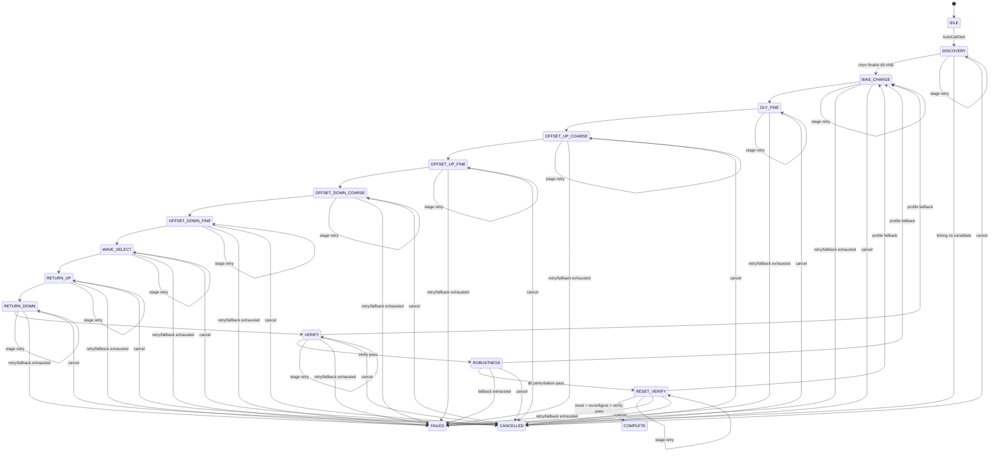
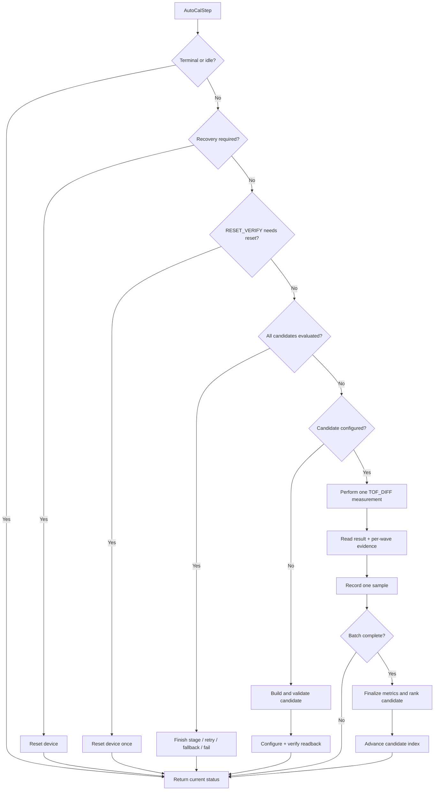

# MAX35103 Auto-Calibration Module

## 1. Mục đích tài liệu

Tài liệu này mô tả logic kỹ thuật của module tự động hiệu chỉnh cấu hình thu sóng siêu âm cho MAX35103, được triển khai trong các file:

- `max35103_autocal.h`
- `max35103_autocal.c`
- `autocal_board.h`
- `autocal_board.c`
- Các API đo và cấu hình liên quan trong `max35103.h` và `max35103.c`

Mục tiêu của module là tìm một `Max35103Profile` có khả năng thu được tín hiệu ổn định cho cả hướng UP và DOWN, phù hợp với cửa sổ thời gian bay dự kiến của đường âm, có đặc tính chu kỳ và WVR hợp lệ, ít khóa nhầm chu kỳ, đồng thời vẫn hoạt động sau khi MAX35103 được reset.

Module **không** thực hiện:

- Chuyển đổi thời gian bay thành lưu lượng.
- Hiệu chuẩn hệ số lưu lượng của đường ống.
- Ghi cấu hình vào flash nội bộ của MAX35103.
- Tự xác nhận rằng hệ thống đang ở trạng thái zero-flow.

Cấu hình tìm được được áp dụng vào ảnh thanh ghi hoạt động. Vì vậy, firmware phải nạp lại profile sau reset hoặc mất nguồn.

---

## 2. Kiến trúc module

Auto-calibration được chia thành ba lớp:

```text
Application / main loop
        |
        v
AUTOCAL_Start() + AUTOCAL_Poll()
Board integration, UART diagnostics, STM32 resources
        |
        v
Max35103AutoCalibrator
Portable search state machine and statistical evaluation
        |
        v
Max35103AutoCalBackend
configure() / measure() / reset()
        |
        v
Max35103Driver
SPI register access, TOF_DIFF measurement and wave evidence
```

### 2.1 Portable search service

`max35103_autocal.c` không phụ thuộc trực tiếp vào STM32 HAL. Phần cứng được truy cập qua `Max35103AutoCalBackend`:

```c
typedef struct
{
    Max35103Status (*configure)(void *context,
                                const Max35103Profile *profile);
    Max35103Status (*measure)(void *context,
                              Max35103RawResult *result,
                              Max35103WaveEvidence *wave);
    Max35103Status (*reset)(void *context);
    void *context;
} Max35103AutoCalBackend;
```

Contract của backend:

- `configure()` áp dụng profile dạng volatile và xác minh readback.
- `measure()` thực hiện một phép đo `TOF_DIFF`, trả về cả kết quả trung bình và bằng chứng theo từng HIT của cùng phép đo.
- `reset()` đưa IC về trạng thái sẵn sàng; state machine sẽ cấu hình lại candidate sau reset.

`MAX35103_AutoCalBindDriver()` tạo backend mặc định từ `Max35103Driver` bằng cách ánh xạ tới:

- `MAX35103_Configure()`
- `MAX35103_SelfCheck()` + mailbox kết quả
- `MAX35103_ReadWaveEvidence()`
- `MAX35103_ResetDevice()`

### 2.2 Board integration

`autocal_board.c` chịu trách nhiệm:

- Khởi tạo transport STM32 HAL.
- Khởi tạo và reset MAX35103.
- Tạo cấu hình Auto-calibration từ thông số vật lý.
- Gắn driver vào backend portable.
- Cấp phát workspace tĩnh.
- Gọi từng bước state machine từ vòng lặp chính.
- Xuất log chẩn đoán qua UART.
- Áp dụng profile cuối cùng sau khi quá trình hoàn tất.

---

## 3. Các khái niệm chính

### 3.1 Profile

`Max35103Profile` là ảnh cấu hình đầy đủ đang được thử nghiệm. Các trường quan trọng đối với Auto-calibration gồm:

| Trường | Vai trò trong Auto-calibration |
|---|---|
| `tof1` | Pulse count, DPL, charge time và stop polarity. |
| `tof2` | Số HIT, lựa chọn wave T2 và timeout. |
| `tof3..tof5` | Wave number của các HIT được sử dụng. |
| `tof6` | Comparator return offset và initial offset cho hướng UP. |
| `tof7` | Comparator return offset và initial offset cho hướng DOWN. |
| `tof_measurement_delay` | Thời điểm bắt đầu cửa sổ đo sau khi phát. |
| `calibration_control` | Điều khiển interrupt/event timing liên quan. |

### 3.2 Candidate

Candidate là một bản sao của profile nền, trong đó một hoặc một nhóm tham số được thay đổi theo stage hiện tại. Mỗi candidate phải vượt qua `MAX35103_ValidateProfile()` trước khi được cấu hình vào IC.

### 3.3 Stage

Stage là một bước tối ưu hóa một nhóm tham số. Profile tốt nhất của stage trước trở thành profile nền cho stage sau.

### 3.4 Sample batch

Mỗi candidate được đo nhiều lần:

- `samples_per_candidate`: batch thông thường.
- `finalist_samples`: batch dài hơn cho chọn wave và return offset.
- `verification_samples`: batch xác minh cuối.

Mỗi sample lưu:

- TOF UP đã chuẩn hóa về wave-zero.
- TOF DOWN đã chuẩn hóa về wave-zero.
- TOF difference do MAX35103 trả về.
- Sai số chu kỳ giữa các HIT.
- Cờ hợp lệ, vật lý, WVR và waveform.

### 3.5 Metrics

Sau khi đủ sample, module tổng hợp `Max35103AutoCalMetrics`, gồm:

- Số lượng và tỷ lệ sample hợp lệ.
- Tỷ lệ nằm trong cửa sổ vật lý.
- Tỷ lệ có chu kỳ HIT hợp lệ.
- Tỷ lệ WVR tốt cho UP, DOWN và cả hai hướng.
- Median TOF UP, DOWN và DIFF.
- MAD của TOF UP, DOWN và DIFF.
- Chênh lệch median giữa hai hướng.
- Median/MAD sai số chu kỳ.
- Số lần và tỷ lệ cycle slip.
- Kết quả của từng validation gate.
- Điểm `score` để xếp hạng candidate.

---

## 4. Khởi tạo cấu hình từ thông số vật lý

API:

```c
MAX35103_AutoCalDefaultConfig(&config,
                              acoustic_path_length_um,
                              transducer_frequency_hz);
```

### 4.1 Cửa sổ TOF vật lý

Module giả định vận tốc âm trong nước nằm trong khoảng:

- Nhanh: `1600 m/s`
- Chậm: `1400 m/s`

Với chiều dài đường âm `L` tính bằng micromet:

```text
tof_fast_ps = L_um × 1,000,000 / 1600
tof_slow_ps = L_um × 1,000,000 / 1400

expected_min_tof_ps = tof_fast_ps - 1,000,000 ps
expected_max_tof_ps = tof_slow_ps + 1,000,000 ps
```

Biên `±1 µs` được thêm để tạo cửa sổ tìm kiếm bảo thủ. Đây là cửa sổ của **wave-zero arrival**, không phải trực tiếp thời gian của một HIT đã trễ nhiều chu kỳ.

### 4.2 DPL từ tần số đầu dò

Giá trị divider được ước lượng từ tần số đầu dò:

```text
divider = round(2,000,000 / transducer_frequency_hz)
divider được giới hạn trong [2, 16]
DPL = divider - 1
```

Phạm vi Discovery mặc định quét quanh giá trị ước lượng:

```text
dpl_min = max(DPL - 1, 1)
dpl_max = min(DPL + 1, 15)
```

Chu kỳ âm kỳ vọng trong phần đánh giá waveform được tính theo:

```text
expected_period_ps = (DPL + 1) × 500,000 ps
```

### 4.3 Phạm vi DLY mặc định

Một tick DLY tương ứng với chu kỳ clock 4 MHz:

```text
1 DLY tick = 250,000 ps = 0.25 µs
```

Module đặt cửa sổ DLY trước thời điểm đến sớm nhất:

```text
dly_min_ps = expected_min_tof_ps - 4 µs
dly_max_ps = expected_min_tof_ps - 1 µs
```

Sau đó đổi sang tick và giới hạn theo giá trị hợp lệ của MAX35103.

### 4.4 Giá trị policy mặc định

| Tham số | Mặc định | Ý nghĩa |
|---|---:|---|
| `pulse_count_min..max` | 8..24 | Phạm vi số pulse phát. |
| `pulse_count_step` | 4 | Bước quét pulse count. |
| `ct_mask` | `0x0F` | Cho phép CT = 0, 1, 2, 3. |
| `try_both_polarities` | `true` | Thử cả hai stop polarity. |
| `initial_offset_min..max` | 0..32 | Phạm vi initial comparator offset. |
| `return_offset_min..max` | -16..16 | Phạm vi comparator return offset. |
| `t2_wave_min..max` | 2..10 | Phạm vi wave T2. |
| `hit_count_min..max` | 3..6 | Số HIT được đánh giá. |
| `samples_per_candidate` | 16 | Batch tìm kiếm thông thường. |
| `finalist_samples` | 32 | Batch cho wave/return tuning. |
| `verification_samples` | 128 | Batch xác minh cuối. |
| `min_valid_rate_per_mille` | 900 | Ít nhất 90% phép đo hợp lệ. |
| `min_tuning_physical_rate_per_mille` | 625 | Ít nhất 10/16 sample vật lý trong các stage tuning. |
| `min_physical_rate_per_mille` | 800 | Ít nhất 80% trong Discovery/Verify/Robustness/Reset Verify. |
| `min_wave_valid_rate_per_mille` | 900 | Ít nhất 90% có bằng chứng chu kỳ hợp lệ. |
| `min_wvr_good_rate_per_mille` | 750 | Ít nhất 75% WVR đạt yêu cầu. |
| `max_tof_mad_ps` | 250,000 ps | Giới hạn độ phân tán TOF UP/DOWN. |
| `max_diff_mad_ps` | 50,000 ps | Giới hạn độ phân tán TOF difference. |
| `max_period_error_ps` | 350,000 ps | Giới hạn median sai số chu kỳ HIT. |
| `max_cycle_slips` | 20 | Giới hạn tuyệt đối cycle slip. |
| `max_cycle_slip_rate_per_mille` | 150 | Tối đa 15% cycle slip. |
| `required_perturbation_passes` | 6/8 | Số perturbation phải vượt qua. |
| `max_stage_retries` | 1 | Mỗi stage được chạy lại tối đa một lần. |
| `max_profile_fallbacks` | 3 | Có thể backtrack qua tối đa ba finalist khác. |
| `max_consecutive_driver_errors` | 8 | Ngưỡng lỗi driver liên tiếp. |
| `max_busy_polls` | 1000 | Ngưỡng BUSY trước khi coi là lỗi. |

`max_direction_delta_ps` được đặt bằng nửa chu kỳ của đầu dò:

```text
max_direction_delta_ps = 1e12 / transducer_frequency_hz / 2
```

Mục đích là loại profile mà UP và DOWN đã khóa vào hai chu kỳ âm khác nhau.

---

## 5. State machine tổng thể



---

## 6. Ý nghĩa từng stage

| Stage | Tham số được tối ưu | Logic chính |
|---|---|---|
| `DISCOVERY` | DPL, pulse count, CT, polarity, DLY coarse | Quét không gian cấu hình phát/thu rộng để tìm các launch family có thể nhìn thấy đường âm thật. Candidate đầu tiên luôn là toàn bộ seed profile do caller cung cấp. |
| `BIAS_CHARGE` | CT | Giữ profile tốt nhất từ Discovery và tinh chỉnh charge time. |
| `DLY_FINE` | `tof_measurement_delay` | Quét DLY quanh giá trị tốt nhất của stage trước bằng bước nhỏ. |
| `OFFSET_UP_COARSE` | Initial offset UP trong `tof6` | Quét thô comparator initial offset của hướng UP. |
| `OFFSET_UP_FINE` | Initial offset UP trong `tof6` | Quét tinh quanh kết quả coarse. |
| `OFFSET_DOWN_COARSE` | Initial offset DOWN trong `tof7` | Quét thô comparator initial offset của hướng DOWN. |
| `OFFSET_DOWN_FINE` | Initial offset DOWN trong `tof7` | Quét tinh quanh kết quả coarse. |
| `WAVE_SELECT` | T2 wave và số HIT | Chọn chuỗi wave/HIT ổn định, đánh giá bằng batch dài hơn. |
| `RETURN_UP` | Return offset UP trong `tof6` | Tinh chỉnh mức comparator quay về cho hướng UP. |
| `RETURN_DOWN` | Return offset DOWN trong `tof7` | Tinh chỉnh mức comparator quay về cho hướng DOWN. |
| `VERIFY` | Không thay đổi profile | Đo 128 sample với profile đã chọn và yêu cầu toàn bộ gate cuối cùng vượt qua. |
| `ROBUSTNESS` | Perturbation xung quanh profile | Thử tám thay đổi nhỏ quanh DLY, offset UP/DOWN và T2 wave. Ít nhất sáu perturbation phải pass. |
| `RESET_VERIFY` | Không thay đổi profile | Reset MAX35103, cấu hình lại profile và đo xác minh độc lập. |
| `COMPLETE` | — | Tạo report có CRC và cung cấp profile cuối. |

### 6.1 Candidate trong Discovery

Số candidate Discovery được tính từ tích Descartes của:

```text
DPL values
× pulse-count values
× enabled CT values
× polarity values
× coarse DLY values
+ 1 seed candidate
```

Seed candidate được giữ nguyên `TOF2..TOF7`, vì lựa chọn HIT wave ảnh hưởng trực tiếp tới phép tái tạo wave-zero arrival.

Các candidate tổng quát trong Discovery sử dụng chuỗi wave ban đầu từ `t2_wave_min`, với ít nhất ba HIT nếu cấu hình cho phép.

### 6.2 Discovery finalists

Module giữ tối đa bốn finalist tốt nhất. Để tránh lưu nhiều candidate gần như giống nhau, mỗi launch family chỉ giữ một điểm DLY tốt nhất. Launch family được nhận diện bằng cùng giá trị `TOF1`.

Danh sách finalist được sắp theo `score` tăng dần; score nhỏ hơn nghĩa là candidate tốt hơn.

---

## 7. Chu trình xử lý một candidate

Mỗi lần gọi `MAX35103_AutoCalStep()` thực hiện tối đa một hành động chính:



State machine là incremental ở cấp điều phối: caller có thể gọi từng bước trong main loop để xen kẽ watchdog, log hoặc policy hệ thống. Tuy nhiên backend driver hiện tại dùng `MAX35103_SelfCheck()` và `MAX35103_ReadWaveEvidence()`, nên bản thân một phép đo là thao tác blocking.

---

## 8. Thu thập và chuẩn hóa sample

### 8.1 Nguồn dữ liệu

Một lần `measure()` tạo hai nhóm bằng chứng:

1. `Max35103RawResult`
   - `tof_up_ps`
   - `tof_down_ps`
   - `tof_diff_ps`
   - cycle count và status

2. `Max35103WaveEvidence`
   - WVR UP/DOWN.
   - Thời điểm từng HIT UP/DOWN.
   - Số HIT thực tế được cấu hình.

Backend luôn lấy mailbox của `MAX35103_SelfCheck()`, kể cả khi phép đo hoàn thành nhưng invalid, để tránh kết quả cũ chặn candidate kế tiếp.

### 8.2 Tái tạo wave-zero arrival

Thời gian HIT chứa cả thời gian truyền âm và độ trễ do chọn wave thứ `n`. Module loại phần trễ này:

```text
period_ps = (DPL + 1) × 500,000 ps
wave_delay_ps(hit) = configured_wave_number(hit) × period_ps

wave_zero_up(hit)   = hit_up_ps(hit)   - wave_delay_ps(hit)
wave_zero_down(hit) = hit_down_ps(hit) - wave_delay_ps(hit)
```

TOF UP/DOWN của sample là trung bình wave-zero của tất cả HIT được cấu hình:

```text
tof_up_ps   = average(wave_zero_up)
tof_down_ps = average(wave_zero_down)
```

Nếu một giá trị sau khi loại delay không dương, sample bị coi là không hợp lệ.

### 8.3 Kiểm tra chu kỳ HIT

Với mỗi cặp HIT liên tiếp ở cả UP và DOWN:

```text
measured_period = hit[n] - hit[n - 1]
period_error = abs(measured_period - expected_period)
```

`period_error_ps` của sample là trung bình sai số trên toàn bộ interval UP và DOWN. Bằng chứng waveform chỉ hợp lệ khi:

- Có ít nhất hai HIT.
- Các HIT tăng đơn điệu.
- Tính được period error cho cả hai hướng.

### 8.4 WVR

MAX35103 cung cấp hai tỷ số dạng unsigned Q1.7 trong mỗi word WVR:

- `t1/t2`
- `t2/tideal`

Một hướng được đánh dấu WVR tốt khi cả hai tỷ số nằm trong phạm vi:

```text
wvr_t1_t2_min_q7 <= t1/t2 <= wvr_ratio_max_q7
wvr_t2_ideal_min_q7 <= t2/tideal <= wvr_ratio_max_q7
```

Mặc định:

- `t1/t2 >= 1/128`
- `t2/tideal >= 64/128 = 0.5`
- Cả hai không vượt `208/128 = 1.625`

UP và DOWN được theo dõi riêng. Cờ `WVR_GOOD` chỉ được đặt khi cả hai hướng đều đạt.

---

## 9. Tổng hợp thống kê

Module sử dụng median và Median Absolute Deviation (MAD) thay vì mean/standard deviation để giảm ảnh hưởng của outlier.

Với các sample hợp lệ:

```text
median_X = median(X)
MAD_X = median(abs(X - median_X))
```

Các đại lượng được tính:

- `median_tof_up_ps`
- `median_tof_down_ps`
- `median_tof_diff_ps`
- `mad_tof_up_ps`
- `mad_tof_down_ps`
- `mad_tof_diff_ps`
- `median_period_error_ps`
- `mad_period_error_ps`

Period median/MAD chỉ dùng sample có `WAVE_VALID`, để sample không có bằng chứng chu kỳ không vô tình đóng góp giá trị zero và làm candidate trông tốt giả tạo.

### 9.1 Phát hiện cycle slip

Chu kỳ kỳ vọng:

```text
expected_period_ps = (DPL + 1) × 500,000 ps
slip_threshold = expected_period_ps / 2
```

Một sample được đếm là cycle slip khi TOF UP hoặc DOWN lệch khỏi median tương ứng quá nửa chu kỳ.

---

## 10. Validation gates

### 10.1 Communication gate

```text
valid_rate >= min_valid_rate_per_mille
```

Gate này xác nhận driver và đường SPI/IC tạo đủ số kết quả hợp lệ.

### 10.2 Direction gate

```text
abs(median_tof_up - median_tof_down) <= max_direction_delta_ps
```

Gate này ngăn việc UP và DOWN cùng nằm trong cửa sổ rộng nhưng khóa vào hai chu kỳ khác nhau.

### 10.3 Physical gate

Physical gate yêu cầu:

- Có sample hợp lệ.
- Direction gate pass.
- Tỷ lệ sample vật lý đạt mức yêu cầu của stage.
- Median UP nằm trong cửa sổ TOF.
- Median DOWN nằm trong cửa sổ TOF.

Các stage tuning dùng ngưỡng vật lý mềm hơn để cho phép một candidate đúng tâm nhưng chưa tối ưu tiếp tục sang bước tinh chỉnh. Discovery và các bước xác minh dùng ngưỡng nghiêm ngặt hơn.

### 10.4 Period gate

```text
wave_valid_rate >= min_wave_valid_rate_per_mille
median_period_error_ps <= max_period_error_ps
```

### 10.5 Waveform gate

```text
period_gate == true
wvr_good_rate >= min_wvr_good_rate_per_mille
```

Đây là gate waveform đầy đủ cho cả UP và DOWN.

### 10.6 Stage waveform gate

Trong các stage đầu, module chỉ yêu cầu những bằng chứng liên quan trực tiếp đến tham số đang tinh chỉnh:

| Stage | Yêu cầu waveform theo stage |
|---|---|
| Discovery, Bias Charge, DLY Fine | Chỉ cần period gate. |
| Offset UP coarse/fine | Period gate + WVR UP. |
| Offset DOWN coarse/fine | Period gate + WVR UP và DOWN. |
| Wave Select, Return UP/DOWN, Verify, Robustness, Reset Verify | Waveform gate đầy đủ. |

Cách này tránh loại bỏ quá sớm một candidate trước khi comparator offset hoặc wave selection được tinh chỉnh.

### 10.7 Statistics gate

Yêu cầu:

- Có sample hợp lệ.
- MAD UP/DOWN không vượt `max_tof_mad_ps`.
- MAD DIFF không vượt `max_diff_mad_ps`.
- Cycle slip count không vượt giới hạn tuyệt đối.
- Cycle slip rate không vượt giới hạn tỷ lệ.

### 10.8 Điều kiện `passed`

Một batch được đánh dấu pass cuối cùng khi:

```text
communication_gate
&& physical_gate
&& waveform_gate
&& statistics_gate
```

Trong các stage tìm kiếm, eligibility có thể dùng `stage_waveform_gate` thay cho waveform gate đầy đủ. Riêng `WAVE_SELECT`, `RETURN_UP` và `RETURN_DOWN` bắt buộc thêm statistics gate trước khi candidate được chọn cho bước xác minh 128 sample.

---

## 11. Cơ chế xếp hạng candidate

Các candidate đủ điều kiện được xếp theo `score`; **score càng nhỏ càng tốt**.

Score là tổng có trọng số và bão hòa để tránh tràn số. Thứ tự ưu tiên thực tế gồm:

1. Tỷ lệ valid.
2. Tỷ lệ physical.
3. Tỷ lệ wave-valid.
4. Tỷ lệ WVR liên quan tới stage.
5. Chênh lệch UP/DOWN.
6. MAD UP, DOWN và DIFF.
7. Period error.
8. Cycle slip.
9. Penalty rất lớn nếu physical gate hoặc stage waveform gate fail.

Các trọng số lớn tạo hành vi gần giống xếp hạng theo thứ tự ưu tiên: một cải thiện về valid rate thường quan trọng hơn nhiều thay đổi nhỏ về MAD.

Ngoài profile tốt nhất hợp lệ, module còn giữ `stage_closest_profile` có score thấp nhất. Profile này được lưu vào failure diagnostics khi không có candidate pass, giúp phân tích candidate gần đạt nhất.

---

## 12. Retry, recovery và fallback

### 12.1 BUSY handling

Nếu `configure()` hoặc `measure()` trả `MAX35103_BUSY`, state machine không tăng candidate/sample mà chỉ tăng `busy_poll_count`.

Khi đạt `max_busy_polls`, quá trình kết thúc với driver error.

### 12.2 Driver recovery

Các lỗi SPI, not-ready, timeout hoặc device error có thể đặt `recovery_required`. Ở lần `AutoCalStep()` tiếp theo, module gọi `backend.reset()` trước khi tiếp tục.

Sau reset:

- `candidate_configured` bị xóa.
- Candidate hiện tại sẽ được cấu hình lại.
- Nếu reset liên tiếp thất bại tới `max_consecutive_driver_errors`, quá trình fail.

### 12.3 Stage retry

Khi một stage không tìm được candidate hợp lệ, module có thể chạy lại toàn bộ stage nếu chưa đạt `max_stage_retries`.

Retry:

- Giữ nguyên profile nền của stage.
- Xóa candidate/metrics tốt nhất và gần nhất.
- Đặt candidate index về zero.
- Discovery còn xóa cả danh sách finalist để đánh giá lại độc lập.

### 12.4 Profile fallback

Nếu stage retry không giải quyết được vấn đề, module có thể quay lại finalist tiếp theo từ Discovery:

```text
selected finalist #0 fails later stage
        -> use finalist #1
        -> restart at BIAS_CHARGE
```

Fallback không quay lại Discovery. Nó bắt đầu lại từ `BIAS_CHARGE` với launch family khác đã được Discovery xác nhận.

Số lần fallback bị giới hạn bởi cả:

- `max_profile_fallbacks`
- Số finalist thực tế tìm được.

---

## 13. Robustness test

Sau khi profile vượt qua `VERIFY`, module tạo tối đa tám perturbation:

| Index | Perturbation |
|---:|---|
| 0 | Giảm DLY một fine step. |
| 1 | Tăng DLY một fine step. |
| 2 | Giảm initial offset UP một fine step. |
| 3 | Tăng initial offset UP một fine step. |
| 4 | Giảm initial offset DOWN một fine step. |
| 5 | Tăng initial offset DOWN một fine step. |
| 6 | Giảm T2 wave một đơn vị. |
| 7 | Tăng T2 wave một đơn vị. |

Nếu perturbation chạm biên, code thử hướng/bước thay thế. Nếu không thể tạo thay đổi thực sự, candidate đó bị bỏ qua.

Mỗi perturbation được đánh giá bằng tiêu chí `metrics.passed` đầy đủ. Mặc định cần ít nhất `6/8` perturbation pass.

Mục đích của stage này không phải chọn profile mới, mà xác minh profile đã chọn không nằm đúng tại một điểm rất hẹp hoặc không ổn định trong không gian tham số.

---

## 14. Reset verification

`RESET_VERIFY` là bằng chứng độc lập cuối cùng:

1. Reset MAX35103 đúng một lần khi vào stage.
2. Cấu hình lại selected profile.
3. Đo batch `verification_samples`.
4. Yêu cầu toàn bộ validation gate cuối pass.
5. Cấu hình lại selected profile một lần nữa trước khi hoàn tất.
6. Tạo report và CRC.

Nếu reset verification fail, module thử stage retry hoặc profile fallback trước khi kết luận không có candidate.

---

## 15. Báo cáo kết quả

Khi hoàn tất, `Max35103AutoCalReport` chứa:

- Magic và version của report.
- Kích thước struct.
- Chiều dài đường âm và cửa sổ TOF.
- Selected profile.
- Verification metrics cuối.
- Tổng số candidate và phép đo đã thực hiện.
- Số perturbation test/pass.
- Số profile fallback đã dùng.
- Zero-flow offset và MAD của TOF difference.
- Confidence.
- Cờ reset verification.
- CRC-32/ISO-HDLC của các trường evidence được encode rõ ràng.

### 15.1 Confidence

| Giá trị | Ý nghĩa |
|---|---|
| `NONE` | Không có kết quả đáng tin cậy. |
| `CANDIDATE` | Enum có định nghĩa nhưng luồng hoàn tất hiện tại không phát report ở mức này. |
| `ACOUSTIC_VERIFIED` | Profile vượt Verify, Robustness và Reset Verify. |
| `ZERO_FLOW_COMPENSATED` | Ngoài acoustic verification, caller đã xác nhận zero-flow và MAD DIFF đạt yêu cầu. |

Trong board integration hiện tại:

```c
config.zero_flow_confirmed = false;
```

Do đó kết quả bình thường có confidence `ACOUSTIC_VERIFIED`, không phải `ZERO_FLOW_COMPENSATED`.

### 15.2 Zero-flow offset

Report luôn lưu:

```text
zero_flow_offset_ps = median_tof_diff_ps
zero_flow_mad_ps    = mad_tof_diff_ps
```

Tuy nhiên chỉ khi `zero_flow_confirmed == true` thì offset này mới được nâng mức confidence để sử dụng như bằng chứng zero-flow compensation.

---

## 16. Cấu hình STM32 board hiện tại

`autocal_board.c` hiện đặt:

```c
#define MAX35103_AUTOCAL_SAMPLE_CAPACITY 128U
#define MAX35103_ACOUSTIC_PATH_UM        15000U
#define MAX35103_TRANSDUCER_FREQUENCY_HZ 1000000U
```

Sau khi tạo default config, board override:

```c
config.dpl_min = 1U;
config.dpl_max = 1U;
config.ct_mask = 0x0FU;
config.dly_min = 0x001CU;
config.dly_max = 0x0023U;
config.dly_coarse_step = 1U;
config.dly_fine_step = 1U;
config.zero_flow_confirmed = false;
```

Nghĩa là HIL hiện tại:

- Dành cho đường âm 15 mm.
- Đầu dò 1 MHz.
- Chỉ quét DPL = 1.
- Quét toàn bộ CT = 0..3.
- DLY từ 28 đến 35 tick, tương đương khoảng 7.00 đến 8.75 µs theo clock danh định 4 MHz.
- DLY coarse và fine đều có bước 0.25 µs.

Các override này là cấu hình board/HIL cụ thể, không phải giới hạn của portable Auto-calibration service.

---

## 17. Trình tự tích hợp trong firmware

### 17.1 Khởi động

```c
static const Max35103Profile seed_profile = MAX35103_AUTOCAL_SEED_DEFAULT;
static Max35103Driver max_driver;

int main(void)
{
    HAL_Init();
    SystemClock_Config();
    MX_GPIO_Init();
    MX_SPI1_Init();
    MX_USART2_UART_Init();

    AUTOCAL_Start(&max_driver, &seed_profile);

    while (1)
    {
        AUTOCAL_Poll();

        /* Other cooperative tasks and watchdog handling. */
    }
}
```

`AUTOCAL_Start()` thực hiện:

1. Kiểm tra argument.
2. Tạo STM32 HAL transport.
3. Khởi tạo driver.
4. Hardware reset IC.
5. Tạo và override Auto-calibration config.
6. Bind driver backend.
7. Khởi tạo calibrator và sample workspace.
8. Chuyển state sang Discovery.
9. Xuất log START, SEED và POLICY.

### 17.2 Polling

`AUTOCAL_Poll()`:

- Gọi một `MAX35103_AutoCalStep()`.
- Lấy progress snapshot.
- Xuất diagnostic định kỳ.
- Phát hiện stage pass, retry và fallback.
- Khi complete, lấy report và áp dụng profile.
- Khi fail, xuất profile/metrics gần đạt nhất.

Không gọi `AUTOCAL_Start()` lại trong khi `s_active == true`.

---

## 18. Hướng dẫn đọc log

### 18.1 START

```text
AUTOCAL|START|path_um=15000|arrival_ns=...|dly_ticks=28..35|...
```

Cho biết thông số vật lý và không gian Discovery.

### 18.2 SEED

```text
AUTOCAL|SEED|TOF1=...|TOF2=...|...|DLY=...
```

Ảnh cấu hình ban đầu do caller cung cấp.

### 18.3 POLICY

```text
AUTOCAL|POLICY|valid_rate=900|physical_tuning=625|...
```

Các ngưỡng gate dùng trong lần chạy hiện tại.

### 18.4 DIAG_CFG

```text
AUTOCAL|DIAG_CFG|state=...|DPL=...|PL=...|CT=...|POL=...|DLY=...
```

Cấu hình của candidate vừa đánh giá và WVR gần nhất.

### 18.5 DIAG

```text
AUTOCAL|DIAG|valid=...|physical=...|wave=...|...
```

Các metric và gate của candidate. Các field quan trọng:

| Field | Ý nghĩa |
|---|---|
| `valid` | Số phép đo driver hợp lệ / số đã thử. |
| `physical` | Số sample có UP và DOWN trong cửa sổ vật lý. |
| `wave` | Số sample có chu kỳ HIT tính được. |
| `physical_rate=x/y` | Tỷ lệ thực tế `x`, yêu cầu của stage `y`. |
| `arrival_up_ns`, `arrival_down_ns` | Median wave-zero arrival. |
| `direction_delta_ns` | Độ lệch median UP/DOWN. |
| `period_error_ps` | Median sai số chu kỳ HIT. |
| `slips`, `slip_rate` | Cycle slip count/rate. |
| `gate_*` | Kết quả từng validation gate. |

### 18.6 STAGE_PASS

```text
AUTOCAL|STAGE_PASS|from=DLY_FINE|to=OFFSET_UP_COARSE|...
```

Stage đã chọn được candidate tốt nhất và chuyển sang bước tiếp theo.

### 18.7 STAGE_RETRY

```text
AUTOCAL|STAGE_RETRY|state=VERIFY|retry=1/1
```

Không có candidate pass; cùng stage đang được chạy lại.

### 18.8 BACKTRACK

```text
AUTOCAL|BACKTRACK|from=VERIFY|to=BIAS_CHARGE|fallback=1/3|...
```

Launch family hiện tại thất bại ở stage sau; module quay về finalist Discovery tiếp theo.

### 18.9 PASS

```text
AUTOCAL|PASS|confidence=2|valid=1000/1000|...|reset=1|crc=...
```

Profile đã vượt toàn bộ chuỗi xác minh.

### 18.10 PROFILE

```text
AUTOCAL|PROFILE|TOF1=...|TOF2=...|...|DLY=...
```

Profile cuối cùng cần lưu vào cấu hình sản phẩm hoặc persistent storage của firmware.

### 18.11 FAIL và FAIL_METRICS

```text
AUTOCAL|FAIL|status=...|state=...|candidate=...|...
AUTOCAL|FAIL_METRICS|valid=...|physical=...|...
```

Các log này chứa stage thất bại và candidate gần đạt nhất, không nhất thiết là candidate cuối cùng được thử.

---

## 19. Tài nguyên và đặc tính thực thi

### 19.1 RAM

Workspace do caller sở hữu. Header ghi nhận một `Max35103AutoCalSample` thường chiếm khoảng 48 byte tùy ABI.

Với 128 sample:

```text
128 × khoảng 48 byte ≈ 6 KiB
```

Ngoài workspace, `Max35103AutoCalibrator` còn chứa nhiều profile, metrics, finalist và report. Nên cấp phát tĩnh hoặc đặt trong composition root thay vì trên stack nhỏ của task.

### 19.2 Thời gian chạy

Thời gian phụ thuộc vào:

```text
Tổng candidate của từng stage
× sample target của stage
× thời gian một TOF_DIFF measurement
+ thời gian configure/reset/retry/fallback
```

Discovery thường chiếm phần lớn thời gian vì quét tích của nhiều tham số. Board HIL đã thu hẹp DPL và DLY để giảm không gian tìm kiếm.

### 19.3 Reentrancy

API instance-based `MAX35103_AutoCalInit/Start/Step` có thể sử dụng với workspace riêng cho từng instance nếu backend/driver tương ứng cũng độc lập.

Convenience API blocking `MAX35103_AutoCal()` sử dụng workspace `static`, vì vậy không reentrant và được thiết kế cho một MCU đơn lõi với một phiên calibration tại một thời điểm.

---


### 19.4 Quan sát về API blocking trong implementation

`max35103_autocal.c` có triển khai hàm `MAX35103_AutoCal()` để chạy toàn bộ quy trình theo kiểu blocking và sử dụng workspace `static`. Tuy nhiên, phiên bản `max35103_autocal.h` đi kèm **không khai báo prototype cho hàm này**. Vì vậy, trong trạng thái source hiện tại, đây chưa phải public API chính thức để module khác gọi trực tiếp. Luồng tích hợp được công bố qua header vẫn là `Init()` → `Start()` → `Step()`.

## 20. Điều kiện để kết quả có ý nghĩa

Trước khi chạy Auto-calibration cần bảo đảm:

- SPI mode, clock, NSS và reset hoạt động ổn định.
- Đầu dò được ghép âm đúng và đường âm có môi chất phù hợp.
- Chiều dài đường âm truyền vào config đúng với phần cứng.
- Tần số đầu dò phản ánh thiết kế thực tế.
- Cửa sổ TOF đã tính tới fixed analog/circuit delay nếu phần cứng có độ trễ đáng kể.
- Seed profile hợp lệ theo `MAX35103_ValidateProfile()`.
- Workspace đủ chứa `samples_per_candidate`, `finalist_samples` và `verification_samples`.
- Auto-calibration không được chạy trong ISR.

Profile tìm được chỉ được xác minh trong điều kiện phần cứng và môi trường tại thời điểm chạy. Thay đổi đầu dò, đường âm, mạch analog, mức nguồn, cơ khí hoặc môi chất có thể yêu cầu chạy lại calibration hoặc xác minh lại profile.

---

## 21. API public

| API | Chức năng |
|---|---|
| `MAX35103_AutoCalDefaultConfig()` | Tạo config bảo thủ từ chiều dài đường âm và tần số đầu dò. |
| `MAX35103_AutoCalBindDriver()` | Bind `Max35103Driver` vào backend portable. |
| `MAX35103_AutoCalInit()` | Khởi tạo instance và gắn workspace do caller cấp. |
| `MAX35103_AutoCalStart()` | Reset trạng thái tìm kiếm và bắt đầu từ Discovery. |
| `MAX35103_AutoCalStep()` | Thực hiện tối đa một measurement hoặc một transition action. |
| `MAX35103_AutoCalCancel()` | Hủy phiên đang chạy. |
| `MAX35103_AutoCalGetState()` | Đọc state hiện tại. |
| `MAX35103_AutoCalGetProgress()` | Lấy snapshot tiến độ. |
| `MAX35103_AutoCalHasReport()` | Kiểm tra report hoàn chỉnh đã sẵn sàng. |
| `MAX35103_AutoCalGetReport()` | Sao chép report ra vùng nhớ của caller. |
| `MAX35103_AutoCalStateName()` | Tên ổn định của state cho diagnostic. |
| `MAX35103_AutoCalReportCrc32()` | Tính CRC-32 trên evidence fields. |
| `AUTOCAL_Start()` | Entry point board-specific cho STM32 HIL. |
| `AUTOCAL_Poll()` | Poll state machine và xuất UART diagnostics. |

---

## 22. Kết luận

Auto-calibration hiện tại là một quy trình tìm kiếm tuần tự nhiều tầng, kết hợp:

1. **Tìm kiếm tham số phát và cửa sổ đo** để nhận được đường âm thật.
2. **Tinh chỉnh comparator cho từng hướng** để cải thiện WVR.
3. **Chọn wave/HIT** để duy trì chu kỳ đúng và tránh khóa nhầm cycle.
4. **Đánh giá robust statistics** bằng median, MAD và cycle-slip detection.
5. **Xác minh dài hạn** bằng batch 128 sample.
6. **Kiểm tra độ bền cục bộ** bằng perturbation.
7. **Kiểm tra độc lập sau reset** trước khi công bố report.
8. **Retry và backtracking** để tránh thất bại do nhiễu ngẫu nhiên hoặc launch family không phù hợp.

Kết quả cuối không chỉ là một profile có thể tạo dữ liệu, mà là một profile đã có bằng chứng về tính hợp lệ vật lý, dạng sóng, thống kê, độ bền tham số và khả năng khôi phục sau reset.
