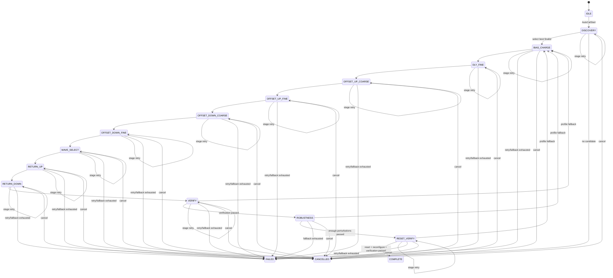
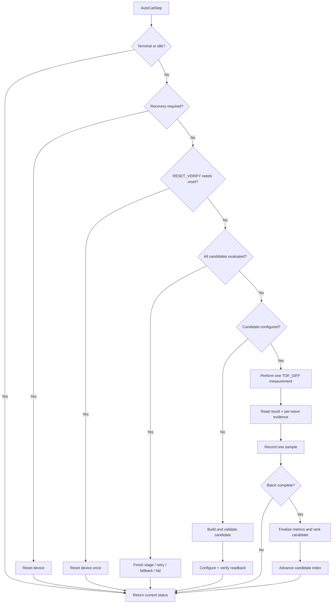

# MAX35103 Auto-Calibration Module

## 1. Purpose of This Document

This document describes the technical logic of the module that automatically calibrates the ultrasonic receive configuration for the MAX35103. The implementation is located in:

- `max35103_autocal.h`
- `max35103_autocal.c`
- `autocal_board.h`
- `autocal_board.c`
- Related measurement and configuration APIs in `max35103.h` and `max35103.c`

The module is intended to find a `Max35103Profile` that can receive stable signals in both the UP and DOWN directions, matches the expected time-of-flight window of the acoustic path, has valid period and WVR characteristics, avoids locking onto the wrong acoustic cycle, and continues to operate after the MAX35103 is reset.

The module does **not**:

- Convert time of flight into flow rate.
- Calibrate the flow coefficient of the pipe.
- Write configuration into the internal flash of the MAX35103.
- Automatically confirm that the system is under zero-flow conditions.

The selected configuration is applied to the volatile register image. Therefore, the firmware must reload the profile after a reset or power loss.

---

## 2. Module Architecture

The Auto-calibration module is divided into three layers:

```text
Application / main loop
        |
        v
AUTOCAL_Start() + AUTOCAL_Poll()
Board integration, UART diagnostics, STM32 resources
        |
        v
Max35103AutoCalibrator
Portable search state machine and statistical evaluation
        |
        v
Max35103AutoCalBackend
configure() / measure() / reset()
        |
        v
Max35103Driver
SPI register access, TOF_DIFF measurement and wave evidence
```

### 2.1 Portable Search Service

`max35103_autocal.c` does not depend directly on STM32 HAL. Hardware access is provided through `Max35103AutoCalBackend`:

```c
typedef struct
{
    Max35103Status (*configure)(void *context,
                                const Max35103Profile *profile);
    Max35103Status (*measure)(void *context,
                              Max35103RawResult *result,
                              Max35103WaveEvidence *wave);
    Max35103Status (*reset)(void *context);
    void *context;
} Max35103AutoCalBackend;
```

Backend contract:

- `configure()` applies the volatile profile and verifies the register readback.
- `measure()` performs one `TOF_DIFF` measurement and returns both the averaged result and per-HIT evidence from the same measurement.
- `reset()` returns the IC to the ready state; the state machine reconfigures the candidate after the reset.

`MAX35103_AutoCalBindDriver()` creates the default backend from `Max35103Driver` by mapping it to:

- `MAX35103_Configure()`
- `MAX35103_SelfCheck()` plus the result mailbox
- `MAX35103_ReadWaveEvidence()`
- `MAX35103_ResetDevice()`

### 2.2 Board Integration

`autocal_board.c` is responsible for:

- Initializing the STM32 HAL transport.
- Initializing and resetting the MAX35103.
- Creating the Auto-calibration configuration from physical parameters.
- Binding the driver to the portable backend.
- Allocating static workspace.
- Calling the state machine one step at a time from the main loop.
- Sending diagnostic logs over UART.
- Applying the final profile after the process completes.

---

## 3. Key Concepts

### 3.1 Profile

`Max35103Profile` is the complete configuration image being evaluated. The fields that are important to Auto-calibration include:

| Field | Role in Auto-calibration |
|---|---|
| `tof1` | Pulse count, DPL, charge time, and stop polarity. |
| `tof2` | HIT count, T2 wave selection, and timeout. |
| `tof3..tof5` | Wave numbers of the HITs being used. |
| `tof6` | Comparator return offset and initial offset for the UP direction. |
| `tof7` | Comparator return offset and initial offset for the DOWN direction. |
| `tof_measurement_delay` | Start time of the measurement window after transmission. |
| `calibration_control` | Related interrupt and Event Timing control. |

### 3.2 Candidate

A candidate is a copy of the base profile in which one parameter or a group of parameters is modified according to the current stage. Every candidate must pass `MAX35103_ValidateProfile()` before it can be configured into the IC.

### 3.3 Stage

A stage optimizes one group of parameters. The best profile from the previous stage becomes the base profile for the next stage.

### 3.4 Sample Batch

Each candidate is measured multiple times:

- `samples_per_candidate`: normal search batch.
- `finalist_samples`: longer batch for wave selection and return-offset tuning.
- `verification_samples`: final verification batch.

Each sample stores:

- UP TOF normalized to wave-zero.
- DOWN TOF normalized to wave-zero.
- TOF difference returned by the MAX35103.
- Period error between HITs.
- Validity, physical, WVR, and waveform flags.

### 3.5 Metrics

After enough samples have been collected, the module produces `Max35103AutoCalMetrics`, including:

- Number and rate of valid samples.
- Rate of samples inside the physical window.
- Rate of samples with valid HIT periods.
- Rate of good WVR for UP, DOWN, and both directions.
- Median UP, DOWN, and DIFF TOF.
- MAD of UP, DOWN, and DIFF TOF.
- Median difference between both directions.
- Median and MAD of period error.
- Number and rate of cycle slips.
- Result of each validation gate.
- Candidate-ranking `score`.

---

## 4. Creating the Configuration from Physical Parameters

API:

```c
MAX35103_AutoCalDefaultConfig(&config,
                              acoustic_path_length_um,
                              transducer_frequency_hz);
```

### 4.1 Physical TOF Window

The module assumes that the speed of sound in water is within the following range:

- Fast: `1600 m/s`
- Slow: `1400 m/s`

For an acoustic path length `L` in micrometers:

```text
tof_fast_ps = L_um × 1,000,000 / 1600
tof_slow_ps = L_um × 1,000,000 / 1400

expected_min_tof_ps = tof_fast_ps - 1,000,000 ps
expected_max_tof_ps = tof_slow_ps + 1,000,000 ps
```

A margin of `±1 µs` is added to create a conservative search window. This is the window of the **wave-zero arrival**, not the direct time of a HIT that has already been delayed by several acoustic cycles.

### 4.2 DPL from the Transducer Frequency

The divider value is estimated from the transducer frequency:

```text
divider = round(2,000,000 / transducer_frequency_hz)
divider is clamped to [2, 16]
DPL = divider - 1
```

The default Discovery range scans around the estimated value:

```text
dpl_min = max(DPL - 1, 1)
dpl_max = min(DPL + 1, 15)
```

The expected acoustic period used during waveform evaluation is:

```text
expected_period_ps = (DPL + 1) × 500,000 ps
```

### 4.3 Default DLY Range

One DLY tick corresponds to the 4 MHz clock period:

```text
1 DLY tick = 250,000 ps = 0.25 µs
```

The module places the DLY window before the earliest expected arrival:

```text
dly_min_ps = expected_min_tof_ps - 4 µs
dly_max_ps = expected_min_tof_ps - 1 µs
```

The values are then converted to ticks and clamped to the valid MAX35103 range.

### 4.4 Default Policy Values

| Parameter | Default | Meaning |
|---|---:|---|
| `pulse_count_min..max` | 8..24 | Transmit pulse-count range. |
| `pulse_count_step` | 4 | Pulse-count scan step. |
| `ct_mask` | `0x0F` | Enables CT = 0, 1, 2, 3. |
| `try_both_polarities` | `true` | Tries both stop polarities. |
| `initial_offset_min..max` | 0..32 | Initial comparator-offset range. |
| `return_offset_min..max` | -16..16 | Comparator return-offset range. |
| `t2_wave_min..max` | 2..10 | T2 wave range. |
| `hit_count_min..max` | 3..6 | Number of HITs to evaluate. |
| `samples_per_candidate` | 16 | Normal search batch. |
| `finalist_samples` | 32 | Batch for wave and return tuning. |
| `verification_samples` | 128 | Final verification batch. |
| `min_valid_rate_per_mille` | 900 | At least 90% valid measurements. |
| `min_tuning_physical_rate_per_mille` | 625 | At least 10 of 16 physical samples in tuning stages. |
| `min_physical_rate_per_mille` | 800 | At least 80% in Discovery, Verify, Robustness, and Reset Verify. |
| `min_wave_valid_rate_per_mille` | 900 | At least 90% with valid period evidence. |
| `min_wvr_good_rate_per_mille` | 750 | At least 75% with acceptable WVR. |
| `max_tof_mad_ps` | 250,000 ps | Maximum UP/DOWN TOF dispersion. |
| `max_diff_mad_ps` | 50,000 ps | Maximum TOF-difference dispersion. |
| `max_period_error_ps` | 350,000 ps | Maximum median HIT-period error. |
| `max_cycle_slips` | 20 | Absolute cycle-slip limit. |
| `max_cycle_slip_rate_per_mille` | 150 | Maximum cycle-slip rate of 15%. |
| `required_perturbation_passes` | 6/8 | Number of perturbations that must pass. |
| `max_stage_retries` | 1 | Each stage may be repeated at most once. |
| `max_profile_fallbacks` | 3 | Up to three alternative finalists may be tried. |
| `max_consecutive_driver_errors` | 8 | Consecutive driver-error threshold. |
| `max_busy_polls` | 1000 | BUSY-poll threshold before failure. |

`max_direction_delta_ps` is set to half of one transducer period:

```text
max_direction_delta_ps = 1e12 / transducer_frequency_hz / 2
```

Its purpose is to reject profiles in which UP and DOWN have locked onto two different acoustic cycles.

---

## 5. Overall State Machine



---

## 6. Purpose of Each Stage

| Stage | Optimized Parameters | Main Logic |
|---|---|---|
| `DISCOVERY` | DPL, pulse count, CT, polarity, coarse DLY | Scans a broad transmit/receive configuration space to find launch families that can observe the real acoustic path. The first candidate is always the complete seed profile provided by the caller. |
| `BIAS_CHARGE` | CT | Keeps the best profile from Discovery and fine-tunes charge time. |
| `DLY_FINE` | `tof_measurement_delay` | Scans DLY around the best value from the previous stage using a small step. |
| `OFFSET_UP_COARSE` | Initial UP offset in `tof6` | Coarse scan of the UP initial comparator offset. |
| `OFFSET_UP_FINE` | Initial UP offset in `tof6` | Fine scan around the coarse result. |
| `OFFSET_DOWN_COARSE` | Initial DOWN offset in `tof7` | Coarse scan of the DOWN initial comparator offset. |
| `OFFSET_DOWN_FINE` | Initial DOWN offset in `tof7` | Fine scan around the coarse result. |
| `WAVE_SELECT` | T2 wave and HIT count | Selects a stable wave/HIT sequence using a longer evaluation batch. |
| `RETURN_UP` | UP return offset in `tof6` | Tunes the comparator return level for the UP direction. |
| `RETURN_DOWN` | DOWN return offset in `tof7` | Tunes the comparator return level for the DOWN direction. |
| `VERIFY` | Profile unchanged | Measures 128 samples using the selected profile and requires all final gates to pass. |
| `ROBUSTNESS` | Perturbations around the profile | Tries eight small changes around DLY, UP/DOWN offsets, and T2 wave. At least six perturbations must pass. |
| `RESET_VERIFY` | Profile unchanged | Resets the MAX35103, reloads the profile, and performs an independent verification batch. |
| `COMPLETE` | — | Creates the CRC-protected report and exposes the final profile. |

### 6.1 Candidates in Discovery

The number of Discovery candidates is calculated from the Cartesian product of:

```text
DPL values
× pulse-count values
× enabled CT values
× polarity values
× coarse DLY values
+ 1 seed candidate
```

The seed candidate preserves the complete `TOF2..TOF7` configuration because HIT-wave selection directly affects wave-zero reconstruction.

General Discovery candidates use an initial wave sequence beginning at `t2_wave_min`, with at least three HITs when the configuration permits.

### 6.2 Discovery Finalists

The module retains up to four best finalists. To avoid storing several nearly identical candidates, only the best DLY point is retained for each launch family. A launch family is identified by the same `TOF1` value.

The finalist list is sorted by increasing `score`; a lower score means a better candidate.

---

## 7. Candidate Processing Cycle

Each call to `MAX35103_AutoCalStep()` performs at most one main action:



The state machine is incremental at the orchestration level: the caller may execute one step at a time from the main loop and interleave watchdog servicing, logging, or system policy. However, the current driver backend uses `MAX35103_SelfCheck()` and `MAX35103_ReadWaveEvidence()`, so one individual measurement is still a blocking operation.

---

## 8. Sample Collection and Normalization

### 8.1 Data Sources

One `measure()` call produces two groups of evidence:

1. `Max35103RawResult`
   - `tof_up_ps`
   - `tof_down_ps`
   - `tof_diff_ps`
   - cycle count and status

2. `Max35103WaveEvidence`
   - UP/DOWN WVR.
   - UP/DOWN time of each HIT.
   - Actual configured HIT count.

The backend always consumes the mailbox produced by `MAX35103_SelfCheck()`, even when a measurement completes with invalid data, so that a stale result cannot block the next candidate.

### 8.2 Reconstructing Wave-Zero Arrival

A HIT timestamp contains both the propagation time and the delay caused by selecting wave number `n`. The module removes this wave delay:

```text
period_ps = (DPL + 1) × 500,000 ps
wave_delay_ps(hit) = configured_wave_number(hit) × period_ps

wave_zero_up(hit)   = hit_up_ps(hit)   - wave_delay_ps(hit)
wave_zero_down(hit) = hit_down_ps(hit) - wave_delay_ps(hit)
```

The sample UP/DOWN TOF is the average wave-zero value of all configured HITs:

```text
tof_up_ps   = average(wave_zero_up)
tof_down_ps = average(wave_zero_down)
```

If a value is not positive after removing the wave delay, the sample is considered invalid.

### 8.3 HIT-Period Validation

For every pair of consecutive HITs in both UP and DOWN:

```text
measured_period = hit[n] - hit[n - 1]
period_error = abs(measured_period - expected_period)
```

The sample `period_error_ps` is the average error across all UP and DOWN intervals. Waveform evidence is valid only when:

- At least two HITs are available.
- HIT times increase monotonically.
- Period error can be calculated for both directions.

### 8.4 WVR

The MAX35103 provides two unsigned Q1.7 ratios in each WVR word:

- `t1/t2`
- `t2/tideal`

One direction is marked as having good WVR when both ratios are inside the configured range:

```text
wvr_t1_t2_min_q7 <= t1/t2 <= wvr_ratio_max_q7
wvr_t2_ideal_min_q7 <= t2/tideal <= wvr_ratio_max_q7
```

Defaults:

- `t1/t2 >= 1/128`
- `t2/tideal >= 64/128 = 0.5`
- Neither ratio exceeds `208/128 = 1.625`

UP and DOWN are tracked separately. `WVR_GOOD` is set only when both directions pass.

---

## 9. Statistical Aggregation

The module uses the median and Median Absolute Deviation (MAD) instead of the mean and standard deviation to reduce sensitivity to outliers.

For valid samples:

```text
median_X = median(X)
MAD_X = median(abs(X - median_X))
```

The following values are calculated:

- `median_tof_up_ps`
- `median_tof_down_ps`
- `median_tof_diff_ps`
- `mad_tof_up_ps`
- `mad_tof_down_ps`
- `mad_tof_diff_ps`
- `median_period_error_ps`
- `mad_period_error_ps`

Period median and MAD use only samples marked with `WAVE_VALID`, preventing samples without valid period evidence from contributing an artificial zero and making a candidate appear better than it is.

### 9.1 Cycle-Slip Detection

Expected period:

```text
expected_period_ps = (DPL + 1) × 500,000 ps
slip_threshold = expected_period_ps / 2
```

A sample is counted as a cycle slip when its UP or DOWN TOF differs from the corresponding median by more than half of one acoustic period.

---

## 10. Validation Gates

### 10.1 Communication Gate

```text
valid_rate >= min_valid_rate_per_mille
```

This gate verifies that the driver and SPI/IC path produce enough valid results.

### 10.2 Direction Gate

```text
abs(median_tof_up - median_tof_down) <= max_direction_delta_ps
```

This gate prevents UP and DOWN from both appearing inside a wide physical window while actually locking onto different acoustic cycles.

### 10.3 Physical Gate

The physical gate requires:

- At least one valid sample.
- A passing direction gate.
- A stage-appropriate physical-sample rate.
- UP median inside the TOF window.
- DOWN median inside the TOF window.

Tuning stages use a softer physical threshold so that a centered but not-yet-optimized candidate can continue to later tuning steps. Discovery and verification stages use the stricter threshold.

### 10.4 Period Gate

```text
wave_valid_rate >= min_wave_valid_rate_per_mille
median_period_error_ps <= max_period_error_ps
```

### 10.5 Waveform Gate

```text
period_gate == true
wvr_good_rate >= min_wvr_good_rate_per_mille
```

This is the complete waveform gate for both UP and DOWN.

### 10.6 Stage Waveform Gate

During early stages, the module requires only the evidence directly related to the parameter currently being tuned:

| Stage | Stage waveform requirement |
|---|---|
| Discovery, Bias Charge, DLY Fine | Period gate only. |
| Offset UP coarse/fine | Period gate plus UP WVR. |
| Offset DOWN coarse/fine | Period gate plus UP and DOWN WVR. |
| Wave Select, Return UP/DOWN, Verify, Robustness, Reset Verify | Complete waveform gate. |

This prevents a candidate from being rejected too early before comparator offsets or wave selection have been tuned.

### 10.7 Statistics Gate

Requirements:

- At least one valid sample.
- UP/DOWN MAD does not exceed `max_tof_mad_ps`.
- DIFF MAD does not exceed `max_diff_mad_ps`.
- Cycle-slip count does not exceed the absolute limit.
- Cycle-slip rate does not exceed the configured rate limit.

### 10.8 `passed` Condition

A batch is marked as finally passed when:

```text
communication_gate
&& physical_gate
&& waveform_gate
&& statistics_gate
```

During search stages, candidate eligibility may use `stage_waveform_gate` instead of the complete waveform gate. `WAVE_SELECT`, `RETURN_UP`, and `RETURN_DOWN` additionally require the statistics gate before a candidate can proceed to the 128-sample verification step.

---

## 11. Candidate-Ranking Mechanism

Eligible candidates are ranked by `score`; a **lower score is better**.

The score is a weighted, saturating sum to avoid integer overflow. Its effective priority order is:

1. Valid rate.
2. Physical rate.
3. Wave-valid rate.
4. Stage-relevant WVR rate.
5. UP/DOWN difference.
6. UP, DOWN, and DIFF MAD.
7. Period error.
8. Cycle slip.
9. A very large penalty when the physical gate or stage waveform gate fails.

The large weights create behavior similar to priority-based ranking: an improvement in valid rate generally matters more than several small MAD improvements.

In addition to the best eligible profile, the module retains `stage_closest_profile`, which has the lowest score among all evaluated candidates. This profile is stored in failure diagnostics when no candidate passes, allowing analysis of the candidate that came closest to satisfying the gates.

---

## 12. Retry, Recovery, and Fallback

### 12.1 BUSY Handling

If `configure()` or `measure()` returns `MAX35103_BUSY`, the state machine does not advance the candidate or sample index; it only increments `busy_poll_count`.

When `max_busy_polls` is reached, the process terminates with a driver error.

### 12.2 Driver Recovery

SPI, not-ready, timeout, or device errors may set `recovery_required`. On the next `AutoCalStep()`, the module calls `backend.reset()` before continuing.

After reset:

- `candidate_configured` is cleared.
- The current candidate is configured again.
- If reset continues to fail until `max_consecutive_driver_errors` is reached, the process fails.

### 12.3 Stage Retry

When a stage cannot find an eligible candidate, the module may rerun the entire stage if `max_stage_retries` has not been reached.

A retry:

- Preserves the stage base profile.
- Clears the best and closest candidate/metrics.
- Resets the candidate index to zero.
- In Discovery, also clears the finalist list so the stage can be evaluated independently again.

### 12.4 Profile Fallback

If a stage retry does not resolve the problem, the module may return to the next finalist from Discovery:

```text
selected finalist #0 fails later stage
        -> use finalist #1
        -> restart at BIAS_CHARGE
```

Fallback does not rerun Discovery. It restarts at `BIAS_CHARGE` using a different launch family already validated by Discovery.

The number of fallbacks is limited by both:

- `max_profile_fallbacks`
- The actual number of finalists found.

---

## 13. Robustness Test

After the profile passes `VERIFY`, the module creates up to eight perturbations:

| Index | Perturbation |
|---:|---|
| 0 | Decrease DLY by one fine step. |
| 1 | Increase DLY by one fine step. |
| 2 | Decrease the UP initial offset by one fine step. |
| 3 | Increase the UP initial offset by one fine step. |
| 4 | Decrease the DOWN initial offset by one fine step. |
| 5 | Increase the DOWN initial offset by one fine step. |
| 6 | Decrease T2 wave by one. |
| 7 | Increase T2 wave by one. |

When a perturbation reaches a limit, the code tries an alternative direction or step. If no real change can be created, that perturbation candidate is skipped.

Each perturbation is evaluated using the complete `metrics.passed` criteria. By default, at least `6/8` perturbations must pass.

The purpose of this stage is not to select a new profile, but to verify that the selected profile does not lie at an extremely narrow or unstable point in parameter space.

---

## 14. Reset Verification

`RESET_VERIFY` provides the final independent evidence:

1. Reset the MAX35103 exactly once when entering the stage.
2. Configure the selected profile again.
3. Measure a `verification_samples` batch.
4. Require all final validation gates to pass.
5. Configure the selected profile one more time before completion.
6. Create the report and CRC.

If reset verification fails, the module attempts a stage retry or profile fallback before concluding that no candidate is available.

---

## 15. Result Report

When complete, `Max35103AutoCalReport` contains:

- Report magic and version.
- Struct size.
- Acoustic path length and TOF window.
- Selected profile.
- Final verification metrics.
- Total numbers of candidates and measurements performed.
- Number of perturbation tests and passes.
- Number of profile fallbacks used.
- Zero-flow offset and TOF-difference MAD.
- Confidence.
- Reset-verification flag.
- CRC-32/ISO-HDLC of explicitly encoded evidence fields.

### 15.1 Confidence

| Value | Meaning |
|---|---|
| `NONE` | No reliable result is available. |
| `CANDIDATE` | The enum value exists, but the current completion flow does not publish reports at this level. |
| `ACOUSTIC_VERIFIED` | The profile passed Verify, Robustness, and Reset Verify. |
| `ZERO_FLOW_COMPENSATED` | In addition to acoustic verification, the caller confirmed zero flow and DIFF MAD satisfies the requirement. |

The current board integration sets:

```c
config.zero_flow_confirmed = false;
```

Therefore, a normal successful result has `ACOUSTIC_VERIFIED` confidence rather than `ZERO_FLOW_COMPENSATED`.

### 15.2 Zero-Flow Offset

The report always stores:

```text
zero_flow_offset_ps = median_tof_diff_ps
zero_flow_mad_ps    = mad_tof_diff_ps
```

However, this offset is promoted to zero-flow-compensation evidence only when `zero_flow_confirmed == true`.

---

## 16. Current STM32 Board Configuration

`autocal_board.c` currently defines:

```c
#define MAX35103_AUTOCAL_SAMPLE_CAPACITY 128U
#define MAX35103_ACOUSTIC_PATH_UM        15000U
#define MAX35103_TRANSDUCER_FREQUENCY_HZ 1000000U
```

After creating the default configuration, the board overrides:

```c
config.dpl_min = 1U;
config.dpl_max = 1U;
config.ct_mask = 0x0FU;
config.dly_min = 0x001CU;
config.dly_max = 0x0023U;
config.dly_coarse_step = 1U;
config.dly_fine_step = 1U;
config.zero_flow_confirmed = false;
```

This means the current HIL configuration:

- Is intended for a 15 mm acoustic path.
- Uses a 1 MHz transducer.
- Scans only DPL = 1.
- Scans all CT values from 0 to 3.
- Scans DLY from 28 to 35 ticks, corresponding to approximately 7.00 to 8.75 µs at the nominal 4 MHz clock.
- Uses a 0.25 µs step for both coarse and fine DLY scans.

These overrides are specific to the current board/HIL configuration and are not limitations of the portable Auto-calibration service.

---

## 17. Firmware Integration Sequence

### 17.1 Startup

```c
static const Max35103Profile seed_profile = MAX35103_AUTOCAL_SEED_DEFAULT;
static Max35103Driver max_driver;

int main(void)
{
    HAL_Init();
    SystemClock_Config();
    MX_GPIO_Init();
    MX_SPI1_Init();
    MX_USART2_UART_Init();

    AUTOCAL_Start(&max_driver, &seed_profile);

    while (1)
    {
        AUTOCAL_Poll();

        /* Other cooperative tasks and watchdog handling. */
    }
}
```

`AUTOCAL_Start()` performs:

1. Argument validation.
2. STM32 HAL transport creation.
3. Driver initialization.
4. Hardware reset of the IC.
5. Auto-calibration configuration creation and board-specific overrides.
6. Driver-backend binding.
7. Calibrator and sample-workspace initialization.
8. Transition to Discovery.
9. Output of START, SEED, and POLICY logs.

### 17.2 Polling

`AUTOCAL_Poll()`:

- Calls one `MAX35103_AutoCalStep()`.
- Retrieves a progress snapshot.
- Produces periodic diagnostics.
- Detects stage pass, retry, and fallback events.
- Retrieves the report and applies the profile after completion.
- Outputs the closest profile and metrics after failure.

Do not call `AUTOCAL_Start()` again while `s_active == true`.

---

## 18. Log Interpretation Guide

### 18.1 START

```text
AUTOCAL|START|path_um=15000|arrival_ns=...|dly_ticks=28..35|...
```

Reports the physical parameters and Discovery search space.

### 18.2 SEED

```text
AUTOCAL|SEED|TOF1=...|TOF2=...|...|DLY=...
```

The initial configuration image provided by the caller.

### 18.3 POLICY

```text
AUTOCAL|POLICY|valid_rate=900|physical_tuning=625|...
```

The validation thresholds used for the current run.

### 18.4 DIAG_CFG

```text
AUTOCAL|DIAG_CFG|state=...|DPL=...|PL=...|CT=...|POL=...|DLY=...
```

The configuration of the candidate that was just evaluated and its latest WVR evidence.

### 18.5 DIAG

```text
AUTOCAL|DIAG|valid=...|physical=...|wave=...|...
```

Candidate metrics and gate results. Important fields:

| Field | Meaning |
|---|---|
| `valid` | Number of valid driver measurements / number attempted. |
| `physical` | Number of samples with both UP and DOWN inside the physical window. |
| `wave` | Number of samples with a calculable HIT period. |
| `physical_rate=x/y` | Actual rate `x` and stage requirement `y`. |
| `arrival_up_ns`, `arrival_down_ns` | Median wave-zero arrival. |
| `direction_delta_ns` | UP/DOWN median difference. |
| `period_error_ps` | Median HIT-period error. |
| `slips`, `slip_rate` | Cycle-slip count and rate. |
| `gate_*` | Result of each validation gate. |

### 18.6 STAGE_PASS

```text
AUTOCAL|STAGE_PASS|from=DLY_FINE|to=OFFSET_UP_COARSE|...
```

The stage selected its best candidate and moved to the next stage.

### 18.7 STAGE_RETRY

```text
AUTOCAL|STAGE_RETRY|state=VERIFY|retry=1/1
```

No candidate passed, so the same stage is being run again.

### 18.8 BACKTRACK

```text
AUTOCAL|BACKTRACK|from=VERIFY|to=BIAS_CHARGE|fallback=1/3|...
```

The current launch family failed at a later stage, so the module returns to the next Discovery finalist.

### 18.9 PASS

```text
AUTOCAL|PASS|confidence=2|valid=1000/1000|...|reset=1|crc=...
```

The profile passed the complete verification sequence.

### 18.10 PROFILE

```text
AUTOCAL|PROFILE|TOF1=...|TOF2=...|...|DLY=...
```

The final profile that should be stored in the product configuration or firmware persistent storage.

### 18.11 FAIL and FAIL_METRICS

```text
AUTOCAL|FAIL|status=...|state=...|candidate=...|...
AUTOCAL|FAIL_METRICS|valid=...|physical=...|...
```

These logs contain the failed stage and the closest candidate, which is not necessarily the last candidate evaluated.

---

## 19. Resource Usage and Execution Characteristics

### 19.1 RAM

The workspace is owned by the caller. The header notes that one `Max35103AutoCalSample` typically occupies approximately 48 bytes, depending on the ABI.

For 128 samples:

```text
128 × approximately 48 bytes ≈ 6 KiB
```

In addition to the workspace, `Max35103AutoCalibrator` contains multiple profiles, metrics, finalists, and the report. It should be statically allocated or placed in the composition root rather than on a small task stack.

### 19.2 Execution Time

Execution time depends on:

```text
Total candidates in each stage
× sample target of the stage
× duration of one TOF_DIFF measurement
+ configure/reset/retry/fallback time
```

Discovery usually dominates execution time because it scans the Cartesian product of several parameters. The board HIL configuration narrows DPL and DLY to reduce the search space.

### 19.3 Reentrancy

The instance-based `MAX35103_AutoCalInit/Start/Step` APIs can be used with separate workspaces for multiple instances, provided that the corresponding backends and drivers are also independent.

The blocking convenience API `MAX35103_AutoCal()` uses a `static` workspace. Therefore, it is not reentrant and is intended for a single-core MCU running one calibration session at a time.

---

### 19.4 Observation About the Blocking API in the Implementation

`max35103_autocal.c` implements `MAX35103_AutoCal()` to execute the entire process in blocking mode using a `static` workspace. However, the accompanying version of `max35103_autocal.h` does **not declare a prototype for this function**. Therefore, in the current source state, it is not an official public API for other modules to call directly. The integration flow exposed by the header remains `Init()` → `Start()` → `Step()`.

## 20. Conditions Required for Meaningful Results

Before running Auto-calibration, make sure that:

- SPI mode, clock, NSS, and reset operation are stable.
- The transducers are acoustically coupled correctly and the acoustic path contains the intended medium.
- The acoustic path length passed into the configuration matches the hardware.
- The transducer frequency reflects the actual design.
- The TOF window accounts for fixed analog or circuit delay when the hardware introduces significant delay.
- The seed profile passes `MAX35103_ValidateProfile()`.
- The workspace can hold `samples_per_candidate`, `finalist_samples`, and `verification_samples`.
- Auto-calibration is not executed inside an ISR.

A selected profile is verified only under the hardware and environmental conditions present during the calibration run. Changes to the transducers, acoustic path, analog circuit, supply level, mechanics, or medium may require calibration to be repeated or the profile to be verified again.

---

## 21. Public API

| API | Function |
|---|---|
| `MAX35103_AutoCalDefaultConfig()` | Creates a conservative configuration from acoustic path length and transducer frequency. |
| `MAX35103_AutoCalBindDriver()` | Binds `Max35103Driver` to the portable backend. |
| `MAX35103_AutoCalInit()` | Initializes an instance and attaches caller-provided workspace. |
| `MAX35103_AutoCalStart()` | Resets the search state and begins at Discovery. |
| `MAX35103_AutoCalStep()` | Performs at most one measurement or transition action. |
| `MAX35103_AutoCalCancel()` | Cancels the active session. |
| `MAX35103_AutoCalGetState()` | Returns the current state. |
| `MAX35103_AutoCalGetProgress()` | Returns a progress snapshot. |
| `MAX35103_AutoCalHasReport()` | Checks whether the final report is available. |
| `MAX35103_AutoCalGetReport()` | Copies the report into caller-owned memory. |
| `MAX35103_AutoCalStateName()` | Returns a stable state name for diagnostics. |
| `MAX35103_AutoCalReportCrc32()` | Calculates CRC-32 over the evidence fields. |
| `AUTOCAL_Start()` | Board-specific entry point for STM32 HIL. |
| `AUTOCAL_Poll()` | Polls the state machine and produces UART diagnostics. |

---

## 22. Conclusion

The current Auto-calibration implementation is a sequential, multi-stage search process that combines:

1. **Transmit-parameter and measurement-window search** to detect the real acoustic path.
2. **Per-direction comparator tuning** to improve WVR.
3. **Wave/HIT selection** to preserve the correct period and avoid locking onto the wrong cycle.
4. **Robust statistical evaluation** using median, MAD, and cycle-slip detection.
5. **Long verification** using a 128-sample batch.
6. **Local robustness validation** using parameter perturbations.
7. **Independent post-reset verification** before publishing the report.
8. **Retry and backtracking** to avoid failure caused by random noise or an unsuitable launch family.

The final result is not merely a profile that produces data, but a profile supported by evidence of physical validity, waveform quality, statistical stability, local parameter robustness, and recoverability after reset.
