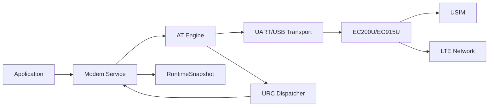
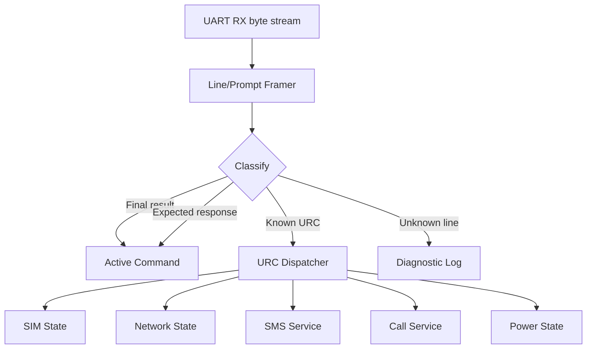
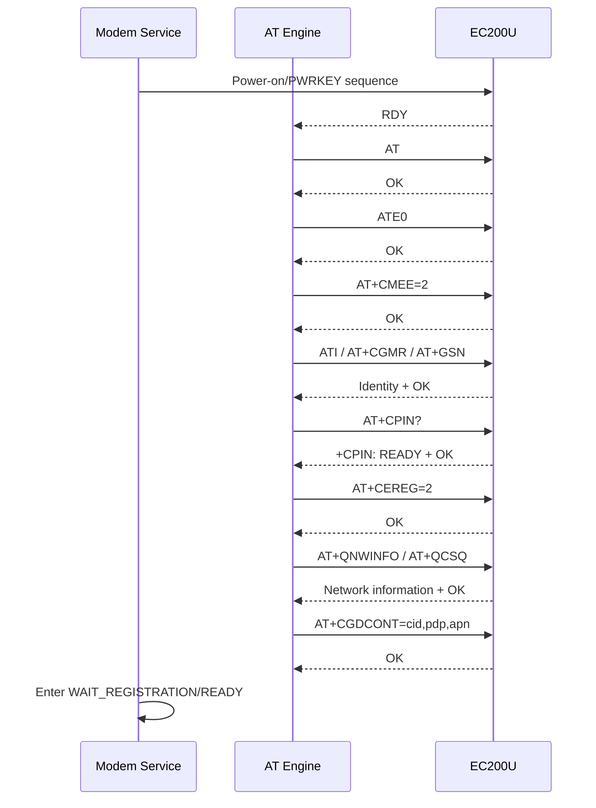
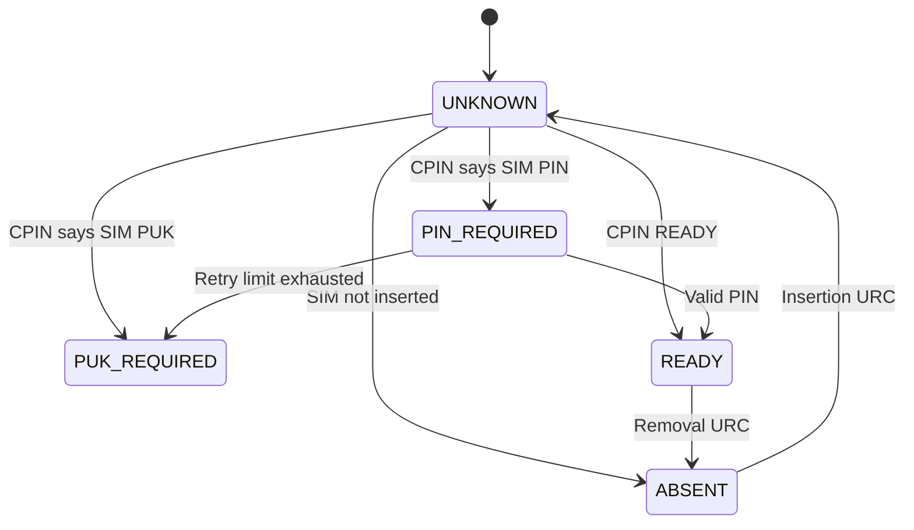
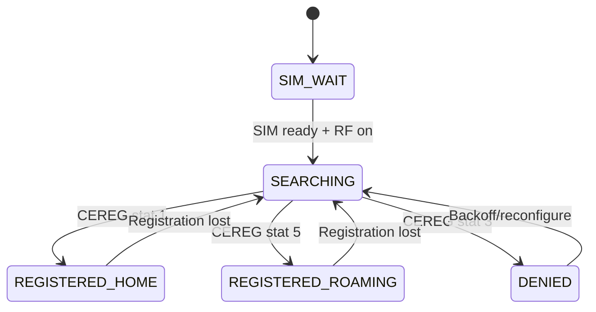
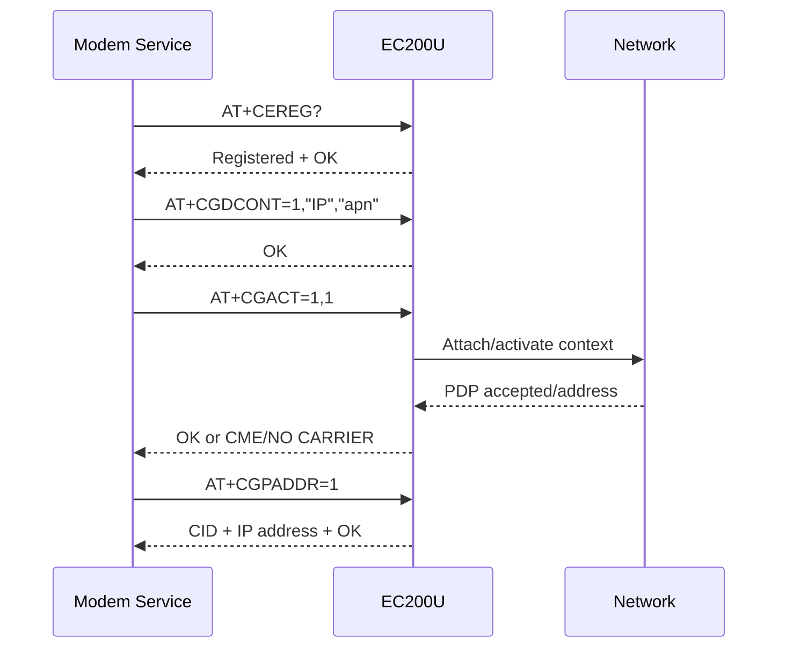
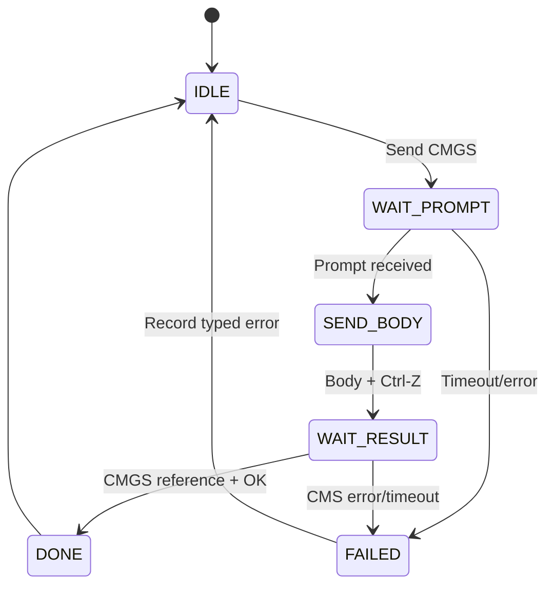
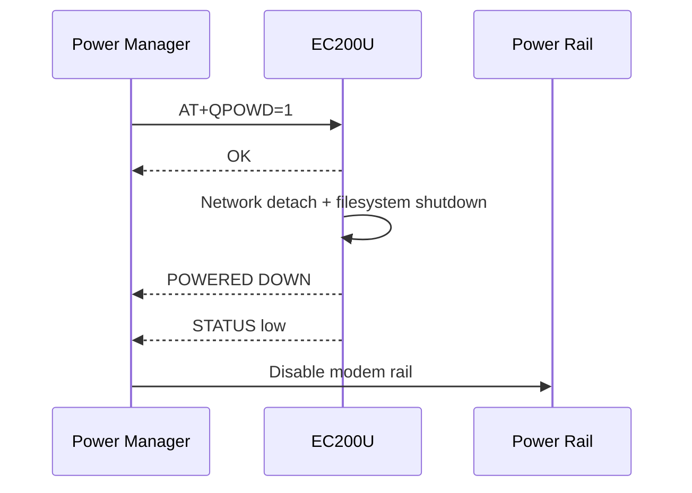
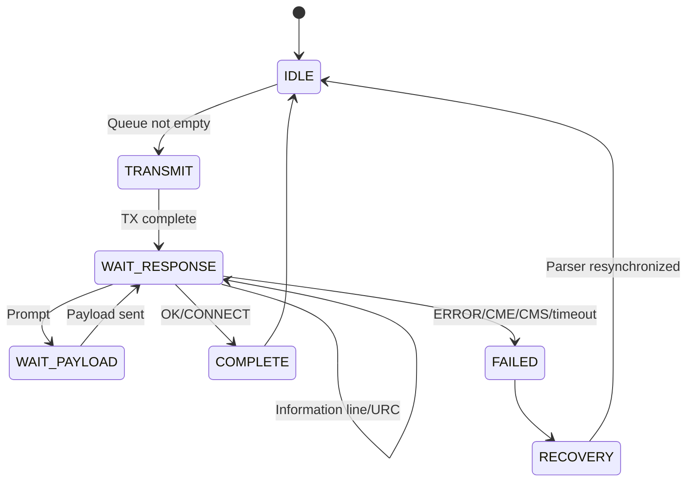
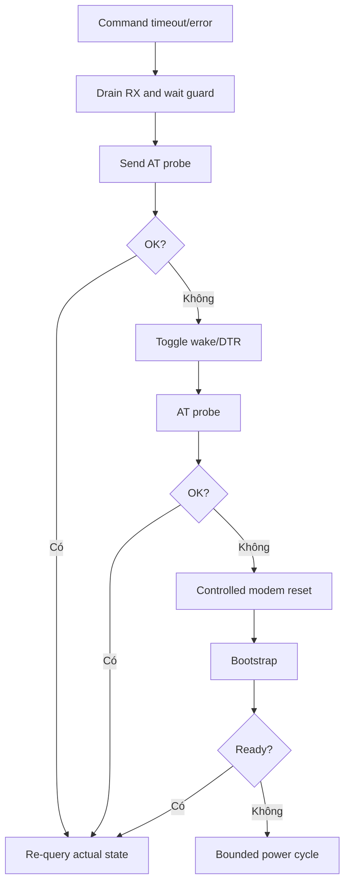

# Quectel EC200U/EG915U — Tài liệu kỹ thuật và hướng dẫn tích hợp

> **Loại tài liệu:** Technical summary + AT command integration guide  
> **Thiết bị:** Quectel EC200U / EG915U Series  
> **Vai trò dự kiến:** Modem LTE điều khiển bằng AT command  
> **Dự án tham chiếu:** Smart Ultrasonic Water Meter  
> **Trạng thái:** Baseline kỹ thuật cho firmware và kiểm thử  
> **Nguồn chính:** Quectel EC200U&EG915U Series AT Commands Manual, Version 1.0, 2021-11-01

---

## Kiểm soát tài liệu

| Thuộc tính | Nội dung |
|---|---|
| Mã tài liệu | `FW-COMP-EC200U-001` |
| Phiên bản tài liệu | 1.0 |
| Ngày cập nhật | 2026-07-11 |
| Trạng thái | Baseline để review firmware modem, production test và system integration |
| Phạm vi thiết bị | EC200U và EG915U Series; khác biệt phần cứng phải kiểm tra theo hardware design riêng |
| Giao tiếp baseline | Main UART; USB AT dùng cho debug/service |
| Chủ sở hữu tài liệu | Nhóm phát triển Smart Ultrasonic Water Meter |

### Lịch sử sửa đổi

| Phiên bản | Ngày | Thay đổi chính |
|---|---|---|
| 1.0 | 2026-07-11 | Chuyển manual AT command thành technical summary và integration guide theo format ZSSC3241 |

### Quy ước yêu cầu

- **Phải**: yêu cầu bắt buộc để thiết kế được chấp nhận.
- **Nên**: baseline; chỉ thay đổi khi có dữ liệu kiểm thử hoặc yêu cầu hệ thống.
- **Có thể**: tính năng tùy chọn.
- `<CR>` là carriage return `0x0D`; `<LF>` là line feed `0x0A`.
- `<...>` biểu diễn tham số; `[...]` biểu diễn thành phần tùy chọn.
- Chuỗi ví dụ không bao gồm ký tự `<CR>` nếu không ghi rõ.
- Khi nội dung tài liệu này khác manual, firmware release note hoặc errata hiện hành của Quectel, tài liệu mới nhất của Quectel được ưu tiên.

### Thuật ngữ

| Thuật ngữ | Ý nghĩa |
|---|---|
| TE/DTE | Terminal Equipment — MCU/host gửi AT command |
| TA/DCE | Terminal Adaptor — modem xử lý AT command |
| UE/ME/MT | Thiết bị di động/modem trong cách gọi của 3GPP |
| URC | Unsolicited Result Code — thông báo bất đồng bộ từ modem |
| SIM/USIM | Thuê bao và thẻ nhận dạng thuê bao |
| PLMN | Public Land Mobile Network |
| RAT/AcT | Radio Access Technology/Access Technology |
| CS | Circuit-Switched domain |
| PS | Packet-Switched domain |
| EPS | Evolved Packet System, liên quan đăng ký LTE |
| PDP context | Cấu hình phiên dữ liệu packet, gồm APN và kiểu IP |
| APN | Access Point Name |
| IMSI | International Mobile Subscriber Identity |
| IMEI | International Mobile Equipment Identity |
| ICCID | Integrated Circuit Card Identifier |
| RI/DTR/DCD/CTS/RTS | Các tín hiệu điều khiển UART/modem |
| CME/CMS error | Lỗi thiết bị/lỗi SMS có mã hoặc mô tả |

---

## 1. Mục đích tài liệu

Tài liệu này chuyển nội dung của manual AT command EC200U/EG915U thành hướng dẫn triển khai phục vụ trực tiếp cho:

- thiết kế modem service trên STM32;
- xây dựng AT parser và URC dispatcher;
- khởi tạo SIM, đăng ký mạng và PDP context;
- quản lý sleep/wakeup và shutdown an toàn;
- gửi/nhận SMS nếu sản phẩm sử dụng;
- thu telemetry mạng và diagnostic;
- fault recovery, retry và watchdog;
- production test và long-run test.

Tài liệu không thay thế:

- hardware design guide của biến thể EC200U cụ thể;
- TCP/IP, SSL, HTTP(S), MQTT, FTP, GNSS hoặc FOTA application note riêng;
- firmware release note theo mã module/region;
- chứng nhận nhà mạng và quy định RF của sản phẩm.

> Manual nguồn là **AT Commands Manual lõi**. Không suy luận rằng các lệnh socket, HTTP, MQTT hoặc GNSS được hỗ trợ chỉ vì modem có kết nối LTE.

---

## 2. Tổng quan

EC200U/EG915U là modem cellular được host điều khiển qua AT command. Các giao diện AT được manual nêu gồm:

- main UART;
- USB MODEM port;
- USB AT port.

Pipeline hệ thống:



Modem service không nên để application gửi chuỗi AT trực tiếp. Mọi command phải đi qua một command engine duy nhất để tránh response và URC bị trộn giữa nhiều task.

---

## 3. Phạm vi AT command của manual

| Nhóm | Chức năng chính |
|---|---|
| General | Identification, echo, result format, functionality, charset, URC port |
| UART control | DCD, DTR, flow control, framing, baud rate |
| Status control | Activity, extended error, indication, extended configuration |
| SIM | PIN/PUK, ICCID, IMSI, detection, logical channel |
| Network service | Operator, registration, signal, time, RAT/band |
| Call | Dial, answer, hang up, call list, emergency number |
| Phonebook | Select/read/write/search phonebook |
| SMS | Text/PDU format, storage, send/read/delete, SMS URC |
| Packet domain | Attach, PDP definition/activation/address, EPS registration |
| Supplementary service | Call forward/waiting/line ID/USSD |
| Audio | Volume, loop, record/playback, codec, TTS |
| Hardware | Power off, RTC, battery, ADC, sleep, Wi-Fi scan |

---

## 4. Cú pháp và transaction AT

### 4.1 Các loại command

| Loại | Cú pháp | Mục đích |
|---|---|---|
| Basic | `AT<x><n>` hoặc `AT&<x><n>` | Command V.250 cơ bản, ví dụ `ATE0` |
| S-register | `ATS<n>=<m>` | Thiết lập S-register |
| Test | `AT+CMD=?` | Kiểm tra command và miền tham số |
| Read | `AT+CMD?` | Đọc cấu hình hiện tại |
| Write | `AT+CMD=<p1>,...` | Ghi tham số |
| Execution | `AT+CMD` | Thực hiện hành động |

Command line phải bắt đầu bằng `AT` hoặc `at` và kết thúc bằng `<CR>`. Response thông thường có dạng:

```text
<CR><LF><information response><CR><LF>
<CR><LF>OK<CR><LF>
```

hoặc:

```text
<CR><LF>ERROR<CR><LF>
```

### 4.2 Quy tắc parser

- Chấp nhận byte stream phân mảnh; không giả định một UART callback chứa một line hoàn chỉnh.
- Tách line theo `CR/LF`, nhưng vẫn hỗ trợ prompt như `> ` của SMS.
- Phân biệt information response, final result và URC bằng context của command đang chạy.
- Không coi line bắt đầu bằng `+` luôn là response; nhiều URC cũng bắt đầu bằng `+`.
- Bật `ATE0` để tắt echo, nếu không parser phải loại command echo.
- Bật `AT+CMEE=2` trong development để nhận lỗi dễ đọc; production có thể dùng `1` để parse mã số ổn định.
- Không gửi nhiều command trên một line dù manual cho phép dấu `;`; mỗi transaction một command dễ timeout và recovery hơn.

### 4.3 Final result code

Các final result thường gặp:

| Result | Ý nghĩa |
|---|---|
| `OK` | Command hoàn tất thành công |
| `ERROR` | Lỗi chung |
| `+CME ERROR: <err>` | Lỗi ME/SIM/network theo command chung |
| `+CMS ERROR: <err>` | Lỗi SMS |
| `CONNECT` | Chuyển sang data state |
| `NO CARRIER` | Kết nối/data/call không được thiết lập hoặc bị ngắt |

---

## 5. URC — dữ liệu bất đồng bộ

URC có thể xuất hiện:

- khi không có command pending;
- giữa information response và final result;
- ngay sau boot hoặc reset;
- khi SIM, network, SMS, call hoặc power state thay đổi.

Kiến trúc parser:



Các URC quan trọng cần hỗ trợ tối thiểu:

| URC | Ý nghĩa/hành động |
|---|---|
| `RDY` | Modem initialization hoàn tất; bắt đầu bootstrap sau guard time |
| `POWERED DOWN` | Có thể ngắt nguồn khi STATUS pin cũng xác nhận low |
| `+CPIN: READY` | SIM sẵn sàng |
| `+QUSIM: <state>` | Trạng thái SIM Quectel |
| `+QIND: PB DONE` | Phonebook initialization hoàn tất |
| `+QIND: SMS DONE` | SMS initialization hoàn tất |
| `+CEREG: ...` | Thay đổi đăng ký EPS/LTE |
| `+CREG: ...` | Thay đổi đăng ký CS |
| `+CGREG: ...` | Thay đổi đăng ký PS |
| `RING` / `+CRING` | Incoming call |
| `+CMTI: ...` / `+CMT: ...` | SMS mới |
| `+QIURC` hoặc URC của protocol khác | Chỉ dùng khi manual protocol tương ứng xác nhận |

`AT+QURCCFG="urcport",...` cấu hình port phát URC. Baseline phải route URC về cùng port mà firmware parser đang quản lý, trừ khi có kiến trúc multi-port rõ ràng.

---

## 6. Power-on và bootstrap

### 6.1 Mục tiêu bootstrap

Bootstrap phải xác minh:

- AT transport hoạt động;
- modem đúng model/firmware mong đợi;
- echo và error format đúng;
- SIM hiện diện và ready;
- URC được cấu hình;
- registration URC được bật;
- APN/PDP context đúng;
- modem đạt trạng thái sẵn sàng cho application.

### 6.2 Trình tự đề xuất



### 6.3 Bootstrap command table

| Bước | Command | Kết quả mong đợi | Fatal? |
|---:|---|---|:---:|
| 1 | `AT` | `OK` | Có sau retry/reset policy |
| 2 | `ATE0` | `OK` | Không, nhưng parser phức tạp hơn nếu thất bại |
| 3 | `AT+CMEE=2` | `OK` | Không |
| 4 | `ATI` | Product identification | Có nếu sai family |
| 5 | `AT+CGMR` | Firmware revision | Có nếu không nằm trong allowlist production |
| 6 | `AT+GSN` hoặc `AT+CGSN` | IMEI hợp lệ | Có |
| 7 | `AT+QCCID` | ICCID hoặc lỗi SIM | Có cho chức năng cellular |
| 8 | `AT+CIMI` | IMSI khi SIM ready | Có cho subscriber identity |
| 9 | `AT+CPIN?` | `READY` hoặc trạng thái PIN/PUK | Có nếu không có cơ chế cấp PIN |
| 10 | `AT+CEREG=2` | `OK` | Có cho LTE registration tracking |
| 11 | `AT+CGREG=2` | `OK` nếu cần PS URC | Tùy RAT |
| 12 | `AT+CGDCONT=...` | `OK` | Có cho data service |

Không reset modem chỉ vì chưa đăng ký mạng trong vài giây. Registration phụ thuộc coverage, SIM, roaming, band, antenna và nhà mạng; dùng state machine với backoff.

---

## 7. Identification và cấu hình chung

| Command | Mục đích | Runtime policy |
|---|---|---|
| `ATI` | Product identification tổng hợp | Đọc khi boot và lưu log |
| `AT+GMI` / `AT+CGMI` | Manufacturer | Production check |
| `AT+GMM` / `AT+CGMM` | Model | So với allowlist |
| `AT+GMR` / `AT+CGMR` | Firmware revision | Lưu vào diagnostic snapshot |
| `AT+GSN` / `AT+CGSN` | IMEI/serial | Validate length/digit/check policy |
| `AT&F` | Factory defaults | Chỉ service/factory; có thể phá cấu hình |
| `AT&V` | Current configuration | Debug snapshot |
| `AT&W` | Lưu profile | Hạn chế ghi không cần thiết |
| `ATZ` | Restore user profile | Chỉ khi profile đã quản lý version |
| `AT+CFUN` | Functionality/reset/RF | Dùng qua modem state machine |
| `AT+CMEE` | Error format | Baseline `2` debug hoặc `1` production |
| `AT+CSCS` | Character set | Chốt theo SMS/phonebook requirement |

### 7.1 `AT+CFUN`

Các mức quan trọng:

| `<fun>` | Ý nghĩa |
|---:|---|
| 0 | Minimum functionality |
| 1 | Full functionality |
| 4 | Tắt cả phát và thu RF — airplane mode |

`AT+CFUN=1,1` reset UE và trở lại full functionality. Command có thể kéo dài theo mạng; manual nêu maximum response time đến 15 s. Sau reset phải coi mọi state cache là invalid và chạy bootstrap lại.

---

## 8. UART và transport

Nhóm lệnh:

| Command | Chức năng |
|---|---|
| `AT&C` | DCD behavior |
| `AT&D` | DTR behavior |
| `AT+IFC` | Local flow control |
| `AT+ICF` | Framing/parity |
| `AT+IPR` | Fixed baud rate |

Khuyến nghị:

- Dùng hardware flow control RTS/CTS nếu schematic hỗ trợ, đặc biệt khi có URC dài hoặc data transfer.
- Không đổi baud/parity trong runtime nếu không có handshake chuyển đổi hai phía.
- RX DMA ring buffer phải đủ cho burst lớn hơn response dài nhất dự kiến.
- Phát hiện UART overrun, framing error và buffer overflow; không im lặng bỏ byte.
- DTR có thể tham gia sleep control; không tái sử dụng pin mà không xét `AT&D` và `AT+QSCLK`.

Ước lượng thời gian truyền UART với baud rate $B$, mỗi byte 10 bit ở 8N1 và payload $N$ byte:

$$
t_{uart}\approx\frac{10N}{B}
$$

Ví dụ 1 KiB tại 115200 bit/s cần khoảng 89 ms, chưa tính response, scheduling và flow control.

---

## 9. SIM/USIM

### 9.1 Command catalog

| Command | Chức năng |
|---|---|
| `AT+CIMI` | Đọc IMSI |
| `AT+CLCK` | Facility lock |
| `AT+CPIN` | Query/enter PIN hoặc PUK/new PIN |
| `AT+CPWD` | Đổi password |
| `AT+CSIM` | Generic SIM access |
| `AT+CRSM` | Restricted SIM access |
| `AT+QCCID` | Đọc ICCID |
| `AT+QINISTAT` | SIM initialization status |
| `AT+QSIMDET` | SIM detection configuration |
| `AT+QSIMSTAT` | SIM insertion status report |
| `AT+CCHO` / `AT+CGLA` / `AT+CCHC` | UICC logical channel open/access/close |

### 9.2 SIM state machine



Không tự động thử nhiều PIN. Sai PIN lặp lại có thể khóa SIM và chuyển sang PUK. PIN phải nằm trong secure configuration, không hard-code hoặc log plaintext.

---

## 10. Network registration

### 10.1 Command catalog

| Command | Chức năng |
|---|---|
| `AT+COPS` | Operator selection |
| `AT+CREG` | CS registration |
| `AT+CGREG` | PS registration |
| `AT+CEREG` | EPS/LTE registration |
| `AT+CSQ` | RSSI/BER dạng 3GPP cơ bản |
| `AT+QCSQ` | Signal metrics theo RAT |
| `AT+QNWINFO` | RAT/operator/band/channel |
| `AT+CPOL` | Preferred operator list |
| `AT+COPN` | Operator names |
| `AT+CTZU` / `AT+CTZR` | Network time zone update/report |
| `AT+QLTS` | Latest network-synchronized time |
| `AT+QSPN` | Service provider name |
| `AT+CIND` | Indicator state |

### 10.2 Registration status

`AT+CEREG=2` bật URC có location information. Trạng thái `<stat>`:

| Giá trị | Ý nghĩa | Policy |
|---:|---|---|
| 0 | Chưa đăng ký, không tìm kiếm | Chờ/backoff; kiểm tra CFUN/SIM/config |
| 1 | Đăng ký home network | Data service có thể tiếp tục |
| 2 | Đang tìm/attach | Chờ; không reset sớm |
| 3 | Registration denied | Thu diagnostic; backoff dài; kiểm tra SIM/operator |
| 4 | Unknown | Query lại sau delay |
| 5 | Đăng ký roaming | Chỉ tiếp tục nếu roaming policy cho phép |

`<AcT>=7` biểu diễn E-UTRAN trong manual này.

### 10.3 Signal quality

Với `AT+CSQ`, khi `2 ≤ rssi ≤ 30`:

$$
RSSI_{dBm}=-113+2\times rssi
$$

Các giá trị đặc biệt:

- `0`: −113 dBm hoặc thấp hơn;
- `1`: −111 dBm;
- `31`: −51 dBm hoặc cao hơn;
- `99`: không biết/không đo được.

`AT+CSQ` không đủ để đánh giá chất lượng LTE. Nên dùng `AT+QCSQ` và lưu RSRP/RSRQ/SINR theo RAT nếu response hỗ trợ, đồng thời giữ raw values và timestamp.

### 10.4 Registration state machine



---

## 11. Band, RAT và extended configuration

`AT+QCFG` bao gồm các nhóm được manual nguồn liệt kê:

| Key | Chức năng |
|---|---|
| `"nwscanmode"` | Network search mode |
| `"band"` | Bands to search |
| `"airplanecontrol"` | W_DISABLE# airplane control |
| `"usbnet"` | USB network protocol |
| `"nat/cid"` | NAT theo PDP CID |
| `"qoos"` | Search timer trong out-of-service |
| `"urc/ri/other"` | RI behavior cho URC chung |
| `"urc/ri/smsincoming"` | RI behavior cho SMS |
| `"urc/ri/ring"` | RI behavior cho call |
| `"urc/delay"` | URC delay |
| `"urc/cache"` | URC cache |
| `"risignaltype"` | RI signal output carrier |
| `"cmux/urcport"` | URC port trong CMUX |
| `"tone/incoming"` | Incoming ringtone |
| `"ledmode"` | Network LED output mode |
| `"fota/cid"` | PDP CID dùng cho FOTA download |
| `"fota/times"` | FOTA connection expiration |
| `"fota/path"` | FOTA package storage |

Không ghi `AT+QCFG="band",...` bằng giá trị lấy từ biến thể khác. Sai band mask có thể khiến modem không đăng ký được mạng. Mọi QCFG production phải có manifest theo model, region, operator và firmware revision.

---

## 12. Packet domain và PDP context

### 12.1 Command catalog

| Command | Chức năng |
|---|---|
| `AT+CGATT` | PS attach/detach |
| `AT+CGDCONT` | Define PDP context/APN/type |
| `AT+CGQREQ` | Requested QoS profile |
| `AT+CGQMIN` | Minimum QoS profile |
| `AT+CGACT` | Activate/deactivate PDP context |
| `AT+CGDATA` | Enter data state, ví dụ PPP |
| `AT+CGPADDR` | Đọc PDP address |
| `AT+CGCLASS` | GPRS mobile station class |
| `AT+CGREG` | PS registration status |
| `AT+CGEREP` | Packet-domain event reporting |
| `AT+CGSMS` | Service cho MO SMS |
| `AT+CEREG` | EPS registration status |
| `AT+QGDCNT` | Packet data counter |
| `AT+QAUGDCNT` | Auto-save data counter |
| `AT+CGCONTRDP` | Dynamic PDP parameters |
| `AT+QNETDEVCTL` | Network adapter data call |

### 12.2 PDP activation flow



`AT+CGACT` có thể mất đến 150 s theo điều kiện mạng. Không block một high-priority task trong toàn bộ thời gian; command engine phải asynchronous và watchdog-aware.

### 12.3 PDP configuration record

```c
typedef struct
{
    uint8_t cid;
    char pdp_type[8];       /* IP, IPV6 hoặc IPV4V6 nếu firmware hỗ trợ */
    char apn[64];
    bool roaming_allowed;
    uint32_t activation_timeout_ms;
} ModemPdpConfig_t;
```

APN và authentication policy thuộc provisioning; không hard-code một APN mẫu như `UNINET` vào production firmware.

---

## 13. SMS

### 13.1 Command catalog

| Command | Chức năng |
|---|---|
| `AT+CSMS` | Select message service |
| `AT+CMGF` | Text/PDU format |
| `AT+CSCA` | SMS service center address |
| `AT+CPMS` | Preferred storage |
| `AT+CMGD` | Delete message |
| `AT+CMGL` | List messages |
| `AT+CMGR` | Read message |
| `AT+CMGS` | Send message |
| `AT+CMMS` | More messages to send |
| `AT+CMGW` | Write message to memory |
| `AT+CMSS` | Send from storage |
| `AT+CNMA` | New message acknowledgement |
| `AT+CNMI` | SMS event reporting |
| `AT+CSDH` | Show text-mode parameters |
| `AT+CSMP` | Text-mode parameters |
| `AT+QCMGS` | Concatenated messages |
| `AT+QCMGR` | Read concatenated messages |

### 13.2 Send SMS state machine



Trong trạng thái chờ prompt/body, URC vẫn có thể xuất hiện. Parser phải biết prompt `>` không kết thúc bằng CR/LF. Không log nội dung SMS nếu có dữ liệu nhạy cảm.

---

## 14. Call, phonebook và supplementary services

### 14.1 Call commands

`ATA`, `ATD`, `ATH`, `AT+CVHU`, `AT+CHUP`, `+++`, `ATO`, `ATS0`, `ATS7`, `AT+CSTA`, `AT+CLCC`, `AT+CRC`, `AT+QECCNUM`, `AT+QHUP`, `AT+QCHLDIPMPTY`.

### 14.2 Phonebook commands

`AT+CNUM`, `AT+CPBF`, `AT+CPBR`, `AT+CPBS`, `AT+CPBW`.

### 14.3 Supplementary service commands

`AT+CCFC`, `AT+CCWA`, `AT+CHLD`, `AT+CLIP`, `AT+CLIR`, `AT+COLP`, `AT+CSSN`, `AT+CUSD`.

Nếu sản phẩm đồng hồ nước không dùng voice/call/phonebook, các API này nên bị loại khỏi production build hoặc chỉ bật trong service firmware để giảm attack surface và độ phức tạp parser.

---

## 15. Audio và TTS

| Command | Chức năng |
|---|---|
| `AT+CLVL` | Loudspeaker volume |
| `AT+QAUDLOOP` | Audio loop test |
| `AT+QAUDRD` | Record audio file |
| `AT+QPSND` | Play audio to uplink/downlink |
| `AT+QAUDPLAY` | Play file to downlink |
| `AT+QAUDMOD` | Audio mode |
| `AT+QIIC` | I2C read/write liên quan audio/peripheral |
| `AT+QAUDSW` | Codec switch |
| `AT+QAUDPASW` | Audio PA type |
| `AT+QTTS` | Text-to-speech play |
| `AT+QTTSETUP` | TTS parameters |

Chỉ dùng `AT+QIIC` sau khi đối chiếu hardware routing; modem điều khiển I2C có thể xung đột quyền sở hữu bus với MCU.

---

## 16. Hardware-related commands

### 16.1 Power-off `AT+QPOWD`

Shutdown an toàn:



Sau `AT+QPOWD`, không gửi command khác. Không ngắt nguồn trước `POWERED DOWN` hoặc STATUS low. Manual cho phép thời gian unregister mạng tối đa khoảng 60 s.

### 16.2 RTC `AT+CCLK`

Định dạng:

```text
"yy/MM/dd,hh:mm:ss±zz"
```

`zz` là timezone tính theo bước 15 phút. RTC setting không được lưu khi mất nguồn hoàn toàn; hệ thống nên ưu tiên network time hoặc RTC ngoài nếu cần timestamp bền vững.

### 16.3 Battery và ADC

- `AT+CBC`: charge status, capacity %, voltage mV.
- `AT+QADC=<port>`: đọc ADC mV.
- EC200U không hỗ trợ ADC3 theo manual nguồn.
- EG915U không hỗ trợ ADC2 và ADC3 theo manual nguồn.

Không dùng ADC channel nếu hardware design của mã module cụ thể không expose pin tương ứng.

### 16.4 Sleep `AT+QSCLK`

| `<n>` | Hành vi |
|---:|---|
| 0 | Disable sleep |
| 1 | Sleep được điều khiển bởi DTR và WAKEUP_IN |
| 2 | Tự sleep sau 5 s không có UART interaction; UART data có thể wake |

Khi sleep bật nhưng UART flow control tắt, manual cảnh báo không gửi trực tiếp burst lớn hơn 127 byte khi modem chưa wake hoàn toàn. Baseline an toàn:

1. Assert wake/DTR theo hardware design.
2. Chờ wake guard time đã đo.
3. Gửi `AT` probe.
4. Chỉ truyền payload lớn sau `OK`.

---

## 17. Wi-Fi scan for positioning

Manual có:

- `AT+QWIFISCAN`: synchronous scan;
- `AT+QWIFISCANEX`: asynchronous scan.

Đây là scan thông tin access point/hotspot, không mặc nhiên biến modem thành Wi-Fi data interface. Kết quả scan có thể gồm RSSI, MAC và channel; việc dùng dữ liệu vị trí phải tuân thủ privacy policy của sản phẩm.

---

## 18. Kiến trúc firmware đề xuất

```text
drivers/
└── modem/
    ├── modem_transport.c
    ├── modem_at_framer.c
    ├── modem_at_engine.c
    ├── modem_urc_parser.c
    ├── modem_power.c
    └── modem_types.h

services/
├── modem_service.c
├── sim_service.c
├── network_service.c
├── packet_data_service.c
└── sms_service.c
```

### 18.1 Trách nhiệm transport

- UART/USB RX/TX;
- DMA ring buffer;
- flow control;
- timestamp và overflow counters;
- không hiểu nội dung AT.

### 18.2 Trách nhiệm AT engine

- command queue có ownership;
- command timeout;
- expected response pattern;
- final result parsing;
- prompt handling;
- cancel/recovery;
- không quyết định network policy.

### 18.3 Trách nhiệm URC dispatcher

- nhận URC dù có command pending;
- parse thành typed event;
- cập nhật state machine;
- không block RX path;
- lưu unknown URC có rate limit.

### 18.4 Trách nhiệm modem service

- bootstrap;
- SIM/network/PDP state;
- retry/backoff;
- sleep/wakeup;
- publish health/quality;
- điều phối reset và power cycle.

---

## 19. API và kiểu dữ liệu đề xuất

```c
typedef enum
{
    MODEM_OK = 0,
    MODEM_ERR_ARGUMENT,
    MODEM_ERR_BUSY,
    MODEM_ERR_TRANSPORT,
    MODEM_ERR_TIMEOUT,
    MODEM_ERR_ERROR_RESULT,
    MODEM_ERR_CME,
    MODEM_ERR_CMS,
    MODEM_ERR_PARSE,
    MODEM_ERR_STATE,
    MODEM_ERR_NOT_REGISTERED,
    MODEM_ERR_NO_SIM
} ModemResult_t;

typedef enum
{
    MODEM_REG_NOT_REGISTERED = 0,
    MODEM_REG_HOME = 1,
    MODEM_REG_SEARCHING = 2,
    MODEM_REG_DENIED = 3,
    MODEM_REG_UNKNOWN = 4,
    MODEM_REG_ROAMING = 5
} ModemRegistration_t;

typedef struct
{
    ModemRegistration_t eps_registration;
    int16_t rssi_dbm;
    int16_t rsrp_dbm;
    int16_t rsrq_db_x10;
    int16_t sinr_db_x10;
    uint32_t cell_id;
    uint16_t tac;
    uint32_t timestamp_ms;
    bool sim_ready;
    bool pdp_active;
    bool roaming;
} ModemStatus_t;
```

API tầng service:

```c
ModemResult_t Modem_Init(void);
ModemResult_t Modem_RequestRegistration(void);
ModemResult_t Modem_ActivatePdp(uint8_t cid);
ModemResult_t Modem_DeactivatePdp(uint8_t cid);
ModemResult_t Modem_GetStatus(ModemStatus_t *status);
ModemResult_t Modem_EnterSleep(void);
ModemResult_t Modem_Wake(void);
ModemResult_t Modem_Shutdown(void);
void Modem_Process(void);
```

Không cung cấp public API `Modem_SendRawAt()` cho application production. Raw AT chỉ nên tồn tại trong diagnostic build, có authentication và command allowlist.

---

## 20. AT command engine

### 20.1 Command descriptor

```c
typedef struct
{
    const char *command;
    const char *expected_prefix;
    uint32_t timeout_ms;
    bool expects_prompt;
    bool sensitive;
    void (*on_line)(const char *line);
    void (*on_complete)(ModemResult_t result);
} AtCommand_t;
```

### 20.2 Transaction state machine



Mỗi command phải có timeout riêng. Ví dụ command local thường khoảng vài trăm ms, `AT+CFUN` có thể đến 15 s và PDP activation có thể đến 150 s theo manual/điều kiện mạng.

---

## 21. Timeout, retry và backoff

### 21.1 Phân loại lỗi

| Loại | Ví dụ | Hành động |
|---|---|---|
| Transport transient | UART overrun, TX busy | Resync/retry giới hạn |
| Command transient | Timeout local hiếm | Probe `AT`, retry |
| Network transient | Searching, attach timeout | Backoff, không reset liên tục |
| Provisioning | APN sai, registration denied | Báo lỗi cấu hình, backoff dài |
| SIM | Absent, PIN/PUK | Chờ người dùng/provisioning |
| Modem fatal | Không phản hồi AT sau recovery | Reset rồi power cycle giới hạn |

### 21.2 Backoff đề xuất

$$
t_{retry}=\min(t_{max},t_0\,2^k)+J
$$

Trong đó $k$ là số lần lỗi liên tiếp và $J$ là jitter. Jitter tránh nhiều thiết bị retry cùng lúc sau mất mạng diện rộng.

Ví dụ policy ban đầu:

```text
AT command retry:       tối đa 2
Parser resync:          1 lần
Modem soft reset:       tối đa 2 lần / 10 phút
Power cycle:            tối đa 1 lần / 10 phút
Registration backoff:   5 s -> 10 s -> 20 s -> ... -> 15 phút
```

Ngưỡng cuối phải dựa trên watchdog và SLA của sản phẩm.

---

## 22. Recovery ladder



Sau recovery không khôi phục state bằng cache. Phải query lại SIM, registration và PDP context.

---

## 23. Power và năng lượng

Năng lượng trung bình theo chu kỳ có thể ước lượng:

$$
I_{avg}=\frac{I_{tx}t_{tx}+I_{rx}t_{rx}+I_{idle}t_{idle}+I_{sleep}t_{sleep}}{T}
$$

Tối ưu năng lượng không chỉ bằng `AT+QSCLK`. Cần phối hợp:

- lịch upload;
- network registration retention;
- PSM/eDRX nếu firmware/operator hỗ trợ qua tài liệu riêng;
- DTR/WAKEUP_IN;
- UART flow control;
- thời gian RF transmit;
- retry khi coverage kém.

Coverage kém có thể làm modem tiêu thụ nhiều năng lượng hơn do search và transmit power tăng.

---

## 24. Tích hợp RuntimeSnapshot

```c
typedef struct
{
    bool modem_ready;
    bool sim_ready;
    bool network_registered;
    bool pdp_active;
    bool roaming;

    int16_t rssi_dbm;
    int16_t rsrp_dbm;
    int16_t rsrq_db_x10;
    int16_t sinr_db_x10;

    uint32_t modem_reset_count;
    uint32_t registration_loss_count;
    uint32_t upload_success_count;
    uint32_t upload_failure_count;
    uint32_t last_network_event_s;
} ModemRuntimeSnapshot_t;
```

Không publish IMSI, ICCID, IMEI, phone number, APN password hoặc SMS content vào telemetry công khai.

---

## 25. Logging và bảo mật

### 25.1 Không được log plaintext

- SIM PIN/PUK;
- APN username/password;
- SMS content;
- authentication token;
- private endpoint credential;
- full IMSI/ICCID/IMEI nếu log rời khỏi thiết bị.

### 25.2 Log có cấu trúc

```text
timestamp, modem_state, command_id, result_type, error_code,
registration, rat, signal_bucket, retry_count, reset_count
```

Nên log command ID thay vì toàn bộ command khi command chứa credential.

---

## 26. Bring-up plan

### Phase 1 — Electrical

- nguồn modem và peak current;
- PWRKEY/RESET/STATUS;
- UART TX/RX/RTS/CTS;
- DTR/RI/DCD nếu dùng;
- SIM detect và SIM voltage;
- antenna và RF path;
- không có brownout khi attach/transmit.

### Phase 2 — Transport

- nhận `RDY`;
- `AT`/`ATE0`;
- baud và flow control;
- DMA RX không overflow;
- parser xử lý response phân mảnh.

### Phase 3 — Identity/SIM

- model/firmware/IMEI;
- ICCID/IMSI;
- SIM ready;
- insert/remove URC nếu hot-plug hỗ trợ.

### Phase 4 — Network

- antenna connected;
- CEREG/CGREG;
- QNWINFO/QCSQ;
- home/roaming/denied/no-service scenarios.

### Phase 5 — Packet data

- APN provisioning;
- PDP activate/address;
- data path theo manual protocol riêng;
- reconnect sau mất mạng.

### Phase 6 — Power/reliability

- QSCLK/wakeup;
- QPOWD;
- brownout và recovery;
- long-run/weak-signal testing.

---

## 27. Kế hoạch kiểm thử

### 27.1 Unit test parser

- response trong một buffer;
- response chia từng byte;
- nhiều line trong một buffer;
- echo on/off;
- URC xen giữa response;
- prompt không CR/LF;
- CME/CMS numeric và verbose;
- line quá dài;
- RX overflow;
- unknown URC;
- tick wrap-around.

### 27.2 Mock modem test

- boot không có `RDY`;
- delayed `OK`;
- command timeout;
- SIM absent/PIN/PUK;
- CEREG searching/denied/roaming;
- PDP timeout 150 s;
- modem reset giữa command;
- `POWERED DOWN` thiếu;
- URC storm;
- malformed response.

### 27.3 Hardware test

| Test | Tiêu chí |
|---|---|
| Boot 1.000 lần | Bootstrap thành công, không parser deadlock |
| SIM insert/remove | State cập nhật đúng, không reset storm |
| No coverage | Backoff đúng, watchdog không reset sai |
| Weak signal | Upload/retry có giới hạn, đo được power impact |
| Registration denied | Diagnostic đúng, không attach liên tục |
| Roaming | Tuân thủ roaming policy |
| UART stress | Không overflow/data corruption |
| Sleep/wakeup 10.000 lần | Wake và AT probe thành công |
| QPOWD 1.000 lần | Không mất dữ liệu/cắt nguồn sớm |
| Brownout | Recovery có kiểm soát |

### 27.4 Long-run test

- 168 giờ tối thiểu;
- periodic upload;
- mất/phục hồi mạng;
- sleep/wakeup;
- log heap/stack/queue depth;
- reset/registration/PDP counters;
- không rò buffer hoặc command descriptor.

---

## 28. Rủi ro kỹ thuật

### 28.1 Trộn URC với command response

Hậu quả: parser gán sai line, command treo hoặc state sai. Giải pháp: context-aware classifier và URC dispatcher độc lập.

### 28.2 Reset khi registration chậm

Hậu quả: modem không bao giờ đủ thời gian attach. Giải pháp: backoff và phân biệt searching với modem unresponsive.

### 28.3 UART không flow control

Hậu quả: mất URC/burst, đặc biệt khi sleep hoặc response dài. Giải pháp: RTS/CTS và ring buffer đủ lớn.

### 28.4 Dùng QCFG sai biến thể

Hậu quả: mất band, URC port, USB behavior hoặc FOTA path. Giải pháp: versioned config manifest theo SKU/firmware.

### 28.5 Cắt nguồn trực tiếp

Hậu quả: mất dữ liệu hoặc hỏng trạng thái nội bộ. Giải pháp: QPOWD và xác nhận shutdown.

### 28.6 Log thông tin nhạy cảm

Hậu quả: lộ subscriber identity/credential. Giải pháp: redaction và structured logging.

---

## 29. Quyết định kiến trúc đề xuất

1. Một AT engine duy nhất sở hữu transport.
2. URC được parse bất đồng bộ, không chờ command kết thúc.
3. Application dùng typed API, không gửi raw AT.
4. Main UART + RTS/CTS là baseline production.
5. `ATE0`, `CMEE` và registration URC được cấu hình khi bootstrap.
6. SIM, registration và PDP là ba state machine riêng có liên kết.
7. Timeout theo từng command, không dùng một giá trị chung.
8. Network failure dùng backoff; modem unresponsive mới reset.
9. `QPOWD` là đường shutdown chuẩn.
10. QCFG/NVM-like persistent setting phải có manifest theo SKU và firmware.
11. Credential và subscriber identity không xuất hiện trong log thường.
12. Protocol IP cấp cao dùng manual riêng và module service riêng.

---

## 30. Checklist hardware

- [ ] Nguồn chịu được peak current của modem với margin.
- [ ] Bulk/decoupling theo hardware design Quectel.
- [ ] PWRKEY, RESET_N và STATUS đúng polarity/timing.
- [ ] UART logic level tương thích.
- [ ] RTS/CTS được route nếu dùng hardware flow control.
- [ ] DTR/RI/DCD/WAKEUP_IN được xác định rõ.
- [ ] SIM interface có ESD và layout phù hợp.
- [ ] SIM detect không floating.
- [ ] Antenna impedance/layout/connector đúng.
- [ ] Có test point nguồn, UART, PWRKEY, RESET, STATUS.
- [ ] MCU có thể power-cycle modem có giới hạn.
- [ ] Không dùng ADC/I2C/audio pin không có trên SKU.

---

## 31. Checklist firmware

- [ ] RX dùng ring buffer và phát hiện overflow.
- [ ] Parser chịu được fragmentation/coalescing.
- [ ] Echo được tắt hoặc xử lý đúng.
- [ ] URC được dispatch khi command pending.
- [ ] CME/CMS được lưu dạng typed error.
- [ ] Command có timeout riêng.
- [ ] SIM PIN không hard-code/log.
- [ ] Registration không gây reset storm.
- [ ] PDP context được provision theo nhà mạng.
- [ ] Roaming policy rõ ràng.
- [ ] Sleep có wake handshake.
- [ ] Shutdown chờ POWERED DOWN/STATUS low.
- [ ] Raw AT API bị khóa trong production.
- [ ] QCFG persistent settings có version.
- [ ] Modem firmware revision được ghi nhận.

---

## 32. Yêu cầu thiết kế có thể kiểm chứng

| ID | Yêu cầu | Xác minh |
|---|---|---|
| EC-HW-001 | Nguồn modem không brownout khi attach/tx | Scope tại worst-case supply/RF |
| EC-HW-002 | UART production phải có cơ chế chống overflow | Review + stress test |
| EC-FW-001 | Chỉ một AT engine được quyền gửi command | Architecture/code review |
| EC-FW-002 | Parser phải xử lý URC xen giữa response | Unit/mock test |
| EC-FW-003 | Mỗi command phải có timeout riêng | Unit test/config review |
| EC-FW-004 | State phải được query lại sau modem reset | Fault injection |
| EC-FW-005 | Không reset trong registration searching bình thường | No-coverage test |
| EC-PWR-001 | Shutdown phải dùng QPOWD và xác nhận hoàn tất | Power-cycle test |
| EC-SEC-001 | PIN/credential không xuất hiện trong log | Log audit |
| EC-NET-001 | Roaming chỉ được dùng theo product policy | SIM/operator test |
| EC-REL-001 | Recovery phải có retry/backoff/reset limits | Long-run/fault injection |

---

## 33. Ma trận truy vết kiểm thử

| Test ID | Yêu cầu | Kích thích | Kết quả đạt |
|---|---|---|---|
| TC-AT-001 | EC-FW-001/002 | URC xen giữa response phân mảnh | Command và URC đều parse đúng |
| TC-AT-002 | EC-FW-003 | Delay theo từng command class | Timeout đúng, không timeout giả |
| TC-NET-001 | EC-FW-005 | Không có coverage 1 giờ | Backoff, không reset storm |
| TC-NET-002 | EC-NET-001 | Home/roaming SIM | Đúng policy |
| TC-PWR-001 | EC-PWR-001 | 1.000 shutdown | Không cắt nguồn sớm |
| TC-REL-001 | EC-FW-004/EC-REL-001 | Reset giữa PDP command | Bootstrap và state query lại |
| TC-SEC-001 | EC-SEC-001 | PIN/APN/SMS workflow | Log đã redact |
| TC-HW-001 | EC-HW-001 | Max TX tại nguồn min/temp max | Không brownout |

---

## 34. Tiêu chí hoàn tất tích hợp

- [ ] SKU, region và firmware revision được freeze.
- [ ] Hardware vượt power/RF/UART/SIM checklist.
- [ ] AT parser vượt unit và fuzz-like fragmentation test.
- [ ] 1.000 boot và 1.000 shutdown thành công.
- [ ] 10.000 sleep/wakeup không deadlock.
- [ ] No-service/weak-signal/denied/roaming đạt policy.
- [ ] PDP activation và data path vượt operator matrix.
- [ ] Recovery không reset storm.
- [ ] Long-run 168 giờ không leak buffer/queue.
- [ ] Security log audit không thấy credential hoặc identity bị cấm.
- [ ] Production configuration có version và rollback plan.

---

## 35. Thông tin dự án còn phải chốt

| Thông tin | Giá trị | Chủ trì |
|---|---|---|
| Exact EC200U SKU/region | TBD | Hardware/System |
| Firmware revision allowlist | TBD | Firmware/Production |
| Operator/SIM profile | TBD | Product/Operations |
| APN/PDP type/authentication | TBD | Backend/Operations |
| Roaming policy | TBD | Product |
| UART baud/flow control/pins | TBD | Hardware/Firmware |
| PWRKEY/reset/status timing | Theo hardware design SKU | Hardware |
| Upload protocol | TBD; manual riêng | Backend/Firmware |
| Power budget và upload schedule | TBD | System/Firmware |
| Sleep mode 1 hay 2 | TBD sau test | Firmware/Hardware |
| SMS/voice/audio có dùng không | TBD | Product |
| FOTA strategy và rollback | TBD | Firmware/Operations |

---

## 36. Tài liệu cần triển khai tiếp

```text
docs/modem/ec200u/
├── EC200U_Technical_Guide.md
├── EC200U_AT_Parser_Design.md
├── EC200U_URC_Catalog.md
├── EC200U_Production_Config.md
├── EC200U_Network_State_Machine.md
├── EC200U_Power_Integration.md
└── EC200U_Test_Plan.md
```

Tài liệu hiện tại có thể dùng làm `EC200U_Technical_Guide.md`.

---

## 37. Tài liệu tham khảo

1. Quectel Wireless Solutions, **EC200U&EG915U Series AT Commands Manual**, Version 1.0, 2021-11-01.
2. 3GPP TS 27.007, **AT command set for User Equipment**.
3. 3GPP TS 27.005, **Use of Data Terminal Equipment — Data Circuit terminating Equipment interface for SMS and CBS**.
4. ITU-T V.250, **Serial asynchronous automatic calling and control**.
5. Quectel EC200U Series hardware design, firmware release notes và protocol application notes tương ứng với SKU — cần bổ sung đúng revision của dự án.

---

## 38. Kết luận

EC200U/EG915U phải được tích hợp như một subsystem bất đồng bộ có nhiều state, không phải một UART peripheral chỉ gửi chuỗi và chờ `OK`.

Baseline đề xuất:

```text
Application
    -> Modem Service
    -> SIM / Registration / PDP State Machines
    -> Single-owner AT Engine
    -> URC-aware Parser
    -> UART DMA + RTS/CTS
    -> EC200U
    -> LTE Network
```

Các rủi ro lớn nhất là:

- response và URC bị trộn;
- timeout chung cho mọi command;
- reset modem khi mạng chỉ đang chậm;
- cấu hình band/APN/QCFG sai SKU;
- UART overflow trong sleep hoặc burst;
- cắt nguồn không qua shutdown;
- log lộ PIN, identity hoặc credential.

Khi các state machine, recovery ladder và kiểm thử fault injection được triển khai đúng, modem service có thể cung cấp kết nối cellular ổn định và có khả năng chẩn đoán cho hệ thống đồng hồ nước.