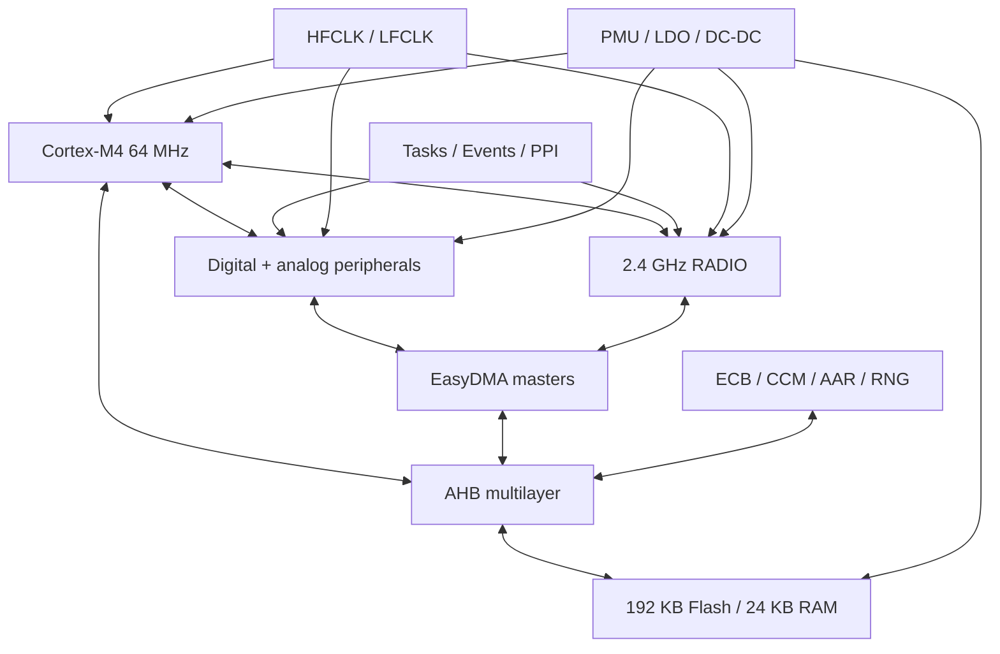
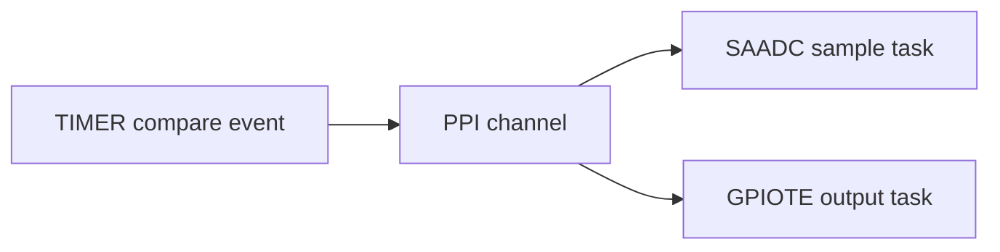
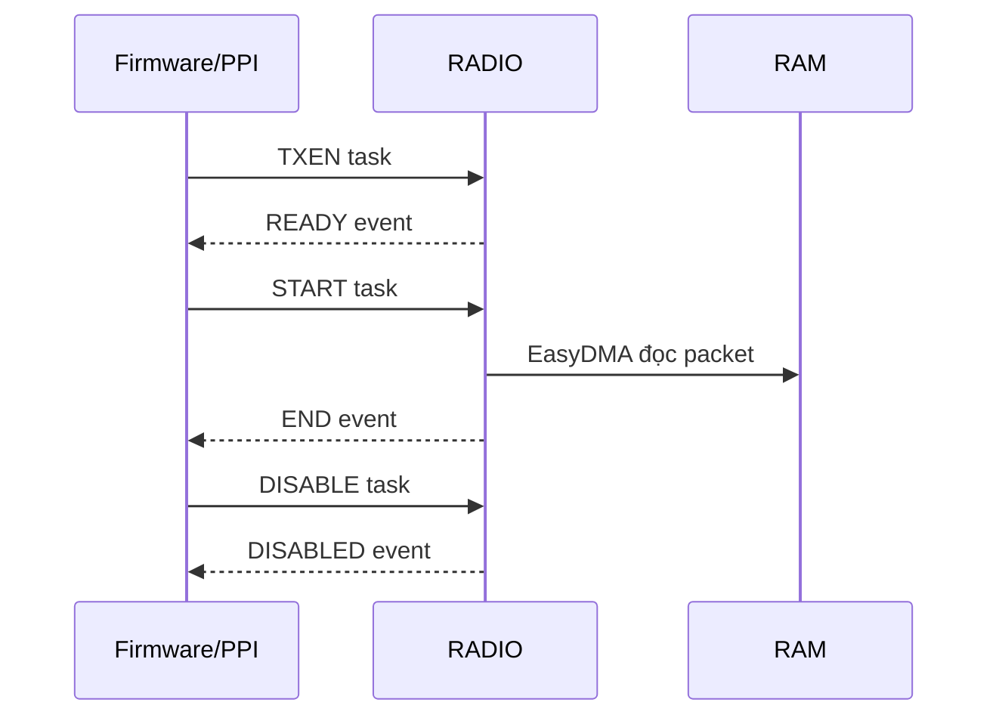
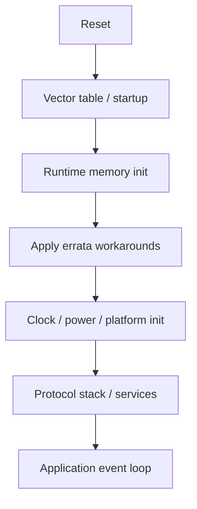

# nRF52810 — Technical Summary

> **Loại tài liệu:** Component technical summary  
> **Phạm vi:** Dùng chung cho các hệ thống sử dụng nRF52810  
> **Linh kiện:** Nordic Semiconductor nRF52810  
> **Trạng thái:** Tài liệu kỹ thuật nền tảng  
> **Nguồn chuẩn:** nRF52810 Product Specification v1.2  
> **Ngày đối chiếu:** 2026-07-11

---

## 1. Mục đích tài liệu

Tài liệu này cung cấp cái nhìn tổng thể về nRF52810 để hỗ trợ:

- đánh giá mức độ phù hợp của SoC với sản phẩm;
- hiểu kiến trúc CPU, memory, bus và peripheral;
- lựa chọn clock, power mode và phương án nguồn;
- hiểu mô hình task/event, shortcut, PPI và EasyDMA;
- đánh giá khả năng radio/Bluetooth Low Energy;
- xây dựng nền tảng firmware và resource-allocation plan;
- chuẩn bị thiết kế schematic, PCB, boot, debug và production programming.

Tài liệu chỉ mô tả kiến thức dùng chung của nRF52810. Các nội dung sau thuộc tài liệu dự án:

- order code/package được chọn;
- pin mapping và schematic;
- crystal, antenna và matching network;
- SDK/stack version;
- BLE services, advertising và connection parameters;
- flash partition, bootloader và DFU;
- power budget và production test.

Các chủ đề chi tiết được tách sang:

- `NRF52810_Memory_Register_Notes.md`;
- `NRF52810_Peripheral_Notes.md`;
- `NRF52810_Clock_Power_Notes.md`;
- `NRF52810_Radio_BLE_Notes.md`;
- `NRF52810_Boot_Debug_Notes.md`;
- `NRF52810_Firmware_Platform_Design.md`.

---

## 2. Tổng quan

nRF52810 là wireless System-on-Chip thuộc họ nRF52, kết hợp:

- CPU Arm Cortex-M4 64 MHz;
- 192 KB Flash và 24 KB RAM;
- radio 2.4 GHz;
- Bluetooth Low Energy 1 Mbps và 2 Mbps PHY;
- Nordic proprietary 1 Mbps và 2 Mbps radio modes;
- hardware cryptography cho AES/CCM và address resolution;
- peripheral số, analog và audio;
- programmable peripheral interconnect;
- power-management system hỗ trợ LDO/DC-DC;
- SWD debug và flash-based firmware.

nRF52810 phù hợp với:

- beacon và sensor node BLE;
- HID đơn giản;
- remote control;
- thiết bị wearable;
- thiết bị đo y tế/health quy mô nhỏ;
- network processor cung cấp kết nối BLE cho host MCU;
- thiết bị công nghiệp hoặc chiếu sáng có yêu cầu kết nối 2.4 GHz;
- sản phẩm chạy pin có firmware và BLE feature set vừa phải.

Giới hạn Flash/RAM cần được xem xét sớm. Việc một giao thức được radio hỗ trợ không đồng nghĩa mọi stack, feature và cấu hình ứng dụng đều vừa tài nguyên nRF52810.

---

## 3. Thông số chính

| Hạng mục | Giá trị hoặc khả năng |
|---|---|
| CPU | Arm Cortex-M4, 32 bit, 64 MHz |
| FPU | Không có |
| DSP instructions | Có |
| Flash | 192 KB |
| RAM | 24 KB |
| Flash page | 4 KB |
| Supply voltage | 1.7–3.6 V |
| Nhiệt độ hoạt động | −40 °C đến +85 °C |
| Radio | 2.4 GHz transceiver |
| Data rate | BLE 1/2 Mbps; proprietary 1/2 Mbps |
| BLE sensitivity | Điển hình −96 dBm theo Product Specification |
| TX power | −20 đến +4 dBm, bước cấu hình 4 dB |
| GPIO | Tối đa 32, phụ thuộc package |
| SAADC | 12 bit, 200 ksps, 8 configurable channels |
| PWM | Một unit, 4 channels, EasyDMA |
| TIMER | Ba timer/counter 32 bit |
| RTC | Hai real-time counter |
| Serial | SPI/TWI/UART, gồm các biến thể EasyDMA |
| Audio | PDM digital microphone interface |
| Crypto | ECB, CCM, AAR, RNG |
| Debug | Serial Wire Debug |
| Package | QFN48 6×6 mm; QFN32 5×5 mm; WLCSP 2.482×2.464 mm |

Giá trị dòng tiêu thụ trong Product Specification là theo điều kiện đo xác định. Power budget phải dùng đúng:

- điện áp nguồn;
- regulator mode;
- clock source;
- CPU/RAM state;
- radio mode và TX power;
- peripheral activity;
- debug state;
- duty cycle thực tế.

---

## 4. Kiến trúc hệ thống



Điểm kiến trúc quan trọng:

- CPU và EasyDMA là các AHB bus master.
- EasyDMA cho phép peripheral trao đổi trực tiếp với Data RAM.
- Task/event/PPI cho phép phản ứng phần cứng mà không cần CPU phục vụ từng bước.
- Clock và power được quản lý theo nhu cầu của các block đang hoạt động.
- Một số peripheral dùng chung ID/base address nên không thể hoạt động đồng thời.

---

## 5. CPU Cortex-M4

### 5.1 Khả năng chính

CPU hỗ trợ:

- Thumb-2 instruction set;
- DSP instructions;
- single-cycle multiply-accumulate;
- hardware divide;
- SIMD 8/16 bit;
- NVIC;
- SysTick;
- MPU;
- Flash Patch and Breakpoint unit;
- Serial Wire Debug access.

CPU **không có FPU**. Firmware dùng floating point sẽ được thực thi bằng software library hoặc compiler-generated routines, làm tăng:

- code size;
- execution time;
- stack use;
- energy consumption.

Với thuật toán thường xuyên xử lý số thực, nên cân nhắc:

- fixed-point arithmetic;
- lookup table;
- scale/offset integer representation;
- đo thực tế code size và CPU time;
- SoC khác có FPU nếu yêu cầu vượt khả năng.

### 5.2 Các đặc tính CPU đáng chú ý

| Thành phần | Trạng thái |
|---|---|
| NVIC vectors | 30 |
| Interrupt priority bits | 3 |
| Endianness | Little endian |
| SysTick | Có |
| MPU | Có |
| FPU | Không |
| Bit-banding | Không |
| DWT | Không |
| ITM/TPIU/ETM | Không |

Không nên xây dựng logging/trace architecture dựa trên ITM hoặc DWT cycle counter như với một số Cortex-M4 khác.

### 5.3 Thực thi từ Flash và RAM

Code chạy từ Flash có thể chịu wait-state penalty. RAM có thể dùng cho:

- data;
- stack/heap;
- EasyDMA buffer;
- code section cần timing đặc biệt, nếu linker layout cho phép.

Code RAM và Data RAM ánh xạ tới cùng physical RAM. Linker script phải tránh overlap giữa vùng code-in-RAM và dữ liệu.

---

## 6. Memory system

### 6.1 Flash

Đặc điểm chính:

- dung lượng 192 KB;
- page size 4 KB;
- mỗi page chia thành tám block;
- CPU truy cập qua ICODE/DCODE buses;
- write/erase được điều khiển bởi NVMC;
- read có thể thực hiện không giới hạn theo mô hình sử dụng thông thường;
- write và erase có endurance/timing constraints theo specification.

Flash image thường phải chứa đồng thời:

- vector table và application;
- protocol stack/RTOS nếu có;
- persistent settings;
- bootloader/DFU metadata nếu được sử dụng.

Vì tổng Flash chỉ 192 KB, flash partition phải được lập trước khi chọn stack và DFU strategy.

### 6.2 RAM

Đặc điểm chính:

- dung lượng 24 KB;
- chia thành ba RAM AHB slaves;
- mỗi slave nối tới hai section 4 KB;
- từng section có power/retention control;
- CPU và EasyDMA cùng truy cập qua AHB multilayer.

RAM budget cần tính cả:

- `.data` và `.bss`;
- main/process stack;
- interrupt stack tùy kiến trúc runtime;
- heap;
- BLE stack buffers;
- packet buffers;
- EasyDMA TX/RX buffers;
- logging queues;
- bootloader/DFU working memory;
- retention region.

### 6.3 FICR và UICR

`FICR` chứa thông tin factory như device configuration và trim-related values. `UICR` chứa cấu hình nonvolatile do người dùng lập trình, ví dụ các cấu hình boot/debug/pin đặc biệt tùy SoC.

UICR không phải vùng settings runtime thông thường. Thay đổi UICR:

- yêu cầu NVMC sequence phù hợp;
- có thể cần reset để có hiệu lực;
- có thể ảnh hưởng debug, reset pin hoặc boot flow;
- phải được quản lý trong production image.

### 6.4 Flash protection

nRF52810 cung cấp BPROT để bảo vệ các block Flash khỏi write/erase ngoài ý muốn. Protection policy phải thống nhất với:

- bootloader;
- settings storage;
- OTA DFU;
- factory programming;
- recovery procedure.

Chi tiết memory map và register xem `NRF52810_Memory_Register_Notes.md`.

---

## 7. EasyDMA

EasyDMA cho phép peripheral đọc/ghi Data RAM mà không cần CPU chuyển từng byte.

### 7.1 Nguyên tắc

- EasyDMA là AHB bus master.
- Pointer chỉ được trỏ tới vùng RAM hợp lệ.
- EasyDMA không đọc trực tiếp từ Flash.
- `MAXCNT` không được lớn hơn buffer thực tế.
- `AMOUNT` cho biết số phần tử đã transfer.
- Pointer reset value không được giả định là hợp lệ.
- Nhiều bus master đồng thời có thể gây congestion.

### 7.2 Buffer trong Flash

Đoạn sau không an toàn nếu peripheral dùng EasyDMA:

```c
static const uint8_t tx_data[] = { 0x01, 0x02, 0x03 };
peripheral_start_dma(tx_data, sizeof(tx_data));
```

Compiler thường đặt `const` data trong Flash. Cần copy sang RAM hoặc dùng abstraction bảo đảm staging buffer:

```c
static uint8_t tx_buffer[] = { 0x01, 0x02, 0x03 };
peripheral_start_dma(tx_buffer, sizeof(tx_buffer));
```

### 7.3 Ownership và lifetime

Buffer phải tồn tại và không bị sửa/giải phóng cho đến khi peripheral phát event hoàn tất. Driver cần định nghĩa rõ:

- ai sở hữu buffer trước, trong và sau transfer;
- điều kiện cancel;
- xử lý partial transfer;
- timeout;
- double buffering;
- callback/event delivery context.

### 7.4 Trước System OFF

Mọi EasyDMA transaction phải hoàn tất hoặc peripheral phải được stop đúng sequence trước khi vào System OFF.

---

## 8. Mô hình Task, Event, Shortcut và PPI

### 8.1 Task

Task là hành động phần cứng được trigger bằng cách ghi register, ví dụ:

- start timer;
- start ADC sample;
- enable radio TX/RX;
- start/stop peripheral.

### 8.2 Event

Event là trạng thái phần cứng báo một điều kiện đã xảy ra, ví dụ:

- timer compare;
- transfer complete;
- radio ready/end;
- ADC result ready;
- GPIO edge.

Event có thể:

- tạo interrupt cho CPU;
- kích hoạt task khác qua PPI;
- tham gia shortcut nội peripheral.

### 8.3 Shortcut

Shortcut nối event với task trong cùng peripheral. Ví dụ một radio event có thể tự động disable radio mà không chờ CPU.

### 8.4 PPI

PPI nối event endpoint của một peripheral tới task endpoint của peripheral khác. Ví dụ:



Lợi ích:

- deterministic timing;
- giảm interrupt latency;
- giảm CPU wake-up;
- giảm energy;
- tạo chuỗi đo/radio chính xác.

Rủi ro:

- channel conflict;
- event cũ chưa clear;
- task được trigger khi peripheral chưa ở state hợp lệ;
- khó debug nếu thiếu resource map;
- power tăng do peripheral vẫn active.

Dự án nên có bảng cấp phát PPI/GPIOTE/timer channels riêng.

---

## 9. Peripheral sharing và instantiation

Một số peripheral có cùng ID và base address, nghĩa là các implementation thay thế dùng chung hardware resource.

| ID/Base | Các instance thay thế |
|---|---|
| `2 / 0x40002000` | `UART0` hoặc `UARTE0` |
| `3 / 0x40003000` | `TWI0`, `TWIM0` hoặc `TWIS0` |
| `4 / 0x40004000` | `SPI0`, `SPIM0` hoặc `SPIS0` |
| `15 / 0x4000F000` | `CCM` hoặc `AAR` |
| `20 / 0x40014000` | `EGU0` hoặc `SWI0` |
| `21 / 0x40015000` | `EGU1` hoặc `SWI1` |

Không được đếm các tên này thành peripheral độc lập có thể hoạt động đồng thời.

Các legacy peripheral `UART`, `TWI` và `SPI` được Product Specification đánh dấu deprecated trong instantiation table. Thiết kế mới nên ưu tiên biến thể EasyDMA khi phù hợp và khi SDK hỗ trợ.

---

## 10. Tổng quan peripheral

| Nhóm | Peripheral | Vai trò chính |
|---|---|---|
| GPIO | GPIO, GPIOTE | Digital I/O, task/event theo pin |
| Interconnect | PPI | Nối event tới task |
| Timing | TIMER0–2 | Timer/counter 32 bit |
| Low-frequency timing | RTC0–1 | Counter chạy từ LFCLK |
| Serial | UARTE0 | UART với EasyDMA |
| Serial | TWIM0/TWIS0 | I²C-compatible master/slave với EasyDMA |
| Serial | SPIM0/SPIS0 | SPI master/slave với EasyDMA |
| Analog | SAADC | ADC đa kênh |
| Analog | COMP | Comparator |
| Audio | PDM | Digital microphone input |
| Waveform | PWM0 | 4-channel PWM với EasyDMA |
| Position | QDEC | Quadrature decoder |
| System | WDT | Watchdog |
| System | TEMP | Die temperature sensor |
| Security | ECB/CCM/AAR/RNG | AES, BLE crypto/address resolution, random |
| Radio | RADIO | 2.4 GHz packet radio |

Chi tiết task/event, interrupt, register và EasyDMA constraint xem `NRF52810_Peripheral_Notes.md`.

---

## 11. GPIO và GPIOTE

nRF52810 cung cấp tối đa 32 GPIO trên port P0, số chân khả dụng phụ thuộc package.

GPIO hỗ trợ các cấu hình điển hình:

- input/output;
- pull-up/pull-down;
- drive strength;
- input buffer connect/disconnect;
- sense level cho wake-up;
- pin mapping linh hoạt cho nhiều peripheral.

GPIOTE cung cấp:

- event khi pin thay đổi;
- task set/clear/toggle output;
- liên kết với PPI cho timing không phụ thuộc CPU.

Các lỗi thiết kế phổ biến:

- để input floating;
- drive strength không phù hợp tải;
- dùng pin bị hạn chế bởi package hoặc chức năng đặc biệt;
- cấu hình SENSE tạo wake-up lặp;
- không xét leakage qua peripheral ngoài khi SoC tắt;
- xung đột giữa GPIO access và peripheral pin ownership.

---

## 12. Timer, RTC và watchdog

### 12.1 TIMER

nRF52810 có ba timer/counter 32 bit. TIMER dùng high-frequency clock và phù hợp cho:

- timestamp độ phân giải cao;
- PWM/software timing;
- input capture qua PPI/GPIOTE;
- trigger ADC/radio;
- protocol timing.

TIMER đang chạy có thể giữ high-frequency resources hoạt động và làm tăng dòng.

### 12.2 RTC

Hai RTC chạy từ LFCLK, phù hợp cho:

- system tick tiết kiệm năng lượng;
- wake-up scheduling;
- timeout dài;
- BLE timing do stack quản lý;
- low-power timestamp.

RTC là counter giới hạn bit-width theo peripheral, không phải lịch ngày/tháng/năm. Overflow và wraparound phải được xử lý trong software.

### 12.3 WDT

Watchdog dùng LFCLK và được thiết kế để phát hiện firmware không còn phục vụ reload requests. Watchdog policy cần xác định:

- module nào sở hữu reload channel;
- điều kiện feed;
- reset reason logging;
- behavior khi debug;
- behavior khi sleep/System OFF;
- recovery sau reset.

Không feed watchdog vô điều kiện trong timer interrupt vì sẽ che lỗi main application.

---

## 13. Serial interfaces

### 13.1 UARTE

UARTE hỗ trợ UART cùng hardware flow control CTS/RTS và EasyDMA. Các điểm cần lưu ý:

- RX buffer phải ở RAM;
- buffer lifetime phải kéo dài đến event completion;
- baud-rate error phụ thuộc clock/configuration;
- floating RX có thể gây wake-up hoặc dữ liệu rác;
- logging tốc độ cao có thể ảnh hưởng power và RAM.

### 13.2 TWIM/TWIS

TWI-compatible peripheral có thể hoạt động master hoặc slave nhưng các instance dùng chung resource.

Thiết kế I²C phải kiểm tra:

- pull-up theo voltage, capacitance và speed;
- bus recovery;
- clock stretching behavior;
- STOP/ERROR event;
- repeated-start requirement;
- anomaly theo silicon revision;
- EasyDMA maximum count và buffer placement.

### 13.3 SPIM/SPIS

SPI master/slave với EasyDMA phù hợp cho sensor, Flash ngoài hoặc host communication. Cần xác định:

- CPOL/CPHA;
- frequency;
- chip-select ownership;
- over-read character ở slave mode;
- buffer alignment/lifetime;
- transaction boundary;
- simultaneous TX/RX lengths.

---

## 14. SAADC và analog input

SAADC có:

- độ phân giải danh nghĩa 12 bit;
- tốc độ đến 200 ksps theo điều kiện specification;
- tám configurable channels;
- programmable gain;
- single-ended và differential measurement options;
- EasyDMA result buffer;
- calibration task;
- oversampling và limit events tùy cấu hình.

Độ chính xác hệ thống phụ thuộc:

- reference và gain;
- source impedance;
- acquisition time;
- input range;
- PCB leakage/noise;
- sampling rate;
- offset calibration;
- temperature;
- oversampling.

Không đưa tín hiệu vượt giới hạn analog pin dù điện áp đó vẫn nằm trong VDD của ngoại vi khác.

SAADC calibration và sampling sequence phải tuân theo errata của silicon revision. Không trigger calibration tùy ý trong lúc sampling đang hoạt động.

---

## 15. PWM, PDM và QDEC

### 15.1 PWM

PWM0 cung cấp bốn output channels và sử dụng EasyDMA để phát sequence. Phù hợp cho:

- LED dimming;
- buzzer;
- servo-like waveform trong giới hạn timing;
- multi-channel synchronized waveform.

PWM sequence buffer phải ở RAM. PWM hoạt động liên tục có thể giữ clock và làm tăng power.

### 15.2 PDM

PDM nhận dữ liệu từ digital microphone và ghi sample vào RAM qua EasyDMA. Thiết kế phải xét:

- microphone clock/data routing;
- sample buffer throughput;
- double buffering;
- RAM và CPU budget cho audio processing;
- radio coexistence và power.

### 15.3 QDEC

QDEC giải mã quadrature input với CPU overhead thấp hơn polling GPIO. Cần kiểm tra debounce/filtering, pin sense và power behavior theo peripheral configuration.

---

## 16. Radio 2.4 GHz

### 16.1 Khả năng

RADIO hỗ trợ:

- BLE 1 Mbps;
- BLE 2 Mbps;
- Nordic proprietary 1 Mbps;
- Nordic proprietary 2 Mbps;
- configurable packet format;
- automatic CRC;
- data whitening;
- RSSI;
- device-address matching;
- interframe spacing;
- packet EasyDMA;
- hardware shortcuts.

RADIO packet buffer phải đặt trong Data RAM.

### 16.2 Radio state machine

Các state chính:

- `DISABLED`;
- `RXRU`, `RXIDLE`, `RX`, `RXDISABLE`;
- `TXRU`, `TXIDLE`, `TX`, `TXDISABLE`.

Task phải được trigger ở state phù hợp. Hardware không ngăn mọi task sai state; trigger sai có thể dẫn tới hành vi không đúng.

Luồng TX khái niệm:



Shortcut/PPI có thể nối `READY→START` và `END→DISABLE` để giảm latency.

### 16.3 Radio không phải BLE stack

RADIO peripheral chỉ cung cấp packet-radio hardware. BLE operation đầy đủ còn yêu cầu software stack quản lý:

- link-layer state;
- advertising/scanning;
- connection scheduling;
- encryption procedure;
- GAP/GATT;
- services/characteristics;
- coexistence;
- timing và resource arbitration.

Không nên tự viết BLE link layer trực tiếp từ RADIO trừ khi có yêu cầu và năng lực protocol compliance chuyên biệt.

### 16.4 RF design

nRF52810 có on-chip balun và single-ended RF port, nhưng PCB vẫn cần:

- matching/reference network theo package/reference circuit;
- controlled RF routing;
- antenna matching;
- ground plane và keep-out;
- decoupling đúng vị trí;
- tránh nhiễu từ DC/DC, clocks và high-speed GPIO;
- đo conducted/radiated RF trên sản phẩm thật.

Firmware chạy đúng không chứng minh RF performance đạt yêu cầu.

---

## 17. Bluetooth Low Energy và protocol support

Nordic công bố nRF52810 hỗ trợ Bluetooth Low Energy gồm 1 Mbps và 2 Mbps PHY, đồng thời có thể dùng ANT hoặc proprietary 2.4 GHz với software phù hợp.

Việc chọn stack cần kiểm tra:

- support matrix của SDK hiện hành;
- Flash/RAM requirement;
- feature set cần dùng;
- maximum connections;
- ATT MTU và data length;
- security configuration;
- bootloader/DFU footprint;
- certification strategy.

Với 192 KB Flash và 24 KB RAM, mọi feature phải được budget bằng build thực tế. Không dùng thông số của nRF52832/nRF52840 để suy ra khả năng của nRF52810.

Chi tiết xem `NRF52810_Radio_BLE_Notes.md`.

---

## 18. Security hardware

### 18.1 ECB

ECB cung cấp AES-128 block encryption primitive. ECB mode tự nó không cung cấp authenticated encryption cho application data.

### 18.2 CCM

CCM hỗ trợ encryption/authentication workload dùng trong BLE. CCM dùng chung peripheral ID/base với AAR nên cần quản lý resource theo stack.

### 18.3 AAR

AAR hỗ trợ accelerated address resolution cho BLE resolvable private addresses.

### 18.4 RNG

RNG tạo random data dựa trên nguồn noise nội. Security design vẫn phải sử dụng API/stack phù hợp để bảo đảm:

- entropy handling;
- key generation;
- nonce uniqueness;
- key storage;
- failure handling.

Hardware crypto không thay thế secure boot, authenticated firmware update hoặc key-management architecture.

---

## 19. Clock system

### 19.1 HFCLK

High-frequency clock domain có thể dùng:

- 64 MHz internal oscillator `HFINT`;
- 64 MHz crystal oscillator `HFXO`.

Internal oscillator cho wake-up nhanh. Radio và các chức năng yêu cầu accuracy cao có thể yêu cầu HFXO theo stack/peripheral policy.

### 19.2 LFCLK

LFCLK 32.768 kHz có thể lấy từ:

- RC oscillator;
- 32.768 kHz crystal oscillator;
- synthesized clock từ HFCLK.

Trade-off:

| Nguồn | Ưu điểm | Nhược điểm |
|---|---|---|
| LFRC | Không cần crystal ngoài | Cần calibration, accuracy thấp hơn |
| LFXO | Accuracy tốt, phù hợp low-power timing | Tăng BOM/PCB, có startup time |
| Synth | Không cần LF crystal | Phụ thuộc HFCLK, power cao hơn |

Clock source ảnh hưởng trực tiếp tới:

- BLE timing;
- RTC accuracy;
- wake-up scheduling;
- current consumption;
- calibration interval;
- BOM và PCB.

Chi tiết xem `NRF52810_Clock_Power_Notes.md`.

---

## 20. Power management

### 20.1 Regulator

SoC hỗ trợ:

- internal LDO, là mặc định;
- internal DC/DC regulator.

DC/DC có thể giảm dòng so với LDO nhưng yêu cầu external LC network đúng reference circuit. Không enable DC/DC trên board thiếu linh kiện cần thiết.

### 20.2 System ON

System ON là trạng thái mặc định. CPU và peripheral có thể ở RUN hoặc IDLE.

Hai sub-power mode:

- **Low-power:** variable wake latency, ưu tiên tiết kiệm năng lượng;
- **Constant Latency:** giữ resource để có wake/PPI response ổn định hơn, đổi lại dòng cao hơn.

### 20.3 System OFF

System OFF là deep power-saving mode:

- core functionality bị power down;
- ongoing tasks bị chấm dứt;
- wake bằng GPIO DETECT hoặc reset;
- wake-up gây reset;
- có thể giữ lại các RAM section được chọn;
- EasyDMA phải hoàn tất trước khi vào mode.

Trong debug interface mode, System OFF được emulation và dòng đo sẽ không đại diện sản phẩm thực tế.

### 20.4 RAM retention

Mỗi RAM section có power/retention control. Giữ ít RAM hơn có thể giảm dòng, nhưng startup phải:

- biết vùng nào được giữ;
- không sử dụng dữ liệu không retained;
- xử lý reset reason;
- khởi tạo lại driver/peripheral state;
- bảo vệ retention data bằng magic/version/CRC nếu cần.

### 20.5 Power budget

Không tính battery life chỉ từ sleep current:

$$
I_{avg}=\frac{\sum_{i=1}^{n} I_i t_i}{T}
$$

Trong đó cần gồm:

- CPU processing;
- radio TX/RX;
- crystal startup;
- sensor/peripheral ngoài;
- SAADC/PDM/PWM;
- Flash write;
- sleep/idle;
- regulator loss;
- battery self-discharge.

---

## 21. Reset, boot và debug

Các reset source gồm:

- power-on reset;
- pin reset nếu được cấu hình;
- wake from System OFF;
- software reset;
- watchdog reset;
- brownout reset;
- CPU lockup theo điều kiện hỗ trợ.

`RESETREAS` phải được đọc sớm và ghi log trước khi clear.

Boot flow khái niệm:



SWD có thể làm thay đổi:

- sleep behavior;
- System OFF behavior;
- current consumption;
- reset/debug access state.

APPROTECT, UICR và recovery mechanism phải được thiết kế cùng production programming. Không bật protection trước khi xác minh đường recovery và programming fixture.

Chi tiết xem `NRF52810_Boot_Debug_Notes.md`.

---

## 22. Package và hardware integration

Các package được Product Specification liệt kê:

| Variant | Package | Kích thước |
|---|---|---:|
| QFAA | QFN48 | 6 × 6 mm |
| QCAA | QFN32 | 5 × 5 mm |
| CAAA | WLCSP | 2.482 × 2.464 mm |

Package ảnh hưởng:

- số GPIO khả dụng;
- pin assignment;
- RF/reference circuit;
- assembly capability;
- PCB escape routing;
- thermal/ground connection;
- production inspection.

Order code hiện hành phải được kiểm tra trên trang Nordic. Một số order code không có hậu tố `-E` được Product Specification đánh dấu không khuyến nghị cho thiết kế mới.

Các nguyên tắc phần cứng chung:

- dùng reference circuitry đúng package;
- đặt decoupling gần chân nguồn;
- tuân thủ DC/DC LC network nếu sử dụng;
- giữ RF path ngắn và đúng topology;
- kiểm soát crystal layout và load capacitance;
- tách nguồn nhiễu khỏi analog/RF;
- đưa SWD và reset access vào production plan;
- không suy ra pin khả dụng từ package khác.

---

## 23. SDK và software architecture

nRF52810 có thể xuất hiện trong nhiều hệ sinh thái phần mềm:

- nRF Connect SDK/Zephyr;
- nrfx drivers/HAL;
- nRF5 SDK và SoftDevice trong hệ thống cũ;
- CMSIS/device headers;
- custom bare-metal firmware.

Technical Summary không chọn một SDK cố định. Mỗi dự án phải ghi rõ:

- SDK và version;
- compiler/toolchain;
- board/device configuration;
- radio/BLE stack;
- errata workaround source;
- linker script/memory layout;
- bootloader/DFU version.

Không trộn API giữa nRF5 SDK, nrfx và Zephyr mà không xác định ownership của peripheral và interrupt.

---

## 24. Errata và hardware revision

Product Specification mô tả chức năng dự kiến; Errata mô tả anomaly của từng silicon revision.

Trước khi chốt firmware/hardware phải xác định:

1. Order code/package.
2. Hardware revision/build code.
3. Errata document tương ứng.
4. Anomaly áp dụng cho peripheral đang dùng.
5. Workaround đã được SDK áp dụng hay cần tự triển khai.

Ví dụ các nhóm anomaly có thể ảnh hưởng:

- clock startup/calibration;
- RTC register behavior;
- SAADC calibration/sampling;
- TWIM timing;
- NVMC operation;
- radio transition/CRC;
- watchdog/System OFF;
- comparator current consumption;
- access-port protection.

Không sao chép workaround từ revision khác nếu chưa đối chiếu applicability.

---

## 25. Quy trình bring-up chung

### Phase 1 — Power và debug

- Kiểm tra nguồn 1.7–3.6 V và rise time.
- Xác nhận không quá dòng.
- Kết nối SWD và đọc device information.
- Xác định hardware revision.
- Kiểm tra reset reason.

### Phase 2 — Clock và GPIO

- Khởi động HFCLK/LFCLK theo cấu hình.
- Đo crystal startup nếu sử dụng.
- Toggle GPIO kiểm tra pin mapping.
- Xác nhận DC/DC configuration khớp schematic.

### Phase 3 — Peripheral cơ bản

- Kiểm tra TIMER/RTC.
- Bring-up serial interface ở tốc độ thấp.
- Xác minh EasyDMA buffer nằm trong RAM.
- Kiểm tra interrupt và error events.

### Phase 4 — Radio

- Dùng stack/example đã được Nordic hỗ trợ.
- Kiểm tra advertising/packet TX/RX.
- Đo current và RF output.
- Kiểm tra HFXO và antenna matching.

### Phase 5 — Low power

- Tắt debug influence trước phép đo chính thức.
- Đo System ON idle và System OFF.
- Xác minh RAM retention.
- Xác minh wake sources và reset reason.
- Lập duty-cycle power profile.

### Phase 6 — Production readiness

- Chốt flash/UICR image.
- Áp dụng errata workarounds.
- Xác minh bootloader/DFU và recovery.
- Chốt APPROTECT policy.
- Tạo programming/functional/RF test.

---

## 26. Rủi ro kỹ thuật chính

### 26.1 Đánh giá thiếu Flash/RAM

BLE stack, logging, bootloader và DFU có thể làm vượt tài nguyên dù application logic nhỏ.

### 26.2 Giả định Cortex-M4 có FPU

nRF52810 không có FPU. Floating-point workload có thể gây code-size và latency lớn.

### 26.3 Trỏ EasyDMA vào Flash hoặc buffer hết lifetime

Có thể gây HardFault, RAM corruption hoặc dữ liệu sai.

### 26.4 Dùng đồng thời peripheral chung ID

Ví dụ TWIM0 và SPIM0 là resource khác nhau, nhưng TWIM0/TWIS0/TWI0 không phải ba hardware block độc lập.

### 26.5 Đo dòng khi SWD còn active

Debug mode thay đổi System OFF và giữ resource hoạt động, dẫn tới kết quả dòng sai.

### 26.6 Enable DC/DC khi thiếu LC network

Firmware và schematic phải thống nhất; DC/DC không chỉ là một tùy chọn software.

### 26.7 Bỏ qua errata

Peripheral có thể vận hành sai dù code đúng theo register description nếu anomaly chưa được xử lý.

### 26.8 RF layout chưa được đo

Advertising hoạt động ở khoảng cách ngắn không chứng minh sensitivity, TX power hoặc regulatory performance đạt yêu cầu.

### 26.9 Copy cấu hình từ nRF52832/nRF52840

Các SoC họ nRF52 không giống nhau về memory, peripheral instances, feature và errata.

---

## 27. Checklist thiết kế dùng chung

### Linh kiện và nguồn

- [ ] Đúng order code, package và hardware revision.
- [ ] Nguồn nằm trong 1.7–3.6 V.
- [ ] VDD rise time đúng specification.
- [ ] Reference circuit đúng package.
- [ ] DC/DC LC network khớp firmware setting.
- [ ] Errata đã được review.

### Memory và firmware

- [ ] Flash/RAM budget có margin.
- [ ] Linker script đúng 192 KB/24 KB.
- [ ] Không giả định có FPU/DWT/ITM.
- [ ] EasyDMA buffer nằm trong RAM.
- [ ] Buffer ownership và lifetime rõ ràng.
- [ ] Flash partition hỗ trợ boot/DFU strategy.
- [ ] UICR/APPROTECT có recovery plan.

### Peripheral

- [ ] Không xung đột peripheral chung ID/base.
- [ ] Có bảng PPI/GPIOTE/timer allocation.
- [ ] Reserved events được clear đúng sequence.
- [ ] Clock dependency được quản lý.
- [ ] Interrupt priorities tương thích stack.
- [ ] Workaround anomaly đã áp dụng.

### Clock và power

- [ ] HFCLK/LFCLK source phù hợp accuracy/power target.
- [ ] LFRC calibration được cấu hình nếu dùng.
- [ ] EasyDMA dừng trước System OFF.
- [ ] RAM retention map được xác minh.
- [ ] Wake source và reset reason được test.
- [ ] Current measurement không bị debug influence.

### Radio và RF

- [ ] Stack hỗ trợ nRF52810 và vừa memory.
- [ ] HFXO/reference network đúng thiết kế.
- [ ] RF path và antenna layout đã review.
- [ ] TX power/RX sensitivity được kiểm tra.
- [ ] BLE parameters thuộc tài liệu dự án.
- [ ] Regulatory test strategy đã xác định.

---

## 28. Thuật ngữ

| Thuật ngữ | Ý nghĩa |
|---|---|
| SoC | System-on-Chip |
| AHB | Advanced High-performance Bus |
| NVIC | Nested Vectored Interrupt Controller |
| MPU | Memory Protection Unit |
| NVMC | Non-Volatile Memory Controller |
| FICR | Factory Information Configuration Registers |
| UICR | User Information Configuration Registers |
| PPI | Programmable Peripheral Interconnect |
| GPIOTE | GPIO Tasks and Events |
| EasyDMA | Peripheral DMA architecture của Nordic |
| HFCLK | High-Frequency Clock |
| LFCLK | Low-Frequency Clock |
| HFXO/LFXO | High/Low-frequency crystal oscillator |
| HFINT/LFRC | Internal high-frequency/low-frequency RC source |
| SAADC | Successive Approximation ADC |
| AAR | Accelerated Address Resolver |
| CCM | AES CCM authenticated encryption block |
| SWD | Serial Wire Debug |
| DCDC | DC/DC regulator |

---

## 29. Tài liệu tham khảo

1. [Nordic Semiconductor — nRF52810 product page](https://www.nordicsemi.com/Products/nRF52810)
2. [nRF52810 Product Specification](https://docs.nordicsemi.com/r/bundle/ps_nrf52810/)
3. [nRF52810 Revision 3 Errata](https://docs.nordicsemi.com/bundle/errata_nRF52810_Rev3/page/ERR/nRF52810/Rev3/latest/err_810.html)
4. [Nordic documentation — nRF52810 resources](https://docs.nordicsemi.com/r/bundle/additionalresources/page/additionalresources/nrf52-series/nrf52810)
5. `README.md`
6. `NRF52810_Memory_Register_Notes.md`
7. `NRF52810_Peripheral_Notes.md`
8. `NRF52810_Clock_Power_Notes.md`
9. `NRF52810_Radio_BLE_Notes.md`
10. `NRF52810_Boot_Debug_Notes.md`
11. `NRF52810_Firmware_Platform_Design.md`

---

## 30. Kết luận

nRF52810 là SoC BLE/2.4 GHz nhỏ gọn, phù hợp với ứng dụng có feature set vừa phải và yêu cầu năng lượng thấp. Giá trị của linh kiện nằm ở sự kết hợp giữa:

- Cortex-M4 64 MHz;
- radio 1/2 Mbps;
- task/event/PPI;
- EasyDMA;
- peripheral đủ cho sensor, audio và control cơ bản;
- power-management linh hoạt.

Các giới hạn cần được quản lý ngay từ đầu gồm:

- 192 KB Flash và 24 KB RAM;
- không có FPU;
- peripheral dùng chung ID/base address;
- EasyDMA chỉ truy cập RAM;
- ảnh hưởng của clock/debug đến power;
- hardware-revision-specific errata;
- yêu cầu RF layout và đo kiểm thực tế.

Technical Summary này là nền tảng chung. Thiết kế sản phẩm phải bổ sung tài liệu về board integration, pin/resource allocation, BLE application, power profile, bootloader/DFU và production programming.