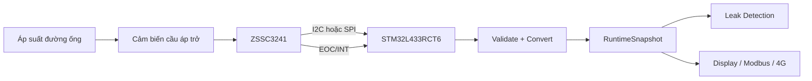
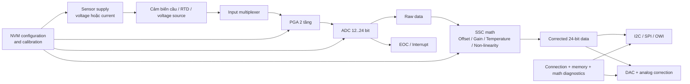
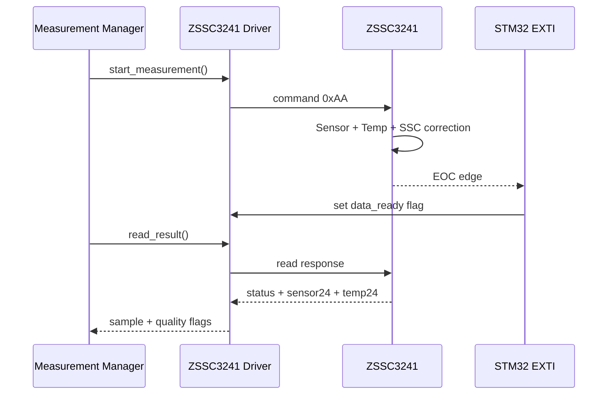
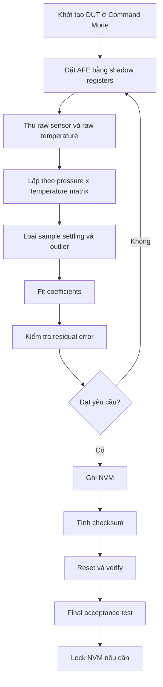
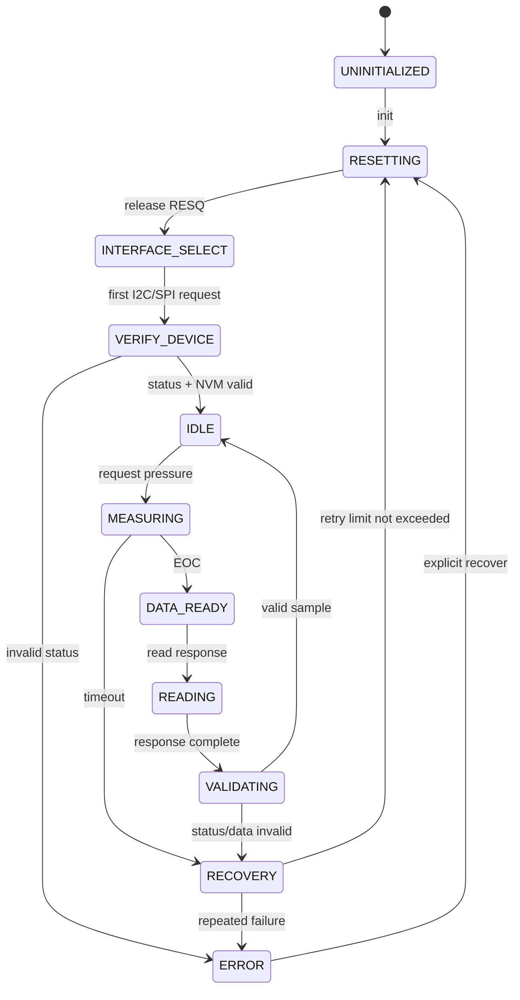

# ZSSC3241 — Tài liệu kỹ thuật và hướng dẫn tích hợp

> **Loại tài liệu:** Technical summary + integration guide  
> **Linh kiện:** Renesas ZSSC3241  
> **Vai trò dự kiến:** Điều hòa tín hiệu cho cảm biến áp suất dạng cầu điện trở  
> **Dự án tham chiếu:** Smart Ultrasonic Water Meter  
> **Trạng thái:** Bản thiết kế kỹ thuật ban đầu  
> **Nguồn chính:** Renesas ZSSC3241 Datasheet, Rev. Feb. 2, 2024

---

## 1. Mục đích tài liệu

Tài liệu này mô tả chi tiết IC **ZSSC3241**, cách IC xử lý tín hiệu từ cảm biến cầu điện trở, phương thức giao tiếp với vi điều khiển, quy trình đo, hiệu chuẩn, chẩn đoán lỗi và các khuyến nghị khi tích hợp vào hệ thống đo áp suất.

Tài liệu được viết theo hướng phục vụ trực tiếp cho việc:

- thiết kế schematic và PCB;
- xây dựng driver cho STM32;
- thiết kế quy trình hiệu chuẩn cảm biến áp suất;
- tích hợp dữ liệu áp suất vào pipeline đo của đồng hồ nước;
- xây dựng kiểm thử trên phần cứng thật và mô phỏng;
- quản lý cấu hình và dữ liệu hiệu chuẩn trong production firmware.

> **Lưu ý quan trọng:** ZSSC3241 không phải là cảm biến áp suất độc lập. Đây là một **Sensor Signal Conditioner — SSC**, tức IC điều hòa tín hiệu. Nó cần được kết nối với một phần tử cảm biến bên ngoài, thường là cầu Wheatstone áp trở.

---

## 2. Tổng quan

ZSSC3241 là IC điều hòa tín hiệu cảm biến điện trở có độ chính xác cao. IC tích hợp:

- nguồn kích cho cảm biến;
- bộ chọn đầu vào analog;
- khuếch đại vi sai PGA;
- ADC có độ phân giải lập trình được từ 12 đến 24 bit;
- khối tính toán hiệu chỉnh số;
- bộ nhớ NVM lưu cấu hình và hệ số hiệu chuẩn;
- DAC và ngõ ra analog;
- các giao tiếp số I2C, SPI và OWI;
- chân EOC/interrupt;
- các chức năng tự chẩn đoán.

ZSSC3241 phù hợp với:

- cảm biến áp suất dạng cầu điện trở;
- load cell;
- cảm biến lực và mô-men;
- cảm biến mức;
- cảm biến lưu lượng sử dụng phần tử áp trở;
- PT100, PTC, NTC hoặc diode nhiệt trong một số cấu hình;
- nguồn điện áp vi sai hoặc single-ended trong phạm vi hỗ trợ.

---

## 3. Thông số chính

| Hạng mục | Giá trị / khả năng |
|---|---|
| Điện áp nguồn VDD | 2.7 V đến 5.5 V |
| Nhiệt độ hoạt động | -40 °C đến +125 °C, tùy mã linh kiện |
| Đóng gói | 24-QFN, 4 mm × 4 mm, pitch 0.5 mm |
| Dải điện trở phần tử cảm biến | Xấp xỉ 0.5 kΩ đến 60 kΩ |
| Dải tín hiệu cầu | Khoảng 1 mV/V đến 500 mV/V |
| Gain PGA | Khoảng 1.32 đến 540 V/V |
| ADC | Có thể cấu hình 12 đến 24 bit |
| Ngõ ra dữ liệu đã hiệu chỉnh | 24 bit |
| Giao tiếp số | I2C, SPI, OWI |
| I2C | Standard, Fast và High-Speed Mode; tối đa 3.4 MHz |
| SPI | Nên thiết kế không vượt quá 10 MHz; bảng timing cho phép tối đa 12 MHz trong điều kiện quy định |
| OWI | Tối đa khoảng 100 kbit/s |
| Ngõ ra analog | Điện áp absolute, điện áp ratiometric, current loop 4–20 mA |
| NVM người dùng | 54 word × 16 bit |
| Độ bền ghi NVM | Khoảng 10,000 chu kỳ |
| Dòng hoạt động điển hình | Khoảng 2.3 mA, chưa tính dòng qua sensor |
| Dòng idle điển hình | Khoảng 1.5 µA ở điều kiện quy định |
| Dòng bias cảm biến lập trình được | 5, 10, 20, 39, 79, 157, 196 hoặc 494 µA |
| Chân báo hoàn tất | EOC — End of Conversion / interrupt |

Các giá trị timing, độ chính xác và dòng tiêu thụ phụ thuộc mạnh vào:

- độ phân giải ADC;
- gain PGA;
- loại nguồn tham chiếu;
- auto-zero;
- oversampling;
- lịch đo temperature;
- lịch chạy diagnostics;
- loại ngõ ra analog;
- dòng tiêu thụ của cầu cảm biến.

---

## 4. Vai trò trong hệ thống đo áp suất

Một cảm biến áp suất áp trở thường tạo ra tín hiệu vi sai nhỏ:

$$
V_{diff} = V_{INP} - V_{INN}
$$

Tín hiệu này thay đổi theo:

- áp suất;
- điện áp kích cầu;
- sai số offset ban đầu;
- độ nhạy của từng sensor;
- nhiệt độ;
- phi tuyến cơ khí và điện;
- ứng suất đóng gói;
- lão hóa.

ZSSC3241 thực hiện pipeline:

```text
Áp suất thực
    ↓
Cầu điện trở áp trở
    ↓
Tín hiệu vi sai INP - INN
    ↓
PGA + dịch offset analog
    ↓
ADC
    ↓
Bù zero/span/temperature/non-linearity
    ↓
Giá trị áp suất đã hiệu chỉnh
    ↓
I2C / SPI / OWI / analog output
```

Trong hệ thống đồng hồ nước, ZSSC3241 nên được xem là một khối đo áp suất độc lập:



---

## 5. Kiến trúc bên trong

Các khối chức năng chính:



### 5.1 Sensor supply

ZSSC3241 hỗ trợ hai cách cấp nguồn chính cho phần tử cảm biến:

1. **Ratiometric voltage supply**
   - Cầu cảm biến được kích bằng điện áp.
   - ADC sử dụng điện áp kích cầu làm reference.
   - Sai số do biến động nguồn được giảm nhờ phép đo ratiometric.
   - Đây thường là lựa chọn tốt cho cầu áp suất.

2. **Current bias**
   - IC cấp dòng lập trình được qua cảm biến.
   - Hữu ích với RTD, diode, PTC/NTC hoặc các cấu hình bridge đặc biệt.
   - Phải kiểm tra common-mode và điện áp rơi trên cảm biến.

### 5.2 PGA

PGA gồm hai tầng:

$$
G_{PGA} = G_1 \times G_2
$$

- `Gain_stage1`: từ khoảng 1.2 đến 300.
- `Gain_stage2`: từ 1.1 đến 1.8.
- Gain tổng tối đa khoảng 540.
- Có thể đảo polarity của đường đo.
- Có thể dịch offset đầu vào từ khoảng -15 mV đến +15 mV theo bước 1 mV.
- Có cơ chế tối ưu common-mode, nhưng việc bật chức năng này làm tăng dòng tiêu thụ.

Mục tiêu cấu hình PGA:

- tận dụng phần lớn dải ADC;
- không saturation ở áp suất và nhiệt độ cực trị;
- vẫn chừa headroom cho sai số sensor;
- giảm noise quy đổi về input.

### 5.3 ADC

ADC có thể cấu hình từ 12 đến 24 bit.

Độ phân giải cao hơn không đồng nghĩa trực tiếp với độ chính xác cao hơn. Khi tăng số bit:

- thời gian conversion tăng;
- dòng trung bình có thể tăng;
- tốc độ cập nhật giảm;
- noise theo số LSB có thể tăng;
- yêu cầu layout và lọc nguồn trở nên nghiêm ngặt hơn.

Ví dụ thời gian điển hình cho một full measurement có cả sensor, temperature và auto-zero:

| ADC | Thời gian điển hình |
|---:|---:|
| 12 bit | khoảng 0.8 ms |
| 16 bit | khoảng 1.3 ms |
| 20 bit | khoảng 2.9 ms |
| 24 bit | khoảng 9.8 ms |

Đối với đo áp suất đường ống trong đồng hồ nước, **16 hoặc 20 bit** thường là điểm bắt đầu hợp lý hơn 24 bit. Cấu hình cuối phải được xác định bằng noise test trên PCB thật.

### 5.4 Khối SSC Math

Khối xử lý số thực hiện:

- hiệu chỉnh offset;
- hiệu chỉnh gain/span;
- bù temperature drift của offset;
- bù temperature drift của gain;
- hiệu chỉnh phi tuyến bậc hai;
- phát hiện saturation trong quá trình tính;
- scaling về dải output số;
- hiệu chỉnh độc lập cho DAC khi dùng analog output.

Mô hình khái niệm có thể hiểu như sau:

$$
Y = f(S_{raw}, T_{raw}, C)
$$

Trong đó:

- $S_{raw}$: raw sensor measurement;
- $T_{raw}$: raw temperature measurement;
- $C$: tập hệ số calibration;
- $Y$: kết quả đã hiệu chỉnh.

Không nên dùng công thức khái niệm này để tự mã hóa coefficient trực tiếp. Định dạng fixed-point và thứ tự tính toán thực tế phải tuân theo datasheet/calibration guide hoặc phần mềm hiệu chuẩn chính thức.

---

## 6. Các loại cảm biến được hỗ trợ

### 6.1 Cầu điện trở đầy đủ

Cấu hình phổ biến nhất với cảm biến áp suất:

- `VDDB`: kích dương cầu;
- `VSSB`: kích âm/ground cầu;
- `INP`: đầu ra vi sai dương;
- `INN`: đầu ra vi sai âm.

Ưu điểm:

- đo ratiometric;
- khử ảnh hưởng biến thiên nguồn kích;
- thích hợp cho bridge pressure transducer;
- sử dụng được kiểm tra đứt dây và short.

### 6.2 Half-bridge

Có thể sử dụng với:

- pressure sensor half-bridge;
- strain gauge half-bridge;
- RTD/PT100 theo sơ đồ thích hợp.

Half-bridge thường cần thêm điện trở ngoài hoặc cấu hình bias phù hợp.

### 6.3 Voltage source

ZSSC3241 có thể nhận nguồn tín hiệu điện áp trong phạm vi analog input cho phép. Khi dùng nguồn absolute:

- không chọn ratiometric reference;
- kiểm tra common-mode;
- kiểm tra biên độ vi sai;
- tắt các khối bias không cần thiết.

### 6.4 Temperature sensor ngoài

Có thể dùng:

- diode nhiệt;
- PTC/NTC;
- bridge resistance như một chỉ báo nhiệt độ;
- RTD/PT100;
- temperature sensor nội của ZSSC3241.

ZSSC3241 hỗ trợ nhiều cấu hình temperature measurement. Việc lựa chọn phụ thuộc vào việc cần bù:

- nhiệt độ môi trường;
- nhiệt độ die;
- nhiệt độ cầu sensor;
- nhiệt độ nước.

> Nhiệt độ dùng để bù drift của pressure sensor không nhất thiết giống nhiệt độ nước dùng trong thuật toán đo lưu lượng siêu âm.

---

## 7. Sơ đồ chân 24-QFN

| Pin | Tên | Loại | Chức năng |
|---:|---|---|---|
| 1 | VDDB | Analog I/O | Nguồn dương cho bridge hoặc sensor-signal input |
| 2 | INP | Analog input | Tín hiệu vi sai dương |
| 3 | VSSB | Analog input | Ground bridge hoặc sensor-signal input |
| 4 | INN | Analog input | Tín hiệu vi sai âm |
| 5 | Renesas-Test | — | Dành cho Renesas; nối VSS hoặc để NC theo datasheet |
| 6 | Renesas-Test | — | Dành cho Renesas; nối VSS hoặc để NC theo datasheet |
| 7 | RESQ | Digital input | Reset active-low, có pull-up nội |
| 8 | Renesas-Test | — | Dành cho Renesas; nối VSS hoặc để NC theo datasheet |
| 9 | MOSI/SDA | Digital I/O | MOSI trong SPI hoặc SDA trong I2C |
| 10 | NC | — | Không kết nối |
| 11 | SCLK/SCL | Digital input | Clock SPI hoặc I2C |
| 12 | MISO | Digital output | Data output SPI |
| 13 | SS | Digital input | Slave Select cho SPI |
| 14 | EOC | Digital output | End of Conversion hoặc interrupt |
| 15 | OWI2in | Digital input | OWI input tùy chọn cho current-loop |
| 16 | AOUT/OWI1 | Analog/Digital I/O | Analog output hoặc đường OWI |
| 17 | FB | Analog output | Feedback cho current-loop; NC nếu không dùng |
| 18 | VSS | Ground | Ground của IC |
| 19 | VDD | Supply | Nguồn 2.7–5.5 V |
| 20 | NC | — | Không kết nối |
| 21 | TEXT | Analog output | Cấp dòng cho external temperature sensor/bridge |
| 22 | NC | — | Không kết nối |
| 23 | LDOctrl | Analog output | Điều khiển regulator/transistor nguồn ngoài |
| 24 | NC | — | Không kết nối |
| 25 | Exposed pad | — | Phải nối VSS; hỗ trợ tản nhiệt và EMC |

### 7.1 Các chân tối thiểu cho ứng dụng digital pressure sensor

Nếu chỉ dùng I2C và không dùng analog output:

- VDD;
- VSS;
- VDDB;
- VSSB;
- INP;
- INN;
- SDA;
- SCL;
- RESQ;
- EOC;
- exposed pad.

Các chân không dùng phải xử lý đúng datasheet; không tự ý kéo lên hoặc kéo xuống các chân NC, FB, OWI hoặc LDOctrl.

---

## 8. Nguồn và khuyến nghị schematic

### 8.1 Nguồn VDD

Baseline phù hợp với STM32L433:

```text
VDD_ZSSC3241 = 3.3 V
VSS          = GND
```

Ưu điểm:

- tương thích logic trực tiếp với STM32 3.3 V;
- không cần level shifter;
- phù hợp I2C hoặc SPI;
- đơn giản hóa nguồn hệ thống.

### 8.2 Tụ khuyến nghị

Theo điều kiện vận hành trong datasheet:

- khoảng 100 nF giữa VDD và VSS;
- khoảng 6.8 nF giữa VDDB và VSS cho EMC;
- tụ tại AOUT chỉ cần thiết khi dùng analog output/OWI theo cấu hình tương ứng.

Khuyến nghị thực tế:

```text
VDD --- 100 nF --- VSS
 |
 +---- 1 µF hoặc 2.2 µF bulk gần IC, tùy rail và layout
```

Tụ 100 nF phải đặt sát pin VDD/VSS nhất có thể.

### 8.3 Kết nối exposed pad

Exposed pad phải:

- nối trực tiếp VSS;
- dùng nhiều via xuống ground plane;
- không để floating;
- không đi tín hiệu digital bên dưới vùng analog nhạy nếu có thể.

### 8.4 Routing cầu cảm biến

- Route INP và INN đối xứng.
- Giữ chiều dài ngắn.
- Tránh chạy song song SCLK, MOSI, RS485, 4G hoặc LCD clock.
- Route VDDB/VSSB như một cặp supply cho bridge.
- Không chia sẻ đường hồi dòng sensor với dòng xung digital.
- Có thể chừa vị trí RC filter nhưng không lắp giá trị quá lớn trước khi đo bandwidth/noise.
- Nếu cảm biến nối bằng cáp, cần đánh giá ESD, surge, leakage và bảo vệ input.

---

## 9. Lựa chọn giao tiếp

## 9.1 I2C

I2C phù hợp khi:

- hệ thống chỉ cần digital measurement;
- muốn giảm số chân;
- không cần tốc độ cực cao;
- MCU đã có I2C bus ổn định;
- ZSSC3241 được đặt gần MCU.

Đặc điểm:

- hỗ trợ đến 3.4 MHz;
- địa chỉ 7 bit nằm trong NVM;
- sau power-on, interface được chọn bằng giao dịch hợp lệ đầu tiên;
- kết quả đọc có status byte đi kèm;
- chỉ gửi số byte cần thiết, ngoại trừ một số yêu cầu High-Speed Mode.

### Khuyến nghị cho dự án

ZSSC3241 có thể chia sẻ I2C với FM24CL04B nếu:

- địa chỉ không xung đột;
- tổng bus capacitance nằm trong giới hạn;
- pull-up được tính đúng;
- lỗi của một slave không làm treo toàn bộ bus;
- driver có cơ chế bus recovery.

Không nên để địa chỉ production là `0x00`. Đây là địa chỉ mặc định trong NVM nhưng là địa chỉ đặc biệt trong hệ sinh thái I2C. Hãy lập trình một địa chỉ 7-bit riêng cho sản phẩm.

## 9.2 SPI

SPI phù hợp khi:

- cần timing xác định;
- cần tốc độ giao tiếp cao;
- muốn tránh chia sẻ I2C bus;
- có đủ chân MCU.

Các điểm quan trọng:

- mode SPI được cấu hình qua NVM;
- CPOL, CPHA và polarity của SS đều lập trình được;
- một command request luôn gồm 3 byte;
- command ngắn phải pad bằng byte `0x00`;
- response thường được clock ra ở transaction sau bằng NOP;
- cần chờ `Busy = 0` hoặc EOC trước khi lấy data;
- khoảng cách giữa hai lần kích hoạt SS phải thỏa timing datasheet;
- nên bring-up ở 1 MHz trước khi tăng tốc.

## 9.3 OWI

OWI dùng chung với AOUT và phù hợp cho:

- end-of-line calibration;
- module chỉ có ít dây;
- current-loop sensor;
- calibration sau khi sensor đã đóng gói.

OWI không phải lựa chọn ưu tiên cho kết nối nội bộ ZSSC3241–STM32 trong đồng hồ nước nếu I2C/SPI đã có sẵn.

---

## 10. Cơ chế chọn interface sau power-on

ZSSC3241 quyết định interface trong startup window:

1. Nếu giao dịch đầu tiên là I2C hợp lệ với đúng slave address → khóa sang I2C.
2. Nếu SS hoạt động đầu tiên → khóa sang SPI.
3. Nếu nhận OWI start hợp lệ → khóa sang OWI.
4. Sau khi đã chọn, chỉ POR hoặc reset mới cho phép chọn lại interface.

Điều này dẫn đến yêu cầu phần cứng:

- nếu dùng I2C, chân SS không được ở mức active trong lúc khởi động;
- nếu dùng SPI, không phát xung I2C/OWI không chủ ý;
- firmware phải kiểm soát thứ tự init;
- bootloader và production firmware không được cấu hình pin khác nhau gây glitch;
- cần reset IC khi bus bị chọn sai.

---

## 11. Chế độ hoạt động

ZSSC3241 có ba main mode.

### 11.1 Sleep Mode

Đặc điểm:

- tối ưu cho digital smart sensor tiết kiệm năng lượng;
- sau khi hoàn thành command, IC trở về idle;
- interface vẫn lắng nghe;
- kết quả chỉ có thể đọc một lần;
- không cung cấp measurement qua analog output.

Phù hợp với:

- đồng hồ nước chạy pin;
- đo áp suất theo chu kỳ chậm;
- wake → measure → read → sleep.

### 11.2 Command Mode

Đặc điểm:

- đầy đủ command;
- thích hợp cho test và calibration;
- hỗ trợ output digital và analog;
- chỉ hoạt động khi có command;
- latency thấp.

Phù hợp với:

- factory calibration;
- driver bring-up;
- debug;
- characterization;
- production test.

### 11.3 Cyclic Mode

Đặc điểm:

- đo tự động lặp lại;
- có measurement scheduler;
- có thể cập nhật digital và analog output;
- có thể chèn diagnostics;
- cấu hình được tần suất sensor, temperature, auto-zero và connection check.

Phù hợp với:

- pressure monitoring liên tục;
- analog output;
- alarm threshold;
- ứng dụng cần update rate ổn định.

### 11.4 Chọn mode cho đồng hồ nước

Baseline đề xuất:

| Trạng thái hệ thống | ZSSC3241 mode |
|---|---|
| Factory calibration | Command Mode |
| Boot self-test | Command Mode |
| Đo định kỳ bằng pin | Sleep Mode |
| Pressure logging nhanh | Cyclic Mode |
| Debug tại phòng lab | Command Mode |
| Analog output/current loop | Cyclic Mode |

---

## 12. Luồng command và dữ liệu

### 12.1 Nhóm command chính

| Command | Ý nghĩa |
|---:|---|
| `0x00`–`0x3F` | Đọc memory/NVM address tương ứng |
| `0x40`–`0x75` + 16-bit data | Ghi customer NVM, address = command - `0x40` |
| `0x90` | Tính và ghi checksum NVM |
| `0xA2` | Raw sensor measurement |
| `0xA4` | Raw temperature measurement |
| `0xA8` | Chuyển sang Sleep Mode |
| `0xA9` | Chuyển sang Command Mode |
| `0xAA` | Full corrected measurement |
| `0xAB` | Chuyển sang Cyclic Mode |
| `0xAC` | Oversample ×2 |
| `0xAD` | Oversample ×4 |
| `0xAE` | Oversample ×8 |
| `0xAF` | Oversample ×16 |
| `0xB0` | Đọc diagnostic detail |
| `0xB1` | Reset diagnostic register |
| `0xB2` | Chạy/update diagnostics |
| `0xD6`–`0xDB` | Ghi đè shadow configuration để test, không sửa NVM |
| `0xFx` | NOP/read response trong SPI, tùy format command |

### 12.2 Raw measurement

`0xA2` và `0xA4` dùng khi:

- thu dữ liệu calibration;
- kiểm tra AFE;
- xác định gain và offset;
- đánh giá noise;
- xác minh temperature channel.

Raw measurement không áp dụng toàn bộ SSC correction.

### 12.3 Corrected measurement

`0xAA` trả về:

- status;
- sensor data 24 bit;
- temperature data 24 bit.

Driver không nên chỉ lấy pressure data mà bỏ status. Mỗi sample phải được gắn quality flags từ status và diagnostic state.

---

## 13. EOC và interrupt

Chân EOC có thể được cấu hình để:

- báo End of Conversion;
- hoạt động như comparator interrupt theo threshold;
- tạo window/hysteresis alarm;
- báo khi giá trị vượt hoặc thấp hơn ngưỡng.

Baseline cho driver ban đầu:

```text
INT_setup = End-of-Conversion
EOC -> STM32 EXTI
```

Runtime flow:



Không nên đọc result ngay sau khi gửi command bằng delay cố định nếu EOC có sẵn. Delay cố định chỉ nên dùng cho bring-up hoặc fallback có timeout.

---

## 14. Status byte

Status byte nên được parse thành các trường:

| Bit | Ý nghĩa |
|---:|---|
| 7 | Reserved/0 |
| 6 | Powered/initialization status |
| 5 | Busy |
| 4:3 | Mode |
| 2 | Memory error |
| 1 | Connection-check fault |
| 0 | Math saturation |

Mode coding:

| `status[4:3]` | Mode |
|---|---|
| `00` | Command |
| `01` | Cyclic |
| `10` | Sleep |
| `11` | Reserved |

Driver phải từ chối publish một sample là “valid” nếu:

- memory error;
- connection fault nghiêm trọng;
- math saturation;
- timeout;
- data length sai;
- mode không đúng;
- raw value ngoài dải được cấu hình.

---

## 15. Diagnostics

ZSSC3241 hỗ trợ các lỗi:

- mất kết nối INP;
- mất kết nối INN;
- INP ngoài dải;
- INN ngoài dải;
- sensor short, `INP = INN`;
- TEXT open;
- TEXT ngoài dải;
- TEXT short với INN;
- TEXT short với INP;
- SSC math saturation;
- NVM checksum error;
- die crack/chipping check failure.

Một mapping tổng quát của `diagnosticreg`:

| Bit | Diagnostic |
|---:|---|
| 0 | Trạng thái fault đã cải thiện kể từ lần đọc trước |
| 1 | Mất kết nối INP |
| 2 | Mất kết nối INN |
| 3 | INP ngoài dải |
| 4 | INN ngoài dải |
| 5 | Sensor short |
| 6 | TEXT open |
| 7 | TEXT ngoài dải |
| 8 | TEXT short với INN |
| 9 | SSC math saturation |
| 10 | NVM checksum error |
| 11 | TEXT short với INP |
| 12 | Die crack/chipping failure |
| 15:13 | Reserved |

### Chính sách xử lý đề xuất

| Fault | Hành động |
|---|---|
| Busy quá timeout | Reset interface hoặc RESQ |
| Memory error | Không dùng hệ số calibration; báo fatal |
| Connection fault | Đánh dấu pressure invalid |
| Math saturation | Không dùng sample cho leak detection |
| TEXT fault | Pressure có thể invalid do bù nhiệt sai |
| Chipping failure | Báo hardware failure |
| Fault tự phục hồi | Ghi event và yêu cầu nhiều sample tốt liên tiếp trước khi clear |

---

## 16. NVM và shadow registers

### 16.1 Đặc tính NVM

- tổ chức theo word 16 bit;
- khoảng 54 word cho customer use;
- khoảng 10,000 lần ghi;
- chứa interface config, AFE config, calibration coefficients, scheduler và output setup;
- có checksum;
- có lock bit;
- lock có hiệu lực sau reset;
- sau khi lock, không thể sửa NVM theo đường bình thường.

### 16.2 Shadow register

Một số cấu hình NVM được load vào shadow register khi reset.

Các command overwrite `0xD6`–`0xDB` cho phép:

- thử gain khác;
- thử ADC resolution;
- thử current bias;
- thử temperature source;
- đo raw data;
- tối ưu AFE;
- không tiêu hao chu kỳ ghi NVM.

Overwrite bị xóa khi:

- power-on reset;
- reset bằng RESQ.

### 16.3 Các địa chỉ NVM quan trọng

| Address | Nhóm |
|---:|---|
| `0x00`–`0x01` | Customer ID |
| `0x02` | Interface config, I2C address, EOC setup, SPI mode |
| `0x03` | SSF1, sensor/temperature source, default mode, lock |
| `0x04` | SSF2, auto-zero, analog output và oversampling |
| `0x05`–`0x13` | Main SSC calibration coefficients |
| `0x14` | Main sensor config 1: PGA gain, ADC resolution, reference |
| `0x15` | Main sensor config 2: offset shift, bias current, AFE options |
| `0x16`–`0x17` | External temperature config |
| `0x18`–`0x1D` | Threshold, post-scaling hoặc calibration phụ |
| `0x1E`–`0x20` | Measurement scheduler |
| `0x21` | Diagnostic check selection |
| `0x22` trở lên | DAC/output calibration và enhanced output features |

Đây là bảng định hướng. Khi implement driver, phải tạo register definition từ **Table 35** của datasheet và kiểm tra từng bit.

### 16.4 Checksum và lock

Quy trình an toàn:

1. Giữ `lock = 0`.
2. Ghi toàn bộ cấu hình.
3. Đọc lại từng word.
4. Chạy measurement validation.
5. Ghi `lock = 1` nếu sản phẩm yêu cầu khóa.
6. Gửi command `0x90` để tính và ghi checksum.
7. Reset.
8. Đọc status và kiểm tra memory error.
9. Đọc lại customer ID/version.

Checksum NVM dùng polynomial:

$$
x^{16} + x^{15} + x^2 + 1
$$

Checksum được kiểm tra sau power-on. Không nên coi lần ghi NVM thành công chỉ vì bus trả ACK.

---

## 17. Hiệu chuẩn

## 17.1 Mục tiêu

Hiệu chuẩn phải xác định:

- zero offset;
- gain/span;
- temperature coefficient của offset;
- temperature coefficient của gain;
- phi tuyến sensor;
- mapping về đơn vị áp suất;
- dải output;
- ngưỡng diagnostics;
- quality limits.

## 17.2 Thiết bị cần thiết

- nguồn áp suất chuẩn hoặc pressure calibrator;
- cảm biến áp suất + ZSSC3241 DUT;
- chamber nhiệt hoặc phương pháp ổn định nhiệt;
- thiết bị đọc reference pressure;
- PC calibration software;
- board giao tiếp;
- nguồn ổn định;
- logger cho raw sensor, raw temperature và reference.

## 17.3 Ma trận calibration đề xuất

Ví dụ:

| Temperature | Pressure points |
|---|---|
| Tmin | 0%, 25%, 50%, 75%, 100% FS |
| Troom | 0%, 25%, 50%, 75%, 100% FS |
| Tmax | 0%, 25%, 50%, 75%, 100% FS |

Với yêu cầu chính xác cao hơn có thể dùng:

- 5 temperature points;
- 7–11 pressure points;
- cả chiều tăng và giảm áp suất để đánh giá hysteresis;
- nhiều lần lặp tại mỗi point.

## 17.4 Quy trình calibration



## 17.5 Dữ liệu calibration record

Mỗi DUT nên có record ngoài IC:

```json
{
  "device_id": "WM-PRESS-000001",
  "sensor_model": "bridge-pressure-sensor",
  "zssc3241_customer_id": "0x12345678",
  "calibration_version": 1,
  "pressure_unit": "kPa",
  "pressure_range": {
    "min": 0.0,
    "max": 1600.0
  },
  "temperature_range_c": {
    "min": -20.0,
    "max": 70.0
  },
  "nvm_image_crc32": "0x00000000",
  "created_at": "YYYY-MM-DD",
  "station_id": "CAL-STATION-01"
}
```

Ngoài NVM image, nên lưu:

- raw calibration points;
- reference instrument ID;
- ngày hiệu chuẩn reference;
- operator/station;
- software version;
- residual error;
- pass/fail limits;
- final NVM dump.

## 17.6 Production calibration và field calibration

### Production calibration

- tạo coefficient đầy đủ;
- ghi NVM ZSSC3241;
- tính checksum;
- có thể lock;
- lưu calibration record trên PC/server.

### Field calibration

Không nên ghi lại toàn bộ NVM thường xuyên. Field adjustment nên được quản lý ở production firmware dưới dạng:

- pressure zero trim;
- installation offset;
- small gain correction;
- timestamp;
- reason code;
- CRC;
- A/B slot trong F-RAM.

Khi đó:

$$
P_{final} = P_{ZSSC3241} \times K_{field} + Offset_{field}
$$

Cấu trúc này giữ nguyên factory calibration trong ZSSC3241 và cho phép hiệu chỉnh nhỏ tại hiện trường.

---

## 18. Cấu hình baseline đề xuất cho dự án

Đây là baseline khởi đầu, không phải cấu hình cuối:

| Hạng mục | Baseline |
|---|---|
| VDD | 3.3 V |
| Interface | I2C |
| I2C speed | 400 kHz khi bring-up |
| EOC | End-of-conversion |
| RESQ | GPIO output từ STM32 |
| Mode production | Sleep Mode, one-shot |
| Mode calibration | Command Mode |
| ADC | 16 bit ban đầu |
| Sensor supply | Ratiometric bridge |
| Auto-zero | Bật khi cần chất lượng; đánh giá timing |
| Temperature source | Internal hoặc bridge temperature, cần characterization |
| Oversampling | Tắt ban đầu; thêm khi noise không đạt |
| Analog output | Tắt |
| OWI | Tắt nếu không sử dụng |
| NVM lock | Chỉ bật sau khi quy trình calibration đã ổn định |

### Lý do chọn I2C

- SPI1 đang dùng cho MAX35103;
- I2C1 đã dùng cho F-RAM;
- pressure update rate không yêu cầu SPI tốc độ cao;
- giảm pin;
- dễ tích hợp EOC bằng EXTI.

Tuy vậy, nên cân nhắc I2C bus riêng nếu:

- bus F-RAM có traffic lớn;
- cần fault containment;
- pressure sensor nằm xa MCU;
- môi trường EMI cao;
- có khả năng một slave kéo SDA thấp.

---

## 19. Đề xuất pin mapping STM32

Pin mapping cụ thể phải được xác nhận với schematic và CubeMX. Mẫu logic:

| ZSSC3241 | STM32L433 | Cấu hình |
|---|---|---|
| SDA | I2C_SDA | Alternate function, open-drain |
| SCL | I2C_SCL | Alternate function, open-drain |
| EOC | GPIO EXTI | Input, edge interrupt |
| RESQ | GPIO output | Push-pull, default high |
| VDD | 3V3_A | Nguồn sạch |
| VSS | GND_A | Ground |
| VDDB/VSSB | Bridge | Analog sensor supply |
| INP/INN | Bridge | Differential analog |

### Quy tắc reset

- GPIO RESQ giữ high bình thường.
- Kéo low đủ thời gian theo datasheet.
- Nhả high.
- Chờ startup.
- Gửi đúng giao dịch interface đầu tiên.
- Đọc status/memory để xác nhận mode.

---

## 20. Kiến trúc firmware đề xuất

```text
drivers/
└── zssc3241/
    ├── zssc3241_driver.c
    ├── zssc3241_driver.h
    ├── zssc3241_protocol.c
    ├── zssc3241_protocol.h
    ├── zssc3241_registers.h
    └── zssc3241_types.h

services/
├── pressure_measurement_service.c
├── pressure_measurement_service.h
├── pressure_calibration_service.c
└── pressure_calibration_service.h
```

### 20.1 Trách nhiệm driver

- bus transaction;
- reset;
- command encoding;
- response parsing;
- status parsing;
- NVM read/write;
- checksum;
- mode switching;
- EOC/timeout;
- diagnostic read;
- không chuyển đổi sang kPa;
- không quyết định leak.

### 20.2 Trách nhiệm pressure service

- trigger theo scheduler hệ thống;
- đổi digital code thành engineering unit;
- áp dụng field adjustment;
- range check;
- quality flags;
- publish vào RuntimeSnapshot;
- ghi diagnostic event;
- quản lý retry/reset policy.

### 20.3 API đề xuất

```c
typedef enum
{
    ZSSC3241_MODE_COMMAND = 0,
    ZSSC3241_MODE_CYCLIC,
    ZSSC3241_MODE_SLEEP
} Zssc3241Mode_t;

typedef struct
{
    uint8_t status;
    uint32_t sensor_raw24;
    uint32_t temperature_raw24;
    bool memory_error;
    bool connection_fault;
    bool math_saturation;
    bool busy;
    Zssc3241Mode_t mode;
} Zssc3241Sample_t;

typedef enum
{
    ZSSC3241_OK = 0,
    ZSSC3241_ERR_ARGUMENT,
    ZSSC3241_ERR_BUS,
    ZSSC3241_ERR_TIMEOUT,
    ZSSC3241_ERR_PROTOCOL,
    ZSSC3241_ERR_DEVICE_STATUS,
    ZSSC3241_ERR_NVM_LOCKED,
    ZSSC3241_ERR_VERIFY
} Zssc3241Result_t;

Zssc3241Result_t Zssc3241_Init(void);
Zssc3241Result_t Zssc3241_Reset(void);
Zssc3241Result_t Zssc3241_SetMode(Zssc3241Mode_t mode);

Zssc3241Result_t Zssc3241_StartMeasurement(void);
Zssc3241Result_t Zssc3241_ReadMeasurement(Zssc3241Sample_t *sample);

Zssc3241Result_t Zssc3241_ReadNvm(uint8_t address, uint16_t *value);
Zssc3241Result_t Zssc3241_WriteNvm(uint8_t address, uint16_t value);
Zssc3241Result_t Zssc3241_UpdateNvmChecksum(void);

Zssc3241Result_t Zssc3241_ReadDiagnostics(uint16_t *diagnostic);
Zssc3241Result_t Zssc3241_UpdateDiagnostics(uint16_t *diagnostic);
Zssc3241Result_t Zssc3241_ClearDiagnostics(void);

void Zssc3241_OnEocInterrupt(void);
bool Zssc3241_IsDataReady(void);
```

### 20.4 Driver context

```c
typedef struct
{
    bool initialized;
    bool data_ready;
    bool measurement_pending;
    uint32_t start_tick_ms;
    uint32_t timeout_ms;
    uint8_t expected_i2c_address;
    Zssc3241Mode_t expected_mode;
    uint32_t reset_count;
    uint32_t bus_error_count;
    uint32_t timeout_count;
    uint32_t status_error_count;
} Zssc3241Context_t;
```

---

## 21. State machine đo áp suất



---

## 22. Measurement service output

```c
typedef enum
{
    PRESSURE_QUALITY_OK                  = 0,
    PRESSURE_QUALITY_TIMEOUT             = 1U << 0,
    PRESSURE_QUALITY_BUS_ERROR           = 1U << 1,
    PRESSURE_QUALITY_MEMORY_ERROR        = 1U << 2,
    PRESSURE_QUALITY_CONNECTION_FAULT    = 1U << 3,
    PRESSURE_QUALITY_MATH_SATURATION     = 1U << 4,
    PRESSURE_QUALITY_OUT_OF_RANGE        = 1U << 5,
    PRESSURE_QUALITY_NOT_CALIBRATED      = 1U << 6,
    PRESSURE_QUALITY_STALE               = 1U << 7
} PressureQualityFlags_t;

typedef struct
{
    int32_t pressure_pa;
    int32_t sensor_temperature_mdeg_c;
    uint32_t timestamp_ms;
    uint32_t sequence;
    PressureQualityFlags_t quality;
    uint8_t zssc_status;
    uint16_t zssc_diagnostics;
} PressureSample_t;
```

Không nên publish `float` trực tiếp trong shared snapshot nếu hệ thống ưu tiên deterministic behavior. Có thể dùng:

- Pa;
- deci-Pa;
- mbar × 100;
- kPa × 1000;
- fixed-point Q format.

---

## 23. Tích hợp với RuntimeSnapshot

Ví dụ:

```c
typedef struct
{
    int32_t flow_rate_ml_min;
    int32_t water_temperature_mdeg_c;
    int32_t pressure_pa;

    uint32_t total_volume_ml;
    uint32_t timestamp_s;

    uint32_t measurement_quality;
    uint32_t pressure_quality;
    uint32_t system_faults;
} RuntimeSnapshot_t;
```

Leak detection chỉ được dùng pressure khi:

```c
bool pressure_is_usable =
    ((snapshot.pressure_quality & PRESSURE_FATAL_MASK) == 0U) &&
    !pressure_is_stale(snapshot);
```

Không được dùng pressure sample lỗi để:

- kết luận leak;
- cập nhật baseline pressure;
- tạo pressure trend;
- hiệu chỉnh flow;
- phát cảnh báo giảm áp.

---

## 24. Xử lý lỗi và recovery

### 24.1 Timeout

1. Đọc status.
2. Nếu Busy:
   - chờ thêm trong giới hạn;
   - không reset ngay nếu conversion 24 bit.
3. Nếu bus error:
   - chạy bus recovery;
   - reset peripheral I2C/SPI.
4. Nếu vẫn lỗi:
   - toggle RESQ;
   - chọn lại interface;
   - verify NVM.
5. Nếu lặp lại:
   - đánh dấu hardware fault.

### 24.2 I2C bus recovery

- disable I2C peripheral;
- cấu hình SCL/SDA thành GPIO open-drain;
- phát tối đa 9 xung SCL;
- tạo STOP;
- re-init I2C;
- reset ZSSC3241 nếu cần;
- gửi đúng first transaction để chọn I2C.

### 24.3 Reset storm prevention

Không reset liên tục. Ví dụ:

```text
Retry command:            tối đa 2 lần
Bus recovery:             tối đa 1 lần
RESQ reset:               tối đa 2 lần / phút
Power-domain reset:       chỉ khi hệ thống cho phép
Permanent fault:          sau ngưỡng lỗi cấu hình được
```

---

## 25. Kế hoạch bring-up

### Phase 1 — Electrical

- xác minh 3.3 V;
- xác minh VDDB;
- kiểm tra RESQ high;
- kiểm tra SDA/SCL idle high;
- kiểm tra EOC idle;
- đo dòng idle và active;
- kiểm tra không có nóng bất thường.

### Phase 2 — Communication

- reset;
- gửi giao dịch I2C đầu tiên;
- đọc status;
- đọc customer ID;
- đọc register `0x02`, `0x03`, `0x04`;
- xác nhận interface address;
- xác nhận mode.

### Phase 3 — Raw measurement

- vào Command Mode;
- đọc raw sensor bằng `0xA2`;
- thay đổi pressure;
- xác minh raw tăng/giảm đúng polarity;
- đọc raw temperature bằng `0xA4`;
- đánh giá noise.

### Phase 4 — Corrected measurement

- gửi `0xAA`;
- dùng EOC;
- đọc sensor + temperature;
- parse status;
- kiểm tra repeatability;
- kiểm tra range.

### Phase 5 — Calibration

- thu ma trận pressure × temperature;
- sinh coefficients;
- ghi NVM;
- checksum;
- reset;
- verify;
- acceptance test.

### Phase 6 — Production integration

- Sleep Mode;
- periodic measurement;
- RuntimeSnapshot;
- Modbus mapping;
- logging;
- leak detection evidence.

---

## 26. Kế hoạch kiểm thử

### 26.1 Unit test driver

- encode memory read;
- encode memory write;
- encode measure command;
- parse 24-bit sensor data;
- parse status;
- parse diagnostic register;
- timeout state;
- invalid length;
- invalid mode;
- NVM verify mismatch.

### 26.2 Mock bus test

- success response;
- NACK;
- stuck busy;
- EOC missing;
- partial response;
- memory error bit;
- math saturation bit;
- connection fault bit;
- reset during transaction.

### 26.3 Hardware test

| Test | Tiêu chí |
|---|---|
| Boot 1000 lần | Không chọn sai interface |
| Power ramp | POR ổn định |
| Pressure sweep | Monotonic |
| Temperature sweep | Residual trong giới hạn |
| Noise | Đạt RMS/peak-to-peak target |
| Cable fault | Diagnostic phát hiện đúng |
| Sensor open | Không publish pressure hợp lệ |
| Sensor short | Không publish pressure hợp lệ |
| Brownout | Tự recovery |
| I2C stuck | Bus recovery hoạt động |
| NVM CRC corruption | Memory error được phát hiện |

### 26.4 Long-run test

- 24–168 giờ;
- đo định kỳ;
- log raw/status/temperature;
- đếm reset;
- đếm timeout;
- theo dõi drift;
- chạy 4G/RS485/LCD đồng thời để đánh giá EMI.

---

## 27. Các rủi ro kỹ thuật

### 27.1 Chọn gain quá cao

Hậu quả:

- saturation;
- math saturation;
- mất dữ liệu ở temperature/pressure extreme;
- yield production thấp.

### 27.2 Dùng 24 bit ngay từ đầu

Hậu quả:

- thời gian đo dài;
- khó đạt noise thực sự;
- tăng năng lượng;
- dễ hiểu nhầm resolution là accuracy.

### 27.3 Ghi NVM trong runtime

Hậu quả:

- hao chu kỳ ghi;
- rủi ro mất nguồn;
- có thể brick cấu hình;
- khó traceability.

Production firmware nên mặc định chỉ đọc NVM ZSSC3241.

### 27.4 Lock NVM quá sớm

Sau khi lock:

- không sửa được calibration;
- không đổi interface;
- không đổi địa chỉ;
- không sửa scheduler.

Chỉ lock sau khi quy trình sản xuất đã được validate.

### 27.5 Nhầm nhiệt độ sensor và nhiệt độ nước

- ZSSC temperature dùng cho bù pressure bridge.
- MAX35103 temperature có thể đại diện nhiệt độ nước.
- Hai nguồn này có vị trí và động học nhiệt khác nhau.
- Không thay thế lẫn nhau nếu chưa characterization.

### 27.6 Chia sẻ I2C không có fault containment

Một slave giữ SDA low có thể làm mất:

- pressure;
- F-RAM;
- configuration;
- calibration storage.

Cần bus recovery và đánh giá có nên dùng bus riêng.

---

## 28. Quyết định kiến trúc đề xuất

1. ZSSC3241 là **pressure sensor front-end**, không phải pressure algorithm.
2. Production firmware đọc dữ liệu đã được factory-calibrated từ ZSSC3241.
3. Factory calibration coefficients nằm trong NVM của ZSSC3241.
4. Field trim nhỏ nằm trong F-RAM của hệ thống.
5. Pressure driver chỉ xử lý protocol và status.
6. Pressure service chuyển đổi đơn vị, validate và publish.
7. Leak detection chỉ dùng pressure có quality hợp lệ.
8. I2C + EOC là baseline đầu tiên.
9. Sleep Mode là baseline cho runtime tiết kiệm năng lượng.
10. Command Mode dùng cho calibration và diagnostics.
11. NVM lock chỉ bật ở cuối dây chuyền sau final verification.
12. Mọi NVM image phải có version và được lưu ngoài DUT.

---

## 29. Checklist schematic

- [ ] VDD nằm trong 2.7–5.5 V.
- [ ] Logic level tương thích MCU.
- [ ] Tụ 100 nF sát VDD/VSS.
- [ ] Tụ VDDB theo khuyến nghị EMC.
- [ ] Exposed pad nối VSS.
- [ ] RESQ có MCU control.
- [ ] EOC đi vào EXTI.
- [ ] SS không active ngoài ý muốn nếu dùng I2C.
- [ ] SDA/SCL có pull-up phù hợp.
- [ ] Địa chỉ I2C không xung đột.
- [ ] INP/INN route đối xứng.
- [ ] VDDB/VSSB không chia sẻ đường hồi xung digital.
- [ ] Chân test/NC xử lý đúng datasheet.
- [ ] FB/LDOctrl/AOUT xử lý đúng khi không dùng.
- [ ] Có test point cho VDD, VDDB, INP, INN, EOC, RESQ.
- [ ] Có phương án sensor open/short test.
- [ ] Có bảo vệ ESD nếu sensor nối cáp.

---

## 30. Checklist firmware

- [ ] Reset sequence đúng.
- [ ] First transaction chọn đúng interface.
- [ ] Đọc và verify NVM config khi boot.
- [ ] Timeout phụ thuộc ADC resolution.
- [ ] EOC interrupt không thực hiện bus transaction trong ISR.
- [ ] Parse status cho mọi sample.
- [ ] Không publish sample có fatal quality.
- [ ] Có diagnostic command.
- [ ] Có I2C recovery.
- [ ] Có retry limit.
- [ ] Có reset storm protection.
- [ ] Không ghi NVM trong normal runtime.
- [ ] NVM write có readback verify.
- [ ] Checksum được cập nhật sau ghi.
- [ ] NVM lock được bảo vệ bằng factory-only command.
- [ ] Raw measurement chỉ có trong calibration/debug build.
- [ ] Có telemetry cho timeout, reset và diagnostic faults.

---

## 31. Tài liệu cần triển khai tiếp

Để hoàn thiện tích hợp ZSSC3241 trong dự án, nên tạo thêm:

```text
1.docs/02_hardware/components/zssc3241/
├── README.md
├── ZSSC3241_Technical_Summary.md
├── ZSSC3241_Register_Notes.md
├── ZSSC3241_Command_Notes.md
├── ZSSC3241_Hardware_Integration.md
├── ZSSC3241_Calibration_Process.md
└── ZSSC3241_Firmware_Driver_Design.md
```

Tài liệu hiện tại có thể dùng làm `ZSSC3241_Technical_Summary.md`.

---

## 32. Tài liệu tham khảo

1. Renesas Electronics, **ZSSC3241 Datasheet — Sensor Signal Conditioner IC for Resistive Sensors**, Rev. Feb. 2, 2024.
2. Renesas Electronics, **ZSSC3241 Evaluation Kit User Guide**, May 22, 2023.
3. Renesas Electronics, **Flexible Temperature Measurement with the ZSSC3241 Enables Bridge as Temperature Sensor**, 2023.
4. Renesas Electronics, **ZSSC3241 Current Loop Application Note**, Dec. 4, 2024.
5. Renesas Electronics, **ZSSC3241 Product Page**.

---

## 33. Kết luận

ZSSC3241 là một AFE/SSC mạnh, phù hợp để biến một bridge pressure transducer thành smart pressure sensor có:

- khuếch đại;
- digitization;
- bù nhiệt;
- hiệu chỉnh phi tuyến;
- NVM calibration;
- diagnostics;
- giao tiếp số;
- khả năng tiết kiệm năng lượng.

Đối với đồng hồ nước dùng STM32L433, baseline hợp lý là:

```text
Bridge pressure sensor
    -> ZSSC3241 ratiometric AFE
    -> I2C + EOC
    -> Pressure Measurement Service
    -> RuntimeSnapshot
    -> Leak Detection / Modbus / 4G / Logging
```

Rủi ro lớn nhất không nằm ở việc đọc I2C, mà ở:

- chọn AFE configuration;
- thiết kế calibration matrix;
- quản lý NVM;
- kiểm soát quality flags;
- tách factory calibration khỏi field adjustment;
- xác minh noise và drift trên phần cứng thật.