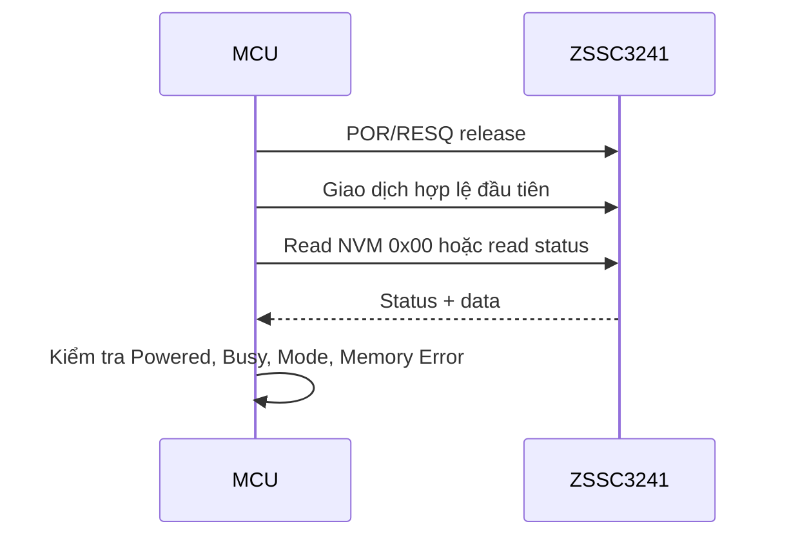

# ZSSC3241 — Command Notes

> **Loại tài liệu:** Tài liệu tra cứu lệnh và giao dịch số  
> **Phạm vi:** Dùng chung cho các hệ thống sử dụng ZSSC3241  
> **Linh kiện:** Renesas ZSSC3241  
> **Trạng thái:** Bản nền tảng để thiết kế driver  
> **Nguồn chuẩn:** ZSSC3241 Datasheet, Rev. Feb. 2, 2024 — Sections 6.4 và 6.6.1

---

## 1. Mục đích và phạm vi

Tài liệu này tổng hợp cách gửi lệnh, nhận phản hồi và quản lý trạng thái của ZSSC3241 qua I²C, SPI hoặc OWI. Nội dung tập trung vào hành vi có thể tái sử dụng khi xây dựng driver; không quy định chân MCU, peripheral instance, tốc độ bus hay timeout cụ thể của một dự án.

Datasheet Renesas vẫn là nguồn chuẩn khi có khác biệt. Các giá trị cấu hình NVM và bit-field được mô tả trong `ZSSC3241_Register_Notes.md`.

## 2. Quy ước

| Ký hiệu | Ý nghĩa |
|---|---|
| `Command` | Opcode 8 bit |
| `CmdData` | Dữ liệu lệnh 16 bit, truyền byte cao trước |
| `Status` | Status byte chung cho I²C, SPI và OWI |
| `SensorData` | Kết quả cảm biến 24 bit, truyền MSB trước |
| `TempData` | Kết quả nhiệt độ 24 bit, truyền MSB trước |
| `MemData` | Một word NVM 16 bit, truyền MSB trước |
| `POR` | Power-on reset |
| `RESQ` | Reset phần cứng qua chân RESQ |

Tất cả dữ liệu nhiều byte đều được truyền theo thứ tự **MSB trước**.

## 3. Chọn giao diện sau power-on

Sau POR, ZSSC3241 nạp cấu hình giao diện từ NVM `0x02`, sau đó chốt giao diện theo hoạt động hợp lệ đầu tiên:

1. I²C request hợp lệ với đúng slave address → I²C.
2. Mức active tại chân SS → SPI.
3. OWI startup hợp lệ trong startup window → OWI.

Giao diện chỉ có thể được chọn lại sau POR. Khi đã chọn I²C, việc đặt SS ở mức active có thể làm IC mất phản hồi và cần reset.

## 4. Status byte

Status byte luôn phải được parse trước dữ liệu trả về.

| Bit | Tên logic | Ý nghĩa khi bằng `1` |
|---:|---|---|
| 7 | Reserved | Luôn bằng `0` |
| 6 | `Powered?` | IC đã hoàn tất trạng thái powered/initialization theo định nghĩa datasheet |
| 5 | `Busy?` | Lệnh hoặc phép đo chưa hoàn tất |
| 4:3 | `Mode` | Mã chế độ hiện tại |
| 2 | `Memory Error?` | Kiểm tra checksum NVM thất bại |
| 1 | `Connection Check Fault?` | Có lỗi connection check |
| 0 | `Math Saturation` | Khối SSC math đã saturation |

### 4.1 Mã chế độ

| `Status[4:3]` | Chế độ |
|---|---|
| `00` | Command Mode |
| `01` | Cyclic Mode |
| `10` | Sleep Mode |
| `11` | Renesas reserved |

### 4.2 Quy tắc xử lý

- Chỉ đọc và publish kết quả khi `Busy = 0`.
- `Memory Error`, `Connection Check Fault` và `Math Saturation` phải được giữ lại trong quality flags của sample.
- Sau lệnh đổi mode, nên đọc status hoặc một word NVM để xác nhận mode.
- ZSSC3241 yêu cầu ít nhất hai tương tác lệnh sau một lần đổi mode trước khi thực hiện lần đổi mode tiếp theo.
- Bit saturation có thể còn phản ánh phép đo trước trong response của lệnh đổi mode.

## 5. Danh sách lệnh

### 5.1 Truy cập NVM

| Opcode | Tên | Dữ liệu gửi | Dữ liệu trả về | Sleep | Command | Cyclic |
|---|---|---:|---:|:---:|:---:|:---:|
| `0x00–0x3F` | Memory Read | Không | 16 bit | Có | Có | Không |
| `0x40–0x75` | Memory Write | 16 bit | Không | Có | Có | Không |
| `0x90` | Calculate NVM Checksum | Không | Không | Có | Có | Không |

Quy đổi địa chỉ ghi:

$$
\text{NVM address} = \text{opcode} - 0x40
$$

Vì vậy opcode `0x40–0x75` chỉ ghi customer NVM `0x00–0x35`. Các lệnh ghi bị bỏ qua hoặc không được acknowledge nếu NVM đã khóa.

### 5.2 Đo và điều khiển mode

| Opcode | Tên | Dữ liệu trả về | Sleep | Command | Cyclic |
|---|---|---:|:---:|:---:|:---:|
| `0xA2` | Raw Sensor Measurement | Sensor raw 24 bit | Có | Có | Không |
| `0xA4` | Raw Temperature Measurement | Temperature raw 24 bit | Có | Có | Không |
| `0xA8` | `START_SLEEP` | Status | Không | Có | Có |
| `0xA9` | `START_CM` | Không | Có | Không | Có |
| `0xAA` | Full Measure | Sensor corrected 24 bit + Temperature corrected 24 bit | Có | Có | Không |
| `0xAB` | `START_CYC` | Không | Có | Có | Không |
| `0xAC` | Oversample-2 Measure | Hai kết quả corrected 24 bit | Có | Có | Không |
| `0xAD` | Oversample-4 Measure | Hai kết quả corrected 24 bit | Có | Có | Không |
| `0xAE` | Oversample-8 Measure | Hai kết quả corrected 24 bit | Có | Có | Không |
| `0xAF` | Oversample-16 Measure | Hai kết quả corrected 24 bit | Có | Có | Không |

Các lệnh `0xAC–0xAF` trả về giá trị trung bình của 2, 4, 8 hoặc 16 full measurements. Thời gian thực thi tăng gần tỷ lệ với hệ số oversampling.

`0xA2` và `0xA4` không chạy SSC correction, phù hợp cho calibration và đánh giá analog front-end. Cấu hình raw measurement lấy từ shadow registers; có thể thay đổi tạm thời bằng `0xD6–0xDB`.

### 5.3 Diagnostics và hiệu chỉnh

| Opcode | Tên | Dữ liệu gửi | Dữ liệu trả về | Sleep | Command | Cyclic |
|---|---|---:|---:|:---:|:---:|:---:|
| `0xB0` | `CHECK_DIAG` | Không | `diagnosticreg[15:0]` | Có | Có | Không |
| `0xB1` | `RESET_DIAG` | Không | Không | Có | Có | Không |
| `0xB2` | `UPDATE_DIAG` | Không | Không | Có | Có | Không |
| `0xB3` | DAC Diagnostic | 16 bit | Không | Không | Có | Không |
| `0xB4` | Self-Diagnostic Measure | `0x00XX` | Raw 24 bit | Không | Có | Không |
| `0xD1` | Set Post-Calibration Offset | 16 bit | Không | Có | Có | Không |
| `0xD2` | Startup OWI | Không | Không | Có | Có | Có |

Lệnh `0xB3` chỉ dùng được với I²C và SPI. Output DAC diagnostic bị tắt bởi POR, RESQ hoặc đổi main mode.

Lệnh `0xB4` tách PGA khỏi sensor, nối nội bộ `INP = INN = AGND`, rồi thay `ioffsc` bằng `XX` để tạo pseudo-offset kiểm tra đường PGA–ADC. Cấu hình ban đầu được phục hồi sau phép đo.

### 5.4 Ghi đè shadow register

| Opcode | Shadow register bị ghi đè | Nguồn NVM ban đầu | Dữ liệu |
|---|---|---:|---:|
| `0xD6` | `SM_config1` | `0x14` | 16 bit |
| `0xD7` | `SM_config2` | `0x15` | 16 bit |
| `0xD8` | `T_config1` | `0x16` hoặc Renesas `0x3C` | 16 bit |
| `0xD9` | `T_config2` | `0x17` hoặc Renesas `0x3D` | 16 bit |
| `0xDA` | `SSF1` | `0x03` | 16 bit |
| `0xDB` | `SSF2` | `0x04` | 16 bit |

Với `0xDA`, các bit `[1:0]` và `[15:13]` bị bỏ qua, không được ghi đè. Toàn bộ overwrite mất hiệu lực sau POR hoặc RESQ.

### 5.5 NOP cho SPI

| Opcode | Tên | Công dụng |
|---|---|---|
| `0xFx` | NOP | Clock status và response của lệnh trước ra MISO |

`x` không mang nội dung response; driver nên dùng một hằng số NOP duy nhất đã chọn và ghi rõ trong implementation.

## 6. Khung giao dịch I²C

### 6.1 Lệnh không có dữ liệu

```text
S | SlaveAddr+W | A | Command | A | P
```

### 6.2 Lệnh có dữ liệu 16 bit

```text
S | SlaveAddr+W | A | Command | A | CmdData[15:8] | A | CmdData[7:0] | A | P
```

### 6.3 Đọc status

```text
S | SlaveAddr+R | A | Status | N | P
```

### 6.4 Đọc một word NVM

```text
1. Gửi Memory Read opcode = address
2. Poll Status đến khi Busy = 0
3. Đọc:
   Status | MemData[15:8] | MemData[7:0]
```

### 6.5 Đọc kết quả full measurement

```text
Status
SensorData[23:16] | SensorData[15:8] | SensorData[7:0]
TempData[23:16]   | TempData[15:8]   | TempData[7:0]
```

Tổng cộng 7 byte. Master ACK tất cả byte trừ byte cuối, sau đó phát STOP.

Ở I²C Standard/Fast Mode chỉ gửi số byte cần thiết. I²C High-Speed Mode yêu cầu command request đủ 3 byte như SPI.

## 7. Khung giao dịch SPI

### 7.1 Command request

Mọi command request SPI, trừ NOP khi chỉ đọc status, đều có ba byte:

```text
MOSI: Command | CmdData[15:8] | CmdData[7:0]
MISO: Status  | PreviousData  | PreviousData
```

Lệnh ngắn phải pad bằng `0x00`.

### 7.2 Đọc response

Response được clock ra bằng NOP sau khi `Busy = 0`:

```text
Memory Read:
MOSI: NOP | 0x00 | 0x00
MISO: Status | MemData[15:8] | MemData[7:0]

Full Measure:
MOSI: NOP | 0x00 | 0x00 | 0x00 | 0x00 | 0x00 | 0x00
MISO: Status | Sensor[23:16] | Sensor[15:8] | Sensor[7:0]
             | Temp[23:16]   | Temp[15:8]   | Temp[7:0]
```

Nếu tiếp tục clock sau một chu kỳ response hoàn chỉnh, ZSSC3241 lặp lại data theo chuỗi response. Driver nên dừng transaction đúng số byte mong đợi.

### 7.3 Timing quan trọng

- `fSCLK`: 0.05–12 MHz theo bảng timing; bring-up nên bắt đầu thấp hơn.
- Khoảng cách tối thiểu giữa deassert SS của lệnh trước và assert SS của lệnh sau: `10 µs`.
- CPOL/CPHA và polarity của SS lấy từ NVM `0x02`.

## 8. OWI

OWI dùng chung chân AOUT, hướng chủ yếu tới end-of-line calibration. Request/response dùng cùng opcode với I²C và SPI, dữ liệu MSB trước. Mỗi request bắt đầu bằng start pulse tối thiểu `10 µs`.

Driver OWI phải tuân theo timing waveform trong datasheet; không nên suy ra timing chỉ từ bitrate danh nghĩa. Khi default mode là Sleep, phải disable OWI bằng `owi_off = 1` để vận hành đúng.

## 9. Trình tự lệnh chuẩn

### 9.1 Boot và xác nhận giao tiếp



### 9.2 Full corrected measurement trong Command/Sleep Mode

1. Gửi `0xAA`.
2. Chờ EOC hoặc poll status với timeout.
3. Xác nhận `Busy = 0`.
4. Đọc 7 byte response.
5. Parse status trước khi dùng sensor và temperature data.

### 9.3 Raw measurement với cấu hình tạm

1. Vào Command Mode.
2. Gửi overwrite cần thiết `0xD6–0xDB`.
3. Gửi `0xA2` hoặc `0xA4`.
4. Chờ hoàn tất và đọc raw 24 bit.
5. Lặp lại các điểm test.
6. Dùng RESQ/POR để chắc chắn quay về cấu hình NVM.

### 9.4 Cập nhật NVM an toàn

1. Xác nhận NVM chưa khóa.
2. Ghi các word `0x00–0x34`; không tự ghi `0x35`.
3. Đọc lại từng word và so sánh.
4. Gửi `0x90` để tạo checksum.
5. Reset bằng POR hoặc RESQ.
6. Kiểm tra `Memory Error = 0`.
7. Chỉ sau validation production mới cân nhắc set `lock = 1`.

## 10. Diagnostic register

Response của `0xB0` là word 16 bit:

| Bit | Fault/State |
|---:|---|
| 0 | Một fault đã chuyển từ lỗi về tốt kể từ thông tin trước |
| 1 | Mất kết nối INP |
| 2 | Mất kết nối INN |
| 3 | INP ngoài dải |
| 4 | INN ngoài dải |
| 5 | Sensor short (`INN = INP`) |
| 6 | TEXT open |
| 7 | TEXT ngoài dải |
| 8 | TEXT short với INN |
| 9 | SSC calculation saturation |
| 10 | NVM checksum error |
| 11 | TEXT short với INP |
| 12 | Die crack/chipping check failure |
| 15:13 | Reserved |

Các check kết nối chỉ được thực hiện/báo nếu được enable trong `select_checks` tại NVM `0x21`. Không enable các check analog không phù hợp với loại sensor.

## 11. Yêu cầu đối với driver

- Dùng enum opcode, không dùng magic number trong business logic.
- Tách `send_command()`, `poll_ready()`, `read_response()` và `parse_status()`.
- Kiểm tra chính xác chiều dài response cho từng opcode.
- Có timeout cho Busy/EOC và cơ chế reset có giới hạn.
- Không dùng delay cố định làm cơ chế đồng bộ chính nếu có EOC hoặc status polling.
- Không publish measurement khi transport lỗi hoặc response thiếu byte.
- Gắn status và diagnostic flags với từng sample.
- Chặn Memory Write khỏi runtime API thông thường.
- Phân biệt rõ NVM write với shadow overwrite.

## 12. Các điểm phải xác minh khi triển khai

- NOP byte cụ thể được chọn cho SPI driver.
- Slave address production và việc tránh `0x04–0x07` nếu không dùng High-Speed entry mechanism.
- Timeout theo ADC resolution, auto-zero và oversampling thực tế.
- Polarity EOC/SS và SPI mode từ image NVM của sản phẩm.
- Hành vi HAL khi đọc status-only và khi kết thúc bằng NACK.
- Reset recovery khi giao diện bị chốt sai.

## 13. Tài liệu tham khảo

1. [Renesas ZSSC3241 Datasheet, Rev. Feb. 2, 2024](https://www.renesas.com/en/document/dst/zssc3241-datasheet)
2. `ZSSC3241_Technical_Summary.md`
3. `ZSSC3241_Register_Notes.md`
