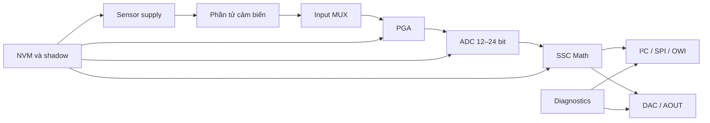
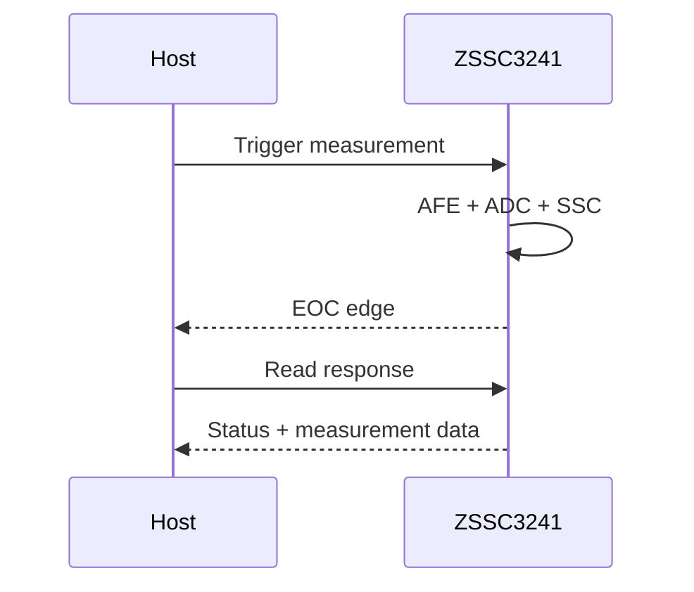

# ZSSC3241 — Technical Summary

> **Loại tài liệu:** Component technical summary  
> **Phạm vi:** Dùng chung cho các hệ thống sử dụng ZSSC3241  
> **Linh kiện:** Renesas ZSSC3241  
> **Trạng thái:** Tài liệu kỹ thuật nền tảng  
> **Nguồn chuẩn:** Renesas ZSSC3241 Datasheet, Rev. Feb. 2, 2024

---

## 1. Mục đích tài liệu

Tài liệu này cung cấp cái nhìn tổng thể về ZSSC3241 để hỗ trợ:

- đánh giá mức độ phù hợp của linh kiện với một loại cảm biến;
- hiểu kiến trúc và luồng xử lý tín hiệu;
- lựa chọn topology cảm biến và phương thức cấp nguồn;
- lựa chọn giao diện số hoặc ngõ ra analog;
- xác định các yêu cầu cơ bản khi thiết kế phần cứng;
- xây dựng register model, command layer và firmware driver;
- xây dựng kế hoạch characterization, calibration và production test.

Tài liệu chỉ mô tả các đặc tính dùng chung của ZSSC3241. Các quyết định như loại cảm biến cụ thể, chân MCU, địa chỉ bus, hệ số hiệu chuẩn và cấu hình NVM production phải được quản lý trong tài liệu của từng dự án.

Các nội dung tra cứu chi tiết được tách riêng:

- `ZSSC3241_Register_Notes.md`: NVM map, shadow registers và bit-field;
- `ZSSC3241_Command_Notes.md`: opcode, request/response và trình tự giao tiếp.

> **Lưu ý:** ZSSC3241 không phải cảm biến áp suất độc lập. Đây là một **Sensor Signal Conditioner — SSC**, cần kết nối với phần tử cảm biến bên ngoài.

---

## 2. Tổng quan linh kiện

ZSSC3241 là IC điều hòa tín hiệu cảm biến có độ chính xác cao. Linh kiện tích hợp:

- mạch cấp nguồn hoặc cấp dòng cho cảm biến;
- bộ chọn đầu vào analog;
- PGA hai tầng;
- ADC có độ phân giải lập trình từ 12 đến 24 bit;
- phép đo sensor, temperature và auto-zero;
- khối tính toán hiệu chỉnh số;
- NVM lưu cấu hình và hệ số calibration;
- DAC và các chế độ ngõ ra analog;
- giao diện I²C, SPI và OWI;
- chân EOC/interrupt;
- chức năng tự chẩn đoán và kiểm tra kết nối.

Các ứng dụng điển hình gồm:

- cảm biến áp suất dạng cầu áp trở;
- load cell và cân điện tử;
- cảm biến lực hoặc mô-men;
- cảm biến mức và lưu lượng;
- cảm biến điện áp vi sai hoặc single-ended;
- thermopile;
- một số cấu hình RTD, PTC, NTC và diode nhiệt.

---

## 3. Thông số chính

| Hạng mục | Giá trị hoặc khả năng |
|---|---|
| Điện áp nguồn `VDD` | 2.7 V đến 5.5 V |
| Nhiệt độ hoạt động | Đến −40 °C…+125 °C, tùy mã linh kiện |
| Đóng gói | 24-QFN, 4 mm × 4 mm, pitch 0.5 mm |
| Dải điện trở sensor điển hình | Khoảng 0.5 kΩ đến 60 kΩ |
| Dải tín hiệu cầu | Khoảng 1 mV/V đến 500 mV/V |
| PGA stage 1 | 1.2 đến 300 V/V |
| PGA stage 2 | 1.1 đến 1.8 V/V |
| Gain PGA tổng | Tối đa khoảng 540 V/V |
| ADC | 12 đến 24 bit, lập trình được |
| Dữ liệu corrected | 24 bit |
| Giao diện số | I²C, SPI, OWI |
| I²C | Standard, Fast và High-Speed Mode; tối đa 3.4 MHz |
| SPI | Timing table cho phép đến 12 MHz trong điều kiện quy định |
| Sensor bias current | 5, 10, 20, 39, 79, 157, 196 hoặc 494 µA |
| Customer-use NVM | 54 word × 16 bit, địa chỉ `0x00–0x35` |
| Độ bền ghi NVM | Khoảng 10.000 chu kỳ |
| Dòng hoạt động điển hình | Khoảng 2.3 mA, chưa tính dòng sensor |
| Dòng idle điển hình | Khoảng 1.5 µA trong điều kiện datasheet |
| Ngõ ra analog | Current loop, ratiometric voltage hoặc absolute voltage |
| Chân báo hoàn tất | EOC/interrupt |

Các giá trị về dòng tiêu thụ, noise, độ chính xác và conversion time phụ thuộc vào:

- ADC resolution;
- PGA gain;
- nguồn tham chiếu;
- auto-zero;
- oversampling;
- measurement scheduler;
- diagnostics;
- analog output mode;
- tải của phần tử cảm biến.

---

## 4. Kiến trúc và luồng tín hiệu



Luồng đo khái niệm:

1. Cấp nguồn hoặc bias current cho sensor.
2. Chọn sensor/temperature/auto-zero signal bằng input MUX.
3. Khuếch đại và dịch offset ở PGA.
4. Chuyển đổi analog–digital.
5. Chạy phép hiệu chỉnh offset, gain, temperature và non-linearity.
6. Tạo kết quả corrected 24 bit.
7. Đưa kết quả ra giao diện số và/hoặc DAC.
8. Cập nhật status, EOC và diagnostic state.

---

## 5. Sensor supply và topology đo

### 5.1 Ratiometric voltage supply

Trong topology ratiometric, sensor được kích bằng điện áp tại VDDB và ADC sử dụng điện áp liên quan làm reference. Với cầu điện trở:

$$
V_{diff}=V_{INP}-V_{INN}
$$

Nếu output sensor tỷ lệ với điện áp kích cầu, phép đo ratiometric giúp giảm ảnh hưởng của biến động nguồn.

Đây thường là lựa chọn đầu tiên cho:

- full bridge áp trở;
- pressure bridge;
- load cell;
- các sensor có output theo mV/V.

### 5.2 Current-mode bias

ZSSC3241 có thể cấp dòng lập trình được cho phần tử cảm biến. Topology này phù hợp với:

- sensor điện trở;
- RTD/PTC/diode temperature sensing;
- các bridge đặc biệt cần current excitation.

Phải kiểm tra đồng thời:

- điện trở sensor nhỏ nhất và lớn nhất;
- điện áp rơi trên sensor;
- common-mode input range;
- differential input range;
- self-heating của sensor;
- công suất tiêu thụ tổng.

Không chọn bias current chỉ theo độ nhạy. Dòng lớn có thể tăng tín hiệu nhưng cũng tăng self-heating và đẩy input ra ngoài common-mode hợp lệ.

### 5.3 Absolute-voltage source

ZSSC3241 có thể xử lý nguồn điện áp absolute, ví dụ thermopile. Với topology này:

- reference thường là bandgap nội;
- một số connection checks dành cho bridge không còn phù hợp;
- không được enable các diagnostic check mà datasheet cảnh báo cho absolute-voltage source.

---

## 6. Analog front-end

### 6.1 PGA

PGA gồm hai tầng:

$$
G_{PGA}=G_1\times G_2
$$

Trong đó:

- `G1`: 1.2, 2, 4, 6, 12, 20, 30, 40, 60, 80, 120, 150, 200, 240 hoặc 300;
- `G2`: 1.1 đến 1.8 theo bước 0.1.

PGA hỗ trợ:

- đảo polarity của signal path;
- input offset shift khoảng −15 mV đến +15 mV;
- ADC extra gain ×2 kết hợp offset compensation;
- automatic common-mode adjustment.

Mục tiêu khi chọn gain:

- tận dụng phần lớn dải ADC;
- không saturation ở mọi điểm áp suất/lực/nhiệt độ;
- chừa headroom cho sensor tolerance và aging;
- giảm input-referred noise;
- không vi phạm common-mode range.

Gain lớn nhất không mặc nhiên là cấu hình tốt nhất. Cấu hình phải được xác nhận bằng raw-data characterization trên phần cứng thật.

### 6.2 ADC

ADC hỗ trợ độ phân giải 12–24 bit. Độ phân giải cao hơn làm tăng conversion time và không bảo đảm accuracy thực tế cao hơn.

Conversion time còn phụ thuộc vào việc full measurement có bao gồm:

- sensor measurement;
- temperature measurement;
- sensor auto-zero;
- temperature auto-zero;
- oversampling;
- connection check.

Khi chọn ADC resolution cần cân bằng:

| Ưu tiên | Xu hướng cấu hình |
|---|---|
| Update rate cao | Giảm resolution và oversampling |
| Noise thấp | Tăng resolution hoặc oversampling sau khi kiểm chứng |
| Tiêu thụ thấp | Giảm số phép đo trong scheduler |
| Bắt transient nhanh | Tránh full sequence quá dài |
| Độ ổn định DC | Cho phép auto-zero và averaging phù hợp |

### 6.3 Auto-zero

Auto-zero được hỗ trợ riêng cho sensor và temperature path. Nó giúp bù offset nội của analog chain nhưng làm tăng thời gian đo.

Auto-zero không thay thế calibration hệ thống vì nó không tự loại bỏ:

- offset cơ khí của sensor;
- span tolerance;
- temperature drift của sensor;
- non-linearity;
- ứng suất do đóng gói.

---

## 7. Temperature measurement

ZSSC3241 hỗ trợ nhiều nguồn nhiệt độ:

- integrated PTAT sensor;
- bridge được tái sử dụng như temperature sensor;
- external resistor tại TEXT;
- PTC hoặc diode;
- topology dùng internal/external `Rt` và `Rt'`.

Temperature channel chủ yếu cung cấp biến đầu vào cho bù nhiệt sensor. Nó không mặc nhiên đại diện cho nhiệt độ môi trường hoặc nhiệt độ môi chất.

Việc chọn nguồn nhiệt độ cần dựa trên:

- vị trí nhiệt của sensor;
- thermal lag;
- coupling giữa die, package và môi trường;
- độ nhạy nhiệt cần bù;
- sai số của external temperature network.

Nếu dùng integrated PTAT, cấu hình measurement nội tương ứng nằm trong vùng factory của Renesas. Nếu dùng external temperature sensor, cấu hình analog front-end nằm tại customer NVM `0x16–0x17`.

---

## 8. Signal conditioning mathematics

Khối SSC math nhận raw sensor signal và temperature signal để tạo kết quả corrected. Mô hình khái niệm gồm:

- sensor offset correction;
- sensor gain/span correction;
- temperature correction của offset;
- temperature correction của gain;
- second-order temperature terms;
- sensor non-linearity correction;
- post-calibration sensor/temperature shift;
- saturation detection.

Các hệ số chính gồm:

- `Offset_S`, `Gain_S`;
- `Tco`, `Tcg`;
- `SOT_tco`, `SOT_tcg`, `SOT_sens`;
- `Offset_T`, `Gain_T`, `SOT_T`;
- `SENS_Shift`, `T_Shift`.

Phần lớn hệ số có độ rộng 24 bit và được chia qua nhiều word NVM. Cách ghép word và sign-extension được mô tả trong `ZSSC3241_Register_Notes.md`.

ZSSC3241 hỗ trợ second-order curve dạng:

- parabolic;
- S-shaped.

Nếu một bước tính nội bị saturation, status và diagnostic register có thể báo `Math Saturation`. Firmware không nên coi sample đó là hoàn toàn hợp lệ chỉ vì vẫn nhận được output 24 bit.

---

## 9. Kết quả đo

### 9.1 Raw data

Raw measurement được dùng cho:

- characterization analog front-end;
- chọn PGA gain và ADC resolution;
- đánh giá noise;
- thu thập dữ liệu calibration;
- xác minh temperature path;
- chạy một số self-test.

Raw result không đi qua toàn bộ SSC correction.

### 9.2 Corrected data

Full measurement tạo:

- sensor corrected data 24 bit;
- temperature corrected data 24 bit;
- status byte.

Driver phải gắn status và diagnostic quality với sample. Không nên tách giá trị số khỏi trạng thái thiết bị.

---

## 10. Chế độ hoạt động

### 10.1 Command Mode

Command Mode phù hợp cho:

- bring-up;
- configuration;
- characterization;
- calibration;
- diagnostics;
- các phép đo được trigger theo yêu cầu.

Đây là mode linh hoạt nhất và cho phép sử dụng đầy đủ nhóm lệnh test/overwrite.

### 10.2 Sleep Mode

Sleep Mode hướng tới digital smart sensor tiêu thụ thấp:

- IC ở trạng thái idle giữa các command;
- phép đo được trigger từ giao diện;
- không cung cấp measurement qua analog output;
- kết quả measurement chỉ đọc được một lần theo hành vi datasheet.

Nếu Sleep là default mode, OWI phải bị disable bằng `owi_off = 1`.

### 10.3 Cyclic Mode

Cyclic Mode tự động lặp measurement sequence:

- sensor measurement;
- temperature measurement;
- auto-zero;
- connection check;
- SSC correction;
- digital/analog output update.

Scheduler cấu hình số pause slots và tần suất từng hoạt động. Update rate thực tế phụ thuộc cả conversion time, scheduler và `CYC_period`.

### 10.4 Chuyển mode

Sau lệnh đổi mode:

- nên đọc status hoặc NVM để xác nhận mode mới;
- không thực hiện liên tiếp các lần đổi mode mà không có giao dịch trung gian;
- datasheet yêu cầu ít nhất hai tương tác command sau một lần đổi mode trước lần đổi mode tiếp theo.

---

## 11. Giao diện số

### 11.1 Chọn giao diện lúc khởi động

Sau POR, ZSSC3241 chốt giao diện theo hoạt động hợp lệ đầu tiên:

1. I²C request đúng slave address → I²C.
2. SS active → SPI.
3. OWI start hợp lệ trong startup window → OWI.

Sau khi chốt, chỉ POR mới cho phép chọn lại giao diện. Pin của các giao diện không sử dụng không được tạo hoạt động giả trong startup window.

### 11.2 I²C

Đặc điểm:

- slave address 7 bit lưu trong NVM;
- hỗ trợ Standard, Fast và High-Speed Mode;
- command và response có độ dài thay đổi;
- response luôn bắt đầu bằng status;
- có thể đọc status riêng để poll `Busy`.

Địa chỉ mặc định `0x00` không nên được dùng làm địa chỉ production thông thường. Các mã `0x04–0x07` có ý nghĩa liên quan đến High-Speed Mode entry và phải được xem xét khi chọn địa chỉ.

### 11.3 SPI

Đặc điểm:

- CPOL/CPHA và SS polarity lập trình qua NVM;
- command request luôn gồm ba byte;
- command ngắn phải pad bằng `0x00`;
- response của command trước được clock ra bằng NOP;
- cần chờ `Busy = 0` hoặc EOC trước khi lấy kết quả;
- khoảng cách tối thiểu giữa hai lần kích hoạt SS phải tuân theo timing table.

SPI timing table cho phép đến 12 MHz trong điều kiện quy định. Bring-up nên bắt đầu ở tốc độ thấp và chỉ tăng sau signal-integrity test.

### 11.4 OWI

OWI dùng chung chân AOUT và phù hợp cho:

- end-of-line calibration;
- sensor module ít dây;
- current-loop application;
- cấu hình sau khi module đã đóng gói.

OWI dùng cùng hệ thống opcode với I²C và SPI nhưng có yêu cầu waveform/timing riêng. Không nên triển khai OWI chỉ từ bitrate danh nghĩa mà bỏ qua timing diagram của datasheet.

Chi tiết frame và opcode xem `ZSSC3241_Command_Notes.md`.

---

## 12. Status byte

| Bit | Ý nghĩa |
|---:|---|
| 7 | Reserved, bằng `0` |
| 6 | Powered/initialization status |
| 5 | Busy |
| 4:3 | Operating mode |
| 2 | Memory error |
| 1 | Connection-check fault |
| 0 | SSC math saturation |

Mã mode:

| `Status[4:3]` | Mode |
|---|---|
| `00` | Command |
| `01` | Cyclic |
| `10` | Sleep |
| `11` | Renesas reserved |

Firmware cần parse status trong mọi response có dữ liệu. Chính sách hợp lệ của sample phải được xác định ở tầng service/application, không nên ẩn lỗi trong low-level transport driver.

---

## 13. EOC và interrupt

Chân EOC có thể được cấu hình làm:

- End-of-Conversion;
- comparator interrupt với một threshold;
- window interrupt với hai threshold;
- interrupt có hysteresis bằng threshold set bổ sung.

Khi dùng EOC làm data-ready:



EOC giúp tránh delay cố định. Firmware vẫn cần timeout vì EOC có thể không đến khi cấu hình, phần cứng hoặc giao tiếp gặp lỗi.

Threshold là giá trị 24 bit và phải được left-align phù hợp với ADC resolution.

---

## 14. Diagnostics

ZSSC3241 hỗ trợ phát hiện:

- mất kết nối INP hoặc INN;
- INP/INN ngoài dải;
- sensor short;
- TEXT open hoặc ngoài dải;
- TEXT short với INP/INN;
- SSC calculation saturation;
- NVM checksum error;
- die crack/chipping check failure.

Thông tin lỗi xuất hiện ở ba mức:

1. Status byte: nhóm lỗi tổng quát.
2. `diagnosticreg`: chi tiết từng loại lỗi.
3. AOUT diagnostic levels: nếu analog diagnostic signaling được enable.

Các connection check được chọn tại NVM `0x21`. Không phải check nào cũng phù hợp với mọi sensor topology.

Nguyên tắc xử lý chung:

| Fault | Hướng xử lý |
|---|---|
| Busy quá timeout | Báo timeout, kiểm tra bus và cân nhắc reset |
| Memory error | Không tin cậy configuration/calibration image |
| Connection fault | Đánh dấu measurement invalid hoặc degraded |
| Math saturation | Không coi output là sample bình thường |
| Temperature path fault | Xem pressure/force correction là không đáng tin cậy |
| Chipping failure | Báo hardware fault |

---

## 15. NVM và shadow registers

### 15.1 Tổ chức NVM

- Word width: 16 bit.
- Customer-use region: `0x00–0x35`.
- Renesas-use region: `0x36–0x3F`.
- Customer region chứa interface, topology, AFE, coefficients, scheduler, diagnostics và output configuration.
- `0x35` lưu checksum do IC tạo.

### 15.2 Shadow registers

Các cấu hình quan trọng được nạp từ NVM sang shadow registers khi reset. Lệnh overwrite cho phép thử:

- PGA gain;
- ADC resolution;
- bias current;
- sensor/temperature topology;
- auto-zero và output configuration;

mà không ghi NVM.

Shadow overwrite mất hiệu lực sau POR hoặc RESQ. Cơ chế này nên được ưu tiên trong characterization và calibration development để bảo toàn endurance NVM.

### 15.3 Checksum

Checksum NVM dùng polynomial:

$$
x^{16}+x^{15}+x^2+1
$$

Sau khi cập nhật NVM:

1. Read-back và so sánh từng word.
2. Gửi lệnh tính/ghi checksum.
3. Reset IC.
4. Kiểm tra `Memory Error = 0`.
5. Đọc lại version/customer ID nếu được sử dụng.

### 15.4 NVM lock

NVM có lock bit tại `SSF1`. Lock có hiệu lực sau reset và không thể đảo bằng write thông thường.

Không set lock trong giai đoạn phát triển. Nếu sản phẩm cần lock, chỉ thực hiện sau khi:

- cấu hình cuối đã được duyệt;
- coefficients đã qua calibration validation;
- read-back thành công;
- checksum hợp lệ;
- production test đạt;
- quy trình truy xuất NVM image đã sẵn sàng.

Chi tiết địa chỉ và bit-field xem `ZSSC3241_Register_Notes.md`.

---

## 16. Ngõ ra analog

ZSSC3241 hỗ trợ:

- current-loop control;
- external-VDD-ratiometric voltage output;
- 0–1 V absolute output;
- 0–5 V absolute output;
- DAC resolution 13–16 bit;
- DAC dithering;
- output clipping;
- DAC gain/offset correction;
- analog diagnostic bands.

Analog output yêu cầu thiết kế riêng về:

- tải và ổn định của AOUT;
- nguồn và headroom;
- external transistor/resistor trong current-loop topology;
- clipping range;
- diagnostic bands;
- DAC calibration;
- OWI sharing tại AOUT.

Không nên sao chép cấu hình analog output giữa các sản phẩm nếu topology nguồn, tải hoặc yêu cầu diagnostic khác nhau.

---

## 17. Power, reset và startup

### 17.1 Nguồn

Phải tuân thủ đầy đủ sơ đồ tụ decoupling và external components trong datasheet. Các miền/chân liên quan như VDD, VDDB, VSS, VSSB, VSSA và exposed pad cần được xử lý đúng theo package/application circuit.

Các nguyên tắc chung:

- đặt decoupling gần chân nguồn;
- giữ sensor analog path ngắn và đối xứng;
- tránh clock/high-current routing gần INP/INN/TEXT;
- bảo vệ đường sensor khỏi leakage do flux, ẩm hoặc contamination;
- kiểm tra ground return của sensor và ADC reference path;
- không để digital-interface pin tạo glitch lúc nguồn lên.

### 17.2 Reset

POR hoặc RESQ:

- nạp lại shadow registers từ NVM;
- xóa temporary overwrite;
- cho phép chọn lại giao diện;
- áp dụng NVM lock đã lập trình;
- đưa IC về default mode được cấu hình.

Reset phải có timeout và giới hạn số lần trong firmware để tránh reset loop khi lỗi phần cứng tồn tại.

---

## 18. Quy trình đánh giá và tích hợp chung

### Phase 1 — Electrical

- Xác nhận nguồn, ground và reset.
- Kiểm tra không có short hoặc quá dòng.
- Xác nhận sensor excitation và common-mode level.
- Kiểm tra trạng thái các chân giao diện tại startup.

### Phase 2 — Communication

- Chọn giao diện bằng giao dịch hợp lệ đầu tiên.
- Đọc status và các word nhận dạng/cấu hình.
- Xác nhận default mode và checksum state.
- Kiểm tra timeout và reset recovery.

### Phase 3 — Raw characterization

- Vào Command Mode.
- Dùng shadow overwrite để thử AFE.
- Thu raw sensor/temperature data trên toàn dải.
- Đánh giá headroom, noise, repeatability và conversion time.

### Phase 4 — Calibration

- Thu ma trận sensor × temperature.
- Tính coefficients bằng quy trình calibration đã kiểm chứng.
- Ghi image với lock tắt.
- Tính checksum, reset và kiểm tra corrected output.

### Phase 5 — Production configuration

- Version hóa NVM image.
- Lưu raw calibration data và coefficient set ngoài DUT.
- Thực hiện read-back và acceptance test.
- Chỉ lock NVM khi có yêu cầu và quy trình phục hồi/truy xuất phù hợp.

---

## 19. Rủi ro kỹ thuật chính

### 19.1 Chọn gain quá cao

Gain quá cao có thể làm saturation ở sensor tolerance hoặc nhiệt độ cực trị dù hoạt động tốt tại điều kiện phòng.

### 19.2 Dùng 24 bit mặc định

24 bit làm tăng conversion time nhưng không bảo đảm effective resolution tương ứng. Phải chọn dựa trên noise measurement.

### 19.3 Ghi NVM trong runtime

NVM có endurance hữu hạn. Runtime firmware thông thường nên coi NVM ZSSC3241 là read-mostly.

### 19.4 Lock NVM quá sớm

Lock là quyết định production gần như không đảo ngược. Không dùng lock như cơ chế thay thế cho kiểm soát quyền ghi trong firmware.

### 19.5 Diễn giải sai temperature result

Temperature dùng cho compensation không mặc nhiên là nhiệt độ môi trường hoặc process temperature.

### 19.6 Bỏ qua status

Output số vẫn có thể xuất hiện khi math saturation hoặc lỗi khác đã xảy ra. Giá trị không đi kèm status là dữ liệu thiếu quality context.

### 19.7 Chọn sai giao diện khi startup

Glitch ở SS, SDA/SCL hoặc AOUT/OWI có thể làm IC chốt giao diện ngoài ý muốn. Việc chọn giao diện phải là một phần của boot design.

---

## 20. Checklist thiết kế dùng chung

### Phần cứng

- [ ] Sensor topology phù hợp khả năng ZSSC3241.
- [ ] Differential và common-mode range hợp lệ.
- [ ] Bias current không gây self-heating quá mức.
- [ ] Decoupling và ground return theo datasheet.
- [ ] INP/INN routing ngắn, đối xứng và tránh nhiễu.
- [ ] RESQ có trạng thái xác định.
- [ ] SS không active ngoài ý muốn nếu dùng I²C.
- [ ] AOUT/OWI network phù hợp mode sử dụng.
- [ ] Exposed pad được kết nối đúng.

### Cấu hình

- [ ] Sensor supply và temperature source đúng schematic.
- [ ] PGA/ADC còn headroom trên toàn dải.
- [ ] Auto-zero và scheduler đạt update rate mục tiêu.
- [ ] Diagnostic checks phù hợp sensor topology.
- [ ] Threshold được căn chỉnh đúng resolution.
- [ ] Giao diện và slave address được quản lý trong production image.
- [ ] Reserved bits giữ đúng giá trị.

### Firmware và production

- [ ] Parse status trong mọi response.
- [ ] Có timeout cho Busy/EOC.
- [ ] Phân biệt NVM write và shadow overwrite.
- [ ] NVM write có read-back verify.
- [ ] Checksum được tạo lại sau thay đổi.
- [ ] Kiểm tra `Memory Error` sau reset.
- [ ] NVM image và calibration record được version hóa.
- [ ] Lock chỉ thực hiện trong bước production được kiểm soát.

---

## 21. Phân chia tài liệu

```text
docs/02_hardware/components/zssc3241/
├── README.md
├── ZSSC3241_Technical_Summary.md
├── ZSSC3241_Register_Notes.md
├── ZSSC3241_Command_Notes.md
├── ZSSC3241_Hardware_Integration.md
├── ZSSC3241_Calibration_Process.md
└── ZSSC3241_Firmware_Driver_Design.md
```

Trong đó:

- ba tài liệu đầu mô tả kiến thức dùng chung của linh kiện;
- Hardware Integration chứa schematic/layout và lựa chọn của một thiết kế;
- Calibration Process chứa thiết bị, ma trận đo và thuật toán hiệu chuẩn;
- Firmware Driver Design chứa API, state machine và platform integration.

Thông tin riêng như MCU, pin mapping, I²C instance, sensor part number, NVM image và calibration coefficients không thuộc Technical Summary.

---

## 22. Thuật ngữ

| Thuật ngữ | Ý nghĩa |
|---|---|
| SSC | Sensor Signal Conditioner/Conditioning |
| AFE | Analog Front-End |
| PGA | Programmable-Gain Amplifier |
| ADC | Analog-to-Digital Converter |
| DAC | Digital-to-Analog Converter |
| NVM | Nonvolatile Memory |
| OWI | One-Wire Interface của ZSSC3241 |
| EOC | End of Conversion |
| POR | Power-on Reset |
| Raw data | Kết quả ADC chưa qua toàn bộ SSC correction |
| Corrected data | Kết quả đã qua SSC math |
| Shadow register | Bản cấu hình runtime được nạp từ NVM hoặc ghi đè tạm thời |

---

## 23. Tài liệu tham khảo

1. [Renesas ZSSC3241 Datasheet, Rev. Feb. 2, 2024](https://www.renesas.com/en/document/dst/zssc3241-datasheet)
2. `ZSSC3241_Register_Notes.md`
3. `ZSSC3241_Command_Notes.md`

---

## 24. Kết luận

ZSSC3241 cung cấp một signal chain hoàn chỉnh cho nhiều loại cảm biến điện trở và điện áp nhỏ: sensor excitation, PGA, ADC, temperature measurement, digital correction, diagnostics, giao diện số và analog output.

Độ chính xác cuối cùng không chỉ phụ thuộc số bit ADC mà phụ thuộc toàn bộ hệ thống:

- sensor topology;
- analog headroom;
- nguồn và layout;
- temperature coupling;
- calibration model;
- NVM configuration;
- firmware quality handling;
- production verification.

Technical Summary này là nền tảng chung. Mọi thiết kế thực tế phải bổ sung tài liệu tích hợp phần cứng, quy trình calibration và firmware driver phù hợp với sensor, MCU và yêu cầu sản phẩm cụ thể.