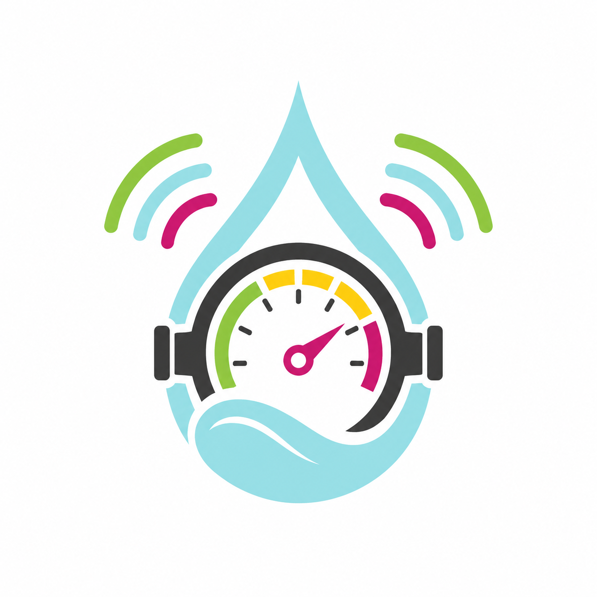

<p align="center">
  
</p>

<h1 align="center">Smart Water Flow and Pressure Monitor</h1>

<p align="center">
  <b>STM32-based water monitoring system</b><br>
  Ultrasonic flow · Temperature · Pressure · Leak detection · BLE · 4G telemetry
</p>

<p align="center">
  
  
  
  
  
</p>

---

## Overview

**Smart Water Flow and Pressure Monitor** is an embedded-system project for:

* ultrasonic flow and temperature measurement,
* cumulative water-volume calculation,
* pressure monitoring,
* leak-condition detection,
* local LCD display,
* BLE configuration and service,
* and scheduled telemetry through a 4G connection.

The project follows a **documentation-first and simulation-first** development approach. The current repository contains the system-design and firmware-architecture baseline; production firmware and hardware validation are still in progress.

---

## System Baseline

| Block                | Selected baseline                      |
| -------------------- | -------------------------------------- |
| Main MCU             | `STM32L433RCT6`                        |
| Flow and temperature | `MAX35103`                             |
| Pressure             | Resistive pressure bridge + `ZSSC3241` |
| Persistent storage   | `FM24CL04B` F-RAM                      |
| Local connectivity   | `nRF52810` BLE coprocessor             |
| Remote connectivity  | `Quectel EC200U-CN` LTE Cat 1 bis      |
| Timekeeping          | STM32 internal RTC                     |
| Firmware model       | Cooperative event-driven runtime       |
| Low-power mode       | STM32 `STOP 2`                         |
| Validation target    | Linux simulation before STM32 bring-up |

BLE is used for local configuration and service. The 4G modem is used for scheduled telemetry and time synchronization.

OTA and generic remote configuration through 4G are outside the current MVP.

---

## Architecture

```text
MAX35103
  -> flow and temperature processing
  -> calibration
  -> volume accumulation

Pressure bridge + ZSSC3241
  -> pressure processing

Flow + volume + pressure + time
  -> leak detection
  -> RuntimeSnapshot
  -> LCD / telemetry / diagnostics

BLE
  -> configuration validation
  -> persistent commit
  -> controlled runtime apply

RTC
  -> reporting scheduler
  -> telemetry queue
  -> EC200U-CN
  -> remote server
```

Important design rules:

* Measurement logic does not depend on BLE, 4G or LCD.
* LCD and telemetry read a stable `RuntimeSnapshot`.
* Invalid or stale data does not update production volume or leak evidence.
* Persistent records use versioning, CRC and A/B slots.
* ZSSC3241 and F-RAM share one managed I2C bus.
* Interrupt handlers only capture minimal data and publish events.
* Communication and recovery flows must be non-blocking or bounded.
* Core firmware logic should remain independent of STM32 HAL.

---

## Repository Structure

```text
smart-water-flow-pressure-monitor/
├── 1.docs/
│   ├── 00_overview/       # System behavior, decisions and traceability
│   ├── 01_principle/      # Measurement principles
│   ├── 02_hardware/       # Hardware design
│   ├── 03_firmware/       # Firmware architecture
│   ├── 04_communication/  # BLE and 4G contracts
│   └── 08_simulation/     # Linux simulation design
├── 3.firmware/            # Firmware implementation
├── 3.hardware/            # Hardware resources
├── 4.software/            # Host tools and scripts
├── 5.references/          # Datasheets and references
├── 6.simulation/          # Emulators and tests
├── assets/
├── LICENSE
└── README.md
```

---

## Current Status

| Area                                  | Status                  |
| ------------------------------------- | ----------------------- |
| System architecture                   | ✅ Defined               |
| System FSM and operating modes        | ✅ Defined               |
| Data ownership and snapshot strategy  | ✅ Defined               |
| Reporting and connectivity policy     | ✅ Defined               |
| Decision registry                     | ✅ 48 decisions accepted |
| Remaining open decisions              | 🟡 5 decisions          |
| Firmware documentation                | 🟡 In progress          |
| BLE and 4G detailed contracts         | 🟡 Pending              |
| Portable firmware implementation      | ⏳ Not started           |
| Linux simulation and tests            | ⏳ Not started           |
| STM32 hardware bring-up               | ⏳ Not started           |
| Product calibration and certification | ⏳ Requires hardware     |

The next milestone is to complete the firmware and communication documentation before implementing the portable firmware core on Linux.

---

## Documentation

Recommended starting points:

1. [`1.docs/00_overview/README.md`](1.docs/00_overview/README.md)
2. [`1.docs/00_overview/00_open_questions_and_decisions.md`](1.docs/00_overview/00_open_questions_and_decisions.md)
3. [`1.docs/00_overview/11_firmware_implication.md`](1.docs/00_overview/11_firmware_implication.md)
4. [`1.docs/00_overview/12_system_traceability.md`](1.docs/00_overview/12_system_traceability.md)
5. [`1.docs/03_firmware/README.md`](1.docs/03_firmware/README.md)

Detailed requirements, decisions, timing behavior and interface contracts belong in `1.docs/`, not in the root README.

---

## Roadmap

```text
Complete firmware documentation
  -> define BLE and 4G contracts
  -> implement portable firmware core
  -> implement Linux peripheral emulators
  -> run unit and integration tests
  -> port HAL adapters to STM32
  -> perform hardware bring-up and qualification
```

---

## License

This project is licensed under the [MIT License](LICENSE).
