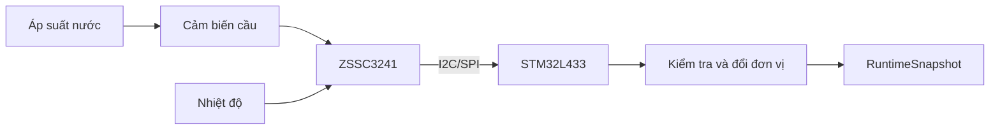
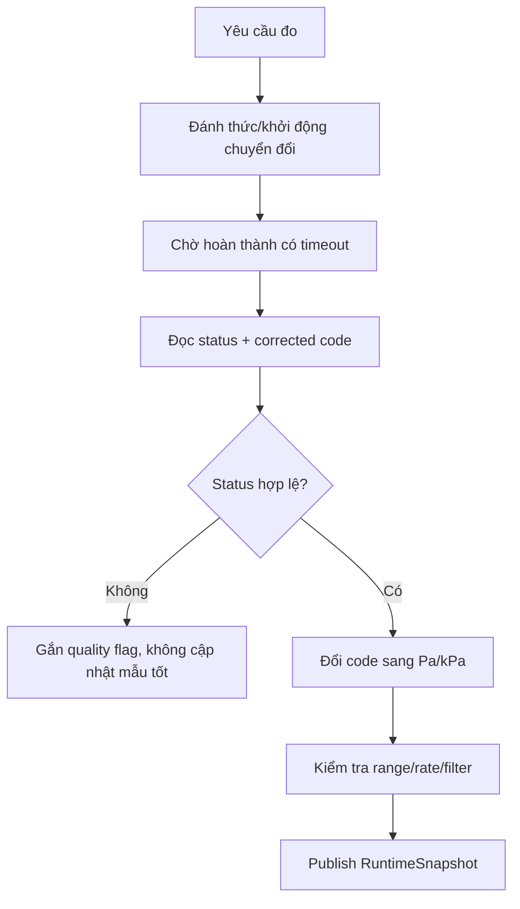

# Hướng dẫn sử dụng ZSSC3241 để đo và hiệu chuẩn áp suất nước

## 1. Mục đích và phạm vi

Tài liệu này mô tả cách xây dựng một kênh đo áp suất nước sử dụng:

- phần tử cảm biến áp suất kiểu cầu điện trở;
- IC điều hòa tín hiệu cảm biến ZSSC3241;
- vi điều khiển, ví dụ STM32L433RCT6;
- giao tiếp số I2C hoặc SPI;
- quy trình hiệu chuẩn tại nhà máy và kiểm tra trong vận hành.

Tài liệu tập trung vào kiến trúc đo, lựa chọn cấu hình, chuyển đổi dữ liệu, hiệu chuẩn, quản lý hệ số và kiểm thử. Giá trị thanh ghi, bit cấu hình và chuỗi lệnh cuối cùng phải được đối chiếu với phiên bản datasheet, phần mềm đánh giá và phần cứng thực tế trước khi phát hành sản phẩm.

> **Điểm quan trọng:** ZSSC3241 không phải phần tử trực tiếp cảm nhận áp suất. IC nhận tín hiệu điện áp rất nhỏ từ cảm biến cầu, khuếch đại, số hóa, bù sai số và cung cấp kết quả qua đầu ra số hoặc tương tự.

## 2. Tài liệu tham chiếu

1. Renesas, *ZSSC3241 Sensor Signal Conditioner IC for Resistive Sensors — Datasheet*, phiên bản ngày 2024-02-02: <https://www.renesas.com/en/document/dst/zssc3241-datasheet>
2. Renesas, *ZSSC3241 product page*: <https://www.renesas.com/en/products/zssc3241>
3. Datasheet của phần tử cảm biến áp suất được chọn.
4. Chứng chỉ và dữ liệu của thiết bị tạo áp suất chuẩn dùng trong hiệu chuẩn.

ZSSC3241 hỗ trợ cảm biến cầu và nửa cầu, ADC có độ phân giải lập trình đến 24 bit, PGA lập trình được, bù số, bộ nhớ NVM và các giao tiếp I2C, SPI, OWI. IC có thể cung cấp đầu ra số, điện áp hoặc hỗ trợ vòng dòng 4–20 mA tùy cấu hình và mạch ngoài.

## 3. Thuật ngữ

| Thuật ngữ | Ý nghĩa |
|---|---|
| DUT | Device Under Test — thiết bị đang được hiệu chuẩn |
| FSO/FS | Full-scale output/full scale — toàn thang |
| PGA | Programmable Gain Amplifier — khuếch đại khả trình |
| ADC | Bộ chuyển đổi tương tự–số |
| NVM | Bộ nhớ không bay hơi trong ZSSC3241 |
| Raw code | Kết quả ADC chưa áp dụng hiệu chỉnh cảm biến |
| Corrected code | Kết quả sau bù offset, span, nhiệt độ và phi tuyến |
| Gauge pressure | Áp suất tương đối so với khí quyển |
| Absolute pressure | Áp suất so với chân không tuyệt đối |
| Differential pressure | Chênh áp giữa hai cổng |
| As-found | Kết quả kiểm tra trước khi điều chỉnh |
| As-left | Kết quả kiểm tra sau khi điều chỉnh |

## 4. Kiến trúc tổng thể



Luồng trách nhiệm được khuyến nghị:

| Khối | Trách nhiệm |
|---|---|
| Cảm biến cầu | Chuyển áp suất thành điện áp vi sai |
| ZSSC3241 | Cấp/kích cảm biến, PGA, ADC, auto-zero, bù nhiệt, tuyến tính hóa, chẩn đoán |
| Driver ZSSC3241 | Điều khiển chế độ đo, đọc trạng thái và kết quả |
| Pressure service | Kiểm tra mẫu, ánh xạ sang Pa/kPa/bar, lọc và tạo quality flags |
| Calibration tooling | Thu thập điểm chuẩn, tính hệ số, lập trình NVM và xác minh |

Không nên để ZSSC3241 và STM32 cùng bù một loại sai số nếu không có lý do và tài liệu rõ ràng. Cấu trúc mặc định nên là:

1. ZSSC3241 thực hiện hiệu chỉnh đặc tính cảm biến.
2. STM32 nhận corrected code.
3. STM32 thực hiện đổi đơn vị, giới hạn vận hành, lọc theo thời gian và phát hiện lỗi hệ thống.

## 5. Lựa chọn cảm biến áp suất

### 5.1 Loại áp suất

- Dùng cảm biến **gauge** nếu mục tiêu là áp suất đường ống so với môi trường.
- Dùng cảm biến **absolute** nếu cần áp suất tuyệt đối.
- Dùng cảm biến **differential** nếu cần đo tổn thất áp suất qua một phần tử.

Nếu dùng cảm biến absolute nhưng cần áp suất gauge:

$$
P_{gauge}=P_{absolute}-P_{atmosphere}
$$

Không nên dùng hằng số khí quyển cố định khi yêu cầu độ chính xác cao.

### 5.2 Tiêu chí chọn cảm biến

| Tiêu chí | Nội dung cần xác định |
|---|---|
| Dải đo | Ví dụ 0–10 bar hoặc 0–16 bar |
| Overpressure/burst pressure | Phải lớn hơn xung áp dự kiến của đường ống |
| Loại cầu | Full bridge hoặc half bridge |
| Độ nhạy | Ví dụ 1–5 mV/V |
| Điện áp kích | Phù hợp với nguồn kích và giới hạn ZSSC3241 |
| Offset ban đầu | Dùng để kiểm tra khả năng dịch offset và PGA |
| TCR/TCS | Trôi offset và độ nhạy theo nhiệt độ |
| Môi chất | Tương thích nước và vật liệu đường ống |
| Áp suất tham chiếu | Gauge, absolute hoặc differential |
| Độ chính xác | Bao gồm phi tuyến, hysteresis và repeatability |

Không chọn gain chỉ theo độ nhạy danh định. Phải xét đồng thời sai lệch giữa các mẫu, offset cực đại, nhiệt độ, over-range và dung sai nguồn kích.

## 6. Quan hệ giữa áp suất và tín hiệu cầu

Với cảm biến có độ nhạy danh định $S_B$, đơn vị V/V tại toàn thang, và nguồn kích \(V_{EXC}\):

$$
V_{FS}=S_BV_{EXC}
$$

Trong mô hình tuyến tính đơn giản:

$$
V_{diff}(P)=V_0+V_{FS}\frac{P-P_{min}}{P_{max}-P_{min}}
$$

Trong thực tế, tín hiệu còn phụ thuộc nhiệt độ và phi tuyến:

$$
V_{diff}=f(P,T)+\epsilon
$$

Trong đó $\epsilon$ bao gồm nhiễu, hysteresis, repeatability, sai số nguồn kích và sai số điện tử.

### Ví dụ ước lượng

Với cảm biến 0–10 bar, độ nhạy 2 mV/V, kích cầu 5 V:

$$
V_{FS}=2\,mV/V\times5\,V=10\,mV
$$

Tại 6 bar, nếu bỏ qua offset và phi tuyến:

$$
V_{diff}\approx10\,mV\times\frac{6}{10}=6\,mV
$$

Đây chỉ là phép ước lượng để chọn front-end. Không dùng trực tiếp làm dữ liệu hiệu chuẩn sản xuất.

## 7. Thiết kế phần cứng

### 7.1 Kết nối chức năng

| Chức năng cảm biến | Nhóm chân ZSSC3241 | Ghi chú |
|---|---|---|
| Signal positive | INP | Tín hiệu cầu dương |
| Signal negative | INN | Tín hiệu cầu âm |
| Bridge excitation | VDDB/VSSB hoặc cấu hình nguồn phù hợp | Theo topology trong datasheet |
| Temperature input | TEXT hoặc nguồn nhiệt độ đã chọn | Tùy chiến lược bù nhiệt |
| Digital interface | Chân giao tiếp I2C/SPI/OWI | Chỉ bật giao tiếp được sử dụng |
| Analog output | AOUT | Có thể không dùng nếu MCU đọc số |
| Supply | VDD/VSS | 2,7–5,5 V theo datasheet |

Tên chân và topology cuối cùng phải kiểm tra theo package QFN24 và sơ đồ ứng dụng tương ứng trong datasheet.

### 7.2 Nguồn và layout

- Đặt tụ decoupling sát các chân nguồn của IC.
- Giữ đường INP/INN ngắn, cân bằng và xa clock, DC/DC, LCD, modem 4G và RS485.
- Không chạy SCK/MOSI song song sát đường cảm biến.
- Duy trì mặt phẳng mass liên tục; tránh dòng hồi công suất đi qua vùng analog.
- Chọn linh kiện bảo vệ sao cho dòng rò không làm sai tín hiệu mV.
- Nếu đầu cảm biến ở xa PCB, đánh giá cáp xoắn, shield, ESD, EMI và lỗi hở/chập dây.
- Không tự ý thêm tụ lớn giữa INP và INN trước khi đánh giá thời gian ổn định và đáp ứng của PGA/ADC.

### 7.3 Chọn I2C hay SPI

| Tiêu chí | I2C | SPI |
|---|---|---|
| Số dây | Ít hơn | Nhiều hơn |
| Tốc độ/độ đơn giản khung | Đủ cho đo áp suất chậm | Thuận lợi khi cần truy cập nhanh |
| Nhiều thiết bị | Thuận lợi nếu địa chỉ không xung đột | Dùng chip-select riêng |
| Khả năng chống nhiễu PCB | Phụ thuộc pull-up và layout | Push-pull, nhưng nhiều cạnh clock |

Với đồng hồ nước, I2C thường đủ nếu ZSSC3241 nằm cùng PCB. SPI có thể được chọn để thống nhất driver hoặc tăng tính xác định thời gian.

## 8. Cấu hình ZSSC3241

### 8.1 Trình tự cấu hình ban đầu

1. Xác định topology cảm biến và kiểu cấp nguồn.
2. Chọn nguồn nhiệt độ dùng cho bù.
3. Ước lượng dải điện áp vi sai nhỏ nhất/lớn nhất trên toàn bộ áp suất và nhiệt độ.
4. Chọn dịch offset đầu vào nếu cần.
5. Chọn PGA sao cho tín hiệu sử dụng phần lớn dải ADC nhưng không bão hòa.
6. Chọn độ phân giải ADC, thời gian chuyển đổi và auto-zero.
7. Chọn chế độ hoạt động: sleep/command/cyclic theo yêu cầu năng lượng.
8. Chọn định dạng corrected output và dải mã đầu ra.
9. Cấu hình diagnostics.
10. Thử bằng shadow registers trước khi ghi NVM.
11. Chỉ ghi NVM sau khi cấu hình và hệ số đã được xác minh.

### 8.2 Chọn gain

Điều kiện thiết kế khái quát:

$$
G\left|V_{diff,max}+V_{offset,worst}\right|<V_{ADC,usable}
$$

Phải để margin cho:

- dung sai độ nhạy của cảm biến;
- offset tại nhiệt độ thấp và cao;
- over-range hợp lệ;
- sai số nguồn và front-end;
- nhiễu tức thời.

Nếu gain quá thấp, độ phân giải hữu ích giảm. Nếu gain quá cao, ADC hoặc khối toán có thể bão hòa.

### 8.3 Chọn độ phân giải và tốc độ

Độ phân giải danh nghĩa không bằng độ phân giải không nhiễu. Tăng thời gian chuyển đổi thường giảm nhiễu nhưng làm giảm tốc độ cập nhật và tăng năng lượng. Cần chọn dựa trên:

- chu kỳ đo áp suất của hệ thống;
- mức nhiễu cho phép;
- thời gian bật nguồn cảm biến;
- yêu cầu phát hiện xung áp;
- ngân sách năng lượng.

## 9. Luồng đo trong firmware



Mỗi mẫu áp suất nên chứa ít nhất:

```c
typedef enum
{
    PRESSURE_QUALITY_VALID          = 0U,
    PRESSURE_QUALITY_NOT_READY      = 1U << 0,
    PRESSURE_QUALITY_COMM_ERROR     = 1U << 1,
    PRESSURE_QUALITY_SENSOR_FAULT   = 1U << 2,
    PRESSURE_QUALITY_MATH_SAT       = 1U << 3,
    PRESSURE_QUALITY_OUT_OF_RANGE   = 1U << 4,
    PRESSURE_QUALITY_STALE          = 1U << 5
} PressureQuality_t;

typedef struct
{
    uint32_t corrected_code;
    int32_t  pressure_pa;
    int32_t  temperature_mdeg_c;
    uint32_t quality_flags;
    uint32_t timestamp_ms;
} PressureSample_t;
```

Không thay mẫu tốt gần nhất bằng số 0 khi giao tiếp lỗi. Nên giữ mẫu trước, đánh dấu `STALE`/`COMM_ERROR` và cung cấp timestamp.

## 10. Chuyển corrected code sang áp suất

Nếu quy ước $C_{min}$ tương ứng $P_{min}$, và $C_{max}$ tương ứng $P_{max}$:

$$
P=P_{min}+\frac{C-C_{min}}{C_{max}-C_{min}}(P_{max}-P_{min})
$$

Nên sử dụng Pa ở tầng dữ liệu nội bộ để tránh nhầm đơn vị:

$$
1\,bar=100000\,Pa,\qquad1\,kPa=1000\,Pa
$$

### Ví dụ về dải mã

Một thiết kế có thể chủ động ánh xạ dải áp suất hợp lệ vào 10–90% dải mã 24 bit:

$$
C_{min}\approx0.1(2^{24}-1)=1677722
$$

$$
C_{max}\approx0.9(2^{24}-1)=15099494
$$

Phần mã còn lại có thể dành cho under-range, over-range hoặc diagnostics. Đây là **quy ước thiết kế ví dụ**, không phải mặc định bắt buộc của ZSSC3241.

### Hàm chuyển đổi số nguyên

```c
#include <stdbool.h>
#include <stdint.h>

typedef struct
{
    uint32_t code_min;
    uint32_t code_max;
    int32_t  pressure_min_pa;
    int32_t  pressure_max_pa;
} PressureTransfer_t;

bool Pressure_CodeToPa(uint32_t code,
                       const PressureTransfer_t *transfer,
                       int32_t *pressure_pa)
{
    if ((transfer == NULL) || (pressure_pa == NULL) ||
        (transfer->code_max <= transfer->code_min))
    {
        return false;
    }

    if ((code < transfer->code_min) || (code > transfer->code_max))
    {
        return false;
    }

    const int64_t code_span =
        (int64_t)transfer->code_max - transfer->code_min;
    const int64_t pressure_span =
        (int64_t)transfer->pressure_max_pa - transfer->pressure_min_pa;
    const int64_t numerator =
        ((int64_t)code - transfer->code_min) * pressure_span;

    *pressure_pa = transfer->pressure_min_pa +
                   (int32_t)((numerator + code_span / 2) / code_span);
    return true;
}
```

Phép tính dùng `int64_t` để hạn chế overflow và tránh phụ thuộc floating-point trên MCU.

## 11. Nguyên tắc hiệu chuẩn

### 11.1 Mục tiêu

Hiệu chuẩn phải nhận diện và bù ít nhất:

- offset tại áp suất thấp;
- span/sensitivity;
- phi tuyến theo áp suất;
- trôi offset theo nhiệt độ;
- trôi span theo nhiệt độ.

Tùy yêu cầu, quy trình còn phải định lượng hysteresis, repeatability và độ ổn định.

### 11.2 Phân biệt calibration và verification

- **Calibration run:** thu dữ liệu và tính/lập trình hệ số mới.
- **Verification run:** đo các điểm độc lập để xác nhận sai số; không dùng các điểm này để fit lại.

Nếu vừa fit vừa đánh giá trên cùng dữ liệu, kết quả có thể lạc quan hơn hiệu năng thật.

### 11.3 Thiết bị cần thiết

- bộ tạo áp suất hoặc pressure controller phù hợp dải đo;
- cảm biến/đồng hồ áp suất chuẩn có độ không đảm bảo tốt hơn DUT;
- buồng nhiệt nếu thực hiện bù đa nhiệt độ;
- nguồn ổn định và thiết bị giao tiếp với ZSSC3241;
- fixture không rò và có cơ chế xả áp an toàn;
- phần mềm thu raw sensor code, temperature code, status và timestamp.

Thiết bị chuẩn phải còn hạn hiệu chuẩn và có truy xuất chuẩn đo lường. Không vượt quá áp suất làm việc, overpressure hoặc burst rating của cảm biến và fixture.

## 12. Ma trận điểm hiệu chuẩn

### 12.1 Hiệu chuẩn tối thiểu ở một nhiệt độ

Có thể dùng 3–5 điểm, ví dụ:

| Điểm | Tỷ lệ toàn thang | Mục đích |
|---|---:|---|
| P0 | 0% | Offset |
| P1 | 25% | Phi tuyến vùng thấp |
| P2 | 50% | Mid-scale |
| P3 | 75% | Phi tuyến vùng cao |
| P4 | 100% | Span |

Hai điểm chỉ đủ hiệu chỉnh tuyến tính offset/span; không đủ đánh giá phi tuyến.

### 12.2 Hiệu chuẩn nhiều nhiệt độ

Ví dụ ma trận ban đầu:

| Nhiệt độ | Áp suất |
|---:|---|
| $T_{low}$ | 0%, 25%, 50%, 75%, 100% FS |
| $T_{room}$ | 0%, 25%, 50%, 75%, 100% FS |
| $T_{high}$ | 0%, 25%, 50%, 75%, 100% FS |

Số điểm thực tế phải dựa trên yêu cầu sai số và đặc tính cảm biến. Với dải nhiệt rộng hoặc cảm biến phi tuyến mạnh, có thể cần thêm mức nhiệt.

### 12.3 Chu kỳ tăng và giảm áp

Để đánh giá hysteresis, thu dữ liệu theo cả hai hướng:

$
0\rightarrow25\rightarrow50\rightarrow75\rightarrow100\%FS
$

và:

$
100\rightarrow75\rightarrow50\rightarrow25\rightarrow0\%FS
$

Không dùng mọi điểm lên/xuống như các điểm độc lập nếu mô hình không hỗ trợ hysteresis; phải báo cáo riêng thành thành phần sai số.

## 13. Quy trình hiệu chuẩn chi tiết

### Bước 1 — Chuẩn bị DUT

1. Kiểm tra đúng mã cảm biến, dải đo và serial.
2. Kiểm tra kết nối cầu, nguồn, giao tiếp và diagnostics.
3. Nạp cấu hình front-end tạm vào shadow registers.
4. Chưa ghi NVM cho đến khi cấu hình được xác nhận.
5. Cho hệ thống ổn định nhiệt theo quy trình sản xuất.

### Bước 2 — Kiểm tra front-end

1. Đặt áp suất thấp nhất và cao nhất.
2. Đọc raw sensor code tại hai điểm.
3. Xác nhận không bão hòa ADC/PGA.
4. Xác nhận tín hiệu tăng đúng chiều áp suất.
5. Xác nhận nhiễu và độ lặp lại nằm trong giới hạn.
6. Điều chỉnh gain, offset shift hoặc conversion time nếu cần.

### Bước 3 — Thu thập dữ liệu

Tại mỗi cặp $(P_i,T_j)$:

1. Đặt nhiệt độ buồng.
2. Chờ nhiệt độ DUT ổn định theo tiêu chí đã định nghĩa.
3. Đặt áp suất chuẩn.
4. Chờ áp suất ổn định.
5. Bỏ một số mẫu đầu nếu vừa chuyển điều kiện.
6. Thu nhiều mẫu raw pressure, raw temperature và status.
7. Tính trung bình, độ lệch chuẩn và lưu toàn bộ metadata.

Một bản ghi tối thiểu:

```text
device_serial, timestamp, pressure_reference_pa,
temperature_reference_mdeg_c, raw_sensor_code,
raw_temperature_code, status, supply_mv, direction, repeat_index
```

### Bước 4 — Tính hệ số

Dùng công cụ hiệu chuẩn tương thích ZSSC3241 để ánh xạ raw sensor/temperature code sang corrected output mong muốn. Mức bù hỗ trợ gồm offset, span, thành phần nhiệt độ bậc một/bậc hai và phi tuyến theo cấu trúc toán học của IC.

Không tự giả định thứ tự hoặc định dạng fixed-point của hệ số. Phải dùng đúng thuật toán, định dạng hệ số và quy tắc lượng tử hóa của ZSSC3241.

### Bước 5 — Kiểm tra hệ số trong shadow registers

1. Nạp hệ số vào shadow registers nếu công cụ hỗ trợ.
2. Đo lại một tập điểm đại diện.
3. Kiểm tra saturation của khối toán.
4. Kiểm tra mã đầu ra tại hai đầu dải.
5. Kiểm tra tính đơn điệu.
6. Nếu không đạt, quay lại cấu hình hoặc mô hình fit.

### Bước 6 — Ghi NVM

1. Bảo đảm nguồn ổn định trong suốt quá trình ghi.
2. Ghi cấu hình và hệ số đã phê duyệt.
3. Đọc lại và so sánh dữ liệu.
4. Khởi động lại IC để xác nhận cấu hình được load từ NVM.
5. Kiểm tra status/memory integrity.
6. Ghi lại version cấu hình và checksum trong hồ sơ sản xuất.

Không lặp ghi NVM không cần thiết. Tần suất ghi và điều kiện lập trình phải theo datasheet.

### Bước 7 — Verification độc lập

Thực hiện lại phép đo tại các điểm kiểm tra, nên bao gồm những điểm không dùng trực tiếp để fit, ví dụ 10%, 40%, 60%, 90% FS.

Tại mỗi điểm:

$$
e_i=P_{measured,i}-P_{reference,i}
$$

Sai số theo phần trăm toàn thang:

$$
e_{FS,i}=100\frac{e_i}{P_{max}-P_{min}}
$$

Sai số theo phần trăm giá trị đọc:

$$
e_{reading,i}=100\frac{e_i}{P_{reference,i}}
$$

Không dùng `%reading` tại hoặc gần 0 vì phép chia không có ý nghĩa ổn định.

## 14. Tiêu chí chấp nhận đề xuất

Các con số phải được thay bằng yêu cầu sản phẩm thực tế.

| Hạng mục | Tiêu chí mẫu |
|---|---|
| Sai số tổng | Không vượt giới hạn tại mọi điểm xác minh |
| Zero output | Nằm trong giới hạn tại 0% FS |
| Full-scale output | Nằm trong giới hạn tại 100% FS |
| Monotonicity | Corrected code không giảm khi áp suất tăng |
| Repeatability | Độ phân tán dưới giới hạn |
| Hysteresis | Chênh giữa chu kỳ lên/xuống dưới giới hạn |
| Diagnostics | Không có sensor/memory/math fault |
| Power-cycle | Hệ số và output không thay đổi ngoài dung sai |
| Out-of-range | Được phát hiện, không xuất bản như mẫu hợp lệ |

## 15. Ngân sách sai số và độ không đảm bảo

Không nên đồng nhất “ADC 24 bit” với độ chính xác 24 bit. Sai số hệ thống có thể đến từ:

- độ không đảm bảo của chuẩn áp suất;
- độ ổn định và phân bố nhiệt độ;
- cảm biến: phi tuyến, hysteresis, repeatability, creep;
- nguồn kích và reference;
- nhiễu analog và EMI;
- PGA, ADC và lượng tử hóa hệ số;
- lắp đặt cơ khí và ứng suất package;
- thuật toán lọc và làm tròn số;
- áp suất khí quyển nếu chuyển absolute sang gauge.

Với các thành phần độc lập $u_i$, độ không đảm bảo chuẩn tổng hợp thường được ước lượng:

$$
u_c=\sqrt{\sum_i u_i^2}
$$

Hệ số phủ và cách báo cáo phải theo quy trình đo lường của dự án.

## 16. Lọc và phát hiện bất thường

Lọc không thay thế hiệu chuẩn. Có thể dùng:

- median 3 mẫu để loại spike;
- moving average hoặc IIR bậc một để giảm nhiễu;
- kiểm tra rate-of-change để phát hiện xung bất thường;
- debounce cho trạng thái lỗi.

Ví dụ IIR:

$$
P_f[k]=P_f[k-1]+\alpha(P[k]-P_f[k-1]),\quad0<\alpha\le1
$$

Phải lựa chọn $\alpha$ dựa trên chu kỳ lấy mẫu và yêu cầu phát hiện xung áp. Luôn giữ cả giá trị raw/corrected chưa lọc cho diagnostics nếu bộ nhớ cho phép.

## 17. Chẩn đoán và xử lý lỗi

Firmware cần kiểm tra status của ZSSC3241 cùng với kết quả đo. Các nhóm lỗi cần xử lý gồm:

- dữ liệu chưa sẵn sàng;
- timeout/giao tiếp;
- hở hoặc chập kết nối cảm biến;
- ADC hoặc math saturation;
- lỗi bộ nhớ/checksum;
- corrected code ngoài dải hợp lý;
- nhiệt độ ngoài vùng hiệu chuẩn;
- mẫu quá cũ.

Chính sách đề xuất:

| Tình huống | Hành động |
|---|---|
| Timeout tạm thời | Retry có giới hạn, giữ mẫu trước và đánh dấu stale |
| Sensor fault | Loại mẫu, ghi diagnostic counter |
| Math saturation | Loại mẫu, kiểm tra gain/hệ số và overpressure |
| Memory fault | Không tin corrected output; vào degraded/error state |
| Out-of-calibration temperature | Gắn cờ degraded và áp dụng policy sản phẩm |
| Nhiều lỗi liên tiếp | Escalate tới health monitor/FSM ERROR |

## 18. Quản lý dữ liệu hiệu chuẩn

### 18.1 Dữ liệu trong ZSSC3241

NVM của ZSSC3241 nên chứa cấu hình front-end và các hệ số SSC cần thiết để tạo corrected output.

### 18.2 Metadata phía hệ thống

STM32 hoặc cơ sở dữ liệu sản xuất nên lưu:

- serial thiết bị và serial cảm biến;
- hardware revision;
- calibration profile version;
- ngày hiệu chuẩn;
- dải áp suất và loại gauge/absolute/differential;
- dải nhiệt độ đã hiệu chuẩn;
- mapping corrected code sang Pa;
- checksum/hash cấu hình;
- kết quả as-found/as-left;
- định danh thiết bị chuẩn.

Không nên lưu một bộ hệ số bù thứ hai trong F-RAM rồi tự động áp dụng lên corrected output, trừ khi tài liệu thiết kế nêu rõ mục đích. F-RAM có thể giữ metadata, mapping đơn vị hoặc field trim nhỏ có kiểm soát.

## 19. Factory calibration và field calibration

### 19.1 Factory calibration

Được phép:

- thu raw code;
- thay đổi front-end configuration;
- tính lại đầy đủ hệ số ZSSC3241;
- ghi NVM;
- xác minh toàn dải áp suất và nhiệt độ.

### 19.2 Field calibration

Nên giới hạn ở:

- zero/tare khi chắc chắn điều kiện tham chiếu hợp lệ;
- offset nhỏ ở tầng hệ thống;
- kiểm tra drift tại một hoặc một vài điểm;
- ghi audit log và khả năng rollback.

Không nên cho field calibration tự động ghi lại toàn bộ NVM khi không có nguồn áp suất chuẩn và điều kiện nhiệt độ kiểm soát.

## 20. Đo chiều cao cột nước

Nếu cần suy ra chiều cao cột nước từ áp suất gauge:

$$
h=\frac{P}{\rho(T)g}
$$

Trong đó:

- $h$: chiều cao cột nước, m;
- $P$: áp suất gauge, Pa;
- $\rho(T)$: khối lượng riêng của nước theo nhiệt độ;
- $g$: gia tốc trọng trường, xấp xỉ \(9.80665\,m/s^2\).

Ở khoảng 20 °C, có thể dùng gần đúng \(\rho\approx998\,kg/m^3\). Với \(P=100\,kPa\):

$$
h\approx\frac{100000}{998\times9.80665}\approx10.22\,m
$$

## 21. Kế hoạch triển khai firmware đề xuất

1. Xây dựng HAL I2C/SPI và kiểm tra giao tiếp.
2. Viết `zssc3241_driver` cho mode, status, raw/corrected result và timeout.
3. Thêm mock driver và unit test parsing.
4. Chạy ZSSC3241 với cấu hình tạm, đọc raw code ở 0%/100% FS.
5. Hoàn thành quy trình factory calibration bằng công cụ PC.
6. Lập trình và xác minh NVM.
7. Viết `pressure_measurement_service` để đổi code sang Pa và phát cờ chất lượng.
8. Tích hợp vào `RuntimeSnapshot`, Modbus, logging và health monitor.
9. Thử nghiệm nhiệt độ, EMC, nguồn và power-cycle.
10. Khóa version của calibration profile trước sản xuất.

API driver gợi ý:

```c
typedef struct
{
    uint32_t sensor_code;
    uint32_t temperature_code;
    uint16_t device_status;
} Zssc3241Result_t;

bool Zssc3241_Init(void);
bool Zssc3241_StartMeasurement(void);
bool Zssc3241_IsDataReady(bool *ready);
bool Zssc3241_ReadCorrectedResult(Zssc3241Result_t *result);
bool Zssc3241_ReadRawResult(Zssc3241Result_t *result);
bool Zssc3241_ReadDiagnostics(uint16_t *status);
```

Tên và kiểu dữ liệu cuối cùng phải dựa trên định dạng frame thực tế của giao tiếp được chọn.

## 22. Kế hoạch kiểm thử

### Unit test

- ghép byte và giải mã kết quả;
- sign extension nếu trường dữ liệu có dấu;
- chuyển corrected code sang Pa tại min/mid/max;
- overflow và rounding;
- code ngoài dải;
- ánh xạ status sang quality flags;
- timeout và retry.

### Hardware-in-the-loop

- giao tiếp sau power-on/reset;
- đo ở 0%, 50%, 100% FS;
- power-cycle sau ghi NVM;
- hở/chập dây cảm biến theo phương pháp an toàn;
- nhiễu từ LCD, RS485 và modem 4G;
- nhiệt độ thấp/phòng/cao;
- kiểm tra tốc độ cập nhật và năng lượng.

### Production test

- xác nhận serial và profile version;
- kiểm tra zero/full-scale;
- kiểm tra điểm độc lập;
- đọc diagnostics;
- lưu báo cáo as-left và pass/fail.

## 23. Checklist trước khi chốt thiết kế

- [ ] Đã chọn cảm biến cầu cụ thể và có datasheet.
- [ ] Đã xác định gauge/absolute/differential.
- [ ] Dải đo, overpressure và burst pressure phù hợp.
- [ ] Gain và offset không bão hòa trên toàn dải nhiệt.
- [ ] Nguồn kích và topology được đối chiếu datasheet.
- [ ] Đã chọn nguồn nhiệt độ dùng cho compensation.
- [ ] Đã chọn I2C hoặc SPI và kiểm tra pin mapping.
- [ ] PCB tách vùng analog khỏi 4G/RS485/DC-DC.
- [ ] Đã định nghĩa output code mapping và đơn vị chuẩn Pa.
- [ ] Đã định nghĩa calibration matrix.
- [ ] Có thiết bị chuẩn và tiêu chí ổn định.
- [ ] Có verification points độc lập.
- [ ] Có kiểm tra diagnostics và power-cycle.
- [ ] Có profile version, checksum và traceability.
- [ ] Factory calibration và field calibration được phân quyền rõ.
- [ ] Không áp dụng bù trùng lặp ở ZSSC3241 và STM32.

## 24. Các thông số còn TBD cho dự án

| Thông số | Trạng thái |
|---|---|
| Mã cảm biến áp suất cầu | TBD |
| Loại áp suất | TBD |
| Dải áp suất danh định | TBD |
| Overpressure/burst rating | TBD |
| Độ nhạy và điện áp kích | TBD |
| Dải nhiệt độ hiệu chuẩn | TBD |
| Chu kỳ đo áp suất | TBD |
| I2C hay SPI | TBD |
| Output code mapping | TBD |
| Sai số cho phép | TBD |
| Số điểm áp suất/nhiệt độ | TBD |
| Quy tắc field zero trim | TBD |

## 25. Kết luận

ZSSC3241 phù hợp để tạo một module áp suất đã được hiệu chỉnh từ cảm biến cầu điện trở. Độ chính xác cuối cùng không chỉ phụ thuộc độ phân giải ADC, mà phụ thuộc cảm biến, thiết kế analog, cấu hình PGA/ADC, ma trận hiệu chuẩn, độ tin cậy của chuẩn và việc xác minh độc lập.

Kiến trúc khuyến nghị cho đồng hồ nước là để ZSSC3241 tạo corrected code đã bù đặc tính cảm biến; STM32L433 kiểm tra trạng thái, chuyển mã sang Pa, lọc theo thời gian và xuất bản dữ liệu kèm quality flags. Cấu hình và hệ số ZSSC3241 được tạo trong factory calibration; field calibration chỉ thực hiện trim nhỏ, có kiểm soát và có khả năng truy vết.