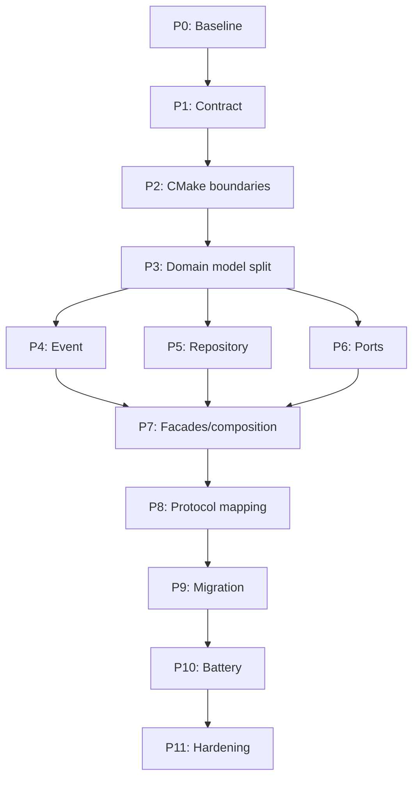

# Kế hoạch thực thi refactor firmware theo phase

**Dự án:** Smart Water Flow & Pressure Monitor  
**Mốc mã nguồn khảo sát:** `780c12b5c3be7362f7d2fbed2741fb290ab46c9d`  
**Tài liệu nền:** `system_architecture_refactoring_plan.md`  
**Acceptance feature:** bổ sung phép đo điện áp pin  
**Cách triển khai:** incremental migration, luôn giữ nhánh chính build và test được

---

## 1. Mục đích

Tài liệu này chuyển kiến trúc mục tiêu thành một backlog triển khai có thể thực hiện và review theo từng phase. Mỗi phase xác định:

- mục tiêu và phạm vi;
- điều kiện bắt đầu;
- task có mã định danh;
- module/file dự kiến bị tác động;
- test và bằng chứng bắt buộc;
- tiêu chí kết thúc;
- cách rollback;
- ước lượng công sức.

Kết quả cuối cùng không chỉ là mã nguồn được sắp xếp lại. Hệ thống phải chứng minh rằng một domain mới như `power/battery` có thể được thêm mà không làm thay đổi các domain flow, pressure, volume và leak.

---

## 2. Phạm vi và nguyên tắc không được phá vỡ

### 2.1. Trong phạm vi

- tách `data_model.h` theo domain ownership;
- chia nhỏ CMake target và public include path;
- thay central event router bằng handler registration;
- thiết kế lại repository theo transaction/builder và typed view;
- tạo subsystem facade và composition root tường minh;
- chuẩn hóa port/adapter cho Linux và STM32;
- tách telemetry/storage mapper khỏi runtime layout;
- sắp xếp lại test theo unit, contract, integration và system;
- dùng tính năng điện áp pin để kiểm chứng khả năng mở rộng;
- xóa compatibility layer sau migration.

### 2.2. Ngoài phạm vi

- thay đổi thuật toán flow, pressure, temperature, leak hoặc volume;
- thay cooperative event loop bằng RTOS;
- thay đổi protocol theo hướng breaking mà không có versioning;
- chọn chi tiết cuối cùng của mạch chia áp/chân ADC;
- tối ưu hiệu năng khi chưa có số đo;
- bổ sung dynamic allocation hoặc plugin runtime.

### 2.3. Quy tắc triển khai

1. Mỗi PR phải build được độc lập.
2. Không trộn di chuyển file, thay API và thay behavior trong cùng một PR.
3. Mọi API cũ được giữ bằng compatibility wrapper trong thời gian có giới hạn.
4. Mỗi wrapper phải có task xóa cụ thể; không tạo lớp chuyển tiếp vĩnh viễn.
5. Không merge nếu test baseline hoặc architecture check thất bại.
6. Không thêm pattern ngoài pattern budget nếu chưa nêu vấn đề cụ thể và test chứng minh giá trị.
7. Không dùng global mutable singleton hoặc default accessor mới.
8. Không thêm `#ifdef` platform vào domain/service logic.
9. Mọi queue, subscriber table và object graph vẫn dùng kích thước cố định.
10. Mỗi phase chỉ được đóng sau khi có bằng chứng cho exit gate.

---

## 3. Tổng quan các phase

| Phase | Nội dung | Kết quả chính | Ước lượng |
|---:|---|---|---:|
| 0 | Baseline và safety net | Hành vi hiện tại được khóa bằng test/golden trace | 2–4 ngày |
| 1 | Architecture contract | ADR, dependency rules và CI guard | 3–5 ngày |
| 2 | CMake/module skeleton | Target nhỏ và include boundary | 3–5 ngày |
| 3 | Tách data model | Type có owner, xóa God Header khỏi dependency mới | 5–8 ngày |
| 4 | Event mediator | Handler registration, domain-owned events | 4–7 ngày |
| 5 | Repository transaction | Hai buffer rõ ràng, typed update/read | 5–8 ngày |
| 6 | Ports và adapters | Contract độc lập Linux/STM32 | 4–7 ngày |
| 7 | Facades và composition | Dependency injection tường minh, bỏ default globals | 5–8 ngày |
| 8 | Protocol/storage boundary | Mapper và builder không phụ thuộc layout | 4–7 ngày |
| 9 | Migration và cleanup trung gian | Mọi service/test dùng API mới | 3–6 ngày |
| 10 | Battery acceptance | Điện áp pin end-to-end qua kiến trúc mới | 4–7 ngày |
| 11 | Hardening và đóng refactor | Xóa legacy, đo regression, đồng bộ tài liệu | 3–5 ngày |

**Tổng ước lượng thô:** 45–77 engineer-days. Đây là ước lượng effort, không phải lịch cam kết. Thời gian thực tế phụ thuộc số người, mức phủ test hiện tại và mức hoàn thiện của STM32 backend.

### 3.1. Dependency giữa các phase



P4, P5 và P6 có thể được phát triển trên các nhánh độc lập sau P3, nhưng nên merge tuần tự để giảm conflict ở CMake và public headers.

---

## 4. Definition of Done chung

Một phase chỉ hoàn thành khi:

- [ ] Debug build với sanitizer thành công;
- [ ] Release build thành công;
- [ ] toàn bộ `ctest --output-on-failure` xanh;
- [ ] test mới cho contract được thêm và review;
- [ ] không có warning mới;
- [ ] architecture check xanh;
- [ ] không tăng global mutable state;
- [ ] ownership/lifetime của API mới được ghi trong header;
- [ ] compatibility API mới có task và thời điểm xóa;
- [ ] tài liệu canonical tương ứng được cập nhật;
- [ ] PR mô tả phạm vi behavior change hoặc xác nhận “no behavior change”.

Lệnh xác minh chuẩn:

```bash
cmake -S 2.firmware -B 2.firmware/build-debug \
  -DCMAKE_BUILD_TYPE=Debug \
  -DENABLE_SANITIZERS=ON
cmake --build 2.firmware/build-debug --parallel
ctest --test-dir 2.firmware/build-debug --output-on-failure

cmake -S 2.firmware -B 2.firmware/build-release \
  -DCMAKE_BUILD_TYPE=Release \
  -DENABLE_SANITIZERS=OFF
cmake --build 2.firmware/build-release --parallel
ctest --test-dir 2.firmware/build-release --output-on-failure
```

---

## 5. Phase 0 — Baseline và safety net

### 5.1. Mục tiêu

Tạo bằng chứng về hành vi hiện tại để các phase sau có thể refactor mà không vô tình thay đổi logic.

### 5.2. Entry criteria

- repository ở trạng thái build được;
- không có feature đang thay đổi cùng các file lõi;
- commit baseline được ghi lại.

### 5.3. Tasks

| ID | Công việc | Deliverable |
|---|---|---|
| P0.1 | Chạy Debug/Release build và toàn bộ CTest | Baseline report: pass/fail, thời gian, toolchain |
| P0.2 | Lập inventory tất cả test hiện có theo cấp độ | `test_inventory.md` hoặc mục trong test strategy |
| P0.3 | Tạo golden trace cho simulator/scenario quan trọng | Expected event/state/output fixtures |
| P0.4 | Bổ sung repository contract test còn thiếu | Atomic publish, abort, generation, reader visibility |
| P0.5 | Bổ sung event contract test còn thiếu | Ordering, priority, overflow, unknown event |
| P0.6 | Ghi số đo cấu trúc | `sizeof(RuntimeSnapshot)`, queue, repository và event envelope |
| P0.7 | Ghi binary size cho Debug/Release; STM32 nếu build khả dụng | Size baseline |
| P0.8 | Chốt danh sách hành vi không được thay đổi | Refactor invariants |

### 5.4. Refactor invariants tối thiểu

- cùng input scenario phải cho cùng state transition và result;
- event priority/overflow policy không đổi;
- system FSM và guard semantics không đổi;
- flow/pressure/temperature/leak/volume numerical output không đổi;
- persistent A/B slot và boot restore không đổi;
- telemetry hiện tại không đổi trước Phase 8;
- không thêm sleep thực vào simulation.

### 5.5. Tests bắt buộc

- `test_determinism`;
- `test_sim_contract`;
- `test_scenarios_core`, `test_scenarios_max`, `test_scenarios_zssc`;
- `test_data_repository`;
- `test_event_queue`, `test_app_event_router`;
- nhóm flow, pressure, volume, leak, storage và reporting hiện có.

### 5.6. Exit gate

- có một baseline commit/tag có thể quay lại;
- toàn bộ test hiện có xanh hoặc failure đã được ghi nhận/triage trước refactor;
- golden trace và contract tests được version control;
- có bảng số đo baseline.

### 5.7. Rollback

Phase này chỉ thêm test và báo cáo. Nếu golden test phát hiện output không xác định, chưa bắt đầu Phase 1; xử lý tính không xác định trước.

---

## 6. Phase 1 — Architecture contract và guard rails

### 6.1. Mục tiêu

Định nghĩa ranh giới mà code, build system và CI đều có thể kiểm tra.

### 6.2. Entry criteria

- Phase 0 hoàn thành;
- baseline behavior đã khóa.

### 6.3. Tasks

| ID | Công việc | Deliverable |
|---|---|---|
| P1.1 | Viết ADR về module boundaries | Owner, dependency direction, exception process |
| P1.2 | Viết ADR về pattern budget | Core/local/conditional/avoid patterns |
| P1.3 | Chốt source tree đích | Mapping old path → new path |
| P1.4 | Chốt public/private header convention | `include` visibility rules |
| P1.5 | Chốt ownership/lifetime convention | Pointer, buffer, event payload, snapshot handle |
| P1.6 | Tạo architecture check | Forbidden include/global accessor checks |
| P1.7 | Thêm architecture check vào CTest/CI | Failure trở thành build gate |
| P1.8 | Định nghĩa compatibility policy | Tên, deprecation marker, removal phase |

### 6.4. Dependency rules cần cưỡng chế

| From | Được phụ thuộc | Không được phụ thuộc |
|---|---|---|
| `domain` | C standard library, `domain/common` | app, infrastructure, driver, platform, protocol |
| `services/<feature>` | domain, narrow ports | concrete platform, protocol encoding |
| `infrastructure` | domain contracts cần lưu/chuyển | concrete driver/platform |
| `protocols` | public read models, protocol ports | service internals |
| `drivers/platform` | port contracts, low-level HAL | repository/runtime aggregate |
| `app` | mọi public contract cần để compose | private headers của subsystem |

### 6.5. Architecture checks đầu tiên

- cấm include `infrastructure/event/data_model.h` từ driver mới;
- cấm include từ `domain/**` sang `infrastructure/**`, `platform/**`, `drivers/**`;
- cấm hàm mới có tên `*_get_default`, `global_*` trong production source;
- cấm CMake target domain link infrastructure/platform;
- cảnh báo khi production source mới include legacy header.

Check nên dùng script đơn giản hoặc CMake test dễ hiểu; chưa cần công cụ dependency phức tạp.

### 6.6. Exit gate

- ADR được review;
- CI bắt được một dependency violation mẫu;
- mọi exception có owner và lý do;
- không thay behavior runtime.

### 6.7. Rollback

Nếu rule quá chặt khiến code hiện tại không thể build, ban đầu áp dụng theo hai mức:

1. code mới: error;
2. dependency legacy đã liệt kê: warning/allowlist có thời hạn.

Không tắt toàn bộ rule chỉ vì một dependency cũ.

---

## 7. Phase 2 — CMake boundaries và module skeleton

### 7.1. Mục tiêu

Biến sơ đồ kiến trúc thành target graph có thể kiểm tra, chưa thay logic.

### 7.2. Vấn đề hiện tại cần xử lý

Top-level CMake cung cấp `FIRMWARE_INCLUDE_DIRS` rộng cho gần như toàn bộ source tree. Điều này khiến target có thể include header của module khác dù chưa khai báo dependency. `services` cũng là một static library lớn, làm mờ coupling giữa các feature.

### 7.3. Tasks

| ID | Công việc | Deliverable |
|---|---|---|
| P2.1 | Tạo skeleton `domain`, `ports`, `protocols` | Thư mục + CMakeLists tối thiểu |
| P2.2 | Tạo target domain theo bounded context | `fw_domain_common`, measurement, product, power, system |
| P2.3 | Tạo target service theo feature | measurement, processing, leak, storage, connectivity, power |
| P2.4 | Tạo target infrastructure nhỏ | event, repository, time, bus/queue |
| P2.5 | Tạo target protocol | telemetry và storage mapper |
| P2.6 | Chuyển sang `target_include_directories` | Public/private includes theo target |
| P2.7 | Thu hẹp `FIRMWARE_INCLUDE_DIRS` | Chỉ compatibility target còn dùng tạm |
| P2.8 | Tạo alias/compatibility target | Executable/test cũ vẫn link được |
| P2.9 | Ghi CMake target graph | Tài liệu + architecture test |

### 7.4. Target baseline đề xuất

```text
fw_domain_common
fw_domain_measurement
fw_domain_product
fw_domain_power
fw_domain_system
fw_domain_connectivity
fw_service_measurement
fw_service_processing
fw_service_leak
fw_service_storage
fw_service_power
fw_service_connectivity
fw_infra_event
fw_infra_repository
fw_infra_time
fw_protocol_telemetry
fw_protocol_storage
fw_platform_linux
fw_app
```

Không nhất thiết tạo tất cả target trong một PR. Tạo target khi có ít nhất một module được migrate vào đó.

### 7.5. PR breakdown

- **PR P2-A:** skeleton + compatibility target;
- **PR P2-B:** common/infrastructure targets;
- **PR P2-C:** service targets;
- **PR P2-D:** thu hẹp include path và thêm link checks.

### 7.6. Exit gate

- không cần global include path để code mới build;
- mỗi target khai báo dependency riêng;
- tests cũ vẫn chạy qua compatibility target;
- không đổi runtime behavior hoặc binary interface ngoài nội bộ firmware.

### 7.7. Rollback

Giữ compatibility target trong toàn Phase 2–3. Nếu target mới gây vòng phụ thuộc, không thêm link workaround hai chiều; ghi lại vòng phụ thuộc và di chuyển type/interface về owner phù hợp.

---

## 8. Phase 3 — Tách domain model và loại God Header

### 8.1. Mục tiêu

Mỗi type có một owner rõ ràng; driver, event và protocol không còn phụ thuộc vào một header chứa toàn bộ hệ thống.

### 8.2. Target type ownership

| Module | Type dự kiến |
|---|---|
| `domain/common` | metadata, timestamp contract, quality/status |
| `domain/measurement` | flow, pressure, temperature, cycle result |
| `domain/product` | volume, leak, product state |
| `domain/power` | power state, battery result/snapshot skeleton |
| `domain/system` | mode, system state |
| `domain/connectivity` | reporting/delivery state |
| `infrastructure/repositories` | runtime aggregate/read view contract |
| driver-specific | MAX35103/ZSSC3241 raw payload |

### 8.3. Migration order

| ID | Công việc | Điều kiện xác minh |
|---|---|---|
| P3.1 | Tách common metadata/quality | Unit tests compile chỉ với common target |
| P3.2 | Tách raw payload về driver contract | Driver không include runtime snapshot |
| P3.3 | Tách measurement results | Flow/pressure/temperature tests không đổi |
| P3.4 | Tách product types | Volume/leak tests không đổi |
| P3.5 | Tách system types | FSM tests không đổi |
| P3.6 | Tách connectivity/reporting types | Reporting/delivery tests không đổi |
| P3.7 | Tạo power type skeleton | Không có behavior battery ở phase này |
| P3.8 | Tạo `RuntimeSnapshot` aggregate mới | Chỉ chứa sub-snapshot, không chứa raw payload/event IDs |
| P3.9 | Tạo legacy re-export header | Consumer cũ build trong thời gian migrate |
| P3.10 | Migrate include theo cụm | Mỗi PR xóa một nhóm legacy include |

### 8.4. Compatibility rule

Legacy header chỉ được phép:

- include các header owner mới;
- cung cấp typedef alias có deprecation comment;
- không định nghĩa type/event mới;
- không được include từ file mới;
- bị xóa ở Phase 11.

### 8.5. Tests bắt buộc

- toàn bộ numerical/unit tests;
- `test_system_fsm`;
- scenario metadata tests;
- compile-only tests cho từng public header;
- architecture test chứng minh driver/domain include direction.

### 8.6. Exit gate

- mỗi type có đúng một definition owner;
- raw sensor payload không nằm trong `RuntimeSnapshot`;
- event IDs không nằm trong aggregate data header;
- production code mới không include legacy header;
- `data_model.h` chỉ còn compatibility re-export hoặc đã được đổi tên rõ là legacy.

### 8.7. Rollback

Di chuyển theo từng nhóm type. Nếu một nhóm gây regression, revert riêng PR của nhóm đó; không hoàn tác các nhóm đã xác minh độc lập.

---

## 9. Phase 4 — Event infrastructure theo Mediator + Observer

### 9.1. Mục tiêu

Thêm một event/domain mới mà không sửa central router hoặc infrastructure switch.

### 9.2. API đích

Event infrastructure chỉ sở hữu:

- envelope chung;
- queue/delivery semantics;
- handler registration;
- dispatch result;
- payload lifetime rules.

Domain sở hữu:

- event type của domain;
- payload type;
- handler/facade xử lý;
- business action sau event.

### 9.3. Tasks

| ID | Công việc | Deliverable |
|---|---|---|
| P4.1 | Tách `AppEvent` envelope | Header không include toàn bộ domain payload |
| P4.2 | Chốt `EventDomain` và type namespace | Không phụ thuộc range dispatch |
| P4.3 | Thiết kế static handler table | Capacity và duplicate policy rõ ràng |
| P4.4 | Implement register/unregister hoặc init table | Không heap, lỗi có kiểu |
| P4.5 | Implement dispatch qua handler table | Dispatcher không chứa business switch |
| P4.6 | Tạo compatibility adapter cho event IDs cũ | Router cũ có thể migrate từng owner |
| P4.7 | Migrate system owner | FSM behavior không đổi |
| P4.8 | Migrate measurement owner | Scenario result không đổi |
| P4.9 | Migrate storage/reporting/connectivity | Pipeline tests không đổi |
| P4.10 | Tạo power event registration test | Không sửa dispatcher implementation |

### 9.4. Contract cần chốt

- registration capacity;
- duplicate handler policy;
- có hay không nhiều subscriber cho một event;
- dispatch ordering;
- unknown event behavior;
- handler failure propagation;
- queue overflow behavior;
- payload nằm inline hay mailbox;
- thời gian sống payload;
- ISR có được post event hay không.

### 9.5. Tests bắt buộc

- register đủ capacity và vượt capacity;
- duplicate registration;
- một và nhiều subscriber nếu hỗ trợ fan-out;
- unknown domain/type;
- handler error;
- ordering không đổi;
- event payload không bị giữ sau dispatch;
- deterministic replay.

### 9.6. Exit gate

- không còn dispatch theo byte cao/range ở path mới;
- dispatcher implementation không include domain event headers;
- thêm power event chỉ cần power module và composition registration;
- queue semantics và golden trace giữ nguyên.

### 9.7. Rollback

Compatibility adapter cho phép chuyển từng owner về router cũ nếu cần. Không chạy hai handler cho cùng event trong cùng composition.

---

## 10. Phase 5 — Repository transaction và typed views

### 10.1. Mục tiêu

Loại API `accept_<field>()` ở global repository, loại offset-based write và định nghĩa chính xác two-buffer ownership.

### 10.2. Design decision phải chốt trước code

Baseline đề xuất:

- cooperative event loop có một writer;
- repository có đúng hai `RuntimeSnapshot` slot;
- `begin` copy active sang inactive;
- transaction update inactive slot bằng typed API;
- `commit` atomic swap active index;
- reader nhận caller-owned copy hoặc typed view copy trong critical section ngắn;
- reader không giữ pointer tới internal buffer qua dispatch cycle.

Nếu hệ thống yêu cầu preemptive reader giữ pointer lâu, phải dừng phase và thiết kế refcount/epoch rõ ràng; không áp dụng giả định single-thread một cách im lặng.

### 10.3. Tasks

| ID | Công việc | Deliverable |
|---|---|---|
| P5.1 | Viết repository contract tests trước | Characterization test cho semantics cũ |
| P5.2 | Tạo `RepoWriteTxn` | State: inactive/committed/aborted/error |
| P5.3 | Implement `begin` | Active → inactive copy, generation base |
| P5.4 | Implement typed update | measurement/product/power/system/connectivity |
| P5.5 | Implement validate + commit | Một atomic publish point |
| P5.6 | Implement abort | Active snapshot không đổi |
| P5.7 | Implement typed read/copy | Lifetime không phụ thuộc internal pointer |
| P5.8 | Hợp nhất admission policy | Production/simulation xử lý đồng nhất |
| P5.9 | Tạo compatibility `accept_*` wrappers | Migrate caller từng bước |
| P5.10 | Migrate measurement/product/system callers | Không đổi result |
| P5.11 | Bổ sung `PowerSnapshot` update path | Chưa cần ADC thật |
| P5.12 | Đo snapshot size và copy time | So sánh baseline |

### 10.4. Test matrix

| Case | Kỳ vọng |
|---|---|
| Begin rồi abort | Active data và generation không đổi |
| Nhiều update rồi commit | Reader thấy toàn bộ hoặc snapshot cũ, không partial |
| Commit hai lần | Lỗi có kiểu, không swap lần hai |
| Update sau commit | Bị từ chối |
| Validation fail | Không publish |
| Generation wrap | Behavior được định nghĩa |
| Reader trong lúc writer chuẩn bị | Chỉ thấy active snapshot |
| Simulation data trong production | Theo policy chung |
| Snapshot size/copy | Không vượt budget đã duyệt |

### 10.5. Exit gate

- repository có đúng hai internal snapshot slots;
- không có public offset/field-size write;
- API mới không cần thêm hàm global khi thêm một field trong `PowerSnapshot`;
- reader lifetime được test và mô tả;
- compatibility wrappers có usage count bằng `rg` và removal task.

### 10.6. Rollback

Trong migration, wrapper có thể chuyển hướng về implementation cũ hoặc mới bằng compile-time option chỉ trên nhánh refactor. Option này phải bị xóa trước Phase 11 và không được đưa vào product configuration.

---

## 11. Phase 6 — Ports và platform/driver adapters

### 11.1. Mục tiêu

Domain/service chỉ phụ thuộc vào contract cần thiết; Linux fake và STM32 implementation có thể thay thế nhau.

### 11.2. Port selection rule

Chỉ tạo port nếu:

- implementation thay đổi giữa Linux và STM32;
- dependency thực hiện I/O hoặc có lifecycle;
- cần fake độc lập trong test;
- caller không nên biết concrete API.

Không tạo port cho pure function hoặc struct copy đơn giản.

### 11.3. Tasks

| ID | Công việc | Deliverable |
|---|---|---|
| P6.1 | Inventory platform calls trực tiếp | Danh sách clock, storage, bus, ADC, control, transport |
| P6.2 | Chuẩn hóa port status/error semantics | Không dùng magic return value |
| P6.3 | Tách clock/system/storage ports | Public contract nhỏ |
| P6.4 | Tạo `AdcPort` | `read_raw`/channel/error contract |
| P6.5 | Tạo Linux adapter/fake | Scenario-driven, deterministic |
| P6.6 | Tạo STM32 adapter skeleton | Compile được, không ảnh hưởng service API |
| P6.7 | Bọc MAX35103/ZSSC3241 nếu cần | Adapter chỉ dịch interface/error |
| P6.8 | Tạo reusable contract tests | Chạy cho mỗi implementation khả dụng |
| P6.9 | Tạo optional trace/fault decorator cho test | Chỉ test/debug, chain tĩnh |

### 11.4. Phân định ADC adapter và power logic

`AdcPort` chịu trách nhiệm:

- chọn channel theo contract;
- đọc raw ADC code;
- báo timeout/hardware/reference error ở mức port;
- không chứa battery thresholds.

Power service chịu trách nhiệm:

- raw-to-millivolt conversion;
- divider/gain/offset config;
- filtering;
- staleness/quality;
- battery state và hysteresis.

### 11.5. Exit gate

- service không include Linux/STM32/HAL header;
- Linux và STM32 dùng cùng public port;
- fake port có thể tạo lỗi, boundary value và stale condition;
- contract test xác định rõ status/error mapping.

### 11.6. Rollback

Adapter mới có thể đặt trước concrete implementation cũ mà không đổi caller. Nếu adapter mapping sai, revert riêng adapter; không thay domain contract để khớp một API HAL cụ thể.

---

## 12. Phase 7 — Subsystem Facades và explicit composition

### 12.1. Mục tiêu

Mỗi feature có public boundary nhỏ; toàn bộ concrete object graph được lắp tại composition root, không qua default/global accessor.

### 12.2. Facades ưu tiên

1. `MeasurementFacade`;
2. `StorageFacade`;
3. `ConnectivityFacade`;
4. `PowerFacade`;
5. facade khác chỉ tạo khi có nhiều internal service cần che giấu.

### 12.3. Tasks

| ID | Công việc | Deliverable |
|---|---|---|
| P7.1 | Chốt facade API convention | `init`, command/event entry, snapshot/status query |
| P7.2 | Tạo MeasurementFacade | Che measurement manager + processing internals |
| P7.3 | Tạo StorageFacade | Che A/B, codec, checkpoint details |
| P7.4 | Tạo ConnectivityFacade | Che reporting/queue/delivery details |
| P7.5 | Tạo PowerFacade skeleton | Nhận ADC/clock/config/result sink |
| P7.6 | Tạo `PlatformBundle` | Họ Linux hoặc STM32 dependencies |
| P7.7 | Tạo `AppComposition` | Static object graph và init order |
| P7.8 | Đăng ký event handlers tại composition | Dispatcher không biết concrete facade |
| P7.9 | Truyền repository/result sinks tường minh | Không dùng default repo |
| P7.10 | Xóa dần global/default accessors | Mỗi test tạo fixture riêng |

### 12.4. Composition constraints

- object graph được cấp phát tĩnh hoặc caller-owned;
- init order được định nghĩa và lỗi init có thể propagate;
- partial initialization có cleanup/reset behavior rõ ràng;
- service không gọi factory;
- chỉ app composition chọn Linux hay STM32 concrete adapters;
- không tạo `SystemFacade` biết mọi chi tiết nội bộ.

### 12.5. Tests bắt buộc

- khởi tạo hai app fixtures độc lập trong cùng process;
- một fixture dùng happy-path ports, một fixture inject failure;
- init failure không để object ở trạng thái dùng được giả;
- event registration đúng instance context;
- system scenarios vẫn deterministic.

### 12.6. Exit gate

- không production module nào gọi `default_repo` hoặc global service getter;
- executable chọn platform tại composition root;
- test có thể thay một port mà không sửa feature logic;
- cross-domain calls đi qua facade/event/command contract đã duyệt.

### 12.7. Rollback

Migrate từng facade. Trong giai đoạn chuyển tiếp, app có thể compose cả legacy module và facade mới, nhưng chỉ một path được active cho mỗi use case.

---

## 13. Phase 8 — Protocol và storage mapping boundary

### 13.1. Mục tiêu

Runtime domain model, persistent record và telemetry wire schema tiến hóa độc lập.

### 13.2. Tasks

| ID | Công việc | Deliverable |
|---|---|---|
| P8.1 | Inventory mapping hiện tại | Runtime field → telemetry/storage field |
| P8.2 | Tạo telemetry record DTO | Protocol-owned, versioned |
| P8.3 | Tạo telemetry builder | Typed views → validated DTO |
| P8.4 | Tạo encoder tách biệt builder | DTO → bytes/JSON/binary |
| P8.5 | Tạo storage record DTO/mapper riêng | Không dùng telemetry DTO |
| P8.6 | Chốt optional/unavailable semantics | Đặc biệt cho battery chưa có sample |
| P8.7 | Tạo golden vectors | Old schema compatibility + new optional field |
| P8.8 | Đặt MQTT/HTTP/BLE sau transport adapter | Domain không biết topic/encoding |

### 13.3. Builder state đề xuất

- `init/reset`;
- `add_measurement_view`;
- `add_product_view`;
- `add_power_view`;
- `add_system/connectivity_view`;
- `validate`;
- `finalize`.

Builder không được giữ pointer đến repository sau khi finalize.

### 13.4. Exit gate

- telemetry builder không phụ thuộc internal repository layout;
- thay encoding không biên dịch lại domain/service;
- storage và telemetry records có version độc lập;
- golden vectors xác nhận backward compatibility.

### 13.5. Rollback

Giữ encoder cũ sau một mapper compatibility trong một phase. Nếu golden vector khác ngoài thay đổi được duyệt, chưa chuyển production path.

---

## 14. Phase 9 — Migrate toàn bộ consumer và cleanup trung gian

### 14.1. Mục tiêu

Đảm bảo API mới thực sự được sử dụng trước khi thêm tính năng battery; không để hai kiến trúc cùng tồn tại lâu dài.

### 14.2. Migration checklist theo consumer

| Nhóm | API mới bắt buộc |
|---|---|
| Measurement manager | MeasurementFacade + domain events + repo transaction |
| Flow/pressure/temperature | Domain-owned result types |
| Volume/leak | Product domain + typed repository update |
| Storage | StorageFacade + storage mapper |
| Reporting/telemetry | Typed snapshot views + telemetry builder |
| Cellular delivery | ConnectivityFacade + transport port |
| Linux simulation | PlatformBundle + AppComposition |
| Tests | Per-target fixture, không global default |

### 14.3. Tasks

| ID | Công việc | Deliverable |
|---|---|---|
| P9.1 | Đếm legacy header/API usage | Migration burn-down list |
| P9.2 | Migrate production consumer theo nhóm | Không còn call path cũ |
| P9.3 | Migrate test fixtures | Không phụ thuộc global state |
| P9.4 | Chuyển test directory theo cấp độ | unit/contract/integration/system |
| P9.5 | Xóa compatibility target khỏi executable | Chỉ legacy tests nếu còn |
| P9.6 | Chạy full golden/determinism suite | Baseline equivalence report |
| P9.7 | Review dependency graph | Không vòng và không reverse dependency |

### 14.4. Exit gate

- production executable không link compatibility target;
- không production call path nào dùng `accept_<field>()` cũ;
- legacy router không còn xử lý event production;
- golden trace khớp baseline;
- architecture check không cần allowlist cho production source.

### 14.5. Rollback

Rollback theo consumer group. Không giữ feature flag để chuyển giữa hai kiến trúc trong release lâu dài.

---

## 15. Phase 10 — Battery voltage acceptance feature

### 15.1. Mục tiêu

Chứng minh kiến trúc mới cho phép thêm measurement domain mà không sửa các module không liên quan.

### 15.2. Functional contract cần chốt

Trước implementation, xác định:

- đơn vị canonical: millivolt (`mV`) bằng integer;
- raw ADC range/resolution;
- nguồn `vref_mv`;
- divider/gain/offset config;
- sample period;
- filter baseline;
- low/critical thresholds;
- hysteresis;
- invalid/stale semantics;
- boot state trước sample đầu tiên;
- telemetry/storage optional field semantics.

Giá trị threshold và conversion coefficients phải là config có validation; không hard-code trong driver.

### 15.3. Tasks

| ID | Công việc | Module |
|---|---|---|
| P10.1 | Thêm `BatteryVoltageResult` và `BatteryHealth` | `domain/power` |
| P10.2 | Thêm validated `PowerConfig` | `domain/power`/configuration |
| P10.3 | Implement integer ADC-to-mV conversion | `services/power` |
| P10.4 | Implement filter/staleness policy | `services/power` |
| P10.5 | Implement NORMAL/LOW/CRITICAL + hysteresis | `domain/power` |
| P10.6 | Hoàn thiện `PowerFacade` sample flow | `services/power` |
| P10.7 | Publish power event/result | power-owned event contract |
| P10.8 | Update `PowerSnapshot` transaction | repository typed update |
| P10.9 | Linux ADC scenario adapter | `platform/linux` |
| P10.10 | STM32 ADC adapter | `platform/stm32` |
| P10.11 | Telemetry/storage mapping `battery_mv` | protocol mappers |
| P10.12 | End-to-end scenarios | integration/system tests |

### 15.4. Conversion safety

Phép tính integer phải:

- dùng intermediate width đủ lớn;
- xác định rounding;
- kiểm tra chia cho zero/config invalid;
- saturation hoặc báo overflow theo contract;
- không dùng float nếu không có lý do và đo chi phí;
- test các giá trị min, max và ngoài range.

### 15.5. Test matrix

| Nhóm | Cases |
|---|---|
| Conversion | raw 0, full scale, midpoint, rounding, overflow, invalid config |
| Port | success, timeout, unavailable, invalid reference |
| Quality | valid, invalid, stale, boot chưa có sample |
| State | NORMAL→LOW, LOW→NORMAL hysteresis, LOW→CRITICAL, recovery |
| Repository | atomic power update, abort, generation |
| Telemetry | valid `battery_mv`, unavailable/invalid representation |
| Simulation | normal drain, transient dip, ADC fault, recovery |
| Regression | flow/pressure/volume/leak outputs không đổi |

### 15.6. Change-budget bắt buộc

Feature battery được xem là đạt kiến trúc khi không sửa:

- flow service/algorithm;
- pressure service/algorithm;
- leak detector;
- volume accumulator;
- MAX35103 driver;
- ZSSC3241 driver;
- event dispatcher implementation;
- global repository API bằng một hàm `accept_battery_*` mới.

Những vùng được phép thay đổi:

- `domain/power`;
- `services/power`;
- ADC port nếu contract chưa đủ;
- Linux/STM32 ADC adapter;
- `PowerSnapshot` composition;
- telemetry/storage mapper;
- composition registration;
- test và tài liệu power.

### 15.7. Exit gate

- battery feature chạy end-to-end trên Linux simulation;
- STM32 adapter compile và đạt contract test khả dụng;
- mọi config boundary được test;
- change-budget đạt;
- baseline golden tests vẫn xanh.

### 15.8. Rollback

Power subsystem có thể bị loại khỏi composition mà không ảnh hưởng measurement pipeline. Telemetry phải xử lý field unavailable khi power feature chưa được compose.

---

## 16. Phase 11 — Hardening, xóa legacy và đóng refactor

### 16.1. Mục tiêu

Xóa kiến trúc chuyển tiếp, đo tác động và đồng bộ code–test–docs.

### 16.2. Tasks

| ID | Công việc | Deliverable |
|---|---|---|
| P11.1 | Xóa legacy data model re-export | Không còn legacy include |
| P11.2 | Xóa old event router/range dispatch | Chỉ registration dispatcher |
| P11.3 | Xóa `accept_*` wrappers | Chỉ repository transaction API |
| P11.4 | Xóa compatibility CMake target/include list | Target boundaries hoàn chỉnh |
| P11.5 | Xóa default/global accessors | Explicit composition duy nhất |
| P11.6 | Chạy static analysis/sanitizers | Report sạch hoặc exception có lý do |
| P11.7 | Đo RAM/flash/stack/copy/event time | Before/after comparison |
| P11.8 | Chạy soak/determinism scenarios | Stability report |
| P11.9 | Đồng bộ firmware docs | Architecture, event, ownership, platform, test strategy |
| P11.10 | Cập nhật traceability | Requirement → module → test |

### 16.3. Performance budgets cần phê duyệt

Không đặt con số tùy ý trong plan. Dùng baseline Phase 0 và phê duyệt mức tăng cho:

- `sizeof(RuntimeSnapshot)`;
- repository transaction copy time;
- event dispatch latency;
- static handler/subscriber table;
- binary flash size;
- static RAM;
- stack high-water mark;
- simulator scenario runtime.

Mọi mức tăng vượt budget phải có nguyên nhân, measurement và quyết định review; không che bằng việc tăng limit.

### 16.4. Exit gate cuối

- `rg` không còn legacy API/header trong production source;
- production CMake không còn include path toàn cục rộng;
- mọi target tuân dependency direction;
- full test/golden/determinism suite xanh;
- battery acceptance feature đạt change-budget;
- before/after metrics được duyệt;
- source tree và tài liệu canonical khớp nhau;
- không còn migration TODO không có owner.

---

## 17. Kế hoạch PR đề xuất

| PR | Nội dung | Phase | Behavior change |
|---:|---|---:|---:|
| 1 | Baseline report + golden tests | 0 | Không |
| 2 | Repository/event characterization tests | 0 | Không |
| 3 | Architecture ADR + CI checks | 1 | Không |
| 4 | CMake skeleton + compatibility target | 2 | Không |
| 5 | Target-specific include/link boundaries | 2 | Không |
| 6 | Common + measurement type split | 3 | Không |
| 7 | Product/system/connectivity type split | 3 | Không |
| 8 | RuntimeSnapshot + power skeleton | 3 | Không |
| 9 | Event registration core | 4 | Không |
| 10–12 | Event owner migrations | 4 | Không |
| 13 | Repository transaction core | 5 | Không |
| 14–16 | Repository consumer migrations | 5 | Không |
| 17 | Ports + Linux adapters | 6 | Không |
| 18 | STM32 adapter skeleton/contract | 6 | Không |
| 19–21 | Facades + composition root | 7 | Không |
| 22 | Telemetry/storage builders | 8 | Không về wire contract |
| 23–24 | Consumer/test migrations | 9 | Không |
| 25 | Power domain/service + Linux battery | 10 | Có: feature mới |
| 26 | STM32 battery ADC adapter | 10 | Có: hardware integration |
| 27 | Legacy removal + hardening | 11 | Không |
| 28 | Final docs/metrics/traceability | 11 | Không |

PR numbering chỉ thể hiện kích thước và thứ tự review; có thể gộp PR nhỏ nếu diff vẫn dễ review và rollback.

---

## 18. Tracking dashboard đề xuất

Theo dõi mỗi phase bằng bảng sau:

| Metric | Baseline | Current | Target |
|---|---:|---:|---:|
| Test pass/total | Phase 0 | cập nhật mỗi PR | 100% known tests |
| Legacy `data_model` includes | đo P1 | giảm dần | 0 production |
| Global/default accessors | đo P1 | giảm dần | 0 production |
| Legacy `accept_*` call sites | đo P5 | giảm dần | 0 production |
| Central router owner branches | đo P4 | giảm dần | 0 |
| Broad/global include paths | đo P2 | giảm dần | 0 production targets |
| Architecture violations | đo P1 | không tăng | 0 unapproved |
| Snapshot size | Phase 0 | cập nhật P5/P10 | trong budget |
| Flash/RAM/stack | Phase 0 | cập nhật P11 | trong budget |
| Battery change-budget violations | N/A | đo P10 | 0 |

---

## 19. Stop conditions

Dừng merge phase hiện tại và xử lý nguyên nhân nếu xảy ra một trong các điều kiện:

- golden trace thay đổi ngoài chủ đích;
- xuất hiện vòng phụ thuộc target;
- cần thêm global getter để hoàn thành migration;
- reader lifetime của repository không chứng minh được;
- event payload ownership chưa rõ;
- sanitizer phát hiện lỗi mới;
- snapshot/stack/binary vượt budget mà chưa có review;
- compatibility layer bắt đầu chứa business logic;
- battery feature buộc sửa domain không liên quan;
- một PR vừa đổi kiến trúc vừa đổi thuật toán nên không thể xác định regression source.

---

## 20. Thứ tự tối thiểu nếu nguồn lực hạn chế

Nếu chưa đủ nguồn lực triển khai toàn bộ, không bỏ Phase 0–1. Có thể thực hiện một vertical slice:

1. Phase 0: baseline;
2. Phase 1: contract/checks;
3. phần cần thiết của Phase 2–3 để tạo `domain/power`;
4. Phase 5: repository transaction tối thiểu;
5. Phase 6–7: `AdcPort`, `PowerFacade`, explicit test composition;
6. Phase 8: telemetry mapper;
7. Phase 10: battery Linux acceptance;
8. quay lại migrate toàn bộ consumer và cleanup.

Vertical slice chỉ được dùng để kiểm chứng kiến trúc. Không được thêm battery vào God Header và API repository cũ rồi bỏ dở migration.

---

## 21. Checklist bắt đầu một phase

- [ ] Phase dependency đã hoàn thành.
- [ ] Entry criteria đã thỏa mãn.
- [ ] Owner/reviewer được gán.
- [ ] Task IDs được tạo trong tracker.
- [ ] PR breakdown đã thống nhất.
- [ ] Behavior-change scope đã ghi rõ.
- [ ] Required tests đã được xác định trước code.
- [ ] Rollback boundary rõ ràng.
- [ ] Compatibility API cần thiết có removal task.
- [ ] Không có feature branch khác thay cùng public headers mà chưa phối hợp.

## 22. Checklist đóng một phase

- [ ] Tất cả task hoàn thành hoặc được chuyển phase có lý do.
- [ ] Definition of Done chung đạt.
- [ ] Exit gate riêng đạt.
- [ ] Baseline/golden tests xanh.
- [ ] Metrics được cập nhật.
- [ ] Legacy usage count giảm đúng mục tiêu.
- [ ] Documentation/ADR cập nhật.
- [ ] Không còn temporary flag/debug bypass.
- [ ] Có release note nội bộ ngắn về thay đổi và rủi ro còn lại.

---

## 23. Tiêu chí thành công cuối cùng

Refactor được xem là thành công khi cả bốn điều kiện sau cùng đúng:

1. **Mở rộng:** battery voltage được thêm mà không sửa các domain/driver không liên quan.
2. **Bảo trì:** type, event, repository view và config có owner rõ ràng; không còn God Header/God Facade.
3. **Kiểm thử:** mỗi subsystem chạy được với fake port và fixture độc lập, không cần global state.
4. **Ổn định:** full test, golden trace, sanitizer và embedded resource budgets đều đạt.

Hoàn thành việc di chuyển thư mục hoặc triển khai nhiều design pattern không được tính là thành công nếu bốn điều kiện trên chưa được chứng minh.