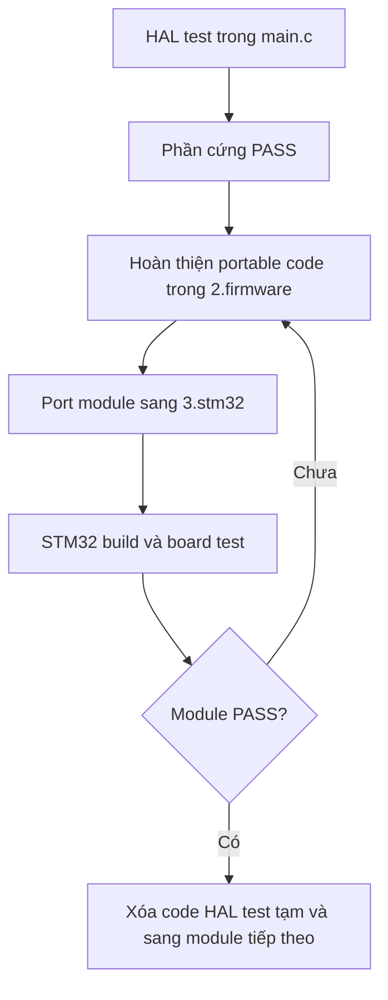

# Kế hoạch triển khai firmware STM32 theo từng module

| Thuộc tính | Giá trị |
|---|---|
| Document ID | `FW-MIG-STM32-002` |
| Phiên bản | `2.0` |
| Trạng thái | Kế hoạch triển khai đơn giản hóa |
| Ngày cập nhật | `2026-07-21` |
| Dự án | Smart Water Flow & Pressure Monitor |
| MCU | STM32L433RCT6 |
| Portable baseline | `2.firmware/` |
| STM32 workspace | `3.stm32/` |
| Module đầu tiên | FM24CL04B F-RAM và persistent storage |

---

## 1. Mục tiêu của kế hoạch

Mục tiêu là đưa firmware đã phát triển và kiểm thử trên Linux trong `2.firmware` lên STM32 theo từng module nhỏ, bắt đầu từ F-RAM.

Quy trình được rút gọn thành ba việc:

1. Kiểm tra phần cứng bằng một đoạn HAL blocking tạm thời trong `main.c`.
2. Hoàn thiện logic portable và driver production trong `2.firmware`.
3. Đưa các file cần thiết sang `3.stm32`, kết nối với HAL và kiểm thử trên board.

Không tạo trước nhiều application, build profile, test runner hoặc lớp trung gian chưa cần dùng.



Kết quả cuối cùng cần đạt:

```text
2.firmware: host/Linux tests PASS
3.stm32: STM32 build và hardware test PASS
        ↓
Tất cả module đạt cùng behavior
        ↓
Hợp nhất STM32 platform vào 2.firmware
        ↓
Xóa 3.stm32
```

---

## 2. Vai trò của từng thư mục

| Thư mục | Vai trò trong giai đoạn triển khai |
|---|---|
| `1.docs` | Yêu cầu, pin mapping, kiến trúc và contract cần tuân thủ |
| `2.firmware` | Source chuẩn cho portable logic, Linux simulation và host tests |
| `3.stm32` | Project CubeMX/HAL dùng để build và chạy firmware trên STM32 thật |

Trong giai đoạn migration:

- Không coi `2.firmware` là backup; đây vẫn là bản chuẩn của portable behavior.
- Không viết một firmware mới hoàn toàn trong `3.stm32`.
- Không đưa `HAL_*`, `I2C_HandleTypeDef` hoặc pin STM32 vào domain, service hay portable driver.
- Nếu sửa logic portable, sửa và test trong `2.firmware` trước rồi mới đồng bộ sang `3.stm32`.
- Nếu sửa pin, clock, NVIC hoặc HAL callback, chỉ sửa trong `3.stm32`.

---

## 3. Cấu trúc `3.stm32` tối thiểu

Chỉ cần duy trì cấu trúc sau:

```text
3.stm32/
├── firmware.ioc
├── CMakeLists.txt
├── Core/                         # CubeMX quản lý
│   ├── Inc/
│   └── Src/
│       ├── main.c
│       ├── stm32l4xx_it.c
│       └── stm32l4xx_hal_msp.c
├── Drivers/                      # CMSIS và STM32 HAL
└── src/                          # Chỉ thêm code production đang sử dụng
    ├── ports/
    ├── infrastructure/
    ├── drivers/
    ├── protocols/
    ├── services/
    └── platform/stm32/
```

Ở giai đoạn F-RAM, không cần tạo:

- `apps/fram_bringup/`;
- `fram_hal_smoke.c/.h`;
- `tests/hil/`;
- `MIGRATION_STATUS.md`;
- `SWFPM_SLICE` và nhiều build target;
- composition root riêng cho từng module;
- file IRQ bridge hoặc completion mailbox riêng;
- các thư mục rỗng dành cho module chưa triển khai.

Code test phần cứng tạm thời đặt trực tiếp trong `Core/Src/main.c`. Chỉ code production mới được tách thành file trong `src/`.

---

## 4. Trạng thái code hiện tại cần lưu ý

Không được copy toàn bộ F-RAM/storage từ `2.firmware` sang STM32 rồi kỳ vọng hệ thống chạy ngay. Code hiện tại còn các khoảng trống quan trọng:

| Thành phần | Trạng thái hiện tại | Việc cần làm |
|---|---|---|
| `I2cPort` | Đã có portable contract | Giữ contract và xác minh phù hợp với HAL async |
| `I2cBusManager` | Đã có queue, timeout và completion | Kết nối với STM32 adapter |
| `i2c_port_stm32` | Đã có adapter khung | Bổ sung HAL operations và deferred completion thật |
| `FramDriver` | In-memory path chạy được | I²C path hiện vẫn trả `FRAM_DRV_IO_ERROR` |
| `FramDriver` API | Hiện là synchronous | Cần chuyển thành submit/completion hoặc state machine async |
| `StorageService` | Có A/B flow và state enum | Các bước vẫn gọi `FramDriver_Read/Write()` đồng bộ |
| Storage codec | Đã có record, CRC và A/B selection | Giữ portable và test lại sau refactor async |

Do đó, thứ tự đúng là:

```text
Xác nhận F-RAM vật lý
→ hoàn thiện async F-RAM path trong 2.firmware
→ cập nhật StorageService chờ completion
→ port sang 3.stm32
```

Không bỏ qua bước hoàn thiện portable contract.

---

## 5. Phạm vi module F-RAM đầu tiên

Trong vòng triển khai đầu tiên chỉ làm chuỗi sau:

```text
main.c
→ StorageService
→ FramDriver
→ I2cBusManager
→ I2cPort
→ STM32 HAL
→ FM24CL04B
→ HAL callback
→ main loop
→ operation completion
```

Chưa đưa vào vòng này:

- ZSSC3241;
- MAX35103;
- measurement manager;
- flow, temperature và pressure processing;
- leak detection và volume integration ngoài checkpoint thử nghiệm;
- BLE, 4G và RS485;
- ADC battery, RTC, STOP2 và watchdog.

---

## 6. Quy trình triển khai F-RAM

### Giai đoạn 0 — Chốt baseline

#### Mục tiêu

Biết chính xác phiên bản code nào đang được đưa lên STM32 và bảo đảm baseline Linux không lỗi trước khi sửa.

#### Công việc

Trong `2.firmware`:

1. Build firmware Linux.
2. Chạy unit và integration tests liên quan đến:
   - `I2cBusManager`;
   - `FramDriver`;
   - storage record và CRC;
   - A/B slot selection;
   - boot restore và power-loss behavior.
3. Ghi lại Git commit nguồn trong `3.stm32/README.md` bằng một dòng đơn giản:

```markdown
Portable baseline: `<commit SHA của 2.firmware>`
```

Không cần tạo bảng migration riêng.

#### Gate hoàn thành

- Host build PASS.
- Các storage test hiện có PASS.
- Đã ghi lại commit nguồn.

---

### Giai đoạn 1 — Khởi tạo STM32 tối thiểu

#### Mục tiêu

Xác nhận project CubeMX boot được và không bị lỗi trước khi thêm F-RAM.

#### CubeMX cần bật

- MCU STM32L433RCT6 đúng package.
- SWD.
- System clock.
- GPIO cần thiết.
- I2C1 cho F-RAM.
- USART debug chỉ khi thực sự cần in kết quả.

Chưa cần bật DMA, RTC, ADC, SPI, BLE UART, modem UART hoặc low-power mode trong bước này.

#### Công việc

1. Generate code vào `3.stm32`.
2. Build project không có code F-RAM.
3. Flash lên board.
4. Xác nhận chương trình chạy bằng debugger, LED hoặc UART.
5. Regenerate CubeMX một lần và kiểm tra code trong vùng `USER CODE` không bị mất.

#### Gate hoàn thành

- Build PASS.
- Flash PASS.
- MCU boot ổn định.
- CubeMX regenerate an toàn.

---

### Giai đoạn 2 — Kiểm tra phần cứng F-RAM trong `main.c`

#### Mục tiêu

Chỉ xác nhận schematic, pin mapping, I2C timing, địa chỉ và chip FM24CL04B hoạt động.

#### Cách triển khai

Tạo một hàm `static` tạm thời trong `Core/Src/main.c`:

```c
static bool fram_hardware_test(void)
{
    /* HAL blocking read/write chỉ dùng trong bước bring-up. */
    /* Trả về true khi toàn bộ phép kiểm tra đạt. */
}
```

Hàm này được gọi một lần sau `MX_I2C1_Init()`:

```c
int main(void)
{
    HAL_Init();
    SystemClock_Config();
    MX_GPIO_Init();
    MX_I2C1_Init();

    bool fram_ok = fram_hardware_test();

    while (1) {
        /* Quan sát fram_ok bằng debugger, LED hoặc UART. */
    }
}
```

#### Các trường hợp cần kiểm tra

1. Probe hai slave page `0x50` và `0x51`.
2. Ghi và đọc lại một byte.
3. Ghi và đọc lại một buffer ngắn.
4. Kiểm tra dải đi qua `0x0FF → 0x100`.
5. Kiểm tra địa chỉ cuối `0x1FF`.
6. Reset MCU rồi xác nhận dữ liệu vẫn còn.
7. Ngắt F-RAM hoặc gây NACK để xác nhận HAL trả lỗi/timeout, không treo vô hạn.
8. Nếu WP được nối cố định, xác nhận trạng thái phần cứng đúng với thiết kế.

Lưu ý: FM24CL04B dùng bit địa chỉ cao để chọn `0x50` hoặc `0x51`. Hàm test phải ánh xạ đúng địa chỉ logic `0x000–0x1FF` sang slave address và memory address.

#### Gate hoàn thành

- Tất cả phép đọc/ghi PASS.
- Boundary `0x0FF/0x100` PASS.
- Dữ liệu tồn tại sau reset/power-cycle.
- Không có bus lock khi gặp NACK hoặc timeout.

#### Sau gate

Giữ hàm `fram_hardware_test()` tạm thời cho đến khi production driver hoạt động. Sau đó xóa hàm khỏi `main.c`; không chuyển nó thành `fram_hal_smoke.c/.h`.

---

### Giai đoạn 3 — Hoàn thiện portable F-RAM path trong `2.firmware`

#### Mục tiêu

Loại bỏ I²C stub và làm cho `FramDriver` thực sự sử dụng `I2cBusManager` theo cơ chế không blocking.

#### File cần sửa

```text
2.firmware/src/drivers/storage/fram_driver.c
2.firmware/src/drivers/storage/fram_driver.h
2.firmware/src/services/storage/storage_service.c
2.firmware/src/services/storage/storage_service.h
2.firmware/tests/unit/...
2.firmware/tests/integration/storage/...
```

Chỉ sửa `I2cPort` hoặc `I2cBusManager` nếu contract hiện tại thật sự không đủ.

#### Thay đổi bắt buộc đối với `FramDriver`

`FramDriver_Read()` và `FramDriver_Write()` synchronous không phù hợp với `HAL_I2C_*_IT()` và event loop. Driver cần có API dạng submit + completion, ví dụ:

```c
FramStatus fram_read_async(
    FramDriver *driver,
    uint16_t address,
    uint8_t *buffer,
    size_t length,
    AsyncOperationToken token);

FramStatus fram_write_async(
    FramDriver *driver,
    uint16_t address,
    const uint8_t *buffer,
    size_t length,
    AsyncOperationToken token);

void fram_on_i2c_done(
    FramDriver *driver,
    const I2cTransactionCompletion *completion);

void fram_poll(FramDriver *driver, uint64_t now_us);
```

Tên API cuối cùng có thể điều chỉnh theo convention của codebase, nhưng behavior phải bảo đảm:

- chỉ có một operation active trên một `FramDriver`;
- buffer sống đến khi completion kết thúc;
- tự tách transaction khi đi qua biên `0x0FF/0x100`;
- map đúng slave page `0x50/0x51`;
- reject phạm vi ngoài `0x000–0x1FF`;
- nhận biết timeout, cancelled và stale completion;
- callback không được xử lý nghiệp vụ nặng.

#### Thay đổi bắt buộc đối với `StorageService`

State machine phải submit một thao tác rồi chờ completion ở tick sau. Không được gọi liên tiếp các hàm read/write blocking trong một tick.

Ví dụ:

```text
INVALIDATE_SUBMIT
→ INVALIDATE_WAIT
→ VERIFY_INVALIDATE_SUBMIT
→ VERIFY_INVALIDATE_WAIT
→ WRITE_BODY_SUBMIT
→ WRITE_BODY_WAIT
→ READBACK_SUBMIT
→ READBACK_WAIT
→ VERIFY_BODY
→ COMMIT_SUBMIT
→ COMMIT_WAIT
→ COMPLETE
```

#### Host tests tối thiểu

- Read/write thông thường.
- Read/write qua biên `0x0FF/0x100`.
- Out-of-range.
- Busy khi operation trước chưa hoàn thành.
- Timeout.
- NACK/I/O error.
- Stale completion bị bỏ qua.
- A/B commit giữ lại slot cũ khi lỗi giữa chừng.
- Boot chọn slot hợp lệ mới nhất.
- CRC sai bị từ chối.

#### Gate hoàn thành

- Không còn nhánh I²C production luôn trả `FRAM_DRV_IO_ERROR`.
- `FramDriver` chạy qua fake `I2cPort/I2cBusManager` trên host.
- `StorageService` không phụ thuộc I/O blocking.
- Host tests PASS.
- Không có STM32 HAL include trong driver hoặc service.

---

### Giai đoạn 4 — Đưa I2C production path sang `3.stm32`

#### Mục tiêu

Đọc/ghi F-RAM trên board qua đúng kiến trúc production, không gọi HAL trực tiếp từ `FramDriver`.

#### File portable cần copy

Giữ nguyên relative path từ `2.firmware`:

```text
src/ports/port_status.h
src/ports/i2c_port.h
src/infrastructure/bus/i2c_bus_manager.c
src/infrastructure/bus/i2c_bus_manager.h
src/drivers/storage/fram_driver.c
src/drivers/storage/fram_driver.h
```

Chỉ copy các dependency mà compiler xác nhận đang cần. Không copy toàn bộ `src/`.

#### File STM32 cần có

```text
src/platform/stm32/adapters/i2c_port_stm32.c
src/platform/stm32/adapters/i2c_port_stm32.h
src/platform/stm32/stm32_i2c1_hal.c
src/platform/stm32/stm32_i2c1_hal.h
```

Hai file `stm32_i2c1_hal.*` chịu trách nhiệm:

- chuyển `I2cPortRequest` thành lời gọi `HAL_I2C_*_IT()`;
- lưu trạng thái completion tối thiểu;
- nhận `HAL_I2C_MemTxCpltCallback()`;
- nhận `HAL_I2C_MemRxCpltCallback()`;
- nhận `HAL_I2C_ErrorCallback()`;
- cung cấp một hàm `stm32_i2c1_poll()` để main loop phát completion ra ngoài ISR;
- thực hiện recovery khi bus lỗi.

Không tạo thêm file `irq_bridge`, `mailbox` hoặc `composition` ở giai đoạn này. Completion flag/mailbox nhỏ được đặt trong chính `stm32_i2c1_hal.c`.

#### Luồng chạy

```text
FramDriver submit
→ I2cBusManager
→ I2cPort
→ i2c_port_stm32
→ stm32_i2c1_hal
→ HAL_I2C_*_IT
→ I2C1 IRQ
→ HAL callback đặt completion flag
→ main loop gọi stm32_i2c1_poll
→ I2cBusManager complete
→ FramDriver completion
```

#### `main.c` ở giai đoạn này

`main.c` chỉ khởi tạo và tick các đối tượng hiện có. Có thể dùng các biến `static` trong `main.c`; chưa cần tạo composition file riêng.

```c
while (1) {
    stm32_i2c1_poll();
    i2c_bus_tick(&i2c_bus, monotonic_now_us());
    fram_poll(&fram, monotonic_now_us());
}
```

#### Board tests tối thiểu

- Production async read/write PASS.
- Cross-boundary PASS.
- Nhiều request được xử lý đúng thứ tự.
- Timeout không làm bus kẹt.
- Sau recovery có thể giao tiếp lại.
- Main loop vẫn tiếp tục chạy khi I2C đang chờ completion.

#### Gate hoàn thành

- F-RAM hoạt động qua `FramDriver → I2cBusManager → I2cPort → HAL`.
- Portable code không gọi HAL.
- ISR không gọi `StorageService` hoặc xử lý CRC/A-B.
- Không còn dùng HAL blocking trong production path.

---

### Giai đoạn 5 — Tích hợp persistent storage trên STM32

#### Mục tiêu

Hoàn thiện chuỗi lưu và khôi phục record thật trên F-RAM.

#### File cần copy

```text
src/protocols/storage/storage_record.c
src/protocols/storage/storage_record.h
src/protocols/storage/ab_slot.c
src/services/storage/storage_service.c
src/services/storage/storage_service.h
```

Nếu các file trên phụ thuộc một type portable khác, chỉ copy dependency trực tiếp đó.

#### Tích hợp trong `main.c`

Trong giai đoạn đầu, `main.c` có thể sở hữu trực tiếp:

```c
static I2cBusManager i2c_bus;
static Stm32I2cAdapter i2c_adapter;
static FramDriver fram;
static StorageService storage;
```

Main loop:

```c
while (1) {
    stm32_i2c1_poll();
    i2c_bus_tick(&i2c_bus, monotonic_now_us());
    fram_poll(&fram, monotonic_now_us());
    StorageService_Tick(&storage);
}
```

Khi full application bắt đầu có nhiều module, các đối tượng này mới được chuyển khỏi `main.c` sang composition root chung.

#### Board tests tối thiểu

1. Ghi record volume vào slot trống.
2. Đọc lại và so sánh payload.
3. Ghi record mới để đổi từ slot A sang B.
4. Reset MCU và restore record mới nhất.
5. Làm hỏng CRC của slot mới và xác nhận slot cũ vẫn được chọn.
6. Ngắt quá trình trước commit byte và xác nhận slot cũ vẫn hợp lệ.
7. Mô phỏng cả hai slot không hợp lệ và xác nhận hệ thống dùng trạng thái mặc định an toàn.
8. Lặp nhiều lần để kiểm tra sequence và đổi slot ổn định.

#### Gate hoàn thành

- A/B commit PASS.
- Read-back verification PASS.
- CRC validation PASS.
- Boot restore PASS.
- Mất nguồn/reset giữa commit không phá slot cũ.
- Main loop không bị blocking trong quá trình lưu.

#### Kết thúc module F-RAM

Sau khi gate đạt:

1. Xóa `fram_hardware_test()` và mọi lời gọi HAL blocking tạm khỏi `main.c`.
2. Ghi kết quả ngắn gọn vào `3.stm32/README.md`:

```markdown
F-RAM/storage: PASS
Source commit: `<SHA>`
Board verification: `<ngày>`
```

3. Commit thay đổi STM32.
4. Bắt đầu module ZSSC3241.

---

## 7. Chỉ tạo file khi nào?

Áp dụng quy tắc sau trong suốt migration:

| Trường hợp | Cách làm |
|---|---|
| Test phần cứng một lần | Viết hàm `static` trong `main.c` |
| Logic được dùng trong production | Tạo/copy file trong `src/` |
| HAL binding có trách nhiệm riêng và được tái sử dụng | Tạo file trong `src/platform/stm32/` |
| Chỉ có vài biến ownership khi hệ thống còn nhỏ | Giữ `static` trong `main.c` |
| Nhiều module đã tích hợp, `main.c` khó quản lý | Tạo một composition root chung |
| HIL đã được tự động hóa thật | Khi đó mới tạo `tests/hil/` |

Không tạo file chỉ để “đúng kiến trúc tương lai”. File mới phải có trách nhiệm hiện tại, được build và được gọi.

---

## 8. Khi có lỗi thì sửa ở đâu?

| Loại lỗi | Nơi sửa |
|---|---|
| Sai pin, I2C timing, clock hoặc NVIC | CubeMX trong `3.stm32` |
| Sai HAL start/callback/recovery | `3.stm32/src/platform/stm32` |
| Sai address mapping hoặc state machine F-RAM | `2.firmware`, test host rồi copy lại |
| Sai CRC, A/B selection hoặc record format | `2.firmware/src/protocols/storage` |
| Sai commit/restore flow | `2.firmware/src/services/storage` |
| Sai cách tạo và nối object | Tạm sửa trong `3.stm32/Core/Src/main.c` |
| HAL include xuất hiện trong portable layer | Refactor lại ranh giới platform |

Nguyên tắc quan trọng:

> Không sửa portable logic chỉ trong `3.stm32`, vì lần đồng bộ tiếp theo có thể ghi đè và làm hai bản lệch behavior.

---

## 9. Quy trình cho module tiếp theo

Sau F-RAM, lặp lại cùng công thức đơn giản:

```text
HAL blocking test trong main.c
→ xác nhận phần cứng
→ hoàn thiện/kiểm thử portable driver trong 2.firmware
→ copy driver và dependency cần thiết
→ nối với STM32 adapter đã có
→ board test
→ xóa HAL test tạm
```

Thứ tự đề xuất:

| Thứ tự | Module | Nền tảng được tái sử dụng |
|---:|---|---|
| 1 | F-RAM + persistent storage | I2C1, monotonic time, async completion |
| 2 | ZSSC3241 | Dùng lại I2C1 và `I2cBusManager` |
| 3 | Pressure processing | Dùng kết quả ZSSC3241, không thêm HAL |
| 4 | MAX35103 | Thêm SPI1 và EXTI |
| 5 | Flow + temperature processing | Dùng kết quả MAX35103 |
| 6 | Volume + leak detection | Portable service, storage checkpoint |
| 7 | ADC battery + RTC schedule | Thêm ADC/RTC platform binding |
| 8 | BLE | UART + DMA/IRQ |
| 9 | 4G modem | UART + modem power/control |
| 10 | RS485 | UART/DE control nếu còn trong phạm vi sản phẩm |
| 11 | STOP2 + watchdog | Tích hợp sau khi các wake source đã ổn định |
| 12 | Full system | FSM, scheduler, event loop và error recovery |

### Ví dụ với ZSSC3241

1. Thêm một hàm HAL blocking tạm trong `main.c` để probe, start one-shot và đọc kết quả.
2. Không viết lại I2C1.
3. Port `Zssc3241Driver` và đăng ký nó như client mới của `I2cBusManager`.
4. Test F-RAM và ZSSC3241 dùng chung bus.
5. Tích hợp pressure service.
6. Xóa hàm HAL test tạm.

---

## 10. Kiểm thử cần duy trì

Không cần tạo hệ thống HIL phức tạp ngay. Mỗi module chỉ cần ba mức xác nhận:

| Mức | Nơi chạy | Yêu cầu |
|---|---|---|
| Host test | `2.firmware` | Logic, state machine, timeout và error path PASS |
| STM32 build | `3.stm32` | Compile, link, RAM/Flash và warning PASS |
| Manual board test | Board thật | Peripheral, callback, persistence/recovery PASS |

Khi các manual board test đã ổn định và lặp lại nhiều lần, mới cân nhắc viết runner tự động trong `tests/hil/`.

---

## 11. Điều kiện hợp nhất cuối cùng

Chỉ hợp nhất `3.stm32` vào `2.firmware` khi:

- tất cả module cần thiết đã chạy trên board;
- host tests trong `2.firmware` vẫn PASS;
- STM32 cross-build PASS;
- Linux và STM32 dùng cùng portable contract và behavior;
- không còn HAL blocking test trong `main.c`;
- không có HAL include trong domain, protocol, service hoặc portable driver;
- CubeMX regenerate không làm mất user code;
- RAM/Flash nằm trong giới hạn;
- full-system test và power-cycle test PASS.

Khi hợp nhất:

```text
3.stm32/firmware.ioc        → 2.firmware/firmware.ioc
3.stm32/Core                → 2.firmware/Core
3.stm32/Drivers             → 2.firmware/Drivers
3.stm32/src/platform/stm32  → 2.firmware/src/platform/stm32
```

Không ghi đè máy móc các portable module trong `2.firmware/src`. Chúng vẫn là bản chuẩn; chỉ nhận các thay đổi portable đã được sửa ngược và test trong `2.firmware`.

Sau hợp nhất:

```text
2.firmware
├── build Linux
└── build STM32
```

Chỉ xóa `3.stm32` sau khi build và test từ vị trí hợp nhất đều PASS.

---

## 12. Checklist công việc ngay trước mắt

Không triển khai toàn bộ roadmap cùng lúc. Chỉ thực hiện tuần tự checklist sau:

### Bước hiện tại

- [ ] Chạy và ghi nhận host tests của F-RAM/storage trong `2.firmware`.
- [ ] Ghi commit baseline vào `3.stm32/README.md`.
- [ ] Tạo hoặc kiểm tra project CubeMX tối thiểu.
- [ ] Build, flash và xác nhận STM32 boot.
- [ ] Cấu hình I2C1.
- [ ] Viết `fram_hardware_test()` tạm trong `main.c`.
- [ ] Xác nhận `0x50`, `0x51`, boundary và persistence.

### Sau khi phần cứng PASS

- [ ] Refactor `FramDriver` sang async trong `2.firmware`.
- [ ] Refactor `StorageService` để chờ completion.
- [ ] Bổ sung host tests timeout, stale completion và power loss.
- [ ] Port I2C stack và `FramDriver` sang `3.stm32`.
- [ ] Viết HAL operations/callback trong `stm32_i2c1_hal.*`.
- [ ] Chạy F-RAM qua production async path.
- [ ] Port storage protocol/service.
- [ ] Test A/B, CRC, reset và interrupted commit.
- [ ] Xóa HAL blocking test khỏi `main.c`.
- [ ] Ghi kết quả PASS và source commit vào README.
- [ ] Chuyển sang ZSSC3241.

---

## 13. Definition of Done cho F-RAM/storage

F-RAM/storage chỉ được xem là hoàn thành khi đồng thời đạt:

- Hardware wiring và I2C address đã xác minh.
- Cross-boundary `0x0FF/0x100` hoạt động.
- Production driver dùng async I2C path.
- Không gọi HAL từ portable driver/service.
- Timeout, NACK và recovery có kết quả xác định.
- A/B slot, CRC và commit-last hoạt động.
- Reset/power-cycle restore đúng record mới nhất.
- Commit lỗi không làm mất slot hợp lệ trước đó.
- Host tests PASS.
- STM32 build PASS.
- Board tests PASS.
- Code HAL blocking tạm đã bị xóa.

Khi đạt toàn bộ điều kiện trên, nền tảng I2C và storage được giữ nguyên để tái sử dụng cho ZSSC3241 và các module còn lại.
