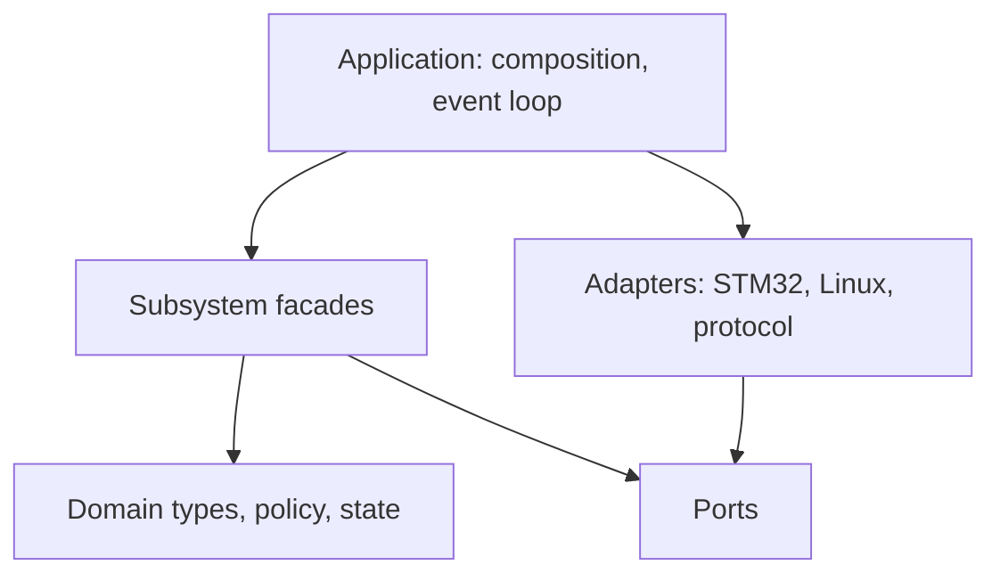

# Kế hoạch refactor kiến trúc firmware

**Dự án:** Smart Water Flow & Pressure Monitor  
**Phạm vi phân tích:** toàn bộ 22 GoF design patterns trên Refactoring.Guru  
**Mốc mã nguồn được khảo sát:** commit `780c12b5c3be7362f7d2fbed2741fb290ab46c9d`  
**Trường hợp kiểm chứng:** thêm phép đo điện áp pin vào firmware mà không làm thay đổi các miền không liên quan

---

## 1. Kết luận điều hành

Vấn đề chính của firmware hiện tại không phải là thiếu design pattern, mà là **ranh giới module chưa được cưỡng chế**:

- `data_model.h` tập trung quá nhiều trách nhiệm và bị phụ thuộc xuyên suốt từ driver đến service;
- event router là điểm điều phối tập trung, phải sửa khi thêm miền dữ liệu mới;
- repository có API theo từng loại dữ liệu và phụ thuộc trực tiếp vào layout của `RuntimeSnapshot`;
- service và test được tổ chức phẳng, khác với cấu trúc đích đã mô tả trong tài liệu;
- có các phụ thuộc ẩn như default repository/singleton làm giảm khả năng cô lập khi kiểm thử;
- telemetry tự sao chép từng trường từ snapshot, khiến schema lưu trữ, truyền thông và runtime dính vào nhau.

Không nên áp dụng cả 22 pattern. Kiến trúc đích chỉ cần một **pattern budget** nhỏ:

| Vai trò | Pattern chủ đạo |
|---|---|
| Tách logic khỏi phần cứng và hệ điều hành | Adapter + Bridge |
| Định nghĩa biên chức năng ổn định | Facade |
| Điều phối mà không tạo phụ thuộc chéo | Mediator + Observer |
| Cập nhật snapshot có kiểm soát | Builder |
| Chọn thuật toán/chính sách thay đổi được | Strategy |
| Mô hình hóa vòng đời có trạng thái | State |
| Lắp ghép Linux/STM32 rõ ràng | Abstract Factory tại composition root |

`Command` và `Memento` chỉ dùng cục bộ cho lệnh cấu hình và lưu trạng thái bền vững. Những pattern còn lại chỉ được phép dùng khi có nhu cầu cụ thể và có kiểm chứng; `Singleton` nên bị loại bỏ khỏi kiến trúc mới.

Mục tiêu cuối cùng: sau khi tạo sẵn biên `power`, việc thêm `battery_voltage_mv` chỉ tác động đến domain `power`, adapter ADC, snapshot view, mapping telemetry và test tương ứng; không sửa flow, pressure, leak, volume hay driver MAX35103/ZSSC3241.

---

## 2. Cơ sở đánh giá từ mã nguồn hiện tại

### 2.1. `data_model.h` đang là God Header

`2.firmware/src/infrastructure/event/data_model.h` chứa đồng thời:

- metadata và quality flags;
- raw sensor payload;
- kết quả flow, pressure, temperature, volume và leak;
- system mode và product state;
- reporting, delivery và trạng thái trực giao;
- `RuntimeSnapshot`;
- danh mục `EventId`.

Hậu quả: chỉ cần thêm một loại đo là driver, event, repository, telemetry và nhiều service có thể phải biên dịch lại hoặc sửa theo. `infrastructure/event` đang sở hữu cả dữ liệu domain, trái với nguyên tắc dependency direction.

### 2.2. Repository mở rộng theo kiểu “thêm dữ liệu thì thêm hàm”

`data_repository.h` có các hàm riêng như:

- `accept_flow`;
- `accept_pressure`;
- `accept_temperature`;
- `accept_volume`;
- `accept_leak`;
- `accept_mode`.

Implementation dùng offset và `memcpy` để ghi vào `RuntimeSnapshot`. Đây là phụ thuộc theo layout, khó đọc và khó kiểm tra kiểu tại compile time. Việc kiểm tra dữ liệu production cũng không đồng nhất giữa các hàm accept.

### 2.3. Mô hình hai buffer chưa khép kín về ownership

Repository khai báo `buffers[2]` nhưng còn có `inactive_buffer` riêng. Điều này làm tài liệu “exactly two buffers” và implementation không còn cùng một mô hình. API trả handle đến snapshot cũng cần quy định rõ thời gian sống của reader trước khi writer tái sử dụng buffer.

### 2.4. Event router là điểm phải sửa tập trung

Router phân tuyến theo byte cao của event ID rồi dùng `switch`. Các owner ngoài system còn là stub. Khi thêm domain `power`, kiến trúc hiện tại dễ dẫn đến:

1. sửa `data_model.h` để thêm event;
2. sửa router để biết range mới;
3. thêm nhánh xử lý tập trung;
4. kéo thêm include vào những module không liên quan.

### 2.5. Cấu trúc thư mục và target build không phản ánh kiến trúc tài liệu

Tài liệu firmware mô tả các nhóm `domain`, `services/measurement`, `services/power`, `protocols`, và test theo cấp độ. Mã nguồn hiện tại lại đặt phần lớn service và test trong hai thư mục phẳng. `services/CMakeLists.txt` tạo một static library lớn, nên CMake chưa cưỡng chế dependency direction.

### 2.6. Telemetry phụ thuộc trực tiếp vào runtime snapshot

Telemetry builder tự ánh xạ các trường trong `RuntimeSnapshot`. Trong khi contract giao tiếp đã có `battery_mv`, firmware chưa có. Điều này cho thấy schema truyền thông và runtime model đang tiến hóa với tốc độ khác nhau nhưng chưa có translation boundary rõ ràng.

### 2.7. Điểm tốt cần giữ

Refactor không được phá bỏ các nền tảng tốt hiện có:

- mô phỏng Linux xác định được và có scenario test;
- định hướng static allocation, phù hợp firmware;
- event loop hợp tác, dễ kiểm soát thời gian thực;
- ý tưởng result bất biến và stable snapshot;
- đã có tư duy port/platform abstraction;
- test cho thuật toán và service đã tồn tại.

---

## 3. Nguyên tắc thiết kế cho refactor

1. **Không big-bang rewrite.** Mỗi bước phải build và test được.
2. **C không phải Java thu nhỏ.** Interface dùng `struct` function pointers và opaque context khi thực sự cần đa hình; không tạo hierarchy giả.
3. **Không heap trong runtime path.** Registration, queue, handler và object graph có kích thước cố định.
4. **Dependency luôn hướng vào trong.** Domain không include infrastructure, platform, protocol hay driver.
5. **Mỗi domain sở hữu type và event của mình.** Không có một header toàn hệ thống biết mọi payload.
6. **Cross-domain interaction đi qua facade, command hoặc event contract.** Không gọi trực tiếp implementation của domain khác.
7. **Composition là explicit.** Mọi dependency được truyền từ composition root; không dùng global accessor ẩn.
8. **Snapshot là read model, không phải domain model duy nhất.** Domain result có thể tồn tại độc lập với cấu trúc snapshot và record truyền thông.
9. **Tài liệu mô tả contract, code và test cưỡng chế contract.** Không để tài liệu là nơi duy nhất định nghĩa kiến trúc.
10. **Pattern phải giải quyết một lực thiết kế cụ thể.** Nếu bỏ pattern mà code đơn giản hơn và không mất thuộc tính chất lượng, không dùng pattern đó.

---

## 4. Đánh giá toàn bộ 22 GoF design patterns

### 4.1. Quy ước mức áp dụng

- **Core:** dùng làm cấu trúc chính của kiến trúc đích.
- **Local:** chỉ dùng trong một subsystem có nhu cầu rõ ràng.
- **Conditional:** chưa triển khai; chỉ dùng khi xuất hiện điều kiện đã nêu.
- **Avoid:** chủ động không dùng trong baseline.

### 4.2. Creational patterns

| Pattern | Mức | Ứng dụng phù hợp trong dự án | Quyết định và giới hạn |
|---|---:|---|---|
| [Factory Method](https://refactoring.guru/design-patterns/factory-method) | Conditional | Hàm `*_create`/`*_init` tạo peer mô phỏng hoặc adapter theo cấu hình | Chỉ dùng factory function đơn giản khi caller không nên biết concrete type. Không tạo hierarchy creator trong C nếu `init()` đã đủ. |
| [Abstract Factory](https://refactoring.guru/design-patterns/abstract-factory) | Core | Tạo một họ dependency nhất quán cho Linux hoặc STM32: clock, bus, storage, ADC, reset, modem | Cài tại composition root dưới dạng `PlatformBundle`. Không cấp phát động và không cho service gọi factory. |
| [Builder](https://refactoring.guru/design-patterns/builder) | Core | Xây `RuntimeSnapshot` transaction, telemetry record và storage record theo từng bước rồi validate/commit | Builder phải có trạng thái hữu hạn, lỗi rõ ràng, `finalize/commit` duy nhất. Không dùng fluent API rườm rà. |
| [Prototype](https://refactoring.guru/design-patterns/prototype) | Avoid | Có thể sao chép sensor profile/config template | Struct C nhỏ có thể dùng hàm `defaults()` hoặc copy tường minh; Prototype không mang thêm giá trị hiện tại. |
| [Singleton](https://refactoring.guru/design-patterns/singleton) | Avoid | Hardware vật lý có thể chỉ có một instance | “Một thiết bị” không đồng nghĩa “global singleton”. Loại `default_repo` và global access; truyền dependency rõ ràng để test nhiều fixture độc lập. |

### 4.3. Structural patterns

| Pattern | Mức | Ứng dụng phù hợp trong dự án | Quyết định và giới hạn |
|---|---:|---|---|
| [Adapter](https://refactoring.guru/design-patterns/adapter) | Core | Chuyển STM32 HAL ADC/SPI/I2C, Linux peer, MAX35103, ZSSC3241 và modem API sang port chuẩn | Mỗi adapter chỉ dịch interface và lỗi; không chứa policy nghiệp vụ. Đây là vị trí thay ADC giả bằng ADC thật cho điện áp pin. |
| [Bridge](https://refactoring.guru/design-patterns/bridge) | Core | Tách abstraction service khỏi implementation platform; tách delivery use case khỏi MQTT/HTTP transport | Port là phía implementation của bridge. Chỉ tạo bridge cho chiều biến đổi độc lập thật sự, không tạo port cho mọi hàm. |
| [Composite](https://refactoring.guru/design-patterns/composite) | Conditional | Cây health/status hoặc menu display nếu sau này thật sự có cấu trúc đệ quy | Không dùng cho `RuntimeSnapshot`; snapshot là aggregate cố định. Tránh recursion và dynamic child list trong firmware baseline. |
| [Decorator](https://refactoring.guru/design-patterns/decorator) | Local | Bọc port bằng trace, metrics hoặc fault injection trong Linux/test | Wrapper phải có cùng port contract và chain ngắn, cấu hình tĩnh. Không dùng để xếp chồng business rule. |
| [Facade](https://refactoring.guru/design-patterns/facade) | Core | `MeasurementFacade`, `PowerFacade`, `StorageFacade`, `ConnectivityFacade` làm public API của từng subsystem | Facade nhỏ theo bounded context; cấm một `SystemFacade` biết mọi chi tiết vì sẽ trở thành God Object mới. |
| [Flyweight](https://refactoring.guru/design-patterns/flyweight) | Avoid | Chia sẻ descriptor/profile bất biến nếu số instance cực lớn | Firmware hiện không có bằng chứng áp lực RAM từ hàng nghìn object giống nhau. `static const` đã đủ; chỉ xem xét lại sau đo memory. |
| [Proxy](https://refactoring.guru/design-patterns/proxy) | Conditional | Kiểm soát vòng đời modem, guarded access hoặc lazy initialization cho tài nguyên tốn năng lượng | Chỉ dùng nếu proxy giữ đúng interface và có lý do lifecycle/access rõ ràng. Không che giấu I/O hay latency sau API tưởng như thuần túy. |

### 4.4. Behavioral patterns

| Pattern | Mức | Ứng dụng phù hợp trong dự án | Quyết định và giới hạn |
|---|---:|---|---|
| [Chain of Responsibility](https://refactoring.guru/design-patterns/chain-of-responsibility) | Conditional | Chuỗi validation/normalization cố định cho config hoặc raw sample | Chỉ dùng chain tĩnh, thứ tự được tài liệu hóa. Không dùng cho luồng điều khiển runtime chính vì khó truy vết WCET và lỗi. |
| [Command](https://refactoring.guru/design-patterns/command) | Local | Lệnh cấu hình/điều khiển từ BLE/MQTT: request ID, validate, execute, result, idempotency | Dùng typed union hoặc bảng command descriptor tĩnh. Không dùng function pointer không kiểu cho payload tùy ý. |
| [Iterator](https://refactoring.guru/design-patterns/iterator) | Conditional | Duyệt catalog field hoặc collection record mà không lộ layout | Với fixed struct nhỏ, vòng lặp tường minh rõ hơn. Chỉ dùng khi đã có collection thực và từ hai consumer trở lên. |
| [Mediator](https://refactoring.guru/design-patterns/mediator) | Core | `AppEventDispatcher` điều phối message giữa các facade mà không tạo phụ thuộc chéo | Dispatcher chỉ route; không chứa business logic. Registration theo bảng tĩnh thay cho central switch biết mọi domain. |
| [Memento](https://refactoring.guru/design-patterns/memento) | Local | A/B slot cho config, calibration, volume checkpoint và trạng thái phục hồi | Memento có version, CRC và migration. Không dùng để lưu toàn bộ object graph runtime. |
| [Observer](https://refactoring.guru/design-patterns/observer) | Core | Publish kết quả đo/trạng thái cho repository, telemetry, storage hoặc display | Subscriber list tĩnh, giới hạn số lượng và thứ tự rõ ràng. Event payload bất biến; không cho subscriber giữ pointer quá lifetime. |
| [State](https://refactoring.guru/design-patterns/state) | Core | System FSM, acquisition FSM, delivery FSM và battery-health state | Mỗi FSM có transition table, guard và action; không phân tán `if (state)` trên nhiều file. |
| [Strategy](https://refactoring.guru/design-patterns/strategy) | Core | Chính sách hiệu chuẩn, filter, battery threshold/hysteresis, retry, checkpoint và delivery | Chỉ strategy hóa phần thực sự thay đổi. Config là dữ liệu; function table chỉ cần khi có nhiều thuật toán. |
| [Template Method](https://refactoring.guru/design-patterns/template-method) | Conditional | Khung acquisition `start → wait → read → validate → publish` dùng hook cho từng sensor | Trong C nên dùng helper + port callbacks. Chỉ áp dụng nếu ít nhất hai flow có skeleton ổn định; nếu không sẽ làm call graph khó đọc. |
| [Visitor](https://refactoring.guru/design-patterns/visitor) | Avoid | Có thể tách serialize/diagnostic khỏi các loại result | Visitor làm ma trận type × operation và gây sửa tập trung khi thêm type. Typed mapper/module-owned serialization đơn giản hơn cho dự án hiện tại. |

### 4.5. Pattern budget được duyệt

Không triển khai pattern theo tên một cách đồng loạt. Baseline chỉ phê duyệt:

1. **Adapter + Bridge** cho biên platform/driver/protocol;
2. **Facade** cho public API mỗi subsystem;
3. **Mediator + Observer** cho event collaboration;
4. **Builder** cho snapshot/record transaction;
5. **Strategy + State** cho policy và lifecycle;
6. **Abstract Factory** chỉ tại composition root;
7. **Command/Memento** cho hai use case cục bộ đã có.

Mỗi pull request dùng pattern mới phải trả lời ba câu hỏi:

- lực thiết kế nào yêu cầu pattern này;
- API đơn giản hơn không giải quyết được ở đâu;
- test nào chứng minh khả năng thay thế/mở rộng mà pattern mang lại.

---

## 5. Kiến trúc đích

### 5.1. Dependency model



Quy tắc include:

- `domain/*` chỉ include C standard library và `domain/common`;
- `services/<feature>` include domain của chính nó và port cần thiết;
- `infrastructure` implement cơ chế dùng chung nhưng không sở hữu type nghiệp vụ;
- `drivers` và `platform` implement port;
- `protocols` ánh xạ domain read model sang wire/storage schema;
- `app` là nơi duy nhất lắp ghép concrete implementation.

### 5.2. Cấu trúc thư mục đề xuất

```text
2.firmware/
├── apps/
│   └── linux_sim/
├── src/
│   ├── app/
│   │   ├── app_composition.c
│   │   ├── app_event_loop.c
│   │   └── system_fsm.c
│   ├── domain/
│   │   ├── common/
│   │   │   ├── measurement_meta.h
│   │   │   ├── quality.h
│   │   │   └── status.h
│   │   ├── measurement/
│   │   ├── product/
│   │   ├── power/
│   │   ├── system/
│   │   └── connectivity/
│   ├── services/
│   │   ├── measurement/
│   │   ├── processing/
│   │   ├── calibration/
│   │   ├── leak/
│   │   ├── storage/
│   │   ├── configuration/
│   │   ├── connectivity/
│   │   ├── display/
│   │   └── power/
│   ├── ports/
│   │   ├── adc_port.h
│   │   ├── clock_port.h
│   │   ├── storage_port.h
│   │   └── transport_port.h
│   ├── infrastructure/
│   │   ├── event/
│   │   ├── repositories/
│   │   ├── bus/
│   │   ├── time/
│   │   └── queues/
│   ├── protocols/
│   │   ├── telemetry/
│   │   ├── storage/
│   │   └── ble/
│   ├── drivers/
│   └── platform/
│       ├── include/
│       ├── linux/
│       └── stm32/
└── tests/
    ├── unit/
    ├── contract/
    ├── integration/
    └── system/
```

### 5.3. CMake là hàng rào kiến trúc

Thay một target `services` lớn bằng target nhỏ:

```text
fw_domain_common
fw_domain_measurement
fw_domain_power
fw_service_measurement
fw_service_power
fw_infra_event
fw_infra_repository
fw_protocol_telemetry
fw_platform_linux
fw_app
```

`target_link_libraries` phải biểu diễn đúng dependency direction. Ví dụ `fw_domain_power` không được link `fw_infra_event`; `fw_protocol_telemetry` có thể link các public read-model contract nhưng domain không được link ngược protocol.

---

## 6. Thiết kế các biên quan trọng

### 6.1. Domain-owned types thay cho `data_model.h`

Tách type theo owner:

| Owner | Type ví dụ |
|---|---|
| `domain/common` | `MeasurementMeta`, `QualityFlags`, `ResultStatus` |
| `domain/measurement` | `FlowResult`, `PressureResult`, `TemperatureResult`, `MeasurementCycleResult` |
| `domain/product` | `VolumeState`, `LeakState`, `ProductSnapshot` |
| `domain/power` | `BatteryVoltageResult`, `PowerState`, `PowerSnapshot` |
| `domain/system` | `SystemMode`, `SystemState`, `SystemSnapshot` |
| `domain/connectivity` | `DeliveryState`, `ConnectivitySnapshot` |

`RuntimeSnapshot` chỉ là aggregate read model:

```c
typedef struct {
    MeasurementSnapshot measurement;
    ProductSnapshot product;
    PowerSnapshot power;
    SystemSnapshot system;
    ConnectivitySnapshot connectivity;
} RuntimeSnapshot;
```

Nó không chứa raw payload của driver và không sở hữu event catalog.

### 6.2. Event contract: Mediator + Observer

Event core chỉ biết envelope và handler contract:

```c
typedef struct {
    EventDomain domain;
    uint16_t type;
    uint32_t sequence;
    Timestamp timestamp;
    EventPayloadRef payload;
} AppEvent;

typedef EventHandlingResult (*EventHandler)(
    void *context,
    const AppEvent *event
);
```

Điểm quan trọng:

- event type cụ thể nằm trong header domain, không nằm trong event infrastructure;
- dispatcher dùng bảng registration có kích thước cố định;
- domain facade đăng ký handler tại composition time;
- dispatcher không `switch` theo tất cả domain;
- payload inline nhỏ hoặc reference đến mailbox có ownership rõ ràng;
- subscriber không giữ pointer sau khi handler trả về;
- overflow, ordering và delivery guarantee được giữ như baseline hiện tại.

Nếu chỉ có đúng một consumer và cùng call stack, gọi facade trực tiếp rõ hơn phát event. Event không được dùng để che giấu mọi dependency.

### 6.3. Repository: Builder transaction + typed views

API đích không có `accept_<field>()` ở cấp global repository. Thay bằng transaction:

```c
typedef struct RepoWriteTxn RepoWriteTxn;

RepoStatus runtime_repo_begin(RuntimeRepository *repo, RepoWriteTxn *txn);
RepoStatus repo_txn_update_measurement(RepoWriteTxn *txn,
                                       const MeasurementSnapshot *value);
RepoStatus repo_txn_update_product(RepoWriteTxn *txn,
                                   const ProductSnapshot *value);
RepoStatus repo_txn_update_power(RepoWriteTxn *txn,
                                 const PowerSnapshot *value);
RepoStatus runtime_repo_commit(RepoWriteTxn *txn);
void runtime_repo_abort(RepoWriteTxn *txn);
```

Quy tắc:

- `begin` copy active buffer sang inactive buffer;
- mọi validate/admission diễn ra trước `commit`;
- `commit` là atomic pointer/index swap duy nhất;
- transaction trỏ vào inactive slot, không tạo bản sao snapshot thứ ba;
- chỉ một writer trong cooperative event loop;
- reader dùng API copy typed view hoặc copy snapshot trong critical section ngắn, không giữ raw pointer qua lần dispatch tiếp theo;
- bỏ logic offset/`memcpy` theo layout khỏi public path;
- production/simulation admission áp dụng thống nhất tại policy chung, không theo từng result ngẫu nhiên.

Nếu sau này có preemptive reader, phải chọn rõ một trong hai: copy-on-read có critical section hoặc reference count/epoch. Không được giả định handle luôn hợp lệ mà không có lifetime protocol.

### 6.4. Facade theo subsystem

Ví dụ public API của power:

```c
typedef struct PowerFacade PowerFacade;

typedef struct {
    AdcPort battery_adc;
    ClockPort clock;
    PowerConfig config;
    PowerResultSink result_sink;
} PowerDependencies;

PowerStatus power_facade_init(PowerFacade *self,
                              const PowerDependencies *dependencies);
PowerStatus power_facade_sample(PowerFacade *self);
EventHandlingResult power_facade_handle_event(
    PowerFacade *self,
    const AppEvent *event
);
PowerSnapshot power_facade_snapshot(const PowerFacade *self);
```

Module khác không include internal header của power service. Tương tự cho measurement, storage và connectivity.

### 6.5. Adapter + Bridge cho phần cứng

`AdcPort` mô tả đúng thứ firmware cần, không sao chép nguyên API HAL:

```c
typedef struct {
    void *context;
    AdcStatus (*read_raw)(void *context,
                          AdcChannel channel,
                          uint16_t *raw_code);
} AdcPort;
```

Hai adapter có thể implement cùng port:

- `LinuxAdcAdapter`: đọc scenario/fake sample;
- `Stm32AdcAdapter`: gọi HAL/LL ADC.

Chuyển đổi raw ADC sang millivolt thuộc power service hoặc calibration strategy, không nằm trong adapter nếu công thức còn chứa divider ratio, gain, offset và battery policy.

### 6.6. Strategy cho cấu hình và thuật toán

Cần phân biệt:

- **Config value:** `divider_num`, `divider_den`, `vref_mv`, `low_mv`, `critical_mv`, `hysteresis_mv`, sample interval;
- **Strategy:** cách tính/filter/phân loại có nhiều implementation thực sự.

Baseline chỉ cần một implementation mặc định nhận config. Chỉ thêm function table strategy khi có ít nhất implementation thứ hai, ví dụ board revision dùng ADC internal reference khác hoặc simulator cần model riêng.

### 6.7. State cho battery health

Không suy luận trạng thái pin bằng các `if` rải rác. Dùng state hữu hạn:

```text
UNKNOWN → NORMAL ↔ LOW ↔ CRITICAL
```

Transition dùng threshold và hysteresis từ config; invalid/stale result không tự động chuyển sang NORMAL. Chính sách này thuộc `domain/power`, độc lập với ADC driver và telemetry.

### 6.8. Abstract Factory tại composition root

```c
typedef struct {
    ClockPort clock;
    AdcPort adc;
    StoragePort storage;
    TransportPort transport;
    ResetPort reset;
} PlatformBundle;
```

`linux_platform_bundle()` và `stm32_platform_bundle()` tạo hai họ dependency nhất quán. Sau đó `app_composition_init()` truyền từng port cho facade tương ứng. Không module nào gọi global `platform_get_default()`.

---

## 7. Kế hoạch triển khai theo giai đoạn

Mỗi giai đoạn phải là một chuỗi pull request nhỏ, không phải một commit khổng lồ.

### Giai đoạn 0 — Đóng băng baseline và lập safety net

**Mục tiêu:** chứng minh refactor không đổi hành vi.

Công việc:

1. Build và chạy toàn bộ test Linux hiện tại.
2. Lưu golden output cho các scenario chính: normal, sensor fault, degraded, storage/retry và restart.
3. Ghi baseline về RAM/flash, queue capacity, snapshot size và thời gian xử lý event nếu toolchain hiện tại hỗ trợ.
4. Bổ sung test thiếu cho repository:
   - atomic visibility của commit;
   - abort không làm đổi active snapshot;
   - generation tăng đúng một lần;
   - simulation/production admission đồng nhất;
   - reader không quan sát partial update.
5. Chốt danh sách behavior không thay đổi trong refactor.

**Exit gate:** test xanh; golden trace được version control; có số đo baseline hoặc ghi rõ số đo chưa khả dụng.

### Giai đoạn 1 — Chốt architecture contract và dependency rules

**Mục tiêu:** có đích rõ trước khi di chuyển file.

Công việc:

1. Tạo ADR “Module boundaries and GoF pattern budget”.
2. Chốt owner cho từng type, event, repository view và port.
3. Chốt include rules và CMake target graph.
4. Thêm architecture check vào CI, tối thiểu kiểm tra:
   - `domain` không include `infrastructure`, `drivers`, `platform`, `protocols`;
   - driver không include aggregate runtime snapshot;
   - không có header production mới include legacy `data_model.h`;
   - không tạo global default accessor mới.
5. Đánh dấu API legacy là deprecated trong tài liệu, chưa xóa code.

**Exit gate:** ADR được review; CI bắt được ít nhất một dependency violation mẫu.

### Giai đoạn 2 — Tạo module và CMake target mới, chưa đổi hành vi

**Mục tiêu:** CMake bắt đầu cưỡng chế kiến trúc.

Công việc:

1. Tạo `domain`, `ports`, `protocols` và các thư mục service theo feature.
2. Tách target CMake nhỏ; giữ compatibility target để executable cũ vẫn build.
3. Di chuyển lần lượt các file ít phụ thuộc trước: numeric/common, policy, record types.
4. Chỉ sửa include path và link target; không thay algorithm.
5. Di chuyển test vào `unit/contract/integration/system` bằng commit cơ học riêng.

**Exit gate:** behavior/golden trace không đổi; mỗi target có dependency list tối thiểu.

### Giai đoạn 3 — Tách `data_model.h` theo domain

**Mục tiêu:** xóa God Header mà chưa thay đổi public behavior.

Thứ tự đề xuất:

1. Tách `MeasurementMeta`, quality và status sang `domain/common`.
2. Tách raw driver payload khỏi processed result.
3. Tách measurement result types.
4. Tách product, system, connectivity snapshot.
5. Tạo `domain/power` với type tối thiểu nhưng chưa cần ADC thật.
6. Để lại `data_model_legacy.h` chỉ re-export header mới trong giai đoạn chuyển tiếp.
7. Migrate consumer theo cụm; cấm code mới include legacy header.
8. Xóa re-export khi không còn consumer.

**Exit gate:** driver không include runtime snapshot/event catalog; mỗi type có một owner; `rg data_model` không còn trong production source.

### Giai đoạn 4 — Refactor event thành Mediator + Observer có registration

**Mục tiêu:** thêm domain không cần sửa central router.

Công việc:

1. Tách `AppEvent` envelope khỏi payload domain.
2. Tạo bảng handler tĩnh với capacity compile-time.
3. Cho composition root đăng ký facade handler theo domain/type.
4. Di chuyển từng owner khỏi central switch sang handler riêng.
5. Giữ compatibility adapter nhận event ID cũ và chuyển sang envelope mới trong quá trình migrate.
6. Bổ sung contract test:
   - duplicate registration;
   - unknown event;
   - queue overflow;
   - ordering;
   - handler error propagation;
   - payload lifetime.
7. Xóa range dispatch cũ sau khi toàn bộ owner được migrate.

**Exit gate:** thêm một event thử nghiệm thuộc `power` chỉ sửa module power và composition table, không sửa event infrastructure.

### Giai đoạn 5 — Refactor repository bằng Builder transaction và typed views

**Mục tiêu:** cập nhật dữ liệu theo aggregate, có validate/commit rõ ràng và ownership đúng.

Công việc:

1. Viết contract test cho semantics cũ trước khi đổi implementation.
2. Tạo hai snapshot slot thật sự; transaction ghi trực tiếp vào inactive slot.
3. Tạo `begin/update/commit/abort` và typed update functions.
4. Tạo read API theo sub-snapshot hoặc caller-owned copy.
5. Chuyển measurement consumer trước, sau đó product/system/connectivity.
6. Tạo compatibility wrapper cho `accept_flow`... gọi transaction mới; xóa wrapper sau khi migrate.
7. Chuyển production/simulation admission thành một policy chung.
8. Thêm `PowerSnapshot` mà không thêm `accept_battery_voltage()` vào global repository.
9. Kiểm tra `sizeof(RuntimeSnapshot)`, stack usage và thời gian copy so với baseline.

**Exit gate:** không dùng offset/memcpy để chọn field; không có snapshot copy thứ ba trong repository; reader lifetime được test và tài liệu hóa.

### Giai đoạn 6 — Tạo subsystem Facade và composition root tường minh

**Mục tiêu:** cô lập implementation và xóa dependency ẩn.

Công việc:

1. Định nghĩa facade nhỏ cho measurement, power, storage và connectivity.
2. Chuyển direct calls giữa service sang facade, command hoặc event contract thích hợp.
3. Tạo `AppComposition` chứa instance và dependency graph tĩnh.
4. Tạo `PlatformBundle` cho Linux; giữ behavior mô phỏng hiện tại.
5. Tạo interface/bundle STM32 compile được dù một số adapter còn stub.
6. Loại `default_repo`, global service accessor và implicit initialization order.
7. Dùng test fixture tự tạo composition riêng cho mỗi test.

**Exit gate:** có thể khởi tạo hai independent app fixtures trong cùng test process; không module nghiệp vụ gọi global getter.

### Giai đoạn 7 — Tách protocol/storage mapping khỏi runtime model

**Mục tiêu:** schema wire/storage tiến hóa độc lập với domain.

Công việc:

1. Tạo telemetry record builder nhận typed snapshot views.
2. Đặt version và optional-field policy trong protocol layer.
3. Tạo storage record mapper riêng, không dùng cùng struct với telemetry.
4. Dùng Adapter cho MQTT/HTTP/BLE transport, không để domain biết topic/payload.
5. Bổ sung golden vector test cho telemetry, gồm trường `battery_mv` chưa có data hoặc marked unavailable.
6. Kiểm tra backward compatibility với protocol hiện tại.

**Exit gate:** thay wire field name/encoding không làm biên dịch lại domain; runtime snapshot không chứa protocol-specific field.

### Giai đoạn 8 — Thêm điện áp pin làm acceptance case

**Mục tiêu:** chứng minh kiến trúc mới mở rộng được.

Công việc dự kiến:

1. `domain/power`: thêm `BatteryVoltageResult`, `BatteryHealth`, quality/staleness semantics.
2. `services/power`: chuyển raw ADC sang mV; filter; threshold/hysteresis từ `PowerConfig`.
3. `ports/adc_port.h`: dùng port chung nếu chưa có.
4. `platform/linux`: adapter đọc sample từ scenario.
5. `platform/stm32`: adapter gọi ADC HAL/LL; có thể stub trước nhưng phải giữ cùng contract.
6. `PowerFacade`: sampling lifecycle và publish result.
7. Repository: cập nhật `PowerSnapshot` qua transaction.
8. Telemetry/storage builder: map sang `battery_mv` và validity/status.
9. Test:
   - conversion boundary và integer overflow;
   - invalid ADC/reference;
   - threshold + hysteresis;
   - stale sample;
   - boot chưa có sample;
   - snapshot atomicity;
   - telemetry golden vector;
   - Linux scenario end-to-end.

**Không được sửa để hoàn thành acceptance case:** flow algorithm, pressure algorithm, leak detector, volume accumulator, MAX35103 driver, ZSSC3241 driver và event dispatcher core.

**Exit gate:** đạt change-budget ở mục 9 và mọi baseline test vẫn xanh.

### Giai đoạn 9 — Xóa compatibility layer và đồng bộ tài liệu

**Mục tiêu:** không để kiến trúc chuyển tiếp trở thành kiến trúc vĩnh viễn.

Công việc:

1. Xóa legacy header, compatibility accept functions và range router.
2. Bật architecture check thành lỗi bắt buộc trong CI.
3. Cập nhật tài liệu canonical; overview chỉ link, không lặp contract.
4. Cập nhật traceability từ requirement → domain → port → test.
5. Chạy full test, golden scenario và static analysis.
6. Ghi lại số đo sau refactor để so với baseline.

**Exit gate:** không còn TODO migration; tài liệu và source tree trùng khớp; không regression về RAM/flash/WCET ngoài budget đã duyệt.

---

## 8. Chiến lược chia pull request

Không trộn di chuyển file, đổi API và đổi behavior trong cùng PR. Chuỗi PR tham khảo:

| PR | Nội dung | Behavior change |
|---:|---|---:|
| 1 | Baseline/golden tests và repository contract tests | Không |
| 2 | ADR, dependency rules và CI architecture check | Không |
| 3 | Tạo CMake targets/thư mục mới | Không |
| 4–6 | Tách common, measurement, product/system types | Không |
| 7 | Tách event envelope và registration API | Không |
| 8–10 | Migrate event owner theo cụm | Không |
| 11 | Repository transaction implementation | Không |
| 12–14 | Migrate repository clients và typed views | Không |
| 15 | Facades + explicit composition cho Linux | Không |
| 16 | Protocol/storage builders | Không về wire contract |
| 17 | Power domain + Linux ADC acceptance case | Có, tính năng mới |
| 18 | STM32 ADC adapter | Có, phần cứng |
| 19 | Xóa compatibility layer và chốt docs | Không |

Số PR là gợi ý về ranh giới review, không phải quota bắt buộc.

---

## 9. Tiêu chí chấp nhận định lượng

### 9.1. Change-budget khi thêm một measurement domain mới

Sau khi có skeleton domain/facade, thêm điện áp pin phải đạt:

- không sửa code của domain measurement, product/leak/volume;
- không sửa event dispatcher implementation;
- không thêm API chuyên biệt vào global repository;
- không sửa concrete driver không liên quan;
- thay đổi tập trung ở tối đa các vùng: `domain/power`, `services/power`, một platform adapter, snapshot composition, protocol mapper và test;
- số header public mà feature mới buộc consumer include không vượt quá contract của power và read model cần thiết.

### 9.2. Testability

- mọi facade khởi tạo được bằng fake port, không cần global state;
- mỗi strategy/policy có unit test độc lập;
- mỗi port có contract test dùng chung cho Linux fake và STM32 adapter ở mức khả dụng;
- repository có test atomicity và lifetime;
- end-to-end Linux scenario không dùng `#ifdef` riêng cho battery logic.

### 9.3. Maintainability và clarity

- một type chỉ có một owner;
- public header không include implementation header;
- mỗi subsystem có README ngắn: responsibility, public API, dependencies, events và ownership;
- CMake target graph khớp sơ đồ kiến trúc;
- không có `data_model.h` hoặc facade toàn hệ thống mới;
- không có pattern implementation nếu ADR/PR không nêu lực thiết kế và test tương ứng.

### 9.4. Embedded constraints

- không heap trong steady-state runtime;
- queue/registration capacity là compile-time constant;
- không recursion trong baseline;
- snapshot size, stack high-water mark, flash size và worst-case event processing không vượt budget dự án;
- không thực hiện I/O ẩn trong getter/proxy;
- integer conversion của ADC có saturation/overflow test.

---

## 10. Test matrix tối thiểu sau refactor

| Cấp test | Phạm vi | Ví dụ |
|---|---|---|
| Unit | Domain policy/state | battery conversion, hysteresis, flow/pressure unchanged |
| Unit | Builder | incomplete record, invalid field, abort/commit |
| Contract | Port | ADC success/error/timeout semantics |
| Contract | Event | registration, ordering, overflow, payload lifetime |
| Contract | Repository | atomic visibility, generation, reader lifetime |
| Integration | Facade + fake ports | measurement/power sample to snapshot |
| Integration | Protocol mapper | snapshot view to telemetry/storage record |
| System | Linux composition | normal/degraded/restart/battery scenarios |
| Architecture | Include/link graph | forbidden dependency and global access checks |

---

## 11. Rủi ro và cách kiểm soát

| Rủi ro | Biểu hiện | Kiểm soát |
|---|---|---|
| Pattern over-engineering | Nhiều interface/indirection nhưng chỉ một implementation | Pattern budget; yêu cầu use case và test thay thế |
| God Facade thay God Header | Một facade biết tất cả subsystem | Facade theo bounded context, API nhỏ |
| Event spaghetti | Mọi tương tác đều phát event, khó truy vết | Chỉ event cho asynchronous/fan-out; direct call cho một consumer đồng bộ |
| Repository copy tốn thời gian | Snapshot lớn gây tăng WCET | Typed view, đo `sizeof`/copy time, không tối ưu trước khi đo |
| Compatibility layer tồn tại mãi | Hai API song song | Mỗi wrapper có issue/PR xóa và deadline theo phase |
| CMake split gây vòng phụ thuộc | Target link chéo | Dependency graph và CI check ngay từ Giai đoạn 1 |
| Refactor lẫn thay behavior | Regression khó định vị | PR cơ học riêng, golden trace, feature battery chỉ ở Giai đoạn 8 |
| HAL chưa sẵn sàng chặn firmware | Chờ driver ADC thật | `AdcPort` + Linux adapter + STM32 stub compile-time; contract không phụ thuộc HAL |
| Schema cũ không nhận field mới | Backend mismatch | Optional/versioned mapping, golden vector, backward compatibility test |

---

## 12. Những việc không nằm trong refactor này

- thay đổi thuật toán flow, pressure, temperature compensation, leak hoặc volume;
- thay scheduler cooperative bằng RTOS;
- chọn chân ADC, divider resistor hoặc reference điện áp phần cứng cuối cùng;
- thay đổi protocol breaking mà không có version/migration;
- tối ưu RAM/flash khi chưa có số đo;
- tạo framework DI, reflection hoặc dynamic plugin cho C firmware;
- triển khai tất cả pattern chỉ vì chúng có trong catalog.

---

## 13. Thứ tự ưu tiên nếu nguồn lực giới hạn

Nếu chưa thể làm toàn bộ, thực hiện theo thứ tự sau:

1. baseline tests + architecture rules;
2. split `data_model.h` và CMake targets;
3. repository transaction/typed view;
4. event registration thay central router;
5. explicit composition + xóa singleton/default getter;
6. protocol mapper boundary;
7. power/battery acceptance case;
8. cleanup và docs.

Không nên thêm battery trực tiếp vào API `accept_<field>()` cũ rồi coi đó là thiết kế cuối. Có thể dùng một compatibility adapter ngắn hạn nếu cần giữ tiến độ, nhưng feature hoàn chỉnh phải đi qua `PowerFacade`, `PowerSnapshot` và repository transaction.

---

## 14. Checklist review cho từng module mới

- [ ] Module có owner và responsibility duy nhất.
- [ ] Public API không lộ concrete platform type.
- [ ] Không dùng global mutable state/default accessor.
- [ ] Ownership và lifetime của mọi pointer được ghi rõ.
- [ ] Error/status model có contract, không dùng magic value.
- [ ] Config và algorithm strategy được phân biệt.
- [ ] Event chỉ dùng khi cần asynchronous hoặc fan-out.
- [ ] Queue/table có capacity cố định và overflow policy.
- [ ] Có unit/contract test phù hợp.
- [ ] CMake dependency tuân theo direction.
- [ ] Không thêm design pattern ngoài pattern budget mà thiếu lý do/test.
- [ ] Tài liệu canonical được cập nhật, overview không sao chép nội dung.

---

## 15. Tài liệu tham khảo

Phân loại và intent của 22 pattern được đối chiếu từ Refactoring.Guru:

- [Design Patterns catalog](https://refactoring.guru/design-patterns)
- [Creational Design Patterns](https://refactoring.guru/design-patterns/creational-patterns)
- [Structural Design Patterns](https://refactoring.guru/design-patterns/structural-patterns)
- [Behavioral Design Patterns](https://refactoring.guru/design-patterns/behavioral-patterns)

Các đề xuất trong tài liệu này là đánh giá áp dụng cho mã nguồn cụ thể của dự án, không phải khuyến nghị triển khai toàn bộ catalog.